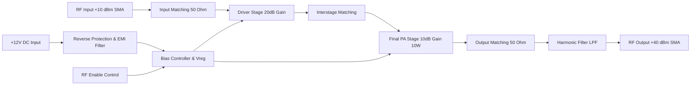

# System Block Diagram
## hkgg

```mermaid
graph LR
    RF_IN["RF Input +10 dBm SMA"] --> INPUT_MATCH["Input Matching 50 Ohm"]
    INPUT_MATCH --> AMP_DRIVER["Driver Stage 20dB Gain"]
    AMP_DRIVER --> INTERMATCH["Interstage Matching"]
    INTERMATCH --> AMP_FINAL["Final PA Stage 10dB Gain 10W"]
    AMP_FINAL --> OUTPUT_MATCH["Output Matching 50 Ohm"]
    OUTPUT_MATCH --> HARMONIC["Harmonic Filter LPF"]
    HARMONIC --> RF_OUT["RF Output +40 dBm SMA"]
    
    DC_IN["+12V DC Input"] --> DC_PROT["Reverse Protection & EMI Filter"]
    DC_PROT --> BIAS["Bias Controller & Vreg"]
    BIAS --> AMP_DRIVER
    BIAS --> AMP_FINAL
    
    CTRL["RF Enable Control"] --> BIAS
```
