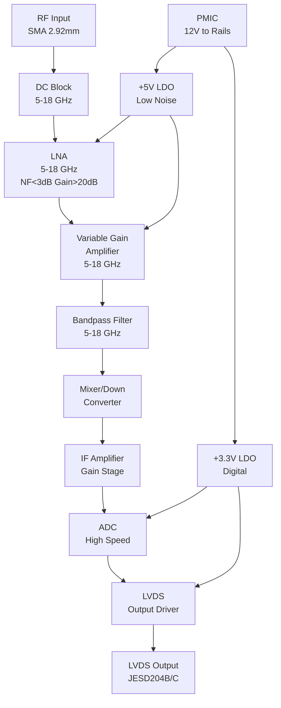

# System Block Diagram
## dkfjg

```mermaid
flowchart TD
    RF_IN[RF Input<br/>SMA 2.92mm] --> DC_BLOCK[DC Block<br/>5-18 GHz]
    DC_BLOCK --> LNA[LNA<br/>5-18 GHz<br/>NF<3dB Gain>20dB]
    LNA --> VGA[Variable Gain<br/>Amplifier<br/>5-18 GHz]
    VGA --> BPF[Bandpass Filter<br/>5-18 GHz]
    BPF --> MIXER[Mixer/Down<br/>Converter]
    MIXER --> IF_AMP[IF Amplifier<br/>Gain Stage]
    IF_AMP --> ADC[ADC<br/>High Speed]
    ADC --> LVDS_TX[LVDS<br/>Output Driver]
    LVDS_TX --> LVDS_OUT[LVDS Output<br/>JESD204B/C]
    
    PMIC[PMIC<br/>12V to Rails] --> REG_1[+5V LDO<br/>Low Noise]
    PMIC --> REG_2[+3.3V LDO<br/>Digital]
    REG_1 --> LNA
    REG_1 --> VGA
    REG_2 --> ADC
    REG_2 --> LVDS_TX
```
