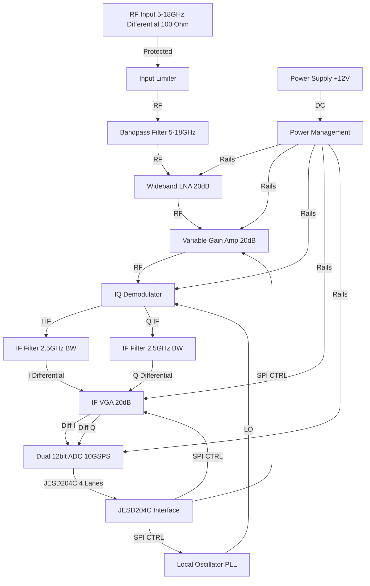

# System Block Diagram
## khg

```mermaid
flowchart TD
    RF_IN[RF Input 5-18GHz Differential 100 Ohm] -->|Protected| LIM[Input Limiter]
    LIM -->|RF| BPF[Bandpass Filter 5-18GHz]
    BPF -->|RF| LNA1[Wideband LNA 20dB]
    LNA1 -->|RF| PGA1[Variable Gain Amp 20dB]
    PGA1 -->|RF| MIX[IQ Demodulator]
    OSC[Local Oscillator PLL] -->|LO| MIX
    MIX -->|I IF| FILT1[IF Filter 2.5GHz BW]
    MIX -->|Q IF| FILT2[IF Filter 2.5GHz BW]
    FILT1 -->|I Differential| VGA[IF VGA 20dB]
    FILT2 -->|Q Differential| VGA
    VGA -->|Diff I| ADC[Dual 12bit ADC 10GSPS]
    VGA -->|Diff Q| ADC
    ADC -->|JESD204C 4 Lanes| FPGA[JESD204C Interface]
    FPGA -->|SPI CTRL| PGA1
    FPGA -->|SPI CTRL| VGA
    FPGA -->|SPI CTRL| OSC
    PWR[Power Supply +12V] -->|DC| PMIC[Power Management]
    PMIC -->|Rails| LNA1
    PMIC -->|Rails| PGA1
    PMIC -->|Rails| MIX
    PMIC -->|Rails| VGA
    PMIC -->|Rails| ADC
```
