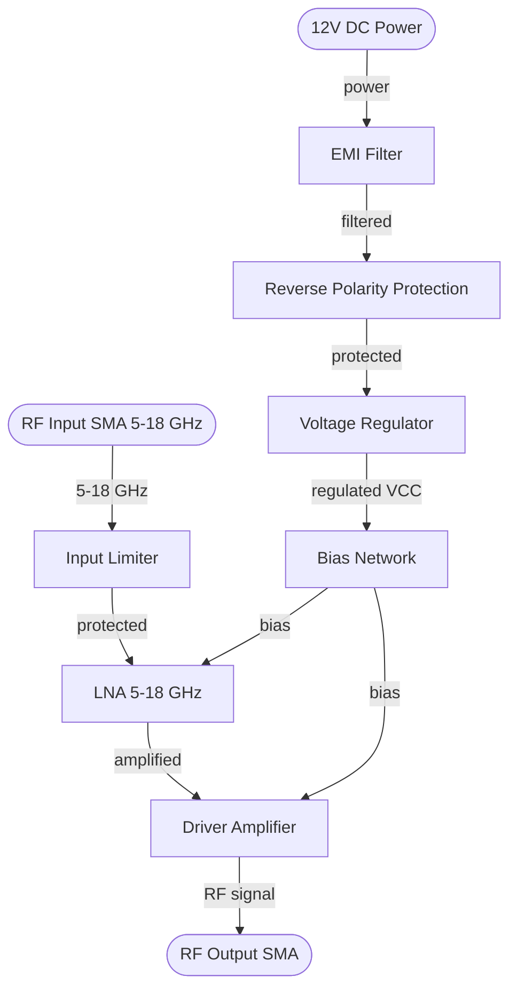

# System Block Diagram
## Rf Receiver

```mermaid
flowchart TD
    RF_IN([RF Input SMA 5-18 GHz]) -->|5-18 GHz| LIM[Input Limiter]
    LIM -->|protected| LNA[LNA 5-18 GHz]
    LNA -->|amplified| AMP[Driver Amplifier]
    AMP -->|RF signal| RF_OUT([RF Output SMA])
    DC_IN([12V DC Power]) -->|power| EMI[EMI Filter]
    EMI -->|filtered| RPP[Reverse Polarity Protection]
    RPP -->|protected| LDO[Voltage Regulator]
    LDO -->|regulated VCC| BIAS[Bias Network]
    BIAS -->|bias| LNA
    BIAS -->|bias| AMP
```
