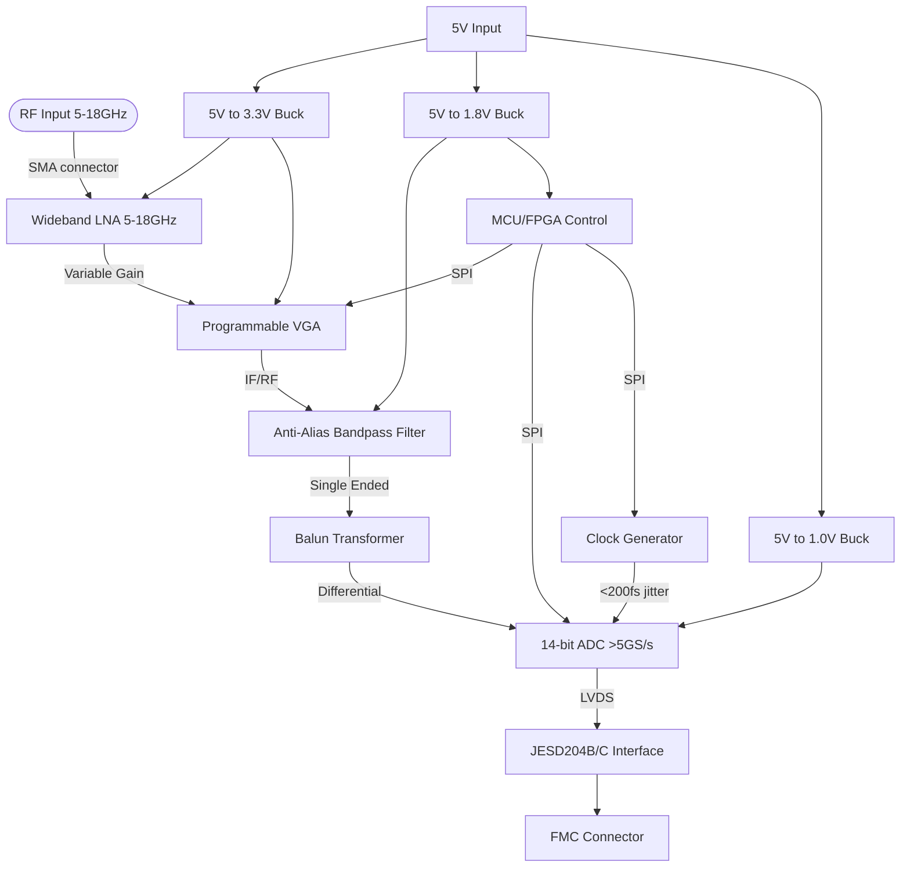

# System Block Diagram
## Test

```mermaid
flowchart TD
    RF_IN([RF Input 5-18GHz]) -->|SMA connector| AMP1[Wideband LNA 5-18GHz]
    AMP1 -->|Variable Gain| VGA[Programmable VGA]
    VGA -->|IF/RF| FIL[Anti-Alias Bandpass Filter]
    FIL -->|Single Ended| BAL[Balun Transformer]
    BAL -->|Differential| ADC[14-bit ADC >5GS/s]
    ADC -->|LVDS| JESD[JESD204B/C Interface]
    JESD --> FMC[FMC Connector]
    
    CLK_GEN[Clock Generator] -->|<200fs jitter| ADC
    MCU[MCU/FPGA Control] -->|SPI| VGA
    MCU -->|SPI| ADC
    MCU -->|SPI| CLK_GEN
    
    PWR_5V[5V Input] --> DCDC1[5V to 3.3V Buck]
    PWR_5V --> DCDC2[5V to 1.8V Buck]
    PWR_5V --> DCDC3[5V to 1.0V Buck]
    DCDC1 --> AMP1
    DCDC1 --> VGA
    DCDC2 --> FIL
    DCDC3 --> ADC
    DCDC2 --> MCU
```
