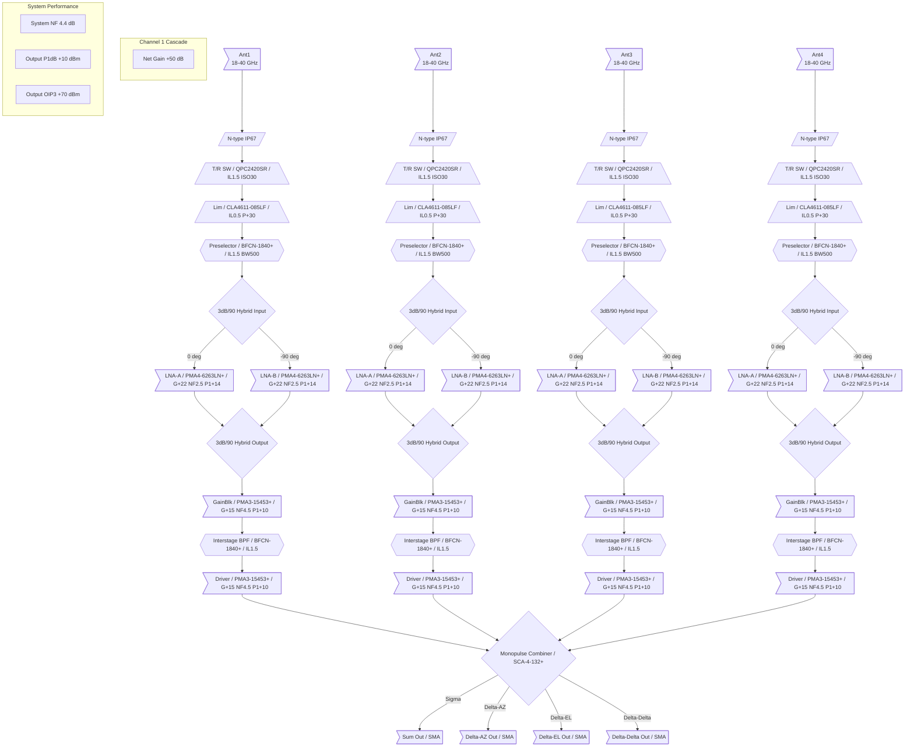

# System Block Diagram
## yhh

```mermaid
flowchart TD
    ANT1>"Ant1<br/>18-40 GHz"]
    ANT2>"Ant2<br/>18-40 GHz"]
    ANT3>"Ant3<br/>18-40 GHz"]
    ANT4>"Ant4<br/>18-40 GHz"]
    CON1[/"N-type IP67"/]
    CON2[/"N-type IP67"/]
    CON3[/"N-type IP67"/]
    CON4[/"N-type IP67"/]
    SW1[/"T/R SW / QPC2420SR / IL1.5 ISO30"\]
    SW2[/"T/R SW / QPC2420SR / IL1.5 ISO30"\]
    SW3[/"T/R SW / QPC2420SR / IL1.5 ISO30"\]
    SW4[/"T/R SW / QPC2420SR / IL1.5 ISO30"\]
    LIM1[/"Lim / CLA4611-085LF / IL0.5 P+30"\]
    LIM2[/"Lim / CLA4611-085LF / IL0.5 P+30"\]
    LIM3[/"Lim / CLA4611-085LF / IL0.5 P+30"\]
    LIM4[/"Lim / CLA4611-085LF / IL0.5 P+30"\]
    BPF1{{"Preselector / BFCN-1840+ / IL1.5 BW500"}}
    BPF2{{"Preselector / BFCN-1840+ / IL1.5 BW500"}}
    BPF3{{"Preselector / BFCN-1840+ / IL1.5 BW500"}}
    BPF4{{"Preselector / BFCN-1840+ / IL1.5 BW500"}}
    HIN1{"3dB/90 Hybrid Input"}
    HIN2{"3dB/90 Hybrid Input"}
    HIN3{"3dB/90 Hybrid Input"}
    HIN4{"3dB/90 Hybrid Input"}
    LNA1A>"LNA-A / PMA4-6263LN+ / G+22 NF2.5 P1+14"]
    LNA1B>"LNA-B / PMA4-6263LN+ / G+22 NF2.5 P1+14"]
    LNA2A>"LNA-A / PMA4-6263LN+ / G+22 NF2.5 P1+14"]
    LNA2B>"LNA-B / PMA4-6263LN+ / G+22 NF2.5 P1+14"]
    LNA3A>"LNA-A / PMA4-6263LN+ / G+22 NF2.5 P1+14"]
    LNA3B>"LNA-B / PMA4-6263LN+ / G+22 NF2.5 P1+14"]
    LNA4A>"LNA-A / PMA4-6263LN+ / G+22 NF2.5 P1+14"]
    LNA4B>"LNA-B / PMA4-6263LN+ / G+22 NF2.5 P1+14"]
    HOUT1{"3dB/90 Hybrid Output"}
    HOUT2{"3dB/90 Hybrid Output"}
    HOUT3{"3dB/90 Hybrid Output"}
    HOUT4{"3dB/90 Hybrid Output"}
    GB1>"GainBlk / PMA3-15453+ / G+15 NF4.5 P1+10"]
    GB2>"GainBlk / PMA3-15453+ / G+15 NF4.5 P1+10"]
    GB3>"GainBlk / PMA3-15453+ / G+15 NF4.5 P1+10"]
    GB4>"GainBlk / PMA3-15453+ / G+15 NF4.5 P1+10"]
    IBPF1{{"Interstage BPF / BFCN-1840+ / IL1.5"}}
    IBPF2{{"Interstage BPF / BFCN-1840+ / IL1.5"}}
    IBPF3{{"Interstage BPF / BFCN-1840+ / IL1.5"}}
    IBPF4{{"Interstage BPF / BFCN-1840+ / IL1.5"}}
    DRV1>"Driver / PMA3-15453+ / G+15 NF4.5 P1+10"]
    DRV2>"Driver / PMA3-15453+ / G+15 NF4.5 P1+10"]
    DRV3>"Driver / PMA3-15453+ / G+15 NF4.5 P1+10"]
    DRV4>"Driver / PMA3-15453+ / G+15 NF4.5 P1+10"]
    MC{"Monopulse Combiner / SCA-4-132+"}
    SUM>"Sum Out / SMA"]
    DAZ>"Delta-AZ Out / SMA"]
    DEL>"Delta-EL Out / SMA"]
    DDD>"Delta-Delta Out / SMA"]
    CG["Net Gain +50 dB"]
    CNF["System NF 4.4 dB"]
    CP1["Output P1dB +10 dBm"]
    CIP3["Output OIP3 +70 dBm"]
    ANT1 --> CON1
    ANT2 --> CON2
    ANT3 --> CON3
    ANT4 --> CON4
    CON1 --> SW1
    CON2 --> SW2
    CON3 --> SW3
    CON4 --> SW4
    SW1 --> LIM1
    SW2 --> LIM2
    SW3 --> LIM3
    SW4 --> LIM4
    LIM1 --> BPF1
    LIM2 --> BPF2
    LIM3 --> BPF3
    LIM4 --> BPF4
    BPF1 --> HIN1
    BPF2 --> HIN2
    BPF3 --> HIN3
    BPF4 --> HIN4
    HIN1 -- "0 deg" --> LNA1A
    HIN1 -- "-90 deg" --> LNA1B
    HIN2 -- "0 deg" --> LNA2A
    HIN2 -- "-90 deg" --> LNA2B
    HIN3 -- "0 deg" --> LNA3A
    HIN3 -- "-90 deg" --> LNA3B
    HIN4 -- "0 deg" --> LNA4A
    HIN4 -- "-90 deg" --> LNA4B
    LNA1A --> HOUT1
    LNA1B --> HOUT1
    LNA2A --> HOUT2
    LNA2B --> HOUT2
    LNA3A --> HOUT3
    LNA3B --> HOUT3
    LNA4A --> HOUT4
    LNA4B --> HOUT4
    HOUT1 --> GB1
    HOUT2 --> GB2
    HOUT3 --> GB3
    HOUT4 --> GB4
    GB1 --> IBPF1
    GB2 --> IBPF2
    GB3 --> IBPF3
    GB4 --> IBPF4
    IBPF1 --> DRV1
    IBPF2 --> DRV2
    IBPF3 --> DRV3
    IBPF4 --> DRV4
    DRV1 --> MC
    DRV2 --> MC
    DRV3 --> MC
    DRV4 --> MC
    MC -- "Sigma" --> SUM
    MC -- "Delta-AZ" --> DAZ
    MC -- "Delta-EL" --> DEL
    MC -- "Delta-Delta" --> DDD
    subgraph CAS1["Channel 1 Cascade"]
        CG
    end
    subgraph CAS2["System Performance"]
        CNF
        CP1
        CIP3
    end
```
