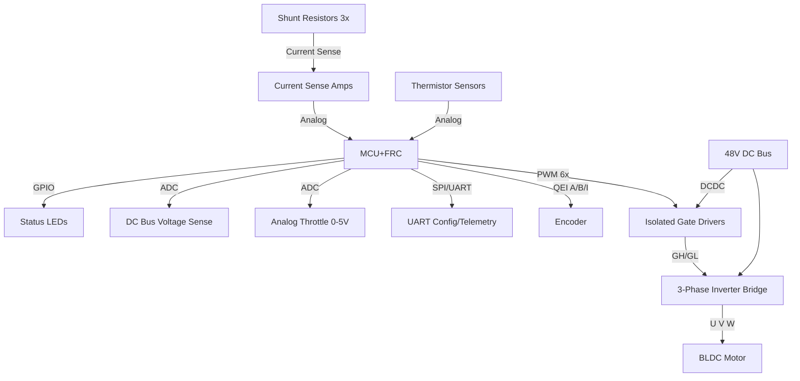

# System Block Diagram
## rf9

```mermaid
graph TD
    MCU[MCU+FRC] -->|PWM 6x| ISODRIVER[Isolated Gate Drivers]
    ISODRIVER -->|GH/GL| MOSFETS[3-Phase Inverter Bridge]
    MOSFETS -->|U V W| MOTOR[BLDC Motor]
    
    MCU -->|QEI A/B/I| ENCODER[Encoder]
    MCU -->|SPI/UART| COMMS[UART Config/Telemetry]
    MCU -->|ADC| THROTTLE[Analog Throttle 0-5V]
    
    SHUNT[Shunt Resistors 3x] -->|Current Sense| AMP[Current Sense Amps]
    AMP -->|Analog| MCU
    
    MCU -->|ADC| VBUS[DC Bus Voltage Sense]
    
    MCU -->|GPIO| LED[Status LEDs]
    
    TEMP[Thermistor Sensors] -->|Analog| MCU
    
    POWER[48V DC Bus] --> MOSFETS
    POWER -->|DCDC| ISODRIVER
```
