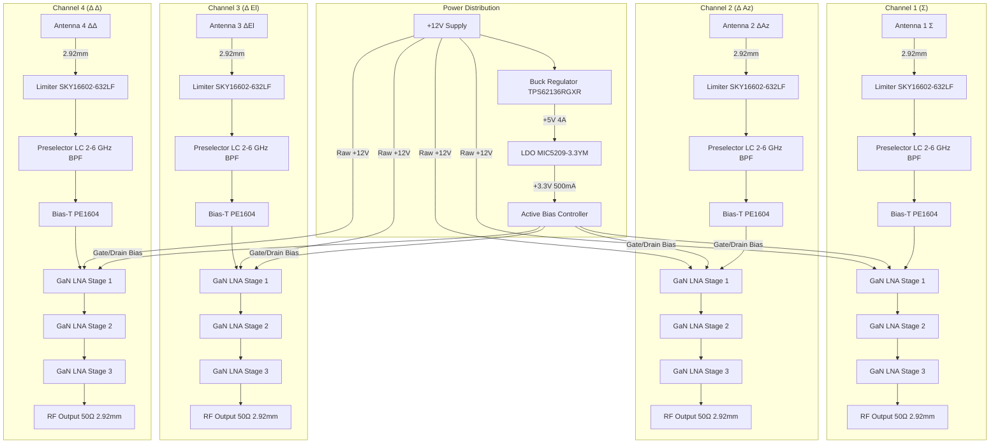

# System Block Diagram
## hfuf

```mermaid
graph TD
    subgraph Channel1["Channel 1 (Σ)"]
        Ant1["Antenna 1 Σ"] -->|2.92mm| Limiter1["Limiter SKY16602-632LF"]
        Limiter1 --> Preselector1["Preselector LC 2-6 GHz BPF"]
        Preselector1 --> BiasT1["Bias-T PE1604"]
        BiasT1 --> LNA1_1["GaN LNA Stage 1"]
        LNA1_1 --> LNA1_2["GaN LNA Stage 2"]
        LNA1_2 --> LNA1_3["GaN LNA Stage 3"]
        LNA1_3 --> RFOut1["RF Output 50Ω 2.92mm"]
    end
    
    subgraph Channel2["Channel 2 (Δ Az)"]
        Ant2["Antenna 2 ΔAz"] -->|2.92mm| Limiter2["Limiter SKY16602-632LF"]
        Limiter2 --> Preselector2["Preselector LC 2-6 GHz BPF"]
        Preselector2 --> BiasT2["Bias-T PE1604"]
        BiasT2 --> LNA2_1["GaN LNA Stage 1"]
        LNA2_1 --> LNA2_2["GaN LNA Stage 2"]
        LNA2_2 --> LNA2_3["GaN LNA Stage 3"]
        LNA2_3 --> RFOut2["RF Output 50Ω 2.92mm"]
    end
    
    subgraph Channel3["Channel 3 (Δ El)"]
        Ant3["Antenna 3 ΔEl"] -->|2.92mm| Limiter3["Limiter SKY16602-632LF"]
        Limiter3 --> Preselector3["Preselector LC 2-6 GHz BPF"]
        Preselector3 --> BiasT3["Bias-T PE1604"]
        BiasT3 --> LNA3_1["GaN LNA Stage 1"]
        LNA3_1 --> LNA3_2["GaN LNA Stage 2"]
        LNA3_2 --> LNA3_3["GaN LNA Stage 3"]
        LNA3_3 --> RFOut3["RF Output 50Ω 2.92mm"]
    end
    
    subgraph Channel4["Channel 4 (Δ Δ)"]
        Ant4["Antenna 4 ΔΔ"] -->|2.92mm| Limiter4["Limiter SKY16602-632LF"]
        Limiter4 --> Preselector4["Preselector LC 2-6 GHz BPF"]
        Preselector4 --> BiasT4["Bias-T PE1604"]
        BiasT4 --> LNA4_1["GaN LNA Stage 1"]
        LNA4_1 --> LNA4_2["GaN LNA Stage 2"]
        LNA4_2 --> LNA4_3["GaN LNA Stage 3"]
        LNA4_3 --> RFOut4["RF Output 50Ω 2.92mm"]
    end
    
    subgraph Power["Power Distribution"]
        Supply["+12V Supply"] --> Buck["Buck Regulator TPS62136RGXR"]
        Buck -->|+5V 4A| LDO["LDO MIC5209-3.3YM"]
        LDO -->|+3.3V 500mA| BiasCtrl["Active Bias Controller"]
        BiasCtrl -->|Gate/Drain Bias| LNA1_1
        BiasCtrl -->|Gate/Drain Bias| LNA2_1
        BiasCtrl -->|Gate/Drain Bias| LNA3_1
        BiasCtrl -->|Gate/Drain Bias| LNA4_1
    end
    
    Supply -->|Raw +12V| LNA1_1
    Supply -->|Raw +12V| LNA2_1
    Supply -->|Raw +12V| LNA3_1
    Supply -->|Raw +12V| LNA4_1
```
