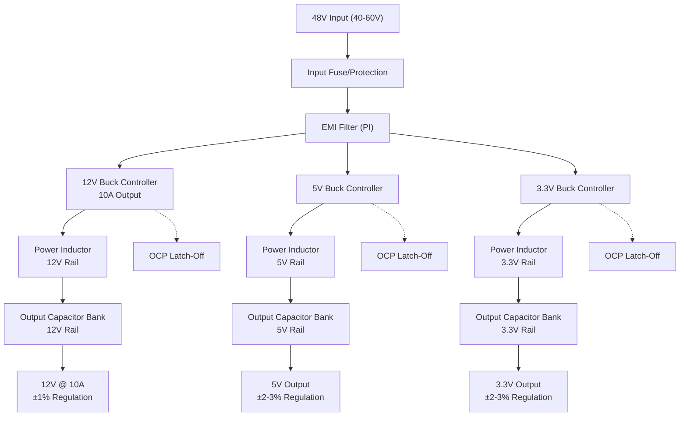

# System Block Diagram
## rf1

```mermaid
graph TD
    VIN["48V Input (40-60V)"]-->FUSE["Input Fuse/Protection"]
    FUSE-->EMI["EMI Filter (PI)"]
    EMI-->BUCK12["12V Buck Controller\n10A Output"]
    EMI-->BUCK5["5V Buck Controller"]
    EMI-->BUCK33["3.3V Buck Controller"]
    BUCK12-->L12["Power Inductor\n12V Rail"]
    BUCK5-->L5["Power Inductor\n5V Rail"]
    BUCK33-->L33["Power Inductor\n3.3V Rail"]
    L12-->C12["Output Capacitor Bank\n12V Rail"]
    L5-->C5["Output Capacitor Bank\n5V Rail"]
    L33-->C33["Output Capacitor Bank\n3.3V Rail"]
    C12-->VOUT12["12V @ 10A\n±1% Regulation"]
    C5-->VOUT5["5V Output\n±2-3% Regulation"]
    C33-->VOUT33["3.3V Output\n±2-3% Regulation"]
    BUCK12-.->OCP12["OCP Latch-Off"]
    BUCK5-.->OCP5["OCP Latch-Off"]
    BUCK33-.->OCP33["OCP Latch-Off"]
```
