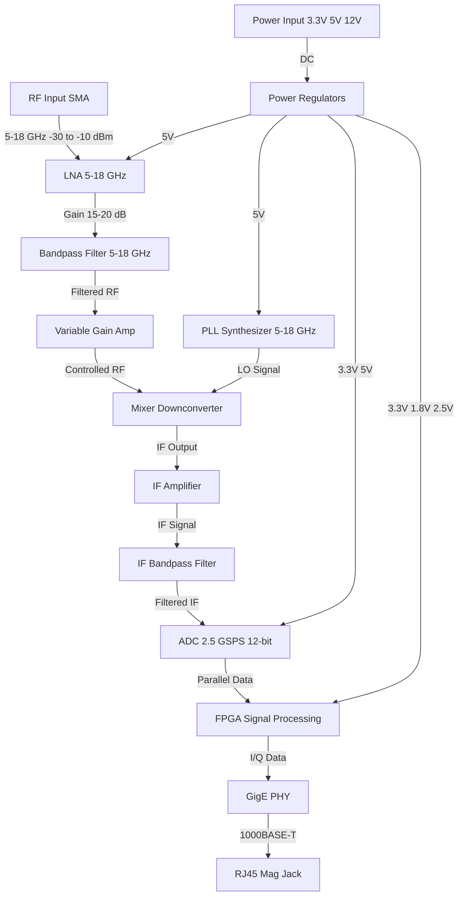

# System Block Diagram
## mnb

```mermaid
flowchart TD
    RF_IN[RF Input SMA] -->|5-18 GHz -30 to -10 dBm| LNA[LNA 5-18 GHz]
    LNA -->|Gain 15-20 dB| BPF1[Bandpass Filter 5-18 GHz]
    BPF1 -->|Filtered RF| VGA[Variable Gain Amp]
    VGA -->|Controlled RF| MIXER[Mixer Downconverter]
    SYNTH[PLL Synthesizer 5-18 GHz] -->|LO Signal| MIXER
    MIXER -->|IF Output| IF_AMP[IF Amplifier]
    IF_AMP -->|IF Signal| BPF2[IF Bandpass Filter]
    BPF2 -->|Filtered IF| ADC[ADC 2.5 GSPS 12-bit]
    ADC -->|Parallel Data| FPGA[FPGA Signal Processing]
    FPGA -->|I/Q Data| ETH_PHY[GigE PHY]
    ETH_PHY -->|1000BASE-T| ETH_MAG[RJ45 Mag Jack]
    PWR[Power Input 3.3V 5V 12V] -->|DC| REGS[Power Regulators]
    REGS -->|3.3V 1.8V 2.5V| FPGA
    REGS -->|3.3V 5V| ADC
    REGS -->|5V| SYNTH
    REGS -->|5V| LNA
```
