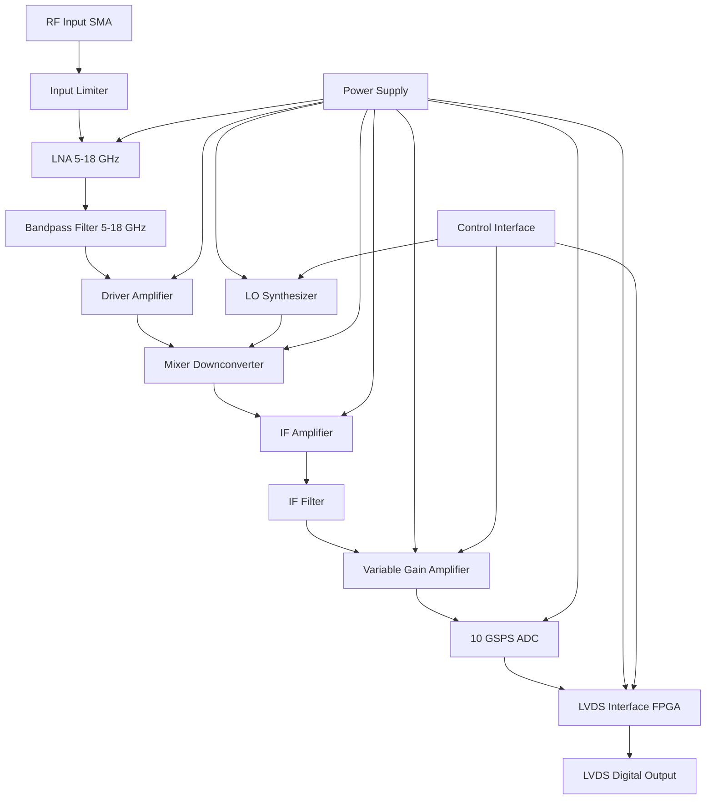

# System Block Diagram
## dsf

```mermaid
flowchart TD
    RF_IN[RF Input SMA] --> LIMITER[Input Limiter]
    LIMITER --> LNA[LNA 5-18 GHz]
    LNA --> BPF1[Bandpass Filter 5-18 GHz]
    BPF1 --> AMP1[Driver Amplifier]
    AMP1 --> MIXER[Mixer Downconverter]
    MIXER --> IF_AMP[IF Amplifier]
    IF_AMP --> IF_FILTER[IF Filter]
    IF_FILTER --> VGA[Variable Gain Amplifier]
    VGA --> ADC[10 GSPS ADC]
    ADC --> FPGA[LVDS Interface FPGA]
    FPGA --> LVDS_OUT[LVDS Digital Output]
    
    LO[LO Synthesizer] --> MIXER
    POWER[Power Supply] --> LNA
    POWER --> AMP1
    POWER --> MIXER
    POWER --> IF_AMP
    POWER --> VGA
    POWER --> ADC
    POWER --> FPGA
    POWER --> LO
    
    CTRL[Control Interface] --> VGA
    CTRL --> LO
    CTRL --> FPGA
```
