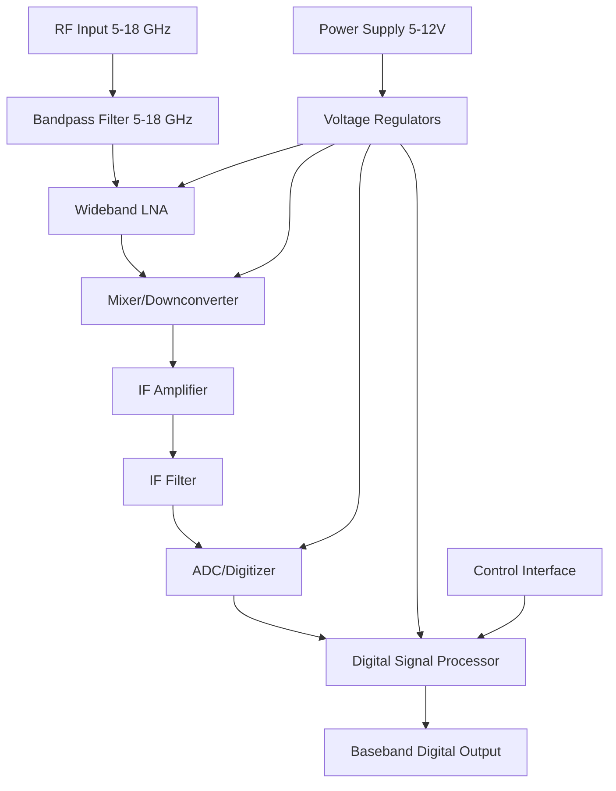

# System Block Diagram
## sample rf

```mermaid
flowchart TD
    RF_IN["RF Input 5-18 GHz"] --> BPF["Bandpass Filter 5-18 GHz"]
    BPF --> LNA["Wideband LNA"]
    LNA --> MIXER["Mixer/Downconverter"]
    MIXER --> IF_AMP["IF Amplifier"]
    IF_AMP --> FILTER["IF Filter"]
    FILTER --> ADC["ADC/Digitizer"]
    ADC --> DSP["Digital Signal Processor"]
    PWR["Power Supply 5-12V"] --> REG["Voltage Regulators"]
    REG --> LNA
    REG --> MIXER
    REG --> ADC
    REG --> DSP
    DSP --> BB_OUT["Baseband Digital Output"]
    CTRL["Control Interface"] --> DSP
```
