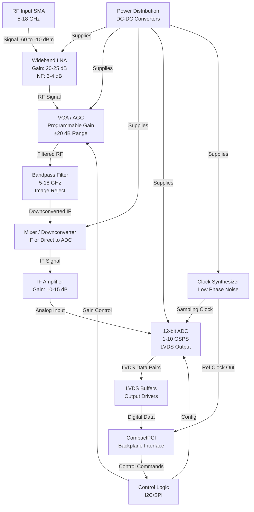

# System Block Diagram
## kgo

```mermaid
flowchart TD
    RF_IN["RF Input SMA<br/>5-18 GHz"] -->|Signal -60 to -10 dBm| LNA["Wideband LNA<br/>Gain: 20-25 dB<br/>NF: 3-4 dB"]
    LNA -->|RF Signal| VGA["VGA / AGC<br/>Programmable Gain<br/>±20 dB Range"]
    VGA -->|Filtered RF| BPF["Bandpass Filter<br/>5-18 GHz<br/>Image Reject"]
    BPF -->|Downconverted IF| MIXER["Mixer / Downconverter<br/>IF or Direct to ADC"]
    MIXER -->|IF Signal| AMP_IF["IF Amplifier<br/>Gain: 10-15 dB"]
    AMP_IF -->|Analog Input| ADC["12-bit ADC<br/>1-10 GSPS<br/>LVDS Output"]
    ADC -->|LVDS Data Pairs| LVDS_BUF["LVDS Buffers<br/>Output Drivers"]
    LVDS_BUF -->|Digital Data| CPCI["CompactPCI<br/>Backplane Interface"]
    CLK_SRC["Clock Synthesizer<br/>Low Phase Noise"] -->|Sampling Clock| ADC
    CLK_SRC -->|Ref Clock Out| CPCI
    CTRL["Control Logic<br/>I2C/SPI"] -->|Gain Control| VGA
    CTRL -->|Config| ADC
    CPCI -->|Control Commands| CTRL
    PWR["Power Distribution<br/>DC-DC Converters"] -->|Supplies| LNA
    PWR -->|Supplies| VGA
    PWR -->|Supplies| MIXER
    PWR -->|Supplies| ADC
    PWR -->|Supplies| CLK_SRC
```
