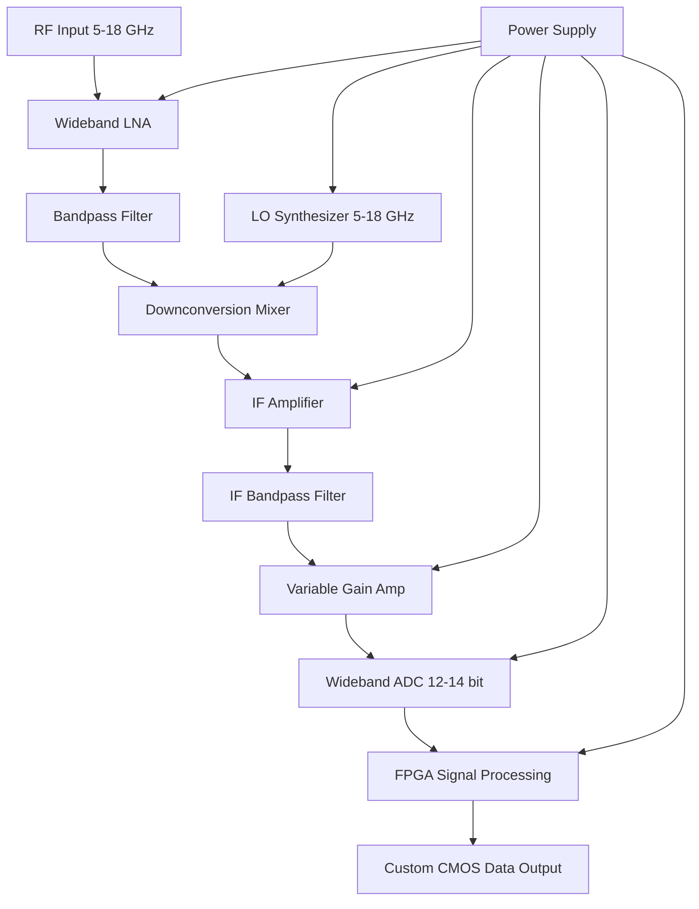

# System Block Diagram
## iguyc

```mermaid
flowchart TD
    RF_IN[RF Input 5-18 GHz] --> LNA[Wideband LNA]
    LNA --> BPF1[Bandpass Filter]
    BPF1 --> MIXER[Downconversion Mixer]
    LO[LO Synthesizer 5-18 GHz] --> MIXER
    MIXER --> IF_AMP[IF Amplifier]
    IF_AMP --> BPF2[IF Bandpass Filter]
    BPF2 --> VGA[Variable Gain Amp]
    VGA --> ADC[Wideband ADC 12-14 bit]
    ADC --> FPGA[FPGA Signal Processing]
    FPGA --> DATA_OUT[Custom CMOS Data Output]
    
    PWR[Power Supply] --> LNA
    PWR --> LO
    PWR --> IF_AMP
    PWR --> VGA
    PWR --> ADC
    PWR --> FPGA
```
