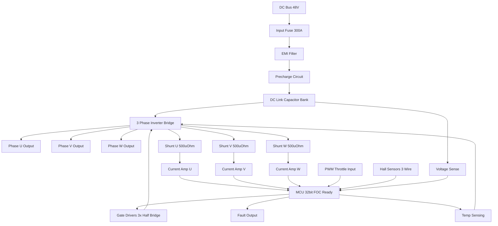

# System Block Diagram
## fug

```mermaid
graph TD
    DC_BUS[DC Bus 48V] --> FUSE[Input Fuse 300A]
    FUSE --> EMI[EMI Filter]
    EMI --> PRE_REG[Precharge Circuit]
    PRE_REG --> DC_LINK[DC Link Capacitor Bank]
    DC_LINK --> INV[3 Phase Inverter Bridge]
    
    INV --> PHASE_U[Phase U Output]
    INV --> PHASE_V[Phase V Output]
    INV --> PHASE_W[Phase W Output]
    
    INV --> SHUNT_U[Shunt U 500uOhm]
    INV --> SHUNT_V[Shunt V 500uOhm]
    INV --> SHUNT_W[Shunt W 500uOhm]
    
    SHUNT_U --> AMP_U[Current Amp U]
    SHUNT_V --> AMP_V[Current Amp V]
    SHUNT_W --> AMP_W[Current Amp W]
    
    AMP_U --> MCU[MCU 32bit FOC Ready]
    AMP_V --> MCU
    AMP_W --> MCU
    
    PWM_IN[PWM Throttle Input] --> MCU
    HALL[Hall Sensors 3 Wire] --> MCU
    
    MCU --> GATE[Gate Drivers 3x Half Bridge]
    GATE --> INV
    
    MCU --> FAULT[Fault Output]
    
    DC_LINK --> VSENSE[Voltage Sense]
    VSENSE --> MCU
    
    MCU --> TEMP[Temp Sensing]
    TEMP --> INV
```
