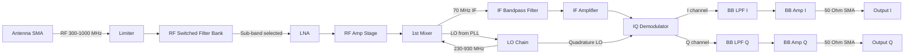

# System Block Diagram
## hm

```mermaid
flowchart LR
    A[Antenna SMA] -->|RF 300-1000 MHz| B[Limiter]
    B --> C[RF Switched Filter Bank]
    C -->|Sub-band selected| D[LNA]
    D --> E[RF Amp Stage]
    E --> F[1st Mixer]
    F -->|LO from PLL| G[LO Chain]
    G -->|230-930 MHz| F
    F -->|70 MHz IF| H[IF Bandpass Filter]
    H --> I[IF Amplifier]
    I --> J[IQ Demodulator]
    G -->|Quadrature LO| J
    J -->|I channel| K[BB LPF I]
    J -->|Q channel| L[BB LPF Q]
    K --> M[BB Amp I]
    L --> N[BB Amp Q]
    M -->|50 Ohm SMA| O[Output I]
    N -->|50 Ohm SMA| P[Output Q]
```
