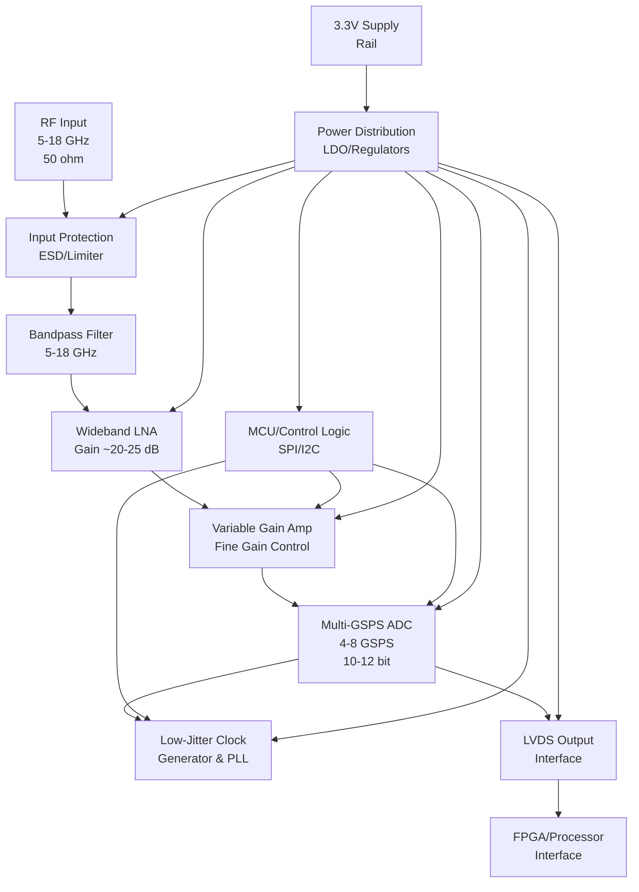

# System Block Diagram
## dghb

```mermaid
flowchart TD
    RF_IN[RF Input\n5-18 GHz\n50 ohm] --> PROTECT[Input Protection\nESD/Limiter]
    PROTECT --> BPF[Bandpass Filter\n5-18 GHz]
    BPF --> LNA[Wideband LNA\nGain ~20-25 dB]
    LNA --> VGA[Variable Gain Amp\nFine Gain Control]
    VGA --> ADC[Multi-GSPS ADC\n4-8 GSPS\n10-12 bit]
    ADC --> CLK_GEN[Low-Jitter Clock\nGenerator & PLL]
    ADC --> LVDS_OUT[LVDS Output\nInterface]
    LVDS_OUT --> FPGA[FPGA/Processor\nInterface]
    CTRL[MCU/Control Logic\nSPI/I2C] --> VGA
    CTRL --> ADC
    CTRL --> CLK_GEN
    PWR_3V3[3.3V Supply\nRail] --> PWR_DIST[Power Distribution\nLDO/Regulators]
    PWR_DIST --> PROTECT
    PWR_DIST --> LNA
    PWR_DIST --> VGA
    PWR_DIST --> ADC
    PWR_DIST --> CLK_GEN
    PWR_DIST --> CTRL
    PWR_DIST --> LVDS_OUT
```
