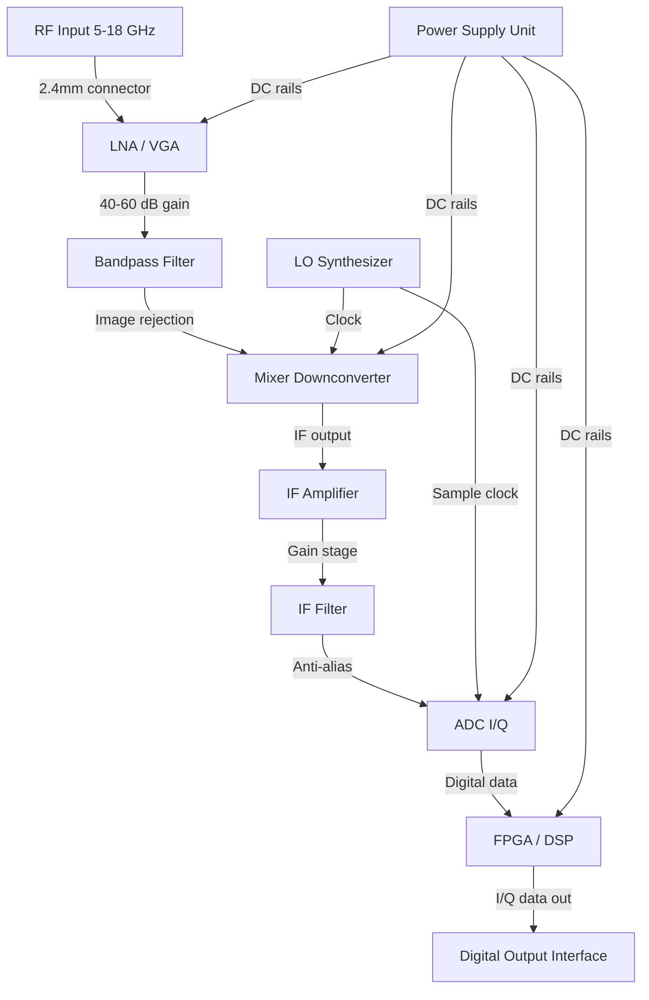

# System Block Diagram
## receiver

```mermaid
flowchart TD
    RF_IN[RF Input 5-18 GHz] -->|2.4mm connector| LNA[LNA / VGA]
    LNA -->|40-60 dB gain| BPF[Bandpass Filter]
    BPF -->|Image rejection| MIXER[Mixer Downconverter]
    MIXER -->|IF output| IF_AMP[IF Amplifier]
    IF_AMP -->|Gain stage| IF_FILTER[IF Filter]
    IF_FILTER -->|Anti-alias| ADC[ADC I/Q]
    ADC -->|Digital data| FPGA[FPGA / DSP]
    FPGA -->|I/Q data out| OUTPUT[Digital Output Interface]
    LO[LO Synthesizer] -->|Clock| MIXER
    LO -->|Sample clock| ADC
    PSU[Power Supply Unit] -->|DC rails| LNA
    PSU -->|DC rails| MIXER
    PSU -->|DC rails| ADC
    PSU -->|DC rails| FPGA
```
