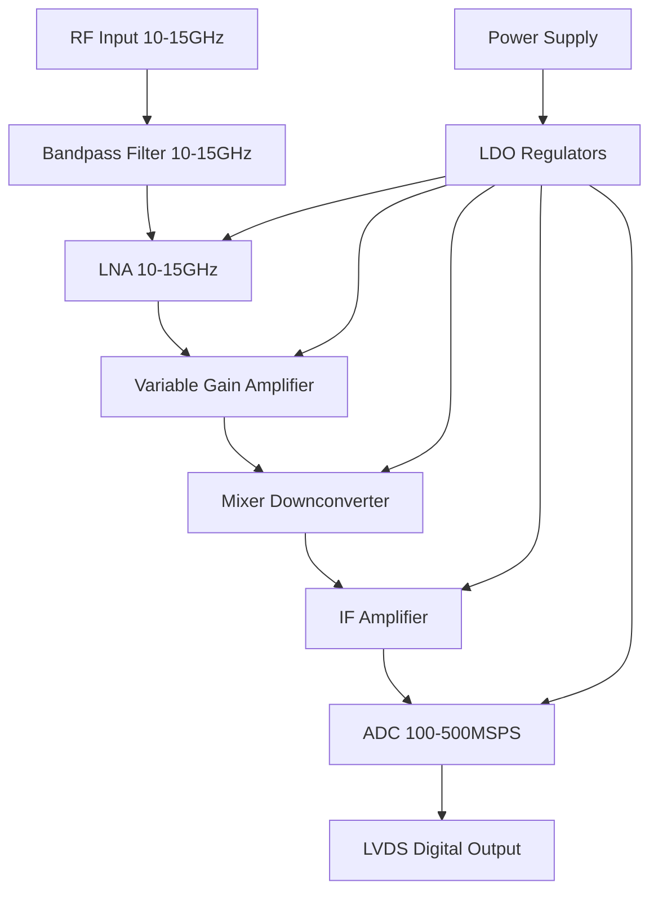

# System Block Diagram
## kh

```mermaid
flowchart TD
    RF_IN[RF Input 10-15GHz] --> BANDPASS[Bandpass Filter 10-15GHz]
    BANDPASS --> LNA[LNA 10-15GHz]
    LNA --> VGA[Variable Gain Amplifier]
    VGA --> MIXER[Mixer Downconverter]
    MIXER --> IF_AMP[IF Amplifier]
    IF_AMP --> ADC[ADC 100-500MSPS]
    ADC --> LVDS_OUT[LVDS Digital Output]
    PWR[Power Supply] --> REG_LDO[LDO Regulators]
    REG_LDO --> LNA
    REG_LDO --> VGA
    REG_LDO --> MIXER
    REG_LDO --> IF_AMP
    REG_LDO --> ADC
```
