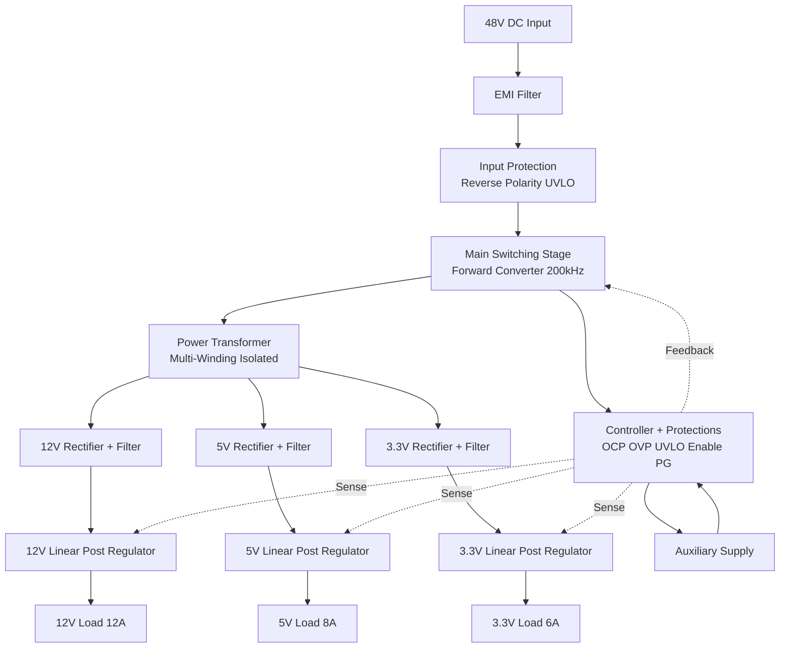

# System Block Diagram
## fjxm

```mermaid
graph TD
    IN[48V DC Input] --> EMI[EMI Filter]
    EMI --> PROT[Input Protection<br/>Reverse Polarity UVLO]
    PROT --> PFC[Main Switching Stage<br/>Forward Converter 200kHz]
    PFC --> TRANS[Power Transformer<br/>Multi-Winding Isolated]
    TRANS --> REC1[12V Rectifier + Filter]
    TRANS --> REC2[5V Rectifier + Filter]
    TRANS --> REC3[3.3V Rectifier + Filter]
    REC1 --> REG12[12V Linear Post Regulator]
    REC2 --> REG5[5V Linear Post Regulator]
    REC3 --> REG33[3.3V Linear Post Regulator]
    REG12 --> LOAD1[12V Load 12A]
    REG5 --> LOAD2[5V Load 8A]
    REG33 --> LOAD3[3.3V Load 6A]
    PFC --> CTRL[Controller + Protections<br/>OCP OVP UVLO Enable PG]
    CTRL -.->|Feedback| PFC
    CTRL -.->|Sense| REG12
    CTRL -.->|Sense| REG5
    CTRL -.->|Sense| REG33
    CTRL --> AUX[Auxiliary Supply]
    AUX --> CTRL
```
