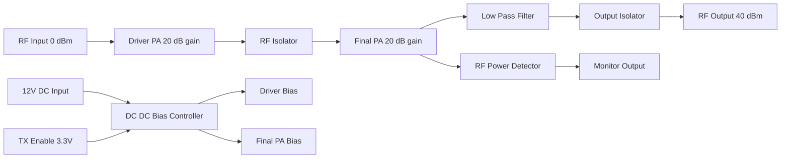

# System Block Diagram
## rfgg

```mermaid
graph LR
    RF_IN[RF Input 0 dBm] --> PA_1[Driver PA 20 dB gain]
    PA_1 --> ISO_1[RF Isolator]
    ISO_1 --> PA_2[Final PA 20 dB gain]
    PA_2 --> LPF[Low Pass Filter]
    LPF --> ISO_2[Output Isolator]
    ISO_2 --> RF_OUT[RF Output 40 dBm]
    
    DC_IN[12V DC Input] --> REG[DC DC Bias Controller]
    REG --> BIAS_1[Driver Bias]
    REG --> BIAS_2[Final PA Bias]
    
    CTRL[TX Enable 3.3V] --> REG
    
    PA_2 --> DET[RF Power Detector]
    DET --> MON[Monitor Output]
```
