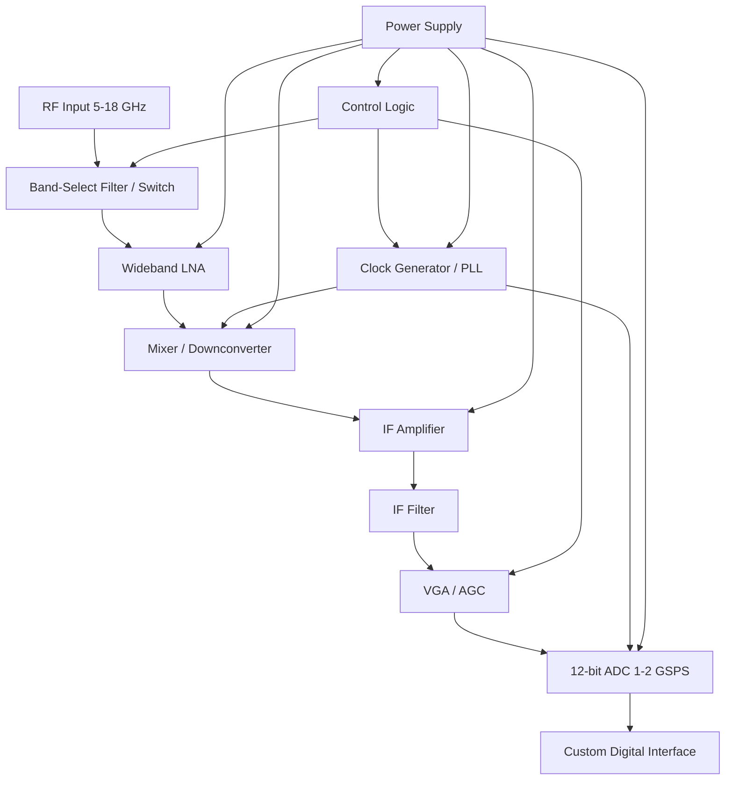

# System Block Diagram
## sample

```mermaid
flowchart TD
    RF_IN["RF Input 5-18 GHz"] --> BAND_SELECT["Band-Select Filter / Switch"]
    BAND_SELECT --> LNA["Wideband LNA"]
    LNA --> MIXER["Mixer / Downconverter"]
    MIXER --> IF_AMP["IF Amplifier"]
    IF_AMP --> IF_FILTER["IF Filter"]
    IF_FILTER --> VGA["VGA / AGC"]
    VGA --> ADC["12-bit ADC 1-2 GSPS"]
    ADC --> DOUT["Custom Digital Interface"]
    
    CLOCK["Clock Generator / PLL"] --> ADC
    CLOCK --> MIXER
    
    MCU["Control Logic"] --> BAND_SELECT
    MCU --> VGA
    MCU --> CLOCK
    
    PWR["Power Supply"] --> LNA
    PWR --> MIXER
    PWR --> IF_AMP
    PWR --> ADC
    PWR --> CLOCK
    PWR --> MCU
```
