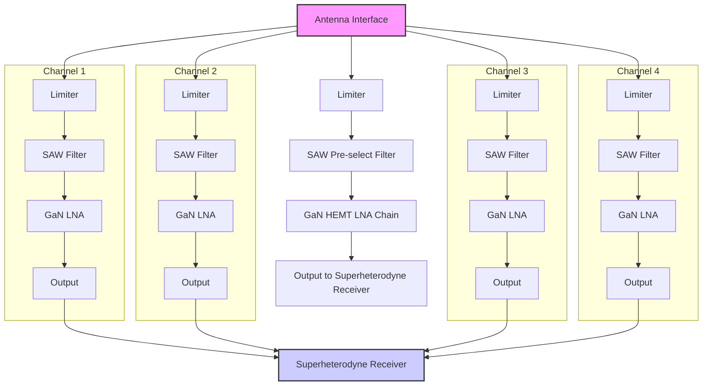

# System Block Diagram
## dgh

```mermaid
flowchart TD
    A[Antenna Interface] --> B[Limiter]
    B --> C[SAW Pre-select Filter]
    C --> D[GaN HEMT LNA Chain]
    D --> E[Output to Superheterodyne Receiver]
    
    subgraph Channel 1
        B1[Limiter] --> C1[SAW Filter] --> D1[GaN LNA] --> E1[Output]
    end
    
    subgraph Channel 2
        B2[Limiter] --> C2[SAW Filter] --> D2[GaN LNA] --> E2[Output]
    end
    
    subgraph Channel 3
        B3[Limiter] --> C3[SAW Filter] --> D3[GaN LNA] --> E3[Output]
    end
    
    subgraph Channel 4
        B4[Limiter] --> C4[SAW Filter] --> D4[GaN LNA] --> E4[Output]
    end
    
    A --> B1
    A --> B2
    A --> B3
    A --> B4
    
    E1 --> F[Superheterodyne Receiver]
    E2 --> F
    E3 --> F
    E4 --> F
    
    style A fill:#f9f,stroke:#333,stroke-width:2px
    style F fill:#ccf,stroke:#333,stroke-width:2px
```
