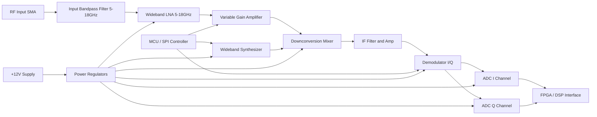

# System Block Diagram
## ajsfdvhjs

```mermaid
graph LR
    ANT[RF Input SMA] --> BPF[Input Bandpass Filter 5-18GHz]
    BPF --> LNA[Wideband LNA 5-18GHz]
    LNA --> VGA[Variable Gain Amplifier]
    VGA --> MIXER[Downconversion Mixer]
    LO[Wideband Synthesizer] --> MIXER
    MIXER --> IF[IF Filter and Amp]
    IF --> IQ[Demodulator I/Q]
    IQ --> ADC1[ADC I Channel]
    IQ --> ADC2[ADC Q Channel]
    ADC1 --> FPGA[FPGA / DSP Interface]
    ADC2 --> FPGA
    CTRL[MCU / SPI Controller] --> VGA
    CTRL --> LO
    CTRL --> IQ
    PWR[+12V Supply] --> REG[Power Regulators]
    REG --> LNA
    REG --> MIXER
    REG --> LO
    REG --> IQ
    REG --> ADC1
    REG --> ADC2
```
