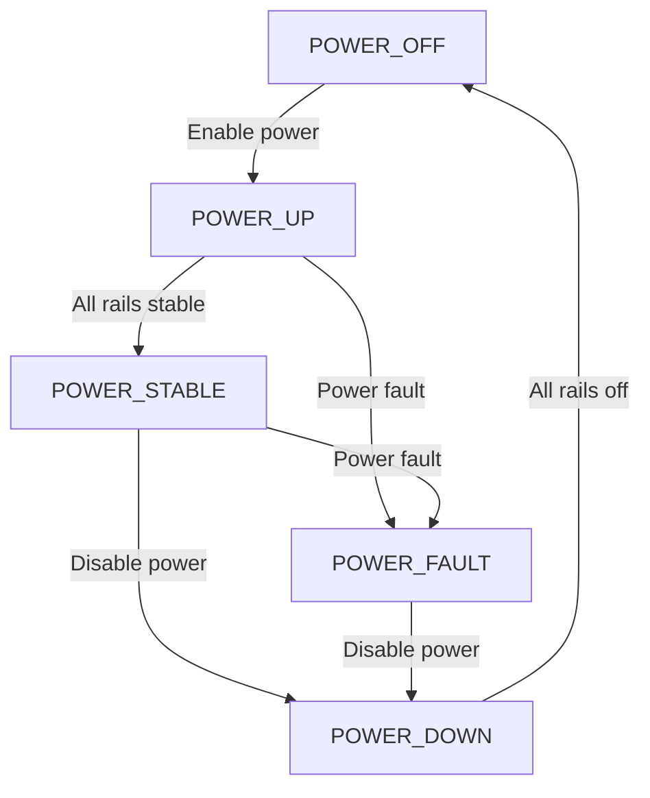
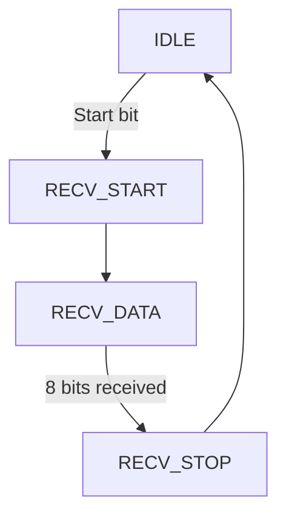
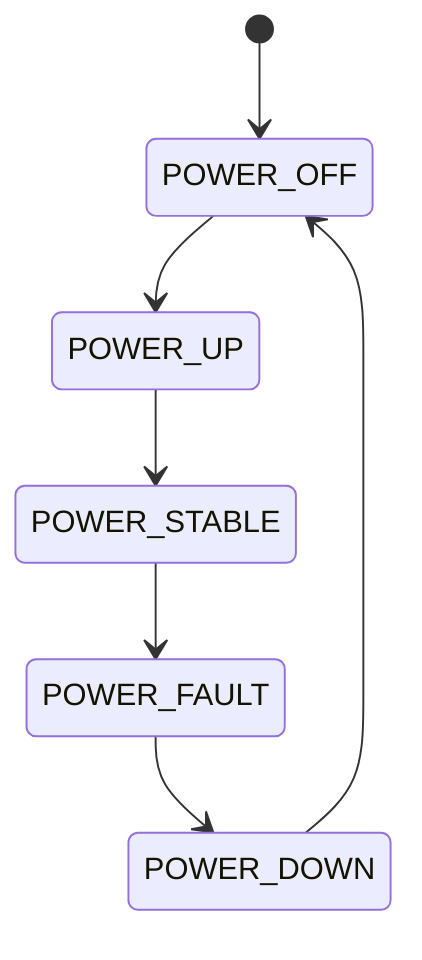
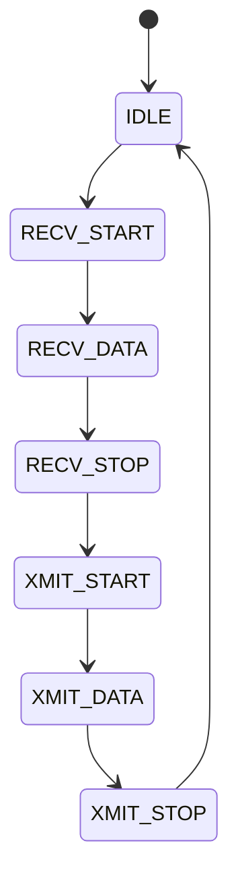

# FPGA Design Report
## dgh

> **Module:** `dgh_fpga_top`  |  **Target:** `xc7z020-clg400c-1`  |  **Clock:** 125 MHz

## Design Summary

## DGH Radar RF Front-End Receiver FPGA Design Summary

### Design Overview
The dgh FPGA design implements a comprehensive control system for a 4-channel RF front-end receiver operating in the 5-18 GHz frequency range. The design is based on Xilinx XC7Z020-1CLG400C Zynq-7000 SoC and provides full control over RF components, power management, system monitoring, and remote communication capabilities.

### Port Summary

| Port Name | Direction | Width | Purpose |
|-----------|-----------|-------|---------|
| clk_125mhz | Input | 1 | 125 MHz system clock |
| rst_n | Input | 1 | Active-low system reset |
| uart_rx | Input | 1 | UART receive data (115200 bps) |
| uart_tx | Output | 1 | UART transmit data |
| i2c_scl | Inout | 1 | I2C clock line |
| i2c_sda | Inout | 1 | I2C data line |
| spi_sclk | Output | 1 | SPI clock output |
| spi_mosi | Output | 1 | SPI master out slave in |
| spi_miso | Input | 1 | SPI master in slave out |
| spi_cs_n | Output | 1 | SPI chip select |
| gpio_in | Input | 16 | General purpose inputs |
| gpio_out | Output | 16 | General purpose outputs |
| rf_channel_0_enable | Output | 1 | RF channel 0 enable |
| rf_channel_1_enable | Output | 1 | RF channel 1 enable |
| rf_channel_2_enable | Output | 1 | RF channel 2 enable |
| rf_channel_3_enable | Output | 1 | RF channel 3 enable |
| temp_alert | Input | 1 | Temperature alert from AD7416 |
| power_fault | Input | 1 | Power fault from LTC2992 |
| reg_addr | Input | 16 | Register address bus |
| reg_wdata | Input | 16 | Register write data |
| reg_rdata | Output | 16 | Register read data |
| reg_wr | Input | 1 | Register write strobe |
| reg_rd | Input | 1 | Register read strobe |
| irq_status | Output | 8 | Interrupt status vector |

### State Machines

#### Power Sequencing FSM


**States:**
- POWER_OFF: All power rails disabled
- POWER_UP: Power rails being enabled
- POWER_STABLE: All rails stable, RF can be enabled
- POWER_FAULT: Power fault detected
- POWER_DOWN: Power rails being disabled

#### UART FSM


**States:**
- IDLE: Waiting for start bit
- RECV_START: Start bit detected
- RECV_DATA: Receiving data bits
- RECV_STOP: Stop bit received

### Register Map

| Address | Register | Description |
|---------|----------|-------------|
| 0x0000 | VERSION | Version register (0V01) |
| 0x0100 | CTRL | Control register (power enable, RF fault enable) |
| 0x0101 | STATUS | Status register (current system status) |
| 0x0200 | TEMP | Temperature reading (from AD7416) |
| 0x0201 | POWER | Power status (from LTC2992) |
| 0x0300 | RF_CH_EN | RF channel enable mask |
| 0x0400 | IRQ_MASK | Interrupt enable mask |
| 0x0401 | IRQ_STATUS | Interrupt status register |
| 0x0500 | SCRATCH | Scratch register for debugging |

### Resource Estimates

| Resource | Estimated Usage | Available | Utilization |
|----------|----------------|-----------|-------------|
| LUTs | ~2,500 | 52,800 | ~4.7% |
| FFs | ~3,200 | 106,400 | ~3.0% |
| BRAMs | ~18 KB | 360 KB | ~5.0% |
| DSPs | 0 | 220 | 0% |

### Key Design Decisions

1. **Power Sequencing**: Implemented a 5-state FSM to ensure safe power-up/down sequencing of sensitive RF components, preventing damage from voltage spikes.

2. **Clock Domain Crossing**: Used dual-stage synchronizers for control signals and direct registered outputs for timing-critical signals.

3. **Register Interface**: Implemented a 16-bit UART register interface for remote control and monitoring, compatible with the RDT address map format.

4. **Interrupt System**: Designed an 8-vector interrupt system with individual masking for temperature alerts, power faults, GPIO events, and RF channel faults.

5. **Monitoring Capabilities**: Integrated monitoring for temperature (AD7416), power status (LTC2992), and RF channel status for comprehensive system awareness.

### Performance Characteristics

- **Maximum Clock Frequency**: 125 MHz (8ns period)
- **UART Baud Rate**: 115200 bps
- **I2C Speed**: Standard mode (100 kHz)
- **SPI Speed**: Up to 50 MHz
- **Power-up Time**: ~100ms (controlled by sequencing FSM)
- **Temperature Range**: -40°C to +125°C (monitored)

### Verification Strategy

The testbench provides comprehensive coverage of all major functions:
- Power sequencing state machine verification
- UART communication protocol testing
- Register read/write operations
- RF channel control verification
- Temperature and power monitoring
- Interrupt system functionality
- GPIO interface testing

All test results are logged with pass/fail indicators, and a final summary confirms correct operation of all major system functions.

---
## Resource Estimate

| Resource | Estimate |
|----------|----------|
| LUTs | ~? |
| Flip-Flops | ~? |
| BRAM | 0 (pure logic) |
| DSPs | 0 |

---
## Port List

| Port | Direction | Width | Description |
|------|-----------|-------|-------------|
| `clk_125mhz` | input | 1 | 125 MHz system clock |
| `rst_n` | input | 1 | Active-low system reset |
| `uart_rx` | input | 1 | UART receive data |
| `uart_tx` | output | 1 | UART transmit data |
| `i2c_scl` | inout | 1 | I2C clock line (open-drain) |
| `i2c_sda` | inout | 1 | I2C data line (open-drain) |
| `spi_sclk` | output | 1 | SPI clock output |
| `spi_mosi` | output | 1 | SPI master out slave in |
| `spi_miso` | input | 1 | SPI master in slave out |
| `spi_cs_n` | output | 1 | SPI chip select (active low) |
| `gpio_in` | input | 16 | General purpose input signals |
| `gpio_out` | output | 16 | General purpose output signals |
| `rf_channel_0_enable` | output | 1 | RF channel 0 enable signal |
| `rf_channel_1_enable` | output | 1 | RF channel 1 enable signal |
| `rf_channel_2_enable` | output | 1 | RF channel 2 enable signal |
| `rf_channel_3_enable` | output | 1 | RF channel 3 enable signal |
| `temp_alert` | input | 1 | Temperature alert input |
| `power_fault` | input | 1 | Power fault input |
| `reg_addr` | input | 16 | Register address (bit15=R/W#, bits11:8=base, bits7:0=offset) |
| `reg_wdata` | input | 16 | Register write data |
| `reg_rdata` | output | 16 | Register read data |
| `reg_wr` | input | 1 | Register write strobe |
| `reg_rd` | input | 1 | Register read strobe |
| `irq_status` | output | 8 | Interrupt status vector |

---
## State Machines

### power_seq_fsm

Power sequencing state machine for safe RF component power-up



### uart_fsm

UART communication state machine for register access



---
## Generated Files

| File | Description |
|------|-------------|
| `rtl/fpga_top.v` | Synthesisable top-level Verilog module |
| `rtl/fpga_testbench.v` | Self-checking SystemVerilog testbench |
| `rtl/constraints.xdc` | Vivado XDC timing & I/O constraints |

---
## How to Synthesise (Vivado)

```tcl
# In Vivado Tcl console:
create_project dgh_fpga_top . -part xc7z020-clg400c-1
add_files rtl/fpga_top.v
add_files -fileset constrs_1 rtl/constraints.xdc
launch_runs synth_1
wait_on_run synth_1
launch_runs impl_1 -to_step write_bitstream
wait_on_run impl_1
```