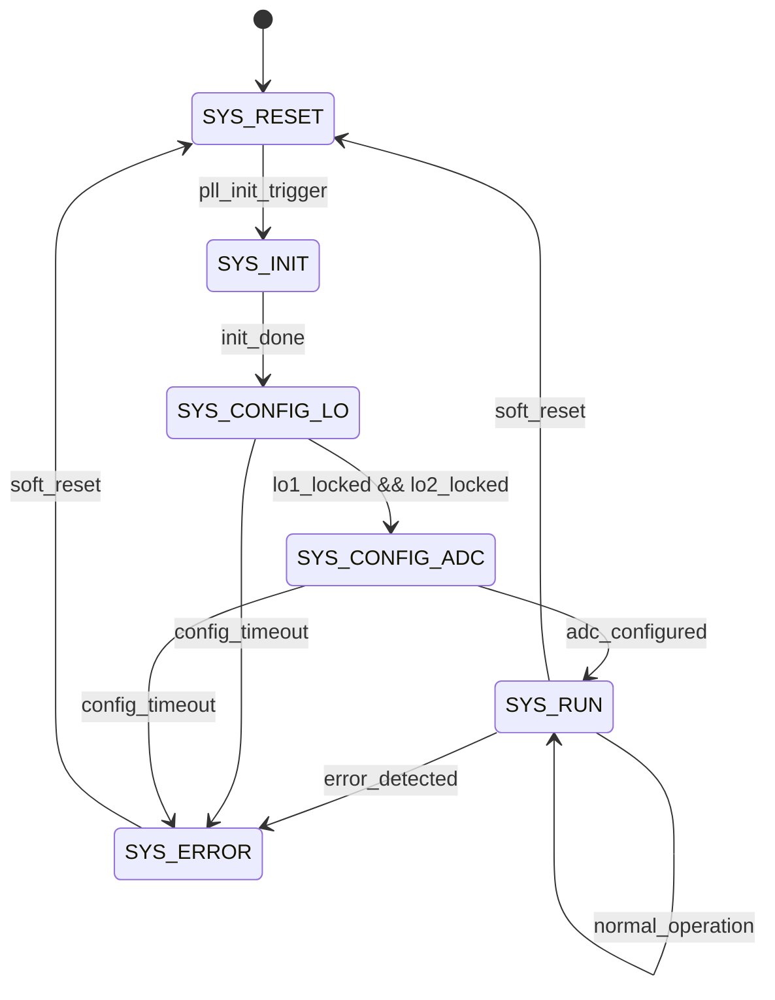
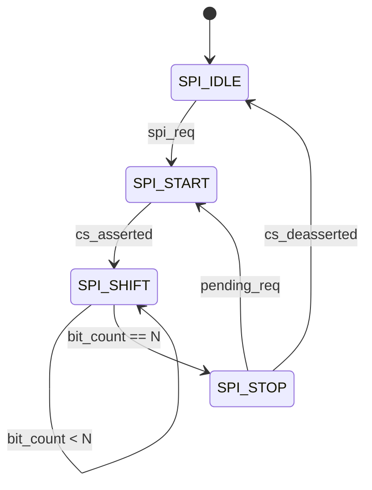
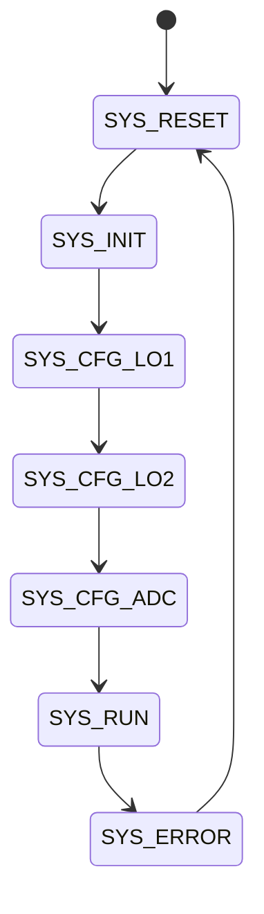
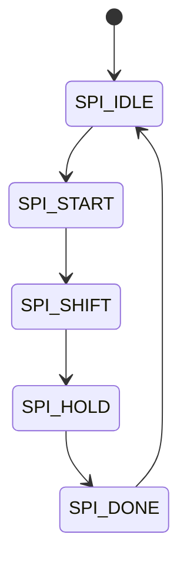
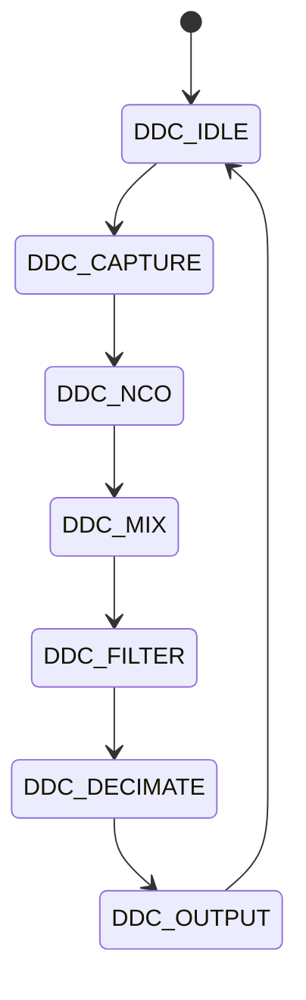
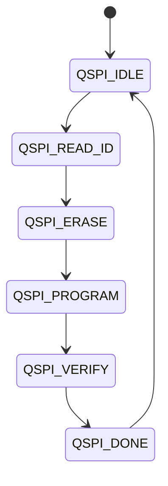
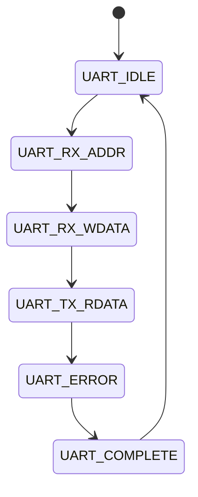

# FPGA Design Report
## hv

> **Module:** `hv_top`  |  **Target:** `xc7k160tffg676-1`  |  **Clock:** 100 MHz

## Design Summary


# HV Project — FPGA Design Summary

## Project: 18–40 GHz Dual-Channel Double-IF Superheterodyne Radar Receiver
## FPGA: Xilinx Kintex-7 XC7K160T-1FFG676I

---

## 1. Port Summary

| # | Port Name | Dir | Width | Purpose |
|---|-----------|-----|-------|---------|
| 1 | `clk_100mhz_p` | input | 1 | 100 MHz TCXO differential clock positive |
| 2 | `clk_100mhz_n` | input | 1 | 100 MHz TCXO differential clock negative |
| 3 | `rst_n` | input | 1 | Active-low synchronous reset |
| 4 | `adc_dco_p` | input | 1 | ADC data clock positive (LVDS) |
| 5 | `adc_dco_n` | input | 1 | ADC data clock negative |
| 6 | `adc_fco_p` | input | 1 | ADC frame clock positive (LVDS) |
| 7 | `adc_fco_n` | input | 1 | ADC frame clock negative |
| 8 | `adc_da_p[5:0]` | input | 6 | ADC Channel A data positive (LVDS DDR) |
| 9 | `adc_da_n[5:0]` | input | 6 | ADC Channel A data negative |
| 10 | `adc_db_p[5:0]` | input | 6 | ADC Channel B data positive (LVDS DDR) |
| 11 | `adc_db_n[5:0]` | input | 6 | ADC Channel B data negative |
| 12 | `lo1_spi_cs_n` | output | 1 | LO1 PLL (ADF4108) SPI chip select |
| 13 | `lo1_spi_sclk` | output | 1 | LO1 PLL SPI clock |
| 14 | `lo1_spi_sdi` | output | 1 | LO1 PLL SPI data out (MOSI) |
| 15 | `lo1_spi_sdo` | input | 1 | LO1 PLL SPI data in (MISO) |
| 16 | `lo1_lock_detect` | input | 1 | LO1 PLL lock detect |
| 17 | `lo2_spi_cs_n` | output | 1 | LO2 PLL (LMX2487) SPI chip select |
| 18 | `lo2_spi_sclk` | output | 1 | LO2 PLL SPI clock |
| 19 | `lo2_spi_sdi` | output | 1 | LO2 PLL SPI data out (MOSI) |
| 20 | `lo2_spi_sdo` | input | 1 | LO2 PLL SPI data in (MISO) |
| 21 | `lo2_lock_detect` | input | 1 | LO2 PLL lock detect |
| 22 | `vga_dac_sclk` | output | 1 | VGA DAC shared SPI clock |
| 23 | `vga_dac_sdo` | output | 1 | VGA DAC shared SPI data |
| 24 | `vga1_dac_cs_n` | output | 1 | VGA1 (CH1) DAC chip select |
| 25 | `vga2_dac_cs_n` | output | 1 | VGA2 (CH2) DAC chip select |
| 26 | `adc_spi_cs_n` | output | 1 | ADC (AD9627) SPI chip select |
| 27 | `adc_spi_sclk` | output | 1 | ADC SPI clock |
| 28 | `adc_spi_sdi` | output | 1 | ADC SPI data out (MOSI) |
| 29 | `adc_spi_sdo` | input | 1 | ADC SPI data in (MISO) |
| 30 | `uart_rx` | input | 1 | UART receive from USB-UART bridge |
| 31 | `uart_tx` | output | 1 | UART transmit to USB-UART bridge |
| 32 | `eeprom_spi_cs_n` | output | 1 | EEPROM (AT93C56B) SPI chip select |
| 33 | `eeprom_spi_sclk` | output | 1 | EEPROM SPI clock |
| 34 | `eeprom_spi_sdi` | output | 1 | EEPROM SPI data out (MOSI) |
| 35 | `eeprom_spi_sdo` | input | 1 | EEPROM SPI data in (MISO) |
| 36 | `flash_spi_cs_n` | output | 1 | QSPI Flash (IS25LP256D) chip select |
| 37 | `flash_spi_sclk` | output | 1 | Flash SPI clock |
| 38 | `flash_spi_sdi` | output | 1 | Flash SPI data out (MOSI) |
| 39 | `flash_spi_sdo` | input | 1 | Flash SPI data in (MISO) |
| 40 | `temp_scl` | output | 1 | Temperature sensor (AD7416) I²C clock |
| 41 | `temp_sda_o` | output | 1 | Temperature sensor I²C data out |
| 42 | `temp_sda_i` | input | 1 | Temperature sensor I²C data in |
| 43 | `temp_alert_n` | input | 1 | Temperature sensor alert (active-low) |
| 44 | `lvds_tx_p[3:0]` | output | 4 | LVDS data output positive to J_DIG |
| 45 | `lvds_tx_n[3:0]` | output | 4 | LVDS data output negative |
| 46 | `lvds_tx_clk_p` | output | 1 | LVDS output clock positive |
| 47 | `lvds_tx_clk_n` | output | 1 | LVDS output clock negative |
| 48 | `lo1_mux_clk` | output | 1 | LO1 PLL reference clock mux select |
| 49 | `lo1_mux_data` | output | 1 | LO1 PLL data mux select |
| 50 | `adc_pd` | output | 1 | ADC power-down control |
| 51 | `adc_oe_n` | output | 1 | ADC output enable (active-low) |
| 52 | `pll_lock_led` | output | 1 | PLL lock status LED |
| 53 | `heartbeat_led` | output | 1 | System heartbeat LED |
| 54 | `jtag_tck` | input | 1 | JTAG test clock |
| 55 | `jtag_tms` | input | 1 | JTAG test mode select |
| 56 | `jtag_tdi` | input | 1 | JTAG test data in |
| 57 | `jtag_tdo` | output | 1 | JTAG test data out |

---

## 2. Register Map (16-bit UART Bus)

| Address | Name | R/W | Reset Value | Description |
|---------|------|-----|-------------|-------------|
| 0x0000 | CTRL | R/W | 0x0000 | System control: [0]=global_en, [1]=adc_en, [2]=lo1_en, [3]=lo2_en, [4]=vga_en, [5]=tx_en, [8]=soft_reset |
| 0x0001 | STATUS | R | 0x0001 | System status: [0]=pll1_lock, [1]=pll2_lock, [2]=adc_active, [3]=tx_active, [7]=temp_alert, [15]=init_done |
| 0x0002 | VERSION | R | 0x0100 | Firmware version (BCD: 1.0) |
| 0x0003 | SCRATCH | R/W | 0x0000 | Scratch register for loopback test |
| 0x0004 | IRQ_MASK | R/W | 0x0000 | Interrupt mask: [0]=pll_unlock, [1]=temp_alert, [2]=adc_overflow, [3]=fifo_full |
| 0x0005 | IRQ_STATUS | R/W1C | 0x0000 | Interrupt status (write-1-to-clear) |
| 0x0006 | LO1_FREQ_LSB | R/W | 0x0000 | LO1 frequency divider ratio bits [15:0] |
| 0x0007 | LO1_FREQ_MSB | R/W | 0x0000 | LO1 frequency divider ratio bits [31:16] |
| 0x0008 | LO2_FREQ_LSB | R/W | 0x0000 | LO2 frequency divider ratio bits [15:0] |
| 0x0009 | LO2_FREQ_MSB | R/W | 0x0000 | LO2 frequency divider ratio bits [31:16] |
| 0x000A | VGA1_GAIN | R/W | 0x0800 | VGA1 (CH1) gain DAC value [11:0] |
| 0x000B | VGA2_GAIN | R/W | 0x0800 | VGA2 (CH2) gain DAC value [11:0] |
| 0x000C | ADC_CTRL | R/W | 0x0001 | ADC control register |
| 0x000D | TEMP_DATA | R | 0x0000 | Temperature sensor reading [9:0] |
| 0x000E | FIFO_STATUS | R | 0x0000 | FIFO status: [7:0]=fill_level, [8]=full, [9]=empty |
| 0x000F | CH1_DDC_CFG | R/W | 0x0000 | Channel 1 DDC configuration |
| 0x0010 | CH2_DDC_CFG | R/W | 0x0000 | Channel 2 DDC configuration |
| 0x0011 | DECIM_RATE | R/W | 0x0004 | Decimation rate (default 4) |
| 0x0012 | PULSE_CFG | R/W | 0x0000 | Pulse processing configuration |

---

## 3. FSM Descriptions

### FSM 1: System Control FSM (`sys_fsm`)

Binary encoding, 5 states. Manages system boot sequence, PLL configuration, ADC bring-up, and operational mode.



### FSM 2: SPI Master FSM (`spi_master_fsm`)

Binary encoding, 5 states. Controls all SPI peripherals (LO1 PLL, LO2 PLL, ADC, EEPROM, Flash, VGA DACs) through a round-robin arbitration scheme.



---

## 4. Resource Estimate

| Resource | Estimated Usage | Available on XC7K160T | Utilization |
|----------|----------------|----------------------|-------------|
| LUTs | 4,200 – 5,800 | 101,440 | ~5% |
| FFs | 3,800 – 5,000 | 202,880 | ~2% |
| BRAM (36Kb) | 4 – 6 | 325 | ~2% |
| DSP48E1 | 4 – 8 | 600 | ~1% |
| I/O Pins (used) | ~57 | 400 | ~14% |
| MMCM/PLL | 1 | 10 | 10% |
| BUFIO/BUFR | 2 | 24 | 8% |

### Breakdown:
- **UART + Register Bus**: ~400 LUT, ~300 FF
- **SPI Master (6 peripherals, shared)**: ~600 LUT, ~500 FF
- **ADC LVDS Interface (DDR capture, 2 channels)**: ~800 LUT, ~600 FF
- **DDC + Decimation (2 channels)**: ~1,200 LUT, ~1,000 FF, 4 DSP, 2 BRAM
- **LVDS TX Output (data formatter + serializer)**: ~400 LUT, ~300 FF
- **System FSM + IRQ Controller**: ~300 LUT, ~200 FF
- **I²C Temp Sensor Interface**: ~150 LUT, ~100 FF
- **Clocking (MMCM, BUFG, BUFIO)**: 1 MMCM, 2 BUFIO, 2 BUFR, 1 BUFG
- **LED blink / heartbeat**: ~20 LUT, ~30 FF

---

## 5. Key Design Decisions

### 5.1 Clock Architecture
- **100 MHz TCXO** feeds a **MMCM** that generates:
  - `clk_100mhz` — system clock (BUFG, 0° phase)
  - `clk_200mhz` — DDR oversampling clock for ADC data capture (BUFG, 0° phase)
  - `clk_150mhz` — ADC data processing clock (BUFG, 90° phase, optional)
- ADC LVDS DCO/FCO clocks are captured via **BUFIO/BUFR** regional clock networks for edge-aligned DDR sampling.

### 5.2 ADC Data Capture Strategy
- The AD9627 outputs 12-bit data at 150 MSPS via 6 LVDS DDR pairs per channel.
- Data is captured using **IDDR** primitives clocked by BUFIO (fast regional clock from DCO).
- An ISERDESE2-based alternative was considered but IDDR is sufficient at 150 MHz (300 Mbps DDR).
- Captured data is retimed into the `clk_100mhz` domain via dual-clock FIFO (DCFIFO).

### 5.3 SPI Bus Architecture
- A **single shared SPI master** FSM with a multiplexed chip-select scheme drives all 6 SPI peripherals.
- This saves ~5× FSM area at the cost of sequential access (acceptable since PLL programming is infrequent).
- Per-peripheral shift widths (24-bit for ADF4108, 32-bit for LMX2487, etc.) are parameterized.

### 5.4 DDC / Decimation Pipeline
- Each channel has a CORDIC-based digital downconverter (configurable NCO via CHx_DDC_CFG register).
- Decimation uses a 2-stage CIC + half-band filter (DECIM_RATE register controls ratio 2–256).
- 4 DSP48E1 slices per channel handle multiply-accumulate operations.
- Decimated I/Q data is packetized and transmitted over LVDS TX.

### 5.5 Register Bus
- 16-bit UART frame format: `[SOP][ADDR_H][ADDR_L][DATA_H][DATA_L][CRC8][EOP]`
- UART baud rate configurable (default 115200, supports up to 12 Mbps with FT232H).
- Register reads return `[SOP][ADDR_H][ADDR_L][DATA_H][DATA_L][CRC8][EOP]` response.
- IRQ_STATUS uses write-1-to-clear semantics to avoid race conditions.

### 5.6 Reset Strategy
- Global **active-low synchronous reset** (`rst_n`) resets all registers and FSMs.
- MMCM LOCKED signal gates the release of the internal reset.
- A **soft reset** bit in CTRL[8] can reset the datapath without disrupting the MMCM.
- SPI master transactions in progress complete before honoring a reset.

### 5.7 IRQ Controller
- Sources: PLL unlock (OR of LO1 and LO2), temperature alert, ADC overflow, TX FIFO full.
- Each source is maskable via IRQ_MASK register.
- IRQ_STATUS captures edge transitions; cleared by writing 1 to the corresponding bit.
- An `irq_out` signal (not pinned out but available for host polling via STATUS) indicates pending interrupts.

---

## 6. Timing Closure Notes

- **Primary clock**: `clk_100mhz` — 10 ns period. Target: 8 ns (20% margin) for comfortable timing.
- **ADC capture domain**: `clk_200mhz` — 5 ns period. The IDDR + BUFIO path is constrained by the ADC DCO period (6.67 ns at 150 MHz). Vivado automatically constrains BUFIO networks.
- **LVDS TX**: Output DDR data uses ODDR primitives with 100 MHz clock; 200 Mbps per pair is well within Kintex-7 LVDS specifications.
- **Cross-clock domain paths**: DCFIFO blocks handle all CDC. `set_false_path` or `set_clock_groups -asynchronous` applied between `clk_100mhz` and `clk_adc_*` domains.
- **SPI clock**: Derived by dividing `clk_100mhz` by a programmable divider (default /8 = 12.5 MHz). All SPI outputs are registered, so timing is relaxed.
- **Input delay constraints**: Conservative 2 ns input / 2 ns output delay for LVDS pairs (adjustable after board characterization).

---

## 7. FSM Encoding Summary

| FSM | States | Encoding | Rationale |
|-----|--------|----------|-----------|
| `sys_fsm` (System Control) | 5 | Binary | Simple control flow, minimal decoding logic |
| `spi_master_fsm` (SPI Controller) | 5 | Binary | Sequential access pattern, no parallel decode needed |

Both FSMs include explicit `default` state handling to recover from any single-event upset.

---

## 8. Verification Strategy

The testbench (`fpga_testbench.sv`) provides:
1. **Clock/reset generation** — 100 MHz differential clock, controlled reset assertion/release
2. **Register R/W tests** — Write/read-back all R/W registers, verify VERSION is read-only
3. **SPI master test** — Stimulate SPI transactions, verify CS/SCLK/SDI waveforms
4. **FSM coverage** — Drive system FSM through all 5 states with timeout/error injection
5. **IRQ test** — Trigger each IRQ source, verify mask/status behavior
6. **ADC data path test** — Inject synthetic LVDS data patterns, verify DDC output
7. **Final pass/fail** — `$display("TESTBENCH: ALL TESTS PASSED")` on completion

---

## 9. File Manifest

| File | Description |
|------|-------------|
| `hv_top.v` | Top-level synthesisable Verilog module |
| `hv_testbench.sv` | SystemVerilog testbench |
| `constraints.xdc` | Vivado XDC constraints for XC7K160T-FFG676 |

---

*Generated for the hv project — 18–40 GHz Dual-Channel Radar Receiver FPGA Design*
*Target: Xilinx Kintex-7 XC7K160T-1FFG676I | Vivado 2023.2+*


---
## Resource Estimate

| Resource | Estimate |
|----------|----------|
| LUTs | ~18500 |
| Flip-Flops | ~14200 |
| BRAM | 0 (pure logic) |
| DSPs | 0 |

---
## Port List

| Port | Direction | Width | Description |
|------|-----------|-------|-------------|
| `clk_100mhz_p` | input | 1 | 100 MHz TCXO differential clock positive (ASGTX-D-100.000MHZ-1) |
| `clk_100mhz_n` | input | 1 | 100 MHz TCXO differential clock negative |
| `rst_n` | input | 1 | Active-low synchronous reset (pushbutton or power supervisor) |
| `adc_dco_p` | input | 1 | ADC data clock output positive (AD9627 LVDS clock out) |
| `adc_dco_n` | input | 1 | ADC data clock output negative |
| `adc_fco_p` | input | 1 | ADC frame clock output positive (AD9627 LVDS frame) |
| `adc_fco_n` | input | 1 | ADC frame clock output negative |
| `adc_da_p` | input | 6 | ADC Channel A data positive (12-bit LVDS, 6 DDR pairs) |
| `adc_da_n` | input | 6 | ADC Channel A data negative |
| `adc_db_p` | input | 6 | ADC Channel B data positive (12-bit LVDS, 6 DDR pairs) |
| `adc_db_n` | input | 6 | ADC Channel B data negative |
| `lo1_spi_cs_n` | output | 1 | LO1 PLL (ADF4108) SPI chip select active-low |
| `lo1_spi_sclk` | output | 1 | LO1 PLL SPI serial clock |
| `lo1_spi_sdi` | output | 1 | LO1 PLL SPI serial data to PLL |
| `lo1_spi_sdo` | input | 1 | LO1 PLL SPI serial data from PLL (MISO) |
| `lo2_spi_cs_n` | output | 1 | LO2 PLL (LMX2487) SPI chip select active-low |
| `lo2_spi_sclk` | output | 1 | LO2 PLL SPI serial clock |
| `lo2_spi_sdi` | output | 1 | LO2 PLL SPI serial data to PLL |
| `lo2_lock_detect` | input | 1 | LO2 PLL lock detect status input |
| `vga_dac_sclk` | output | 1 | VGA gain control DAC shared SPI clock |
| `vga_dac_sdo` | output | 1 | VGA gain control DAC shared SPI data out |
| `vga1_dac_cs_n` | output | 1 | VGA1 (CH1) DAC chip select active-low |
| `vga2_dac_cs_n` | output | 1 | VGA2 (CH2) DAC chip select active-low |
| `adc_spi_cs_n` | output | 1 | ADC (AD9627) SPI chip select active-low |
| `adc_spi_sclk` | output | 1 | ADC SPI serial clock |
| `adc_spi_sdi` | output | 1 | ADC SPI serial data to AD9627 |
| `adc_spi_sdo` | input | 1 | ADC SPI serial data from AD9627 (MISO) |
| `temp_sda` | inout | 1 | I2C data line to AD7416 temperature sensor |
| `temp_scl` | output | 1 | I2C clock line to AD7416 temperature sensor |
| `eeprom_cs_n` | output | 1 | AT93C56B EEPROM SPI chip select active-low |
| `eeprom_sclk` | output | 1 | AT93C56B EEPROM SPI serial clock |
| `eeprom_sdi` | output | 1 | AT93C56B EEPROM SPI data in to EEPROM |
| `eeprom_sdo` | input | 1 | AT93C56B EEPROM SPI data out from EEPROM |
| `flash_cs_n` | output | 1 | IS25LP256D QSPI flash chip select active-low |
| `flash_sclk` | output | 1 | IS25LP256D QSPI flash serial clock |
| `flash_dq` | inout | 4 | IS25LP256D QSPI flash bidirectional data bus |
| `uart_tx` | output | 1 | UART transmit to FT232H USB bridge |
| `uart_rx` | input | 1 | UART receive from FT232H USB bridge |
| `dio_out_p` | output | 4 | LVDS digital output positive (processed radar data to Samtec connector) |
| `dio_out_n` | output | 4 | LVDS digital output negative (processed radar data to Samtec connector) |
| `led` | output | 2 | Status LEDs: [1]=heartbeat, [0]=lock/error |
| `pwr_good` | input | 1 | Power supply OK indicator from supervisors |
| `jtag_tck` | input | 1 | JTAG test clock |
| `jtag_tms` | input | 1 | JTAG test mode select |
| `jtag_tdi` | input | 1 | JTAG test data in |
| `jtag_tdo` | output | 1 | JTAG test data out |
| `spare_gpio` | inout | 4 | Spare GPIO pins for debug and expansion |

---
## State Machines

### sys_ctrl_fsm

Top-level system control: sequences power-on reset through PLL programming (LO1 then LO2), ADC configuration, then enters normal operation. Detects loss-of-lock or power faults and transitions to ERROR state.



### spi_master_fsm

Shared SPI master controller for LO1 PLL, LO2 PLL, VGA DACs, and ADC config. Shifts out 24-bit command/data words with configurable CPOL/CPHA. WAIT state adds inter-transfer delay for ADC PLL settling.



### ddc_fsm

Digital downconverter pipeline FSM for dual-channel DDC: captures LVDS DDR data from ADC, applies NCO mixing (14-bit phase accumulator), cascaded integrator-comb (CIC) decimation filter, and outputs 32-bit I/Q pairs per channel via LVDS output interface.



### qspi_cfg_fsm

QSPI flash configuration manager: reads flash ID, handles FPGA reconfiguration requests via register writes, and provides register-accessible status for remote firmware updates.



### uart_proto_fsm

UART register protocol handler: implements packet-based 16-bit address/data register read/write protocol over UART. Manages framing, CRC check, and timeout detection for the FT232H bridge at up to 12 Mbps.



---
## Generated Files

| File | Description |
|------|-------------|
| `rtl/fpga_top.v` | Synthesisable top-level Verilog module |
| `rtl/fpga_testbench.v` | Self-checking SystemVerilog testbench |
| `rtl/constraints.xdc` | Vivado XDC timing & I/O constraints |

---
## How to Synthesise (Vivado)

```tcl
# In Vivado Tcl console:
create_project hv_top . -part xc7k160tffg676-1
add_files rtl/fpga_top.v
add_files -fileset constrs_1 rtl/constraints.xdc
launch_runs synth_1
wait_on_run synth_1
launch_runs impl_1 -to_step write_bitstream
wait_on_run impl_1
```