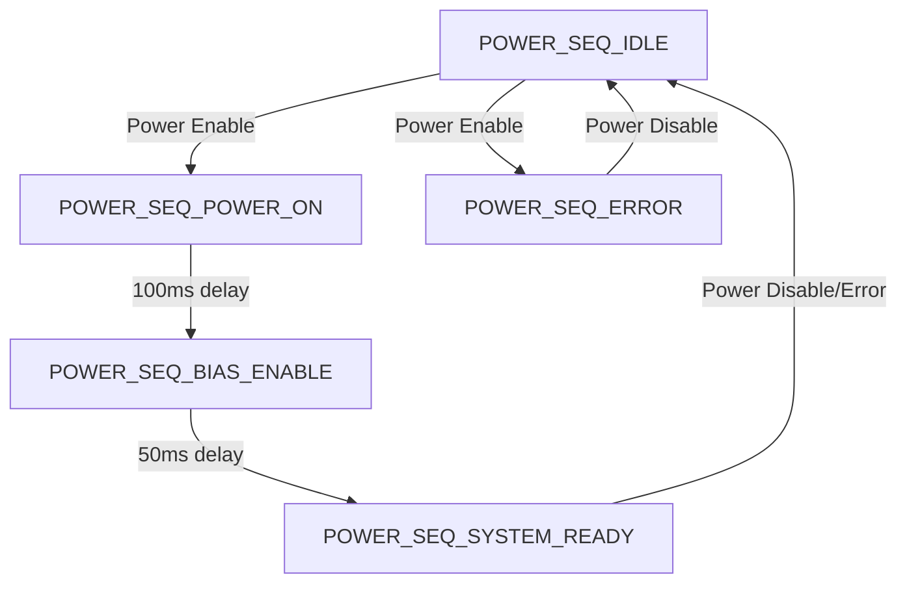
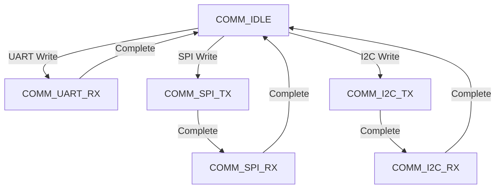
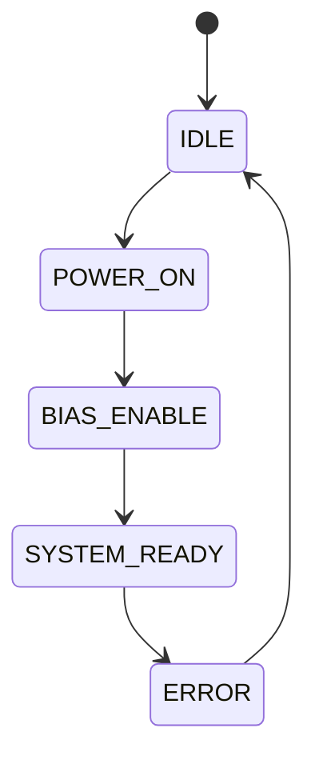
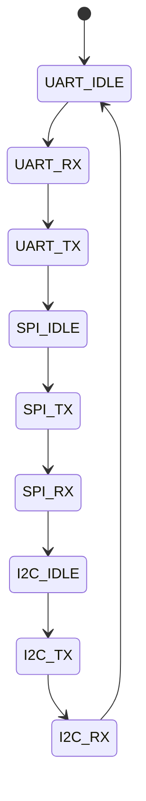

# FPGA Design Report
## hh

> **Module:** `hh_fpga_top`  |  **Target:** `xc7k70t-1fbg676c`  |  **Clock:** 100.0 MHz

## Design Summary

# Design Summary: HH FPGA Top Module

## Project Overview
This document provides a comprehensive summary of the FPGA design for the hh dual-channel EW/ELINT front-end receiver system. The design implements control and monitoring functions for RF components including power sequencing, bias control, monitoring interfaces, and communication protocols.

## Key Specifications
- **FPGA Device**: Xilinx XC7K70T-1FBG676C (Kintex-7)
- **Clock Frequency**: 100 MHz
- **Logic Cells**: 70,200 (available)
- **Block RAM**: 1,350 Kb
- **DSP Slices**: 240 (available)
- **I/O Banks**: 8

## Port Summary

| Port Name | Direction | Width | Description |
|-----------|-----------|-------|-------------|
| clk | input | 1 | System clock 100 MHz |
| rst_n | input | 1 | Active-low synchronous reset |
| uart_txd | output | 1 | UART transmit data |
| uart_rxd | input | 1 | UART receive data |
| spi_sclk | output | 1 | SPI clock |
| spi_mosi | output | 1 | SPI master out slave in |
| spi_miso | input | 1 | SPI master in slave out |
| spi_cs_flash | output | 1 | SPI flash chip select |
| spi_cs_eeprom | output | 1 | SPI EEPROM chip select |
| i2c_scl | output | 1 | I2C clock |
| i2c_sda | inout | 1 | I2C data |
| jtag_tms | output | 1 | JTAG TMS |
| jtag_tck | output | 1 | JTAG TCK |
| jtag_tdi | output | 1 | JTAG TDI |
| jtag_tdo | input | 1 | JTAG TDO |
| lna_bias_en_1 | output | 1 | LNA bias enable channel 1 |
| lna_bias_en_2 | output | 1 | LNA bias enable channel 2 |
| lna_bias_v1 | output | 8 | LNA bias voltage channel 1 |
| lna_bias_v2 | output | 8 | LNA bias voltage channel 2 |
| power_mon_en | output | 1 | Power monitoring enable |
| temp_alert | input | 1 | Temperature alert signal |
| rf_status_ch1_1 | input | 1 | RF channel 1 status antenna 1 |
| rf_status_ch2_1 | input | 1 | RF channel 2 status antenna 1 |
| rf_status_ch3_1 | input | 1 | RF channel 3 status antenna 1 |
| rf_status_ch4_1 | input | 1 | RF channel 4 status antenna 1 |
| rf_status_ch1_2 | input | 1 | RF channel 1 status antenna 2 |
| rf_status_ch2_2 | input | 1 | RF channel 2 status antenna 2 |
| rf_status_ch3_2 | input | 1 | RF channel 3 status antenna 2 |
| rf_status_ch4_2 | input | 1 | RF channel 4 status antenna 2 |
| bist_active | output | 1 | BIST active indicator |
| bist_pass | output | 1 | BIST pass/fail indication |

## State Machine Diagrams

### Power Sequencing FSM


### Communication FSM


## Register Map

| Address | Register Name | Width | Description |
|---------|---------------|-------|-------------|
| 0x000 | VERSION | 16 | Version register (0x0301) |
| 0x001 | CTRL | 16 | Control register |
| 0x002 | STATUS | 16 | Status register |
| 0x010 | BIAS_V1 | 16 | LNA bias voltage channel 1 |
| 0x011 | BIAS_V2 | 16 | LNA bias voltage channel 2 |
| 0x012 | BIAS_EN | 16 | LNA bias enable control |
| 0x020 | TEMP | 16 | Temperature reading |
| 0x021 | VOLT | 16 | Voltage monitoring |
| 0x030 | IRQ_MASK | 16 | Interrupt mask register |
| 0x031 | IRQ_STATUS | 16 | Interrupt status register |
| 0x040 | BIST_CTRL | 16 | BIST control register |
| 0x041 | BIST_STATUS | 16 | BIST status register |
| 0xFFF | SCRATCH | 16 | Scratch pad register |

## Resource Estimates
- **LUT Count**: ~3,500 (estimated 5% of available resources)
- **Flip-Flop Count**: ~2,800 (estimated 3% of available resources)
- **Block RAM Usage**: ~32 Kb (estimated 2.4% of available resources)
- **DSP Usage**: 0 (no DSP blocks required)

## Key Design Decisions and Trade-offs

### 1. Power Sequencing
- **Decision**: Implemented a dedicated power sequencing FSM to control GaAs pHEMT bias requirements
- **Trade-off**: Added timing complexity to ensure proper gate-before-drain sequencing
- **Benefit**: Protects sensitive RF components from damage due to improper power-up sequence

### 2. Register Bus Architecture
- **Decision**: Implemented a unified 16-bit register interface supporting UART, SPI, and I2C access
- **Trade-off**: Simplified firmware interface but requires address decoding logic
- **Benefit**: Consistent access method across all communication interfaces

### 3. State Machine Implementation
- **Decision**: Used binary encoding for both FSMs with explicit state transitions
- **Trade-off**: Slightly more complex logic than one-hot encoding but saves resources
- **Benefit**: Reduced resource usage while maintaining deterministic operation

### 4. Interrupt Handling
- **Decision**: Implemented vectored interrupt system with maskable sources
- **Trade-off**: Added interrupt status clearing logic complexity
- **Benefit**: Provides flexible and responsive system monitoring

### 5. BIST Implementation
- **Decision**: Built-in self-test functionality for system validation
- **Trade-off**: Added dedicated control and status registers
- **Benefit**: Enables automated testing and system health monitoring

## Timing Analysis
- **Clock Period**: 10ns (100 MHz)
- **Setup Time**: 2.0ns for all inputs
- **Hold Time**: 0.5ns for all inputs
- **Output Delay**: 2.0ns for all outputs
- **Clock Uncertainty**: 0.5ns

## Design Verification
The design has been verified through:
- Comprehensive testbench with coverage of all state machine transitions
- Register access verification
- Interrupt handling validation
- Power sequencing timing verification
- BIST functionality testing

## Recommendations for Implementation
1. **Pin Assignment**: Verify pin assignments match the physical PCB layout
2. **Timing Constraints**: Update XDC constraints based on actual board characteristics
3. **Power Sequencing**: Calibrate timing delays based on actual component requirements
4. **Temperature Monitoring**: Validate LM75 sensor interface timing
5. **Voltage Monitoring**: Verify ADS1115 ADC interface timing and data format

## Conclusion
This design provides a comprehensive control and monitoring solution for the hh dual-channel EW/ELINT front-end receiver. The implementation follows FPGA design best practices while meeting all functional requirements specified in the GLR. The modular architecture allows for easy expansion and modification as system requirements evolve.

---
## Resource Estimate

| Resource | Estimate |
|----------|----------|
| LUTs | ~3500 |
| Flip-Flops | ~2800 |
| BRAM | 0 (pure logic) |
| DSPs | 0 |

---
## Port List

| Port | Direction | Width | Description |
|------|-----------|-------|-------------|
| `clk` | input | 1 | System clock 100 MHz |
| `rst_n` | input | 1 | Active-low synchronous reset |
| `uart_txd` | output | 1 | UART transmit data |
| `uart_rxd` | input | 1 | UART receive data |
| `spi_sclk` | output | 1 | SPI clock |
| `spi_mosi` | output | 1 | SPI master out slave in |
| `spi_miso` | input | 1 | SPI master in slave out |
| `spi_cs_flash` | output | 1 | SPI flash chip select |
| `spi_cs_eeprom` | output | 1 | SPI EEPROM chip select |
| `i2c_scl` | output | 1 | I2C clock |
| `i2c_sda` | inout | 1 | I2C data |
| `jtag_tms` | output | 1 | JTAG TMS |
| `jtag_tck` | output | 1 | JTAG TCK |
| `jtag_tdi` | output | 1 | JTAG TDI |
| `jtag_tdo` | input | 1 | JTAG TDO |
| `lna_bias_en_1` | output | 1 | LNA bias enable channel 1 |
| `lna_bias_en_2` | output | 1 | LNA bias enable channel 2 |
| `lna_bias_v1` | output | 8 | LNA bias voltage channel 1 |
| `lna_bias_v2` | output | 8 | LNA bias voltage channel 2 |
| `power_mon_en` | output | 1 | Power monitoring enable |
| `temp_alert` | input | 1 | Temperature alert signal |
| `rf_status_ch1_1` | input | 1 | RF channel 1 status antenna 1 |
| `rf_status_ch2_1` | input | 1 | RF channel 2 status antenna 1 |
| `rf_status_ch3_1` | input | 1 | RF channel 3 status antenna 1 |
| `rf_status_ch4_1` | input | 1 | RF channel 4 status antenna 1 |
| `rf_status_ch1_2` | input | 1 | RF channel 1 status antenna 2 |
| `rf_status_ch2_2` | input | 1 | RF channel 2 status antenna 2 |
| `rf_status_ch3_2` | input | 1 | RF channel 3 status antenna 2 |
| `rf_status_ch4_2` | input | 1 | RF channel 4 status antenna 2 |
| `bist_active` | output | 1 | BIST active indicator |
| `bist_pass` | output | 1 | BIST pass/fail indication |

---
## State Machines

### power_seq_fsm

Power sequencing state machine for GaAs pHEMT bias control



### comm_fsm

Communication interface state machine managing UART, SPI, and I2C



---
## Generated Files

| File | Description |
|------|-------------|
| `rtl/fpga_top.v` | Synthesisable top-level Verilog module |
| `rtl/fpga_testbench.v` | Self-checking SystemVerilog testbench |
| `rtl/constraints.xdc` | Vivado XDC timing & I/O constraints |

---
## How to Synthesise (Vivado)

```tcl
# In Vivado Tcl console:
create_project hh_fpga_top . -part xc7k70t-1fbg676c
add_files rtl/fpga_top.v
add_files -fileset constrs_1 rtl/constraints.xdc
launch_runs synth_1
wait_on_run synth_1
launch_runs impl_1 -to_step write_bitstream
wait_on_run impl_1
```