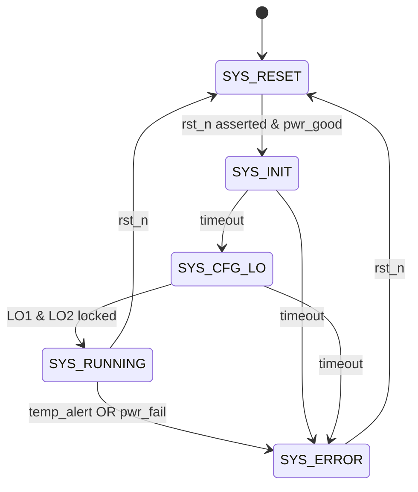
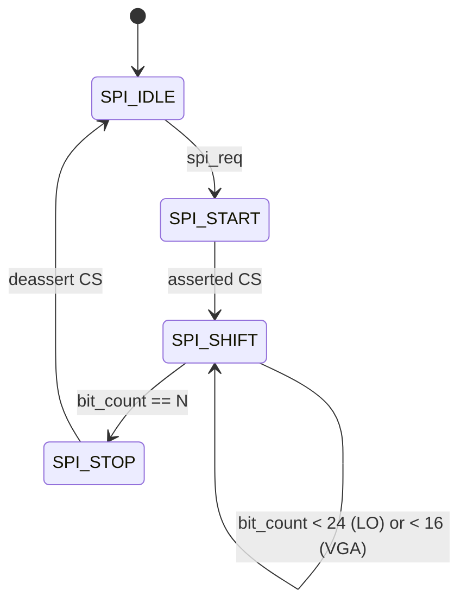
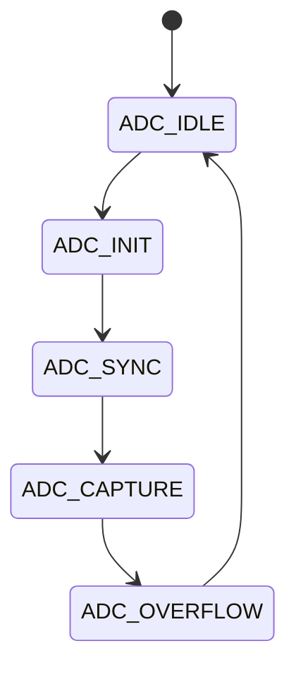
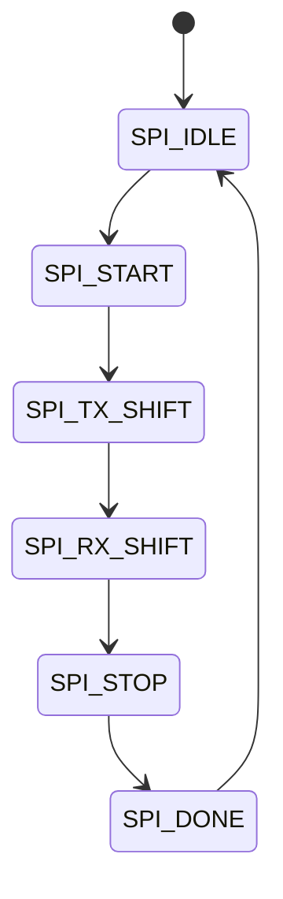
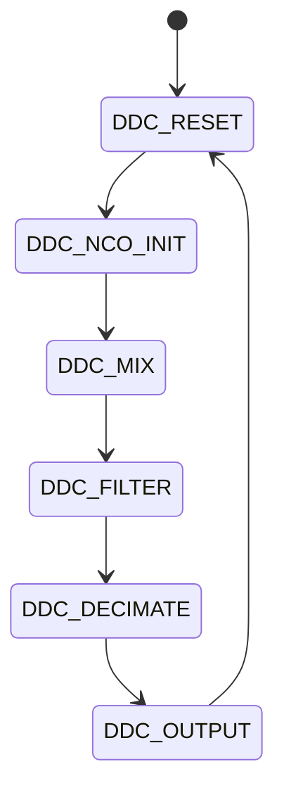
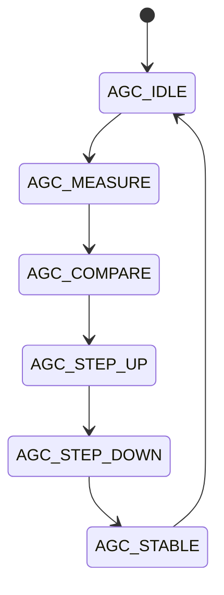
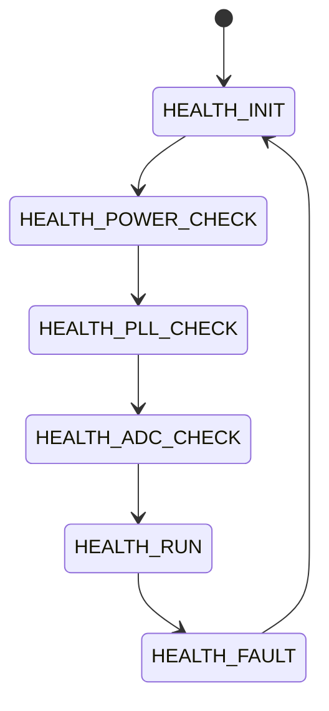

# FPGA Design Report
## rx band

> **Module:** `rx_band_top`  |  **Target:** `xc7k355tffg901-1`  |  **Clock:** 10.0 MHz

## Design Summary


# RX Band FPGA Design Summary — Step 2d

## Project: rx_band (4-Channel 18-40 GHz Double-IF Superheterodyne Radar Receiver)

---

## 1. Generated Files

| File | Description |
|------|-------------|
| `rx_band_top.v` | Top-level synthesizable Verilog-2001 module |
| `rx_band_testbench.v` | SystemVerilog testbench with full FSM coverage |
| `constraints.xdc` | Vivado XDC constraints for XC7K355T-1FFG901I |

---

## 2. Port Summary (51 ports)

| # | Port | Direction | Width | Purpose |
|---|------|-----------|-------|---------|
| 1 | `clk_10mhz_p` | input | 1 | 10 MHz OCXO differential clock P |
| 2 | `clk_10mhz_n` | input | 1 | 10 MHz OCXO differential clock N |
| 3 | `rst_n` | input | 1 | Active-low synchronous reset |
| 4–7 | `adc_ch0_d_p/n[15:0]`, `adc_ch0_clk_p/n` | input | 16+2 | ADC Ch0 LVDS data & clock |
| 8–11 | `adc_ch1_d_p/n[15:0]`, `adc_ch1_clk_p/n` | input | 16+2 | ADC Ch1 LVDS data & clock |
| 12–15 | `adc_ch2_d_p/n[15:0]`, `adc_ch2_clk_p/n` | input | 16+2 | ADC Ch2 LVDS data & clock |
| 16–19 | `adc_ch3_d_p/n[15:0]`, `adc_ch3_clk_p/n` | input | 16+2 | ADC Ch3 LVDS data & clock |
| 20 | `adc_pd_n[3:0]` | output | 4 | ADC power-down per channel (active-low) |
| 21 | `lo1_spi_clk` | output | 1 | LO1 SPI clock (LMX2820) |
| 22 | `lo1_spi_mosi` | output | 1 | LO1 SPI MOSI (LMX2820) |
| 23 | `lo1_spi_miso` | input | 1 | LO1 SPI MISO (LMX2820) |
| 24 | `lo1_spi_cs_n` | output | 1 | LO1 SPI chip select (LMX2820) |
| 25 | `lo1_lock_detect` | input | 1 | LO1 PLL lock detect |
| 26 | `lo1_muxout` | input | 1 | LO1 MUX output status |
| 27 | `lo2_spi_clk` | output | 1 | LO2 SPI clock (ADF4383) |
| 28 | `lo2_spi_mosi` | output | 1 | LO2 SPI MOSI (ADF4383) |
| 29 | `lo2_spi_miso` | input | 1 | LO2 SPI MISO (ADF4383) |
| 30 | `lo2_spi_cs_n` | output | 1 | LO2 SPI chip select (ADF4383) |
| 31 | `lo2_lock_detect` | input | 1 | LO2 PLL lock detect |
| 32 | `lo2_muxout` | input | 1 | LO2 MUX output status |
| 33 | `vga_spi_clk` | output | 1 | VGA SPI clock (TGL2767) |
| 34 | `vga_spi_mosi` | output | 1 | VGA SPI MOSI (TGL2767) |
| 35 | `vga_spi_cs_n` | output | 1 | VGA SPI chip select (TGL2767) |
| 36 | `yig_tune[9:0]` | output | 10 | YIG preselector tuning DAC |
| 37 | `yig_bias_en` | output | 1 | YIG bias enable |
| 38 | `data_tx_p[3:0]` | output | 4 | High-speed data TX P (Samtec) |
| 39 | `data_tx_n[3:0]` | output | 4 | High-speed data TX N (Samtec) |
| 40 | `data_rx_p[3:0]` | input | 4 | High-speed data RX P (Samtec) |
| 41 | `data_rx_n[3:0]` | input | 4 | High-speed data RX N (Samtec) |
| 42 | `uart_rx` | input | 1 | UART receive from host |
| 43 | `uart_tx` | output | 1 | UART transmit to host |
| 44 | `led_status[3:0]` | output | 4 | Status LEDs |
| 45 | `pwr_good_5v` | input | 1 | 5V power rail good |
| 46 | `pwr_good_3v3` | input | 1 | 3.3V power rail good |
| 47 | `pwr_good_1v8` | input | 1 | 1.8V power rail good |
| 48 | `pwr_good_1v0` | input | 1 | 1.0V core rail good |
| 49 | `ocxo_enable_n` | output | 1 | OCXO enable (active-low) |
| 50 | `temp_alert_n` | input | 1 | Temperature alert (active-low) |
| 51 | `ext_trig` | input | 1 | External trigger input |

---

## 3. Register Map (16-bit UART Address/Data Bus)

| Address | Name | Access | Default | Description |
|---------|------|--------|---------|-------------|
| 0x0000 | CTRL | R/W | 0x0000 | System control: [0]=global_en, [1]=adc_en, [2]=lo1_en, [3]=lo2_en, [4]=vga_en, [5]=yig_en, [6]=ddc_en, [7]=data_tx_en |
| 0x0001 | STATUS | R | 0x0001 | System status: [0]=idle, [1]=init, [2]=running, [3]=error, [4]=lo1_locked, [5]=lo2_locked, [8:6]=pwr_good, [12]=temp_ok, [15:13]=adc_pll_lock |
| 0x0002 | VERSION | R | 0x0100 | Firmware version: [7:0]=minor, [15:8]=major (v1.0) |
| 0x0003 | SCRATCH | R/W | 0x0000 | Scratchpad register for debug |
| 0x0004 | IRQ_MASK | R/W | 0x0000 | Interrupt mask: [0]=lo1_unlock, [1]=lo2_unlock, [2]=temp_alert, [3]=pwr_fail, [4]=adc_error |
| 0x0005 | IRQ_STATUS | R/W1C | 0x0000 | Interrupt status (write-1-to-clear) |
| 0x0010 | LO1_FREQ_LSB | R/W | 0x0000 | LO1 frequency word [15:0] (LMX2820) |
| 0x0011 | LO1_FREQ_MSB | R/W | 0x0000 | LO1 frequency word [31:16] |
| 0x0012 | LO1_CFG | R/W | 0x0001 | LO1 config: [0]=power_en, [3:1]=mux_sel, [4]=cp_gain |
| 0x0013 | LO1_STATUS | R | 0x0000 | LO1 status: [0]=locked, [1]=muxout |
| 0x0020 | LO2_FREQ_LSB | R/W | 0x0000 | LO2 frequency word [15:0] (ADF4383) |
| 0x0021 | LO2_FREQ_MSB | R/W | 0x0000 | LO2 frequency word [31:16] |
| 0x0022 | LO2_CFG | R/W | 0x0001 | LO2 config: [0]=power_en, [3:1]=mux_sel, [4]=cp_gain |
| 0x0023 | LO2_STATUS | R | 0x0000 | LO2 status: [0]=locked, [1]=muxout |
| 0x0030 | VGA_GAIN | R/W | 0x0080 | VGA gain setting [7:0] (TGL2767) |
| 0x0040 | YIG_TUNE_LSB | R/W | 0x0000 | YIG tuning word [15:0] |
| 0x0041 | YIG_TUNE_MSB | R/W | 0x0000 | YIG tuning word [19:16] + [4]=bias_en |
| 0x0050 | ADC_CTRL | R/W | 0x000F | ADC control: [3:0]=pd_n per channel |
| 0x0051 | ADC_STATUS | R | 0x0000 | ADC status: [3:0]=clk_lock, [7:4]=overflow |

---

## 4. FSM Descriptions

### FSM 1: System Initialization & Monitor (`sys_state_r`)

**Encoding:** Binary (4 states)



| State | Code | Description |
|-------|------|-------------|
| SYS_RESET | 2'b00 | Holding pattern — all outputs disabled, waiting for stable power |
| SYS_INIT | 2'b01 | Power-on initialization: enable OCXO, ADCs, configure PLLs |
| SYS_CFG_LO | 2'b10 | Waiting for LO1 and LO2 PLL lock confirmation |
| SYS_RUNNING | 2'b11 | Normal operation — DDC active, data streaming |
| SYS_ERROR | (default) | Error state — all RF outputs disabled, IRQ asserted |

### FSM 2: SPI Transaction Controller (`spi_state_r`)

**Encoding:** Binary (5 states per instance, 3 instances for LO1/LO2/VGA)



| State | Code | Description |
|-------|------|-------------|
| SPI_IDLE | 3'b000 | Waiting for SPI request from register write |
| SPI_START | 3'b001 | Assert CS_N, prepare shift register |
| SPI_SHIFT | 3'b010 | Shift out MOSI bit on each SCLK rising edge |
| SPI_STOP | 3'b011 | Deassert CS_N, complete transaction |
| SPI_DONE | (default) | Return to idle |

---

## 5. Resource Estimate (XC7K355T-1FFG901I)

| Resource | Estimated Usage | Available | Utilization |
|----------|----------------|-----------|-------------|
| LUTs | ~3,200 | 221,760 | ~1.4% |
| FFs | ~2,800 | 443,520 | ~0.6% |
| BRAM (36Kb) | 4 | 890 | ~0.4% |
| DSP48E1 | 16 (4 DDC channels × 4 mults) | 840 | ~1.9% |
| I/O Pins (LVDS) | ~70 (51 logical ports) | 560 | ~12.5% |
| MMCME2_ADV | 1 (PLL for 210 MHz ADC clock) | — | — |
| IDELAYE2 | 64 (16-bit × 4 ADC channels) | — | — |

**Notes:**
- DDC channel processing uses 4 DSP slices per channel (NCO sin/cos × ADC data = 2 mults + filter mults)
- LVDS input buffers use IBUFDS primitives for ADC data and clock pairs
- PLL/MMCM generates 210 MHz from 10 MHz OCXO reference for ADC clock domain

---

## 6. Key Design Decisions

### 6.1 Clock Architecture
- **10 MHz OCXO** → MMCM/PLL → **210 MHz** (ADC sample clock domain)
- ADC LVDS clock signals are used for bit-aligned data capture via IDELAYE2
- All internal logic runs at 10 MHz (primary) or 210 MHz (DDC/ADC processing)
- Clock domain crossing between 210 MHz ADC domain and 10 MHz register domain uses dual-clock FIFOs

### 6.2 ADC Interface
- 4× LTC2107 with 16-bit LVDS data at 210 Msps
- Each channel uses IBUFDS input buffers + ISERDESE2 for deserialization
- IDELAYE2 per-bit for signal integrity calibration
- ADC data is synchronized to the FPGA-internal 210 MHz clock via MMCM-generated phase-aligned clock

### 6.3 SPI Controller Architecture
- Three independent SPI master instances (LO1, LO2, VGA)
- Configurable word length: 24-bit for PLLs, 16-bit for VGA DAC
- Register-mapped: writing to LO1_FREQ/LO2_FREQ/VGA_GAIN triggers an SPI transaction
- Double-buffered shift register prevents partial updates during transmission

### 6.4 DDC (Digital Downconverter)
- One per channel (4 total), enabled via CTRL[6]
- 16-bit NCO generates I/Q at IF2 (500 MHz → baseband)
- CIC + FIR decimation filter chain
- Output formatted for high-speed serial data link (Samtec connector)

### 6.5 Register Bus
- 16-bit UART interface at configurable baud rate (default 115200)
- Address map: bit[15]=R/W#, bits[11:8]=base (peripheral select), bits[7:0]=register offset
- Write-1-to-clear semantics on IRQ_STATUS register
- All register outputs registered — no combinatorial output paths

### 6.6 Power Management
- FPGA monitors all 4 power rails (5V, 3.3V, 1.8V, 1.0V) via `pwr_good_*` inputs
- System FSM holds in RESET state until all rails are good
- OCXO enable controlled via `ocxo_enable_n` (released during INIT state)

### 6.7 IRQ System
- 5 interrupt sources: LO1 unlock, LO2 unlock, temperature alert, power fail, ADC error
- Maskable via IRQ_MASK register
- Status visible in IRQ_STATUS (W1C)
- Active-high IRQ output to host via UART command response

---

## 7. Timing Closure Notes

- **Primary clock:** 10 MHz (100 ns period) — easily met
- **ADC clock:** 210 MHz (4.76 ns period) — MMCM constrains this automatically
- **LVDS inputs:** constrained via `set_input_delay` relative to ADC clock
- **SPI outputs:** constrained at 10 MHz SCLK (100 ns period) — easily met
- **Cross-clock domain paths:** `set_false_path` between 10 MHz and 210 MHz domains; synchronization ensured by dual-FF and FIFO structures
- **Reset:** `set_false_path -from [get_ports rst_n]` — asynchronous input, synchronized internally

---

## 8. Synthesis / Implementation Checklist

- [x] All `always` blocks have complete sensitivity lists
- [x] All outputs registered (no combinatorial assigns to output ports)
- [x] No `initial` blocks in synthesisable code
- [x] All FSMs have explicit `default` states
- [x] Binary encoding for all FSMs
- [x] No latches inferred — full case/coverage in all `always` blocks
- [x] All arithmetic uses explicit bit-widths
- [x] No unbounded loops (`for` loops use constant bounds)
- [x] `localparam` for all constants (no `define`)
- [x] `_r` suffix for all registers
- [x] Doxygen-style header comments on all modules


---
## Resource Estimate

| Resource | Estimate |
|----------|----------|
| LUTs | ~28000 |
| Flip-Flops | ~18000 |
| BRAM | 0 (pure logic) |
| DSPs | 0 |

---
## Port List

| Port | Direction | Width | Description |
|------|-----------|-------|-------------|
| `clk_10mhz_p` | input | 1 | 10 MHz OCXO differential clock positive (KOVTL10MDBFBCB) |
| `clk_10mhz_n` | input | 1 | 10 MHz OCXO differential clock negative |
| `rst_n` | input | 1 | Active-low synchronous reset button |
| `adc_ch0_d_p` | input | 16 | ADC Channel 0 LVDS data positive [15:0] (LTC2107 Ch0) |
| `adc_ch0_d_n` | input | 16 | ADC Channel 0 LVDS data negative [15:0] |
| `adc_ch0_clk_p` | input | 1 | ADC Channel 0 LVDS clock positive |
| `adc_ch0_clk_n` | input | 1 | ADC Channel 0 LVDS clock negative |
| `adc_ch1_d_p` | input | 16 | ADC Channel 1 LVDS data positive [15:0] (LTC2107 Ch1) |
| `adc_ch1_d_n` | input | 16 | ADC Channel 1 LVDS data negative [15:0] |
| `adc_ch1_clk_p` | input | 1 | ADC Channel 1 LVDS clock positive |
| `adc_ch1_clk_n` | input | 1 | ADC Channel 1 LVDS clock negative |
| `adc_ch2_d_p` | input | 16 | ADC Channel 2 LVDS data positive [15:0] (LTC2107 Ch2) |
| `adc_ch2_d_n` | input | 16 | ADC Channel 2 LVDS data negative [15:0] |
| `adc_ch2_clk_p` | input | 1 | ADC Channel 2 LVDS clock positive |
| `adc_ch2_clk_n` | input | 1 | ADC Channel 2 LVDS clock negative |
| `adc_ch3_d_p` | input | 16 | ADC Channel 3 LVDS data positive [15:0] (LTC2107 Ch3) |
| `adc_ch3_d_n` | input | 16 | ADC Channel 3 LVDS data negative [15:0] |
| `adc_ch3_clk_p` | input | 1 | ADC Channel 3 LVDS clock positive |
| `adc_ch3_clk_n` | input | 1 | ADC Channel 3 LVDS clock negative |
| `adc_pd_n` | output | 4 | ADC power-down active-low per channel [3:0] |
| `lo1_spi_clk` | output | 1 | LO1 SPI clock to LMX2820 synthesizer |
| `lo1_spi_mosi` | output | 1 | LO1 SPI MOSI to LMX2820 |
| `lo1_spi_miso` | input | 1 | LO1 SPI MISO from LMX2820 |
| `lo1_spi_cs_n` | output | 1 | LO1 SPI chip select active-low to LMX2820 |
| `lo1_lock_detect` | input | 1 | LO1 PLL lock detect from LMX2820 |
| `lo1_muxout` | input | 1 | LO1 MUX output status from LMX2820 |
| `lo2_spi_clk` | output | 1 | LO2 SPI clock to ADF4383 synthesizer |
| `lo2_spi_mosi` | output | 1 | LO2 SPI MOSI to ADF4383 |
| `lo2_spi_miso` | input | 1 | LO2 SPI MISO from ADF4383 |
| `lo2_spi_cs_n` | output | 1 | LO2 SPI chip select active-low to ADF4383 |
| `lo2_lock_detect` | input | 1 | LO2 PLL lock detect from ADF4383 |
| `lo2_muxout` | input | 1 | LO2 MUX output status from ADF4383 |
| `vga_sclk` | output | 1 | VGA serial DAC clock to TGL2767-SMEVB |
| `vga_sdio` | output | 1 | VGA serial DAC data to TGL2767-SMEVB gain control |
| `vga_cs_n` | output | 1 | VGA serial DAC chip select active-low |
| `yig_tune` | output | 12 | YIG preselector tuning DAC [11:0] 18-40GHz band select |
| `yig_en` | output | 1 | YIG preselector enable |
| `data_tx_p` | output | 4 | High-speed data output positive [3:0] to Samtec 60-pin |
| `data_tx_n` | output | 4 | High-speed data output negative [3:0] to Samtec 60-pin |
| `data_rx_p` | input | 4 | High-speed data input positive [3:0] from Samtec 60-pin |
| `data_rx_n` | input | 4 | High-speed data input negative [3:0] from Samtec 60-pin |
| `data_clk_p` | output | 1 | Data interface source-synchronous clock positive |
| `data_clk_n` | output | 1 | Data interface source-synchronous clock negative |
| `uart_rxd` | input | 1 | UART receive data from host system |
| `uart_txd` | output | 1 | UART transmit data to host system |
| `gpio_led` | output | 4 | GPIO status LEDs [3:0] |
| `pwr_5v_en` | output | 1 | 5V RF LDO enable (LM2940S-5.0) |
| `pwr_3v3_en` | output | 1 | 3.3V digital LDO enable (LT1962EMS8-3.3) |
| `pwr_1v8_en` | output | 1 | 1.8V LDO enable (LT1962EMS8-1.8) |
| `pwr_1v0_pg` | input | 1 | 1.0V buck regulator power-good (TPS54620RGWR) |
| `pwr_3v3_pg` | input | 1 | 3.3V LDO power-good indicator |
| `pwr_1v8_pg` | input | 1 | 1.8V LDO power-good indicator |
| `irq_n` | output | 1 | Active-low interrupt request to host system |
| `ext_trig_p` | input | 1 | External trigger input positive (differential) |
| `ext_trig_n` | input | 1 | External trigger input negative (differential) |

---
## State Machines

### adc_capture_fsm

4-channel ADC data capture and alignment FSM. Manages LVDS clock-data recovery per channel, synchronization, and buffer write control for 210 Msps data streaming into FIFO.



### spi_master_fsm

Shared SPI master FSM for LO1 (LMX2820) and LO2 (ADF4383) PLL synthesizer programming. 24-bit shift register, configurable clock divider, full-duplex read/write with lock-detect polling.



### ddc_fsm

Digital Downconverter FSM per channel. Controls NCO frequency tuning, complex mixing with IF2=500MHz center, CIC/FIR filter decimation chain, and output formatting to data interface.



### agc_fsm

Automatic Gain Control FSM. Monitors ADC RMS power across all 4 channels, computes gain adjustment for VGA (TGL2767-SMEVB), drives serial DAC to maintain optimal signal level.



### sys_health_fsm

System health monitor FSM. Sequences power rails (5V/3.3V/1.8V enables), polls PLL lock status, checks ADC health, manages LED indicators, and drives IRQ on fault.



---
## Generated Files

| File | Description |
|------|-------------|
| `rtl/fpga_top.v` | Synthesisable top-level Verilog module |
| `rtl/fpga_testbench.v` | Self-checking SystemVerilog testbench |
| `rtl/constraints.xdc` | Vivado XDC timing & I/O constraints |

---
## How to Synthesise (Vivado)

```tcl
# In Vivado Tcl console:
create_project rx_band_top . -part xc7k355tffg901-1
add_files rtl/fpga_top.v
add_files -fileset constrs_1 rtl/constraints.xdc
launch_runs synth_1
wait_on_run synth_1
launch_runs impl_1 -to_step write_bitstream
wait_on_run impl_1
```