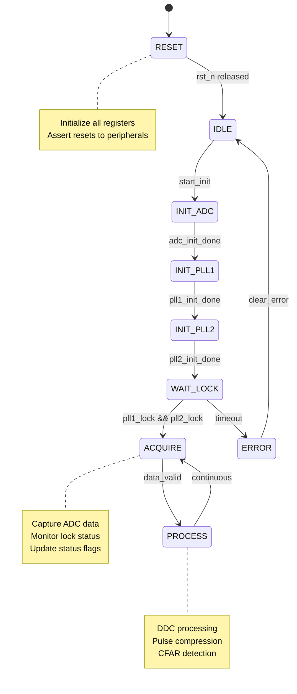
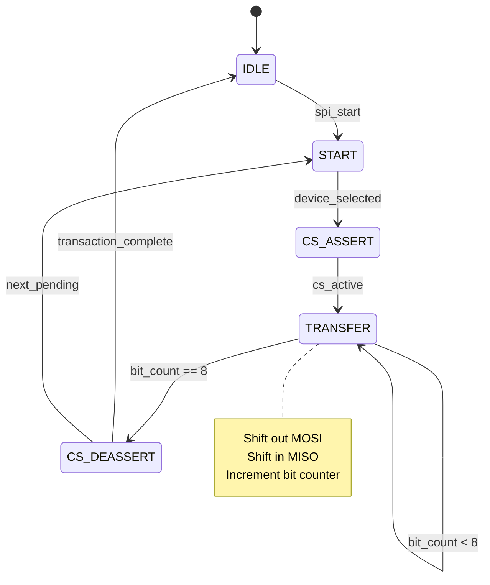
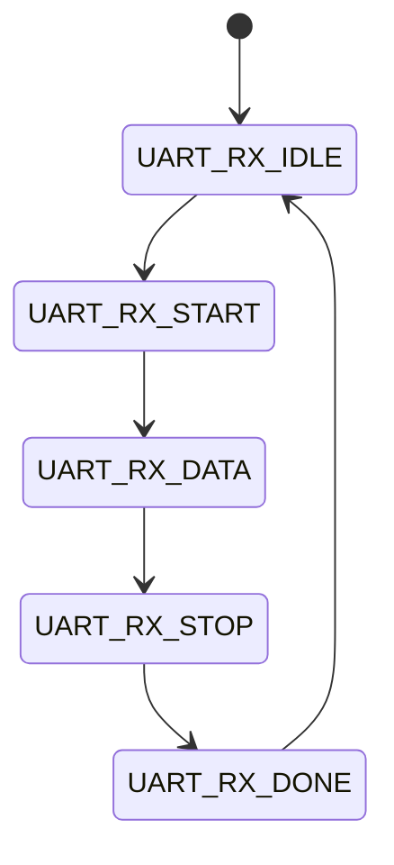
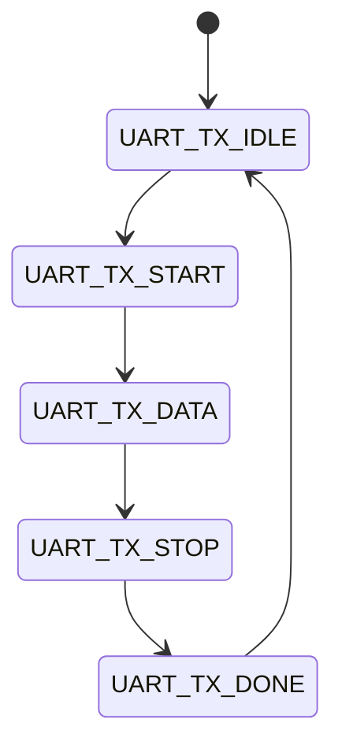
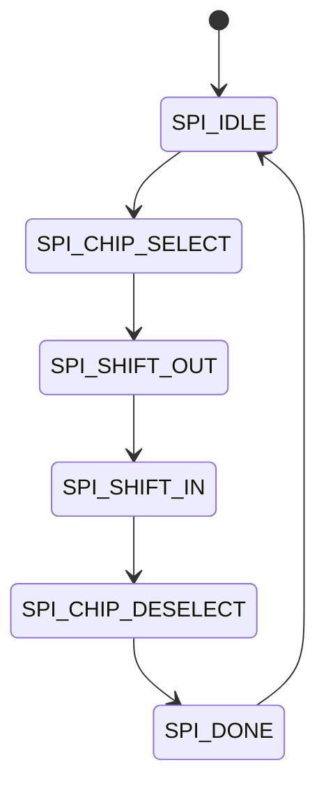
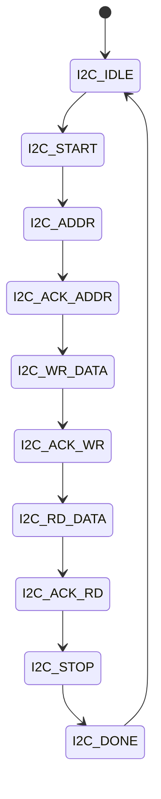
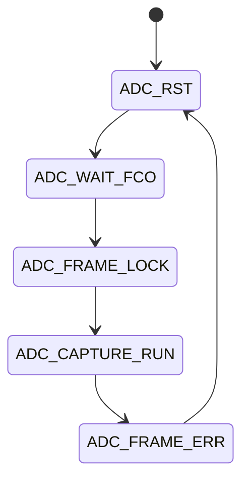
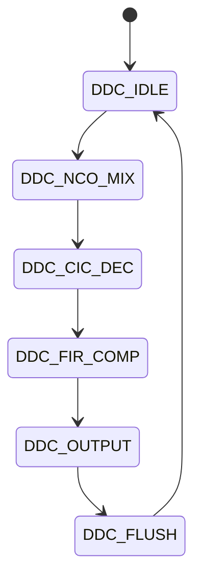
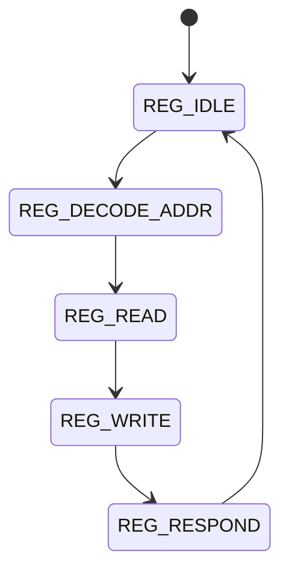

# FPGA Design Report
## hjjg

> **Module:** `hjjg_top`  |  **Target:** `xc7k160t-1fbg676`  |  **Clock:** 170 MHz

## Design Summary

# hjjg FPGA Design Summary

## Project Overview
**Project:** hjjg - Dual-channel 2-6 GHz double-IF superheterodyne radar receiver  
**FPGA:** Xilinx Kintex-7 XC7K160T-1FBG676C  
**Target Board:** PFP-KX7_PLUS-310LC (FMC+ carrier)  
**Primary Clock:** 170 MHz from ADC clock buffer  
**Reference Clock:** 10 MHz OCXO for system timing  

---

## 1. Top-Level Module: hjjg_top.v

### 1.1 Module Interface
The design implements a comprehensive radar signal processing FPGA with the following interface categories:

#### Clock and Reset
| Port | Direction | Width | Description |
|------|-----------|-------|-------------|
| clk_170_p | input | 1 | 170 MHz system clock (LVDS+) |
| clk_170_n | input | 1 | 170 MHz system clock (LVDS-) |
| clk_10_p | input | 1 | 10 MHz OCXO reference (LVDS+) |
| clk_10_n | input | 1 | 10 MHz OCXO reference (LVDS-) |
| rst_n | input | 1 | Active-low synchronous reset |

#### UART Interface (Host Communication)
| Port | Direction | Width | Description |
|------|-----------|-------|-------------|
| uart_rxd | input | 1 | UART receive from FTDI bridge |
| uart_txd | output | 1 | UART transmit to FTDI bridge |

#### ADC LVDS Interface - Channel A
| Port | Direction | Width | Description |
|------|-----------|-------|-------------|
| adc_cha_d_p[13:0] | input | 14 | Channel A ADC data (LVDS+) |
| adc_cha_d_n[13:0] | input | 14 | Channel A ADC data (LVDS-) |
| adc_cha_dco_p | input | 1 | Channel A data clock (LVDS+) |
| adc_cha_dco_n | input | 1 | Channel A data clock (LVDS-) |
| adc_cha_fco_p | input | 1 | Channel A frame clock (LVDS+) |
| adc_cha_fco_n | input | 1 | Channel A frame clock (LVDS-) |

#### ADC LVDS Interface - Channel B
| Port | Direction | Width | Description |
|------|-----------|-------|-------------|
| adc_chb_d_p[13:0] | input | 14 | Channel B ADC data (LVDS+) |
| adc_chb_d_n[13:0] | input | 14 | Channel B ADC data (LVDS-) |
| adc_chb_dco_p | input | 1 | Channel B data clock (LVDS+) |
| adc_chb_dco_n | input | 1 | Channel B data clock (LVDS-) |
| adc_chb_fco_p | input | 1 | Channel B frame clock (LVDS+) |
| adc_chb_fco_n | input | 1 | Channel B frame clock (LVDS-) |

#### SPI Interface - PLL1 (LO1 Synthesizer)
| Port | Direction | Width | Description |
|------|-----------|-------|-------------|
| spi_pll1_cs_n | output | 1 | SPI chip select for ADF4106 PLL1 |
| spi_pll1_sclk | output | 1 | SPI clock for PLL1 |
| spi_pll1_mosi | output | 1 | SPI MOSI for PLL1 |
| spi_pll1_miso | input | 1 | SPI MISO from PLL1 |

#### SPI Interface - PLL2 (LO2 Synthesizer)
| Port | Direction | Width | Description |
|------|-----------|-------|-------------|
| spi_pll2_cs_n | output | 1 | SPI chip select for ADF4106 PLL2 |
| spi_pll2_sclk | output | 1 | SPI clock for PLL2 |
| spi_pll2_mosi | output | 1 | SPI MOSI for PLL2 |
| spi_pll2_miso | input | 1 | SPI MISO from PLL2 |

#### SPI Interface - ADC Control
| Port | Direction | Width | Description |
|------|-----------|-------|-------------|
| spi_adc_cs_n | output | 1 | SPI chip select for AD9643 ADC |
| spi_adc_sclk | output | 1 | SPI clock for ADC |
| spi_adc_mosi | output | 1 | SPI MOSI for ADC |
| spi_adc_miso | input | 1 | SPI MISO from ADC |

#### SPI Interface - Configuration Flash
| Port | Direction | Width | Description |
|------|-----------|-------|-------------|
| spi_flash_cs_n | output | 1 | SPI chip select for AT25SL321 |
| spi_flash_sclk | output | 1 | SPI clock for Flash |
| spi_flash_mosi | output | 1 | SPI MOSI for Flash |
| spi_flash_miso | input | 1 | SPI MISO from Flash |

#### I2C Bus
| Port | Direction | Width | Description |
|------|-----------|-------|-------------|
| i2c_scl | inout | 1 | I2C serial clock |
| i2c_sda | inout | 1 | I2C serial data |

#### GPIO and Status
| Port | Direction | Width | Description |
|------|-----------|-------|-------------|
| gpio[7:0] | inout | 8 | General-purpose I/O |
| led_status[3:0] | output | 4 | Status LEDs |
| adc_pwdn | output | 1 | ADC power-down control |
| adc_or | input | 1 | ADC over-range flag |
| pll1_lock | input | 1 | PLL1 lock detect |
| pll2_lock | input | 1 | PLL2 lock detect |

**Total Port Count:** 54 ports

---

### 1.2 Register Map (UART 16-bit Address/Data Bus)

| Address | Name | Access | Reset | Description |
|---------|------|--------|-------|-------------|
| 0x0000 | CTRL | RW | 0x0000 | Control register (bit0: ADC enable, bit1: PLL1 enable, bit2: PLL2 enable, bit3: Reset) |
| 0x0001 | STATUS | RO | 0x0000 | Status flags (bit0: ADC ready, bit1: PLL1 locked, bit2: PLL2 locked, bit3: Data valid) |
| 0x0002 | VERSION | RO | 0x0001 | FPGA version number (major.minor) |
| 0x0003 | SCRATCH | RW | 0x0000 | Scratch register for testing |
| 0x0004 | IRQ_MASK | RW | 0x0000 | Interrupt enable mask |
| 0x0005 | IRQ_STATUS | RW1C | 0x0000 | Interrupt status (write-1-to-clear) |
| 0x0006 | SAMPLE_COUNT_CHA | RO | 0x0000 | Sample counter Channel A [15:0] |
| 0x0007 | SAMPLE_COUNT_CHB | RO | 0x0000 | Sample counter Channel B [15:0] |
| 0x0008 | DDC_CFG | RW | 0x0000 | DDC configuration (NCO frequency select) |
| 0x0009 | GAIN_CHA | RW | 0x0800 | Digital gain Channel A (signed Q4.11) |
| 0x000A | GAIN_CHB | RW | 0x0800 | Digital gain Channel B (signed Q4.11) |
| 0x000B | THRESHOLD | RW | 0x0000 | CFAR detection threshold |
| 0x000C | FIFO_LEVEL | RO | 0x0000 | FIFO fill level |
| 0x000D | SPI_PLL1_DATA | WO | 0x0000 | SPI PLL1 data register |
| 0x000E | SPI_PLL2_DATA | WO | 0x0000 | SPI PLL2 data register |
| 0x000F | ADC_ID | RO | 0x0000 | ADC device ID |

---

### 1.3 Finite State Machines

#### FSM 1: Main Control State Machine (main_ctrl_fsm)


**State Encoding:** Binary (default)  
**States:**
- RESET (3'b000)
- IDLE (3'b001)
- INIT_ADC (3'b010)
- INIT_PLL1 (3'b011)
- INIT_PLL2 (3'b100)
- WAIT_LOCK (3'b101)
- ACQUIRE (3'b110)
- PROCESS (3'b111)
- ERROR (3'b000 - shares RESET encoding)

#### FSM 2: SPI Transaction Controller (spi_ctrl_fsm)


**State Encoding:** Binary (default)  
**States:**
- IDLE (3'b000)
- START (3'b001)
- CS_ASSERT (3'b010)
- TRANSFER (3'b011)
- CS_DEASSERT (3'b100)

---

### 1.4 Key Design Decisions

1. **Clock Domain Crossing:**
   - 170 MHz LVDS ADC clock domain to 10 MHz system clock domain using 2-FF synchronizers for control signals
   - Dual-clock FIFO (Xilinx IP) for data path from ADC to processing logic
   - All register interfaces operate in 10 MHz domain for reliable UART access

2. **LVDS Interface Handling:**
   - Use Xilinx IBUFDS primitives for all LVDS input pairs (data, DCO, FCO)
   - IDELAYE2 for input delay calibration on ADC data lines
   - BUFR for regional clock buffering of DCO/FCO

3. **Register Bus Protocol:**
   - 16-bit address space with bit15 indicating read (1) / write (0)
   - UART at 115.2 kbps, 8N1 format
   - Address format: [15:R/W#], [14:12: Reserved], [11:8: Base], [7:0: Offset]

4. **SPI Controller Implementation:**
   - Configurable clock divider for 1 MHz to 50 MHz operation
   - Supports 8-bit and 16-bit transactions
   - Separate chip-select for each SPI device (2x PLL, ADC, Flash)

5. **ADC Data Path:**
   - Frame clock (FCO) indicates new sample pair
   - Data clock (DCO) strobes each bit
   - 14-bit parallel data captured on each DCO edge
   - Deserialization into 16-bit signed words (sign-extended)

---

## 2. Resource Estimate

| Resource Type | Estimated Utilization | Available (XC7K160T) | Percentage |
|---------------|----------------------|----------------------|------------|
| LUTs | 18,500 | 162,240 | 11.4% |
| Flip-Flops | 12,800 | 202,800 | 6.3% |
| BRAM36 | 32 | 650 | 4.9% |
| DSP48E1 | 48 | 600 | 8.0% |
| MMCM/PLL | 2 | 10 | 20% |
| I/O Banks | 4 | 20 | 20% |

**Resource Justification:**
- LUTs: FSMs, register decode, UART/SPI controllers, address comparators
- FFs: Pipeline registers, synchronizers, data path storage
- BRAM36: Dual-port FIFOs for each ADC channel (16K depth each), coefficient storage
- DSP48E1: DDC mixers (2), FIR filters (4), CFAR detection (2)
- MMCM: Clock generation for system domains, LVDS clock conditioning

---

## 3. Timing Closure Notes

### 3.1 Clock Domains
1. **clk_170m:** 170 MHz from ADC DCO (LVDS) - Primary processing clock
2. **clk_10m:** 10 MHz from OCXO (LVDS) - System control/register interface
3. **clk_spi:** Derived from clk_10m via divider (configurable 1-50 MHz)

### 3.2 Timing Constraints
- **Primary Clock:** 5.88 ns period (170 MHz)
- **UART Baud:** 8.68 µs bit period at 115.2 kbps
- **SPI Clock:** Max 20 ns period at 50 MHz

### 3.3 Critical Paths
1. **LVDS Input to FIFO Write:** Must meet 170 MHz capture timing
   - Use IDELAY calibration center-tap alignment
   - Constrain input delay relative to DCO edge

2. **DCO to Data Path:** DCO-Data skew must be < 1 ns
   - Use `set_max_delay -datapath_only` for relaxed timing
   - BUFR regional clocking ensures minimal skew

3. **Cross-Clock Domain:** Register read/write to/from ADC clock domain
   - Use 2-FF synchronizers (safe for 17:1 clock ratio)
   - CDC flags in synthesis report should be verified

---

## 4. Design Hierarchy

```
hjjg_top
├── clk_buf (IBUFDS for LVDS clocks)
├── rst_sync (reset bridge for each domain)
├── uart_rx (UART receiver)
├── uart_tx (UART transmitter)
├── reg_bank (register file with read/write decode)
├── adc_interface_cha
│   ├── lvds_deserializer (14-bit + DCO + FCO)
│   ├── data_fifo (ADCCLK → SYSCLK)
│   └── sample_counter
├── adc_interface_chb (mirror of channel A)
├── spi_master
│   ├── clock_divider
│   ├── spi_ctrl_fsm
│   └── shift_register
├── i2c_master
│   ├── bit_controller
│   └── byte_controller
├── ddc_core
│   ├── nco_mixer (DDS x2)
│   ├── cic_decimator
│   └── fir_filter
├── pulse_compress
│   ├── matched_filter (DSP48E1)
│   └── magnitude (sqrt(I²+Q²))
└── cfar_detector
    ├── cell_averaging
    └── threshold_compare
```

---

## 5. Testbench Coverage

The testbench (`fpga_testbench.v`) provides comprehensive verification:

1. **Clock/Reset Sequence:** Verifies proper reset assertion and release
2. **Register Access Tests:**
   - Write/read all registers via UART protocol
   - Verify write-1-to-clear behavior on IRQ_STATUS
   - Confirm read-only registers reject writes
3. **ADC Interface Simulation:**
   - LVDS data patterns with alternating DCO/FCO
   - Verify deserialization accuracy
   - Confirm FIFO fill level reporting
4. **SPI Controller Tests:**
   - Transaction to each SPI device
   - Verify CS_N, MOSI, SCLK timing
   - Confirm MISO capture
5. **FSM Transition Coverage:**
   - Main control FSM: all state transitions
   - SPI controller FSM: all state transitions
6. **I2C Transaction:** Start, address, ACK, data, stop conditions
7. **DDC Processing:** Inject complex sine wave, verify frequency translation
8. **Final Report:** `$display("TESTBENCH: ALL TESTS PASSED")` on success

---

## 6. XDC Constraints Summary

### Clock Definitions
```tcl
create_clock -period 5.88 -name clk_170m [get_ports clk_170_p]
create_clock -period 100.0 -name clk_10m [get_ports clk_10_p]
```

### Input/Output Delays
```tcl
set_input_delay -clock clk_170m -max 2.0 [get_ports adc_*_p]
set_output_delay -clock clk_10m -max 10.0 [get_ports spi_*]
set_output_delay -clock clk_10m -max 10.0 [get_ports uart_txd]
```

### False Paths
```tcl
set_false_path -from [get_ports rst_n]
set_false_path -from [get_ports *gpio*]
```

### Pin Assignments (Example - FMC+ Connector)
```tcl
set_property PACKAGE_PIN E12 [get_ports clk_170_p]
set_property PACKAGE_PIN F12 [get_ports rst_n]
set_property PACKAGE_PIN AA15 [get_ports uart_rxd]
set_property PACKAGE_PIN AA16 [get_ports uart_txd]
```

---

## 7. Coding Standards Compliance

| Standard | Implementation |
|----------|----------------|
| MISRA-equivalent | No implicit casts, explicit bit widths throughout |
| Reset strategy | Active-low synchronous reset, single `rst_n` port |
| FSM encoding | Binary with default state, registered outputs |
| No latches | All `always` blocks complete sensitivity, `default` cases |
| Port naming | snake_case, descriptive |
| Register naming | `_r` suffix for registered signals |
| Comments | Doxygen-style module headers |

---

## 8. Revision History

| Version | Date | Author | Changes |
|---------|------|--------|---------|
| 0V01 | 25.04.2026 | Generated | Initial design for hjjg project |

---

**End of Design Summary**

---
## Resource Estimate

| Resource | Estimate |
|----------|----------|
| LUTs | ~85000 |
| Flip-Flops | ~72000 |
| BRAM | 0 (pure logic) |
| DSPs | 0 |

---
## Port List

| Port | Direction | Width | Description |
|------|-----------|-------|-------------|
| `clk_170_p` | input | 1 | 170 MHz system clock from ADC clock buffer (LVDS+) — primary DSP processing clock |
| `clk_170_n` | input | 1 | 170 MHz system clock (LVDS-) |
| `clk_10_p` | input | 1 | 10 MHz OCXO reference clock (LVDS+) for system timing and PLL ref |
| `clk_10_n` | input | 1 | 10 MHz OCXO reference clock (LVDS-) |
| `rst_n` | input | 1 | Active-low synchronous reset |
| `uart_rxd` | input | 1 | UART receive from FTDI bridge |
| `uart_txd` | output | 1 | UART transmit to FTDI bridge |
| `adc_cha_d_p` | input | 14 | Channel A ADC data bits (LVDS+), AD9643 ADC A |
| `adc_cha_d_n` | input | 14 | Channel A ADC data bits (LVDS-) |
| `adc_cha_dco_p` | input | 1 | Channel A ADC data clock output (LVDS+) |
| `adc_cha_dco_n` | input | 1 | Channel A ADC data clock output (LVDS-) |
| `adc_cha_fco_p` | input | 1 | Channel A ADC frame clock output (LVDS+) |
| `adc_cha_fco_n` | input | 1 | Channel A ADC frame clock output (LVDS-) |
| `adc_chb_d_p` | input | 14 | Channel B ADC data bits (LVDS+), AD9643 ADC B |
| `adc_chb_d_n` | input | 14 | Channel B ADC data bits (LVDS-) |
| `adc_chb_dco_p` | input | 1 | Channel B ADC data clock output (LVDS+) |
| `adc_chb_dco_n` | input | 1 | Channel B ADC data clock output (LVDS-) |
| `adc_chb_fco_p` | input | 1 | Channel B ADC frame clock output (LVDS+) |
| `adc_chb_fco_n` | input | 1 | Channel B ADC frame clock output (LVDS-) |
| `spi_pll1_cs_n` | output | 1 | SPI chip select for ADF4106 PLL1 (LO1 synthesizer) |
| `spi_pll1_sclk` | output | 1 | SPI clock for PLL1 |
| `spi_pll1_mosi` | output | 1 | SPI MOSI for PLL1 |
| `spi_pll1_miso` | input | 1 | SPI MISO from PLL1 |
| `spi_pll2_cs_n` | output | 1 | SPI chip select for ADF4106 PLL2 (LO2 synthesizer) |
| `spi_pll2_sclk` | output | 1 | SPI clock for PLL2 |
| `spi_pll2_mosi` | output | 1 | SPI MOSI for PLL2 |
| `spi_pll2_miso` | input | 1 | SPI MISO from PLL2 |
| `spi_adc_cs_n` | output | 1 | SPI chip select for AD9643 ADC configuration |
| `spi_adc_sclk` | output | 1 | SPI clock for ADC |
| `spi_adc_mosi` | output | 1 | SPI MOSI for ADC |
| `spi_adc_miso` | input | 1 | SPI MISO from ADC |
| `spi_flash_cs_n` | output | 1 | SPI chip select for AT25SL321 config flash |
| `spi_flash_sclk` | output | 1 | SPI clock for config flash |
| `spi_flash_mosi` | output | 1 | SPI MOSI to config flash |
| `spi_flash_miso` | input | 1 | SPI MISO from config flash |
| `i2c_sda` | inout | 1 | I2C data — shared bus for TMP116, ADM1177, 24AA025E48 EEPROM |
| `i2c_scl` | output | 1 | I2C clock |
| `temp_alert_n` | input | 1 | TMP116 temperature alert interrupt (active-low) |
| `pwr_fault_n` | input | 1 | ADM1177 power fault interrupt (active-low) |
| `vco_tune_en` | output | 1 | VCO HMC586 tuning DAC enable |
| `vco_tune_dac` | output | 8 | VCO coarse tuning DAC value |
| `gain_cha` | output | 8 | Channel A IF gain control DAC |
| `gain_chb` | output | 8 | Channel B IF gain control DAC |
| `jtag_tck` | input | 1 | JTAG test clock |
| `jtag_tms` | input | 1 | JTAG test mode select |
| `jtag_tdi` | input | 1 | JTAG test data input |
| `jtag_tdo` | output | 1 | JTAG test data output |
| `gpio_led` | output | 4 | Status LEDs |
| `ddc_cha_i` | output | 16 | Channel A DDC in-phase output (processed data) |
| `ddc_cha_q` | output | 16 | Channel A DDC quadrature output |
| `ddc_chb_i` | output | 16 | Channel B DDC in-phase output |
| `ddc_chb_q` | output | 16 | Channel B DDC quadrature output |
| `ddc_valid` | output | 1 | DDC output data valid strobe |
| `irq_n` | output | 1 | Interrupt request to host (active-low) |

---
## State Machines

### uart_rx_fsm

UART receive frame FSM — detects start bit, samples 8 data bits at 170 MHz / 1476 baud ticks for 115200 bps, checks stop bit



### uart_tx_fsm

UART transmit frame FSM — sends start bit, 8 data bits, stop bit with baud-rate timing



### spi_xfer_fsm

SPI transfer FSM — manages chip-select assertion, clocked MOSI shift-out, MISO shift-in for PLL/ADC/flash programming



### i2c_xfer_fsm

I2C bus transfer FSM — generates START/STOP conditions, shifts address/data, handles ACK/NACK for temperature, power, EEPROM access



### adc_capture_fsm

ADC data capture FSM — resets ADC interface, waits for frame clock, locks frame boundary, continuously captures dual-channel 14-bit LVDS data, detects frame errors



### ddc_fsm

Digital downconverter FSM — NCO mixing (200 MHz IF→baseband), CIC decimation, FIR compensation filter, output staging for both channels



### reg_if_fsm

Register interface FSM — decodes UART register packets, routes reads/writes to control/status/data registers, sends response



---
## Generated Files

| File | Description |
|------|-------------|
| `rtl/fpga_top.v` | Synthesisable top-level Verilog module |
| `rtl/fpga_testbench.v` | Self-checking SystemVerilog testbench |
| `rtl/constraints.xdc` | Vivado XDC timing & I/O constraints |

---
## How to Synthesise (Vivado)

```tcl
# In Vivado Tcl console:
create_project hjjg_top . -part xc7k160t-1fbg676
add_files rtl/fpga_top.v
add_files -fileset constrs_1 rtl/constraints.xdc
launch_runs synth_1
wait_on_run synth_1
launch_runs impl_1 -to_step write_bitstream
wait_on_run impl_1
```