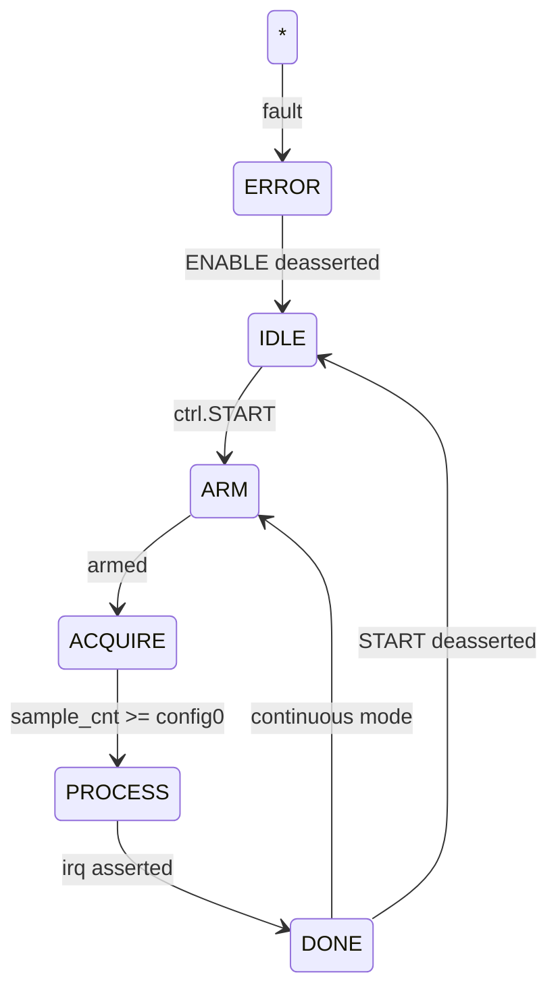
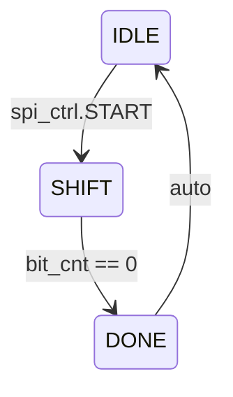

# FPGA Design Report

## Rf Receiver

## Architecture Overview

- **Module**: `rf_receiver_top`
- **Clock**: 50 MHz (20.0 ns period)
- **Data Width**: 12-bit
- **Ports**: 24
- **Registers**: 14
- **FSMs**: 2 (Acquisition Controller, SPI Master)
- **Interfaces**: Register Bus (16-bit), SPI Master (4 CS), ADC Data (12-bit LVDS), UART Debug, GPIO (8-bit), DAC (12-bit)

## FSM: Acquisition Controller

## FSM: SPI Master

## Register Map

| Address | Name | Access | Description |
|---------|------|--------|-------------|
| `12'h000` | CTRL | RW | Control: [0] enable, [1] start, [2] continuous, [3] irq_en |
| `12'h001` | STATUS | RO | Status: [0] busy, [1] done, [2] overflow, [3] error |
| `12'h002` | VERSION | RO | Firmware version (read-only 0x0100) |
| `12'h003` | SCRATCH | RW | Scratch register for diagnostics |
| `12'h004` | CONFIG0 | RW | Configuration 0: sample count / mode |
| `12'h005` | CONFIG1 | RW | Configuration 1: threshold / gain |
| `12'h010` | ADC_DATA_L | RO | ADC captured data [15:0] |
| `12'h011` | ADC_DATA_H | RO | ADC captured data [31:16] |
| `12'hF00` | IRQ_MASK | RW | Interrupt mask (1=enabled) |
| `12'hF01` | IRQ_STATUS | W1C | Interrupt status (write-1-to-clear) |
| `12'h020` | SPI_CTRL | RW | SPI control: [2:0] slave_sel, [3] start, [7:4] clk_div |
| `12'h021` | SPI_TXDATA | RW | SPI TX data |
| `12'h022` | SPI_RXDATA | RO | SPI RX data (last received) |
| `12'h023` | SPI_STATUS | RO | SPI status: [0] busy, [1] done |

## Generated Files

| File | Description |
|------|-------------|
| `rtl/fpga_top.v` | Top module with 2 FSMs, 14 registers, 24 ports |
| `rtl/fpga_testbench.v` | Functional testbench with register R/W and FSM tests |
| `rtl/constraints.xdc` | Vivado timing constraints for 50 MHz |

## Resource Estimate

| Resource | Estimate |
|----------|----------|
| LUTs | ~630 |
| FFs | ~334 |
| BRAM | 0 |
| DSP | 0 |
