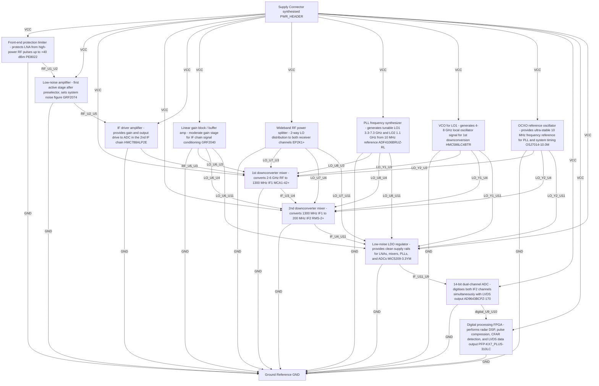

# Logical Netlist
## hjjg

## Block Diagram

## Component Instances

| Ref | Part Number | Component |
|---|---|---|
| U1 | PE8022 | Front-end protection limiter — protects LNA from high-power RF pulses up to +40 dBm |
| U2 | GRF2074 | Low-noise amplifier — first active stage after preselector, sets system noise figure |
| U3 | MCA1-42+ | 1st downconverter mixer — converts 2-6 GHz RF to 1300 MHz IF1 |
| U4 | RMS-2+ | 2nd downconverter mixer — converts 1300 MHz IF1 to 200 MHz IF2 |
| U5 | HMC788ALP2E | IF driver amplifier — provides gain and output drive to ADC in the 2nd IF chain |
| U6 | GRF2040 | Linear gain block / buffer amp — moderate gain stage for IF chain signal conditioning |
| U7 | EP2K1+ | Wideband RF power splitter — 2-way LO distribution to both receiver channels |
| U8 | ADF4106BRUZ-RL | PLL frequency synthesizer — generates tunable LO1 (3.3-7.3 GHz) and LO2 (1.1 GHz) from 10 MHz reference |
| Y1 | HMC586LC4BTR | VCO for LO1 — generates 4-8 GHz local oscillator signal for 1st downconversion |
| Y2 | OSJ7014-10.0M | OCXO reference oscillator — provides ultra-stable 10 MHz frequency reference for PLL and system timing |
| U9 | AD9643BCPZ-170 | 14-bit dual-channel ADC — digitises both IF2 channels simultaneously with LVDS output |
| U10 | PFP-KX7_PLUS-310LC | Digital processing FPGA — performs radar DSP, pulse compression, CFAR detection, and LVDS data output |
| U11 | MIC5209-3.3YM | Low-noise LDO regulator — provides clean supply rails for LNAs, mixers, PLLs, and ADCs |
| J_PWR | PWR_HEADER | Supply Connector (synthesised) |
| GND_STAR | GND | Ground Reference |

## Pin-to-Pin Connections

| Net | From | Pin | To | Pin | Type |
|---|---|---|---|---|---|
| VCC | J_PWR | 1 | U1 | VCC | power |
| VCC | J_PWR | 1 | U2 | VCC | power |
| VCC | J_PWR | 1 | U3 | VCC | power |
| VCC | J_PWR | 1 | U4 | VCC | power |
| VCC | J_PWR | 1 | U5 | VCC | power |
| VCC | J_PWR | 1 | U6 | VCC | power |
| VCC | J_PWR | 1 | U7 | VCC | power |
| VCC | J_PWR | 1 | U8 | VCC | power |
| VCC | J_PWR | 1 | Y1 | VCC | power |
| VCC | J_PWR | 1 | Y2 | VCC | power |
| VCC | J_PWR | 1 | U9 | VCC | power |
| VCC | J_PWR | 1 | U10 | VCC | power |
| VCC | J_PWR | 1 | U11 | VCC | power |
| GND | U1 | GND | GND_STAR | 1 | ground |
| GND | U2 | GND | GND_STAR | 1 | ground |
| GND | U3 | GND | GND_STAR | 1 | ground |
| GND | U4 | GND | GND_STAR | 1 | ground |
| GND | U5 | GND | GND_STAR | 1 | ground |
| GND | U6 | GND | GND_STAR | 1 | ground |
| GND | U7 | GND | GND_STAR | 1 | ground |
| GND | U8 | GND | GND_STAR | 1 | ground |
| GND | Y1 | GND | GND_STAR | 1 | ground |
| GND | Y2 | GND | GND_STAR | 1 | ground |
| GND | U9 | GND | GND_STAR | 1 | ground |
| GND | U10 | GND | GND_STAR | 1 | ground |
| GND | U11 | GND | GND_STAR | 1 | ground |
| RF_U1_U2 | U1 | OUT | U2 | IN | rf |
| RF_U2_U5 | U2 | OUT | U5 | IN | rf |
| RF_U5_U3 | U5 | OUT | U3 | IN | rf |
| IF_U3_U4 | U3 | OUT | U4 | IN | if |
| IF_U4_U11 | U4 | OUT | U11 | IN | if |
| IF_U11_U9 | U11 | OUT | U9 | IN | if |
| digital_U9_U10 | U9 | OUT | U10 | IN | digital |
| LO_U6_U3 | U6 | RF_OUT | U3 | LO | clock |
| LO_U6_U4 | U6 | RF_OUT | U4 | LO | clock |
| LO_U6_U11 | U6 | RF_OUT | U11 | LO | clock |
| LO_U7_U3 | U7 | RF_OUT | U3 | LO | clock |
| LO_U7_U4 | U7 | RF_OUT | U4 | LO | clock |
| LO_U7_U11 | U7 | RF_OUT | U11 | LO | clock |
| LO_U8_U3 | U8 | RF_OUT | U3 | LO | clock |
| LO_U8_U4 | U8 | RF_OUT | U4 | LO | clock |
| LO_U8_U11 | U8 | RF_OUT | U11 | LO | clock |
| LO_Y1_U3 | Y1 | RF_OUT | U3 | LO | clock |
| LO_Y1_U4 | Y1 | RF_OUT | U4 | LO | clock |
| LO_Y1_U11 | Y1 | RF_OUT | U11 | LO | clock |
| LO_Y2_U3 | Y2 | RF_OUT | U3 | LO | clock |
| LO_Y2_U4 | Y2 | RF_OUT | U4 | LO | clock |
| LO_Y2_U11 | Y2 | RF_OUT | U11 | LO | clock |

## Net Connection List

| Net Name | Reference Designator - Pin No. |
|----------|-------------------------------|
| GND | U1 - GND,  GND_STAR - 1,  U2 - GND,  U3 - GND,  U4 - GND,  U5 - GND,  U6 - GND,  U7 - GND,  U8 - GND,  Y1 - GND,  Y2 - GND,  U9 - GND,  U10 - GND,  U11 - GND |
| IF_U11_U9 | U11 - OUT,  U9 - IN |
| IF_U3_U4 | U3 - OUT,  U4 - IN |
| IF_U4_U11 | U4 - OUT,  U11 - IN |
| LO_U6_U11 | U6 - RF_OUT,  U11 - LO |
| LO_U6_U3 | U6 - RF_OUT,  U3 - LO |
| LO_U6_U4 | U6 - RF_OUT,  U4 - LO |
| LO_U7_U11 | U7 - RF_OUT,  U11 - LO |
| LO_U7_U3 | U7 - RF_OUT,  U3 - LO |
| LO_U7_U4 | U7 - RF_OUT,  U4 - LO |
| LO_U8_U11 | U8 - RF_OUT,  U11 - LO |
| LO_U8_U3 | U8 - RF_OUT,  U3 - LO |
| LO_U8_U4 | U8 - RF_OUT,  U4 - LO |
| LO_Y1_U11 | Y1 - RF_OUT,  U11 - LO |
| LO_Y1_U3 | Y1 - RF_OUT,  U3 - LO |
| LO_Y1_U4 | Y1 - RF_OUT,  U4 - LO |
| LO_Y2_U11 | Y2 - RF_OUT,  U11 - LO |
| LO_Y2_U3 | Y2 - RF_OUT,  U3 - LO |
| LO_Y2_U4 | Y2 - RF_OUT,  U4 - LO |
| RF_U1_U2 | U1 - OUT,  U2 - IN |
| RF_U2_U5 | U2 - OUT,  U5 - IN |
| RF_U5_U3 | U5 - OUT,  U3 - IN |
| VCC | J_PWR - 1,  U1 - VCC,  U2 - VCC,  U3 - VCC,  U4 - VCC,  U5 - VCC,  U6 - VCC,  U7 - VCC,  U8 - VCC,  Y1 - VCC,  Y2 - VCC,  U9 - VCC,  U10 - VCC,  U11 - VCC |
| digital_U9_U10 | U9 - OUT,  U10 - IN |

## Validation Notes

- INFO: Auto-extracted 15 components from P1 BOM
- INFO: Generated 48 connections based on signal chain analysis
- INFO: Power nets: VCC
- INFO: Ground nets: AGND, GND
- WARNING: No power regulators detected in BOM