# Logical Netlist
## jhf

## Block Diagram

```mermaid
graph TB
    J1[SMA_RF_INPUT_CONNECTOR 142-0701-851]
    L1[BPF_5_18GHZ BP05G18G-06]
    U1[LNA_WIDEBAND HMC6180LP4E]
    U2[MIXER_WIDEBAND HMC558LC4]
    U3[VGA_DIGITAL HMC698LP4]
    U4[LO_SYNTHESIZER ADF5356]
    U5[IF_AMPLIFIER ADL5541]
    U6[DCDC_12V_BUCK LM22676-12]
    U7[LDO_3V3 LT3042]
    U8[NEG_REGULATOR_5V LM2991]
    J2[IF_OUTPUT_CONNECTOR SMA-F]
    J3[POWER_INPUT_CONNECTOR HEADER-5]
    J4[SPI_CONTROL_HEADER HEADER-6]
    C1[CAPACITOR_RF 100pF_C0G]
    C2[CAPACITOR_RF 100pF_C0G]
    C3[CAPACITOR_RF 100pF_C0G]
    C4[CAPACITOR_RF 100pF_C0G]
    C5[CAPACITOR_RF 100pF_C0G]
    C6[CAPACITOR_RF 100pF_C0G]
    C7[CAPACITOR_RF 100pF_C0G]
    C8[CAPACITOR_RF 100pF_C0G]
    C9[CAPACITOR_RF 100pF_C0G]
    C10[CAPACITOR_BULK 10uF_TANT]
    C11[CAPACITOR_BULK 10uF_TANT]
    C12[CAPACITOR_DECOUPLE 100nF_X7R]
    C13[CAPACITOR_DECOUPLE 100nF_X7R]
    C14[CAPACITOR_DECOUPLE 100nF_X7R]
    C15[CAPACITOR_DECOUPLE 100nF_X7R]
    C16[CAPACITOR_DECOUPLE 100nF_X7R]
    C17[CAPACITOR_DECOUPLE 100nF_X7R]
    C18[CAPACITOR_DECOUPLE 100nF_X7R]
    C19[CAPACITOR_DECOUPLE 100nF_X7R]
    C20[CAPACITOR_BULK 10uF_TANT]
    C21[CAPACITOR_BULK 10uF_TANT]
    C22[CAPACITOR_INPUT 47uF_ELECTROLYTIC]
    C23[CAPACITOR_OUTPUT 47uF_ELECTROLYTIC]
    C24[CAPACITOR_DECOUPLE 10uF_CERAMIC]
    C25[CAPACITOR_DECOUPLE 10uF_CERAMIC]
    C26[CAPACITOR_DECOUPLE 100nF_X7R]
    C27[CAPACITOR_RF 100pF_C0G]
    C28[CAPACITOR_RF 100pF_C0G]
    C29[CAPACITOR_BULK 10uF_TANT]
    C30[CAPACITOR_DECOUPLE 100nF_X7R]
    R1[RESISTOR_PULLUP 10k_0805]
    R2[RESISTOR_PULLUP 10k_0805]
    R3[RESISTOR_PULLUP 10k_0805]
    R4[RESISTOR_PULLUP 10k_0805]
    R5[RESISTOR_RF 49.9_0805]
    R6[RESISTOR_RF 49.9_0805]
    R7[RESISTOR_I2C 1k_0805]
    R8[RESISTOR_I2C 1k_0805]
    L2[INDUCTOR_BUCK 10uH_POWER]
    L3[INDUCTOR_BUCK 10uH_POWER]
    D1[DIODE_PROTECTION SCHOTTKY_100V]
    FB1[FERRITE_BEAD BEAD_600R]
    FB2[FERRITE_BEAD BEAD_600R]
    FB3[FERRITE_BEAD BEAD_600R]
    FB4[FERRITE_BEAD BEAD_600R]
    FB5[FERRITE_BEAD BEAD_600R]
    FB6[FERRITE_BEAD BEAD_600R]
    J1 -->|RF_IN_5_18GHZ| L1
    L1 -->|RF_FILTERED| C1
    C1 -->|RF_FILTERED| R5
    R5 -->|RF_LNA_IN| U1
    U1 -->|RF_LNA_OUT| C2
    C2 -->|RF_LNA_OUT| U2
    U2 -->|IF_MIXER_OUT| C3
    C3 -->|IF_MIXER_OUT| R6
    R6 -->|IF_VGA_IN| U3
    U3 -->|IF_VGA_OUT| C4
    C4 -->|IF_VGA_OUT| U5
    U5 -->|IF_OUT_FINAL| C5
    C5 -->|IF_OUT_FINAL| J2
    U4 -->|LO_SYNTH_OUT| C27
    C27 -->|LO_MIXER_IN| U2
    J3 -->|12V_INPUT| D1
    D1 -->|12V_PROTECTED| C22
    C22 -->|12V_PROTECTED| U6
    U6 -->|12V_SW| L2
    L2 -->|12V_SW| C23
    C23 -->|12V_REG| FB1
    FB1 -->|12V_RF| U1
    U1 -->|12V_RF| C10
    FB1 -->|12V_RF| U2
    U2 -->|12V_RF| C11
    FB1 -->|12V_RF| U5
    U5 -->|12V_RF| C29
    U6 -->|3V3_REG| U7
    U6 -->|3V3_REG| C24
    U7 -->|3V3_LOGIC| FB2
    FB2 -->|3V3_LOGIC| U3
    FB2 -->|3V3_LOGIC| U4
    U6 -->|5V_NEG_INPUT| U8
    U6 -->|5V_NEG_INPUT| C25
    U8 -->|NEG_5V| FB3
    FB3 -->|NEG_5V| U3
    J3 -->|GND| C22
    C22 -->|GND| U6
    U6 -->|GND| C23
    C23 -->|GND| C24
    C24 -->|GND| U7
    U7 -->|GND| C25
    C25 -->|GND| U8
    C10 -->|GND| U1
    U1 -->|GND| C11
    C11 -->|GND| U2
    U2 -->|GND| C29
    C29 -->|GND| U5
    J1 -->|GND| J2
    J2 -->|GND| U4
    U4 -->|GND| U3
    J3 -->|GND| J4
    J4 -->|GND| J4
    J4 -->|SPI_CLK| R7
    R7 -->|SPI_CLK| U3
    U3 -->|SPI_CLK| U4
    J4 -->|SPI_MOSI| U3
    U3 -->|SPI_MOSI| U4
    J4 -->|SPI_LE_VGA| U3
    J4 -->|SPI_LE_LO| U4
    U7 -->|VDD_PULLUP| R1
    R1 -->|VDD_PULLUP| U3
    U7 -->|VDD_PULLUP| R2
    R2 -->|VDD_PULLUP| U4
    U7 -->|VDD_PULLUP| R3
    R3 -->|VDD_PULLUP| U3
    U7 -->|VDD_PULLUP| R4
    R4 -->|VDD_PULLUP| U3
    U3 -->|VGA_MUX_A| R1
    U3 -->|VGA_MUX_B| C6
    C6 -->|VGA_MUX_B_GND| U3
    U4 -->|LO_MUX| C7
    C7 -->|LO_MUX_GND| U4
    U4 -->|LO_VCO_TANK| C8
    C8 -->|LO_VCO_TANK| L3
    L3 -->|LO_VCO_TANK| U4
```

## Component Instances

| Ref | Part Number | Component |
|---|---|---|
| J1 | 142-0701-851 | SMA_RF_INPUT_CONNECTOR |
| L1 | BP05G18G-06 | BPF_5_18GHZ |
| U1 | HMC6180LP4E | LNA_WIDEBAND |
| U2 | HMC558LC4 | MIXER_WIDEBAND |
| U3 | HMC698LP4 | VGA_DIGITAL |
| U4 | ADF5356 | LO_SYNTHESIZER |
| U5 | ADL5541 | IF_AMPLIFIER |
| U6 | LM22676-12 | DCDC_12V_BUCK |
| U7 | LT3042 | LDO_3V3 |
| U8 | LM2991 | NEG_REGULATOR_5V |
| J2 | SMA-F | IF_OUTPUT_CONNECTOR |
| J3 | HEADER-5 | POWER_INPUT_CONNECTOR |
| J4 | HEADER-6 | SPI_CONTROL_HEADER |
| C1 | 100pF_C0G | CAPACITOR_RF |
| C2 | 100pF_C0G | CAPACITOR_RF |
| C3 | 100pF_C0G | CAPACITOR_RF |
| C4 | 100pF_C0G | CAPACITOR_RF |
| C5 | 100pF_C0G | CAPACITOR_RF |
| C6 | 100pF_C0G | CAPACITOR_RF |
| C7 | 100pF_C0G | CAPACITOR_RF |
| C8 | 100pF_C0G | CAPACITOR_RF |
| C9 | 100pF_C0G | CAPACITOR_RF |
| C10 | 10uF_TANT | CAPACITOR_BULK |
| C11 | 10uF_TANT | CAPACITOR_BULK |
| C12 | 100nF_X7R | CAPACITOR_DECOUPLE |
| C13 | 100nF_X7R | CAPACITOR_DECOUPLE |
| C14 | 100nF_X7R | CAPACITOR_DECOUPLE |
| C15 | 100nF_X7R | CAPACITOR_DECOUPLE |
| C16 | 100nF_X7R | CAPACITOR_DECOUPLE |
| C17 | 100nF_X7R | CAPACITOR_DECOUPLE |
| C18 | 100nF_X7R | CAPACITOR_DECOUPLE |
| C19 | 100nF_X7R | CAPACITOR_DECOUPLE |
| C20 | 10uF_TANT | CAPACITOR_BULK |
| C21 | 10uF_TANT | CAPACITOR_BULK |
| C22 | 47uF_ELECTROLYTIC | CAPACITOR_INPUT |
| C23 | 47uF_ELECTROLYTIC | CAPACITOR_OUTPUT |
| C24 | 10uF_CERAMIC | CAPACITOR_DECOUPLE |
| C25 | 10uF_CERAMIC | CAPACITOR_DECOUPLE |
| C26 | 100nF_X7R | CAPACITOR_DECOUPLE |
| C27 | 100pF_C0G | CAPACITOR_RF |
| C28 | 100pF_C0G | CAPACITOR_RF |
| C29 | 10uF_TANT | CAPACITOR_BULK |
| C30 | 100nF_X7R | CAPACITOR_DECOUPLE |
| R1 | 10k_0805 | RESISTOR_PULLUP |
| R2 | 10k_0805 | RESISTOR_PULLUP |
| R3 | 10k_0805 | RESISTOR_PULLUP |
| R4 | 10k_0805 | RESISTOR_PULLUP |
| R5 | 49.9_0805 | RESISTOR_RF |
| R6 | 49.9_0805 | RESISTOR_RF |
| R7 | 1k_0805 | RESISTOR_I2C |
| R8 | 1k_0805 | RESISTOR_I2C |
| L2 | 10uH_POWER | INDUCTOR_BUCK |
| L3 | 10uH_POWER | INDUCTOR_BUCK |
| D1 | SCHOTTKY_100V | DIODE_PROTECTION |
| FB1 | BEAD_600R | FERRITE_BEAD |
| FB2 | BEAD_600R | FERRITE_BEAD |
| FB3 | BEAD_600R | FERRITE_BEAD |
| FB4 | BEAD_600R | FERRITE_BEAD |
| FB5 | BEAD_600R | FERRITE_BEAD |
| FB6 | BEAD_600R | FERRITE_BEAD |

## Pin-to-Pin Connections

| Net | From | Pin | To | Pin | Type |
|---|---|---|---|---|---|
| RF_IN_5_18GHZ | J1 | SIG | L1 | RF_IN | RF |
| RF_FILTERED | L1 | RF_OUT | C1 | 1 | RF |
| RF_FILTERED | C1 | 2 | R5 | 1 | RF |
| RF_LNA_IN | R5 | 2 | U1 | RFIN | RF |
| RF_LNA_OUT | U1 | RFOUT | C2 | 1 | RF |
| RF_LNA_OUT | C2 | 2 | U2 | RF_IN | RF |
| IF_MIXER_OUT | U2 | IF_OUT | C3 | 1 | IF |
| IF_MIXER_OUT | C3 | 2 | R6 | 1 | IF |
| IF_VGA_IN | R6 | 2 | U3 | RF_IN | IF |
| IF_VGA_OUT | U3 | RF_OUT | C4 | 1 | IF |
| IF_VGA_OUT | C4 | 2 | U5 | RFIN | IF |
| IF_OUT_FINAL | U5 | RFOUT | C5 | 1 | IF |
| IF_OUT_FINAL | C5 | 2 | J2 | SIG | IF |
| LO_SYNTH_OUT | U4 | RF_OUT_A | C27 | 1 | RF |
| LO_MIXER_IN | C27 | 2 | U2 | LO_IN | RF |
| 12V_INPUT | J3 | 1 | D1 | CATHODE | power |
| 12V_PROTECTED | D1 | ANODE | C22 | POS | power |
| 12V_PROTECTED | C22 | NEG | U6 | VIN | power |
| 12V_SW | U6 | SW | L2 | 1 | power |
| 12V_SW | L2 | 2 | C23 | POS | power |
| 12V_REG | C23 | NEG | FB1 | 1 | power |
| 12V_RF | FB1 | 2 | U1 | VCC | power |
| 12V_RF | U1 | VCC | C10 | POS | power |
| 12V_RF | FB1 | 2 | U2 | VCC | power |
| 12V_RF | U2 | VCC | C11 | POS | power |
| 12V_RF | FB1 | 2 | U5 | VCC | power |
| 12V_RF | U5 | VCC | C29 | POS | power |
| 3V3_REG | U6 | FB | U7 | IN | power |
| 3V3_REG | U6 | FB | C24 | POS | power |
| 3V3_LOGIC | U7 | OUT | FB2 | 1 | power |
| 3V3_LOGIC | FB2 | 2 | U3 | VDD | power |
| 3V3_LOGIC | FB2 | 2 | U4 | VDD | power |
| 5V_NEG_INPUT | U6 | FB | U8 | VIN | power |
| 5V_NEG_INPUT | U6 | FB | C25 | POS | power |
| NEG_5V | U8 | VOUT | FB3 | 1 | power |
| NEG_5V | FB3 | 2 | U3 | VEE | power |
| GND | J3 | 2 | C22 | NEG | ground |
| GND | C22 | NEG | U6 | GND | ground |
| GND | U6 | GND | C23 | NEG | ground |
| GND | C23 | NEG | C24 | NEG | ground |
| GND | C24 | NEG | U7 | GND | ground |
| GND | U7 | GND | C25 | NEG | ground |
| GND | C25 | NEG | U8 | GND | ground |
| GND | C10 | NEG | U1 | GND | ground |
| GND | U1 | GND | C11 | NEG | ground |
| GND | C11 | NEG | U2 | GND | ground |
| GND | U2 | GND | C29 | NEG | ground |
| GND | C29 | NEG | U5 | GND | ground |
| GND | J1 | SHLD1 | J2 | SHLD1 | ground |
| GND | J2 | SHLD1 | U4 | GND | ground |
| GND | U4 | GND | U3 | GND | ground |
| GND | J3 | 2 | J4 | 3 | ground |
| GND | J4 | 3 | J4 | 5 | ground |
| SPI_CLK | J4 | 1 | R7 | 1 | digital |
| SPI_CLK | R7 | 2 | U3 | CLK | digital |
| SPI_CLK | U3 | CLK | U4 | CLK | digital |
| SPI_MOSI | J4 | 2 | U3 | DATA | digital |
| SPI_MOSI | U3 | DATA | U4 | DATA | digital |
| SPI_LE_VGA | J4 | 4 | U3 | LE | digital |
| SPI_LE_LO | J4 | 6 | U4 | LE | digital |
| VDD_PULLUP | U7 | OUT | R1 | 2 | power |
| VDD_PULLUP | R1 | 1 | U3 | LE | power |
| VDD_PULLUP | U7 | OUT | R2 | 2 | power |
| VDD_PULLUP | R2 | 1 | U4 | LE | power |
| VDD_PULLUP | U7 | OUT | R3 | 2 | power |
| VDD_PULLUP | R3 | 1 | U3 | CLK | power |
| VDD_PULLUP | U7 | OUT | R4 | 2 | power |
| VDD_PULLUP | R4 | 1 | U3 | DATA | power |
| VGA_MUX_A | U3 | MUX_A | R1 | 1 | digital |
| VGA_MUX_B | U3 | MUX_B | C6 | 1 | digital |
| VGA_MUX_B_GND | C6 | 2 | U3 | GND | ground |
| LO_MUX | U4 | MUX_OUT | C7 | 1 | clock |
| LO_MUX_GND | C7 | 2 | U4 | GND | ground |
| LO_VCO_TANK | U4 | VCO_TANK | C8 | 1 | analog |
| LO_VCO_TANK | C8 | 2 | L3 | 1 | analog |
| LO_VCO_TANK | L3 | 2 | U4 | GND | ground |

## Net Connection List

| Net Name | Reference Designator - Pin No. |
|----------|-------------------------------|
| 12V_INPUT | J3 - 1,  D1 - CATHODE |
| 12V_PROTECTED | D1 - ANODE,  C22 - POS,  C22 - NEG,  U6 - VIN |
| 12V_REG | C23 - NEG,  FB1 - 1 |
| 12V_RF | FB1 - 2,  U1 - VCC,  C10 - POS,  U2 - VCC,  C11 - POS,  U5 - VCC,  C29 - POS |
| 12V_SW | U6 - SW,  L2 - 1,  L2 - 2,  C23 - POS |
| 3V3_LOGIC | U7 - OUT,  FB2 - 1,  FB2 - 2,  U3 - VDD,  U4 - VDD |
| 3V3_REG | U6 - FB,  U7 - IN,  C24 - POS |
| 5V_NEG_INPUT | U6 - FB,  U8 - VIN,  C25 - POS |
| GND | J3 - 2,  C22 - NEG,  U6 - GND,  C23 - NEG,  C24 - NEG,  U7 - GND,  C25 - NEG,  U8 - GND,  C10 - NEG,  U1 - GND,  C11 - NEG,  U2 - GND,  C29 - NEG,  U5 - GND,  J1 - SHLD1,  J2 - SHLD1,  U4 - GND,  U3 - GND,  J4 - 3,  J4 - 5 |
| IF_MIXER_OUT | U2 - IF_OUT,  C3 - 1,  C3 - 2,  R6 - 1 |
| IF_OUT_FINAL | U5 - RFOUT,  C5 - 1,  C5 - 2,  J2 - SIG |
| IF_VGA_IN | R6 - 2,  U3 - RF_IN |
| IF_VGA_OUT | U3 - RF_OUT,  C4 - 1,  C4 - 2,  U5 - RFIN |
| LO_MIXER_IN | C27 - 2,  U2 - LO_IN |
| LO_MUX | U4 - MUX_OUT,  C7 - 1 |
| LO_MUX_GND | C7 - 2,  U4 - GND |
| LO_SYNTH_OUT | U4 - RF_OUT_A,  C27 - 1 |
| LO_VCO_TANK | U4 - VCO_TANK,  C8 - 1,  C8 - 2,  L3 - 1,  L3 - 2,  U4 - GND |
| NEG_5V | U8 - VOUT,  FB3 - 1,  FB3 - 2,  U3 - VEE |
| RF_FILTERED | L1 - RF_OUT,  C1 - 1,  C1 - 2,  R5 - 1 |
| RF_IN_5_18GHZ | J1 - SIG,  L1 - RF_IN |
| RF_LNA_IN | R5 - 2,  U1 - RFIN |
| RF_LNA_OUT | U1 - RFOUT,  C2 - 1,  C2 - 2,  U2 - RF_IN |
| SPI_CLK | J4 - 1,  R7 - 1,  R7 - 2,  U3 - CLK,  U4 - CLK |
| SPI_LE_LO | J4 - 6,  U4 - LE |
| SPI_LE_VGA | J4 - 4,  U3 - LE |
| SPI_MOSI | J4 - 2,  U3 - DATA,  U4 - DATA |
| VDD_PULLUP | U7 - OUT,  R1 - 2,  R1 - 1,  U3 - LE,  R2 - 2,  R2 - 1,  U4 - LE,  R3 - 2,  R3 - 1,  U3 - CLK,  R4 - 2,  R4 - 1,  U3 - DATA |
| VGA_MUX_A | U3 - MUX_A,  R1 - 1 |
| VGA_MUX_B | U3 - MUX_B,  C6 - 1 |
| VGA_MUX_B_GND | C6 - 2,  U3 - GND |

## Validation Notes

- VGA (HMC698LP4) requires +/-5V supplies - added -5V regulator LM2991
- HMC698LP4 RF bandwidth is DC-6 GHz, adequate for IF output range 100 MHz-2 GHz
- Mixer HMC558LC4 RF range is 4-8 GHz - covers lower portion of 5-18 GHz requirement, recommend considering wider mixer or dual-mixer approach for full band coverage
- ADF5356 LO range 53.125 MHz-13.6 GHz covers mixer LO requirements (2-8 GHz)
- Added RF blocking capacitors (100 pF C0G) at all RF interconnects for DC isolation and coupling
- Added ferrite beads on power rails to reduce switching noise coupling into RF circuits
- Added input protection diode D1 for reverse polarity protection
- All power pins have local decoupling: 10 uF bulk + 100 nF ceramic per datasheet recommendations
- SPI control lines include series resistors (R7, R8) for impedance matching and ESD protection
- Pullup resistors (R1-R4) on SPI control lines ensure defined logic levels when idle
- Ground connections between all RF components and connectors for proper RF grounding and shielding
- Total estimated supply current: ~450 mA (well under 500 mA requirement REQ-HW-007)
- Operating temperature: All selected components support -40C to +85C industrial range (REQ-HW-011)
- Input impedance: 50-ohm controlled impedance PCB required from J1 through entire RF chain
- Recommended PCB: Rogers RO4350B or similar low-loss RF substrate for 5-18 GHz performance
- EMC compliance: Shielding cans recommended over LNA, Mixer, and LO sections per MIL-STD-461 (REQ-HW-014)
- Component mounting: Use staked or conformal-coated components per MIL-STD-810 vibration requirements (REQ-HW-013)