# Logical Netlist
## hv

## Block Diagram

```mermaid
graph TB
    J1[SMA Female Connector CH1 SMA-F-18-40G]
    J2[SMA Female Connector CH2 SMA-F-18-40G]
    LIM1[GaAs Limiter CH1 HLM-40ABH]
    LIM2[GaAs Limiter CH2 HLM-40ABH]
    BPF1[Preselector BPF CH1 BFCN-1840+ XM-A163-0204D]
    BPF2[Preselector BPF CH2 BFCN-1840+ XM-A163-0204D]
    LNA1[LNA CH1 PMA3-10203+]
    LNA2[LNA CH2 PMA3-10203+]
    MIX1[RF Mixer CH1 SMIQ-1844H+]
    MIX2[RF Mixer CH2 SMIQ-1844H+]
    IF1BPF1[IF1 Bandpass Filter CH1 3.1 GHz LFCN-3000+]
    IF1BPF2[IF1 Bandpass Filter CH2 3.1 GHz LFCN-3000+]
    DA1[Driver Amplifier CH1 CMD295C4]
    DA2[Driver Amplifier CH2 CMD295C4]
    IF2BPF1[IF2 Bandpass Filter CH1 500 MHz LFCN-500+]
    IF2BPF2[IF2 Bandpass Filter CH2 500 MHz LFCN-500+]
    VGA1[VGA CH1 AGC ADL5330]
    VGA2[VGA CH2 AGC ADL5330]
    ADC1[Dual 12-bit 150Msps ADC AD9627ABCPZ-150]
    U_FPGA[Kintex-7 FPGA XC7K160T-1FFG676I]
    U_LO1PLL[LO1 PLL Synthesizer ADF4108BCPZ-RL7]
    U_LO2PLL[LO2 Dual PLL Synthesizer LMX2487ESQ/NOPB]
    U_TCXO[100 MHz TCXO Reference ASGTX-D-100.000MHZ-1]
    U_SPLIT[LO1 2-way Splitter EP2K1+]
    U_BUCK[Buck Converter 15V to 5.5V Pre-regulator TPS5450DDA]
    U_5V_LDO[5V LDO Regulator BD50GA3MEFJ-CE2]
    U_33_LDO[3.3V LDO Regulator LD1117S33TR]
    U_18_LDO[1.8V LDO Regulator for ADC ADP1706AUJZ-1.8-R7]
    J_PWR[DC Power Input Connector +15V CON-DC-BARREL-15V]
    J_DIG[Digital I/O Connector LVDS Output CON-SAMTEC-80PIN]
    C_LNA1_1[100nF Decoupling Cap LNA1 GRM155R71C104KA88D]
    C_LNA1_2[100nF Decoupling Cap LNA1 Alt Rail GRM155R71C104KA88D]
    C_LNA2_1[100nF Decoupling Cap LNA2 GRM155R71C104KA88D]
    C_LNA2_2[100nF Decoupling Cap LNA2 Alt Rail GRM155R71C104KA88D]
    C_DA1_1[100nF Decoupling Cap DA1 GRM155R71C104KA88D]
    C_DA2_1[100nF Decoupling Cap DA2 GRM155R71C104KA88D]
    C_VGA1_1[100nF Decoupling Cap VGA1 GRM155R71C104KA88D]
    C_VGA2_1[100nF Decoupling Cap VGA2 GRM155R71C104KA88D]
    C_ADC_1[100nF Decoupling Cap ADC 1.8V GRM155R71C104KA88D]
    C_ADC_2[100nF Decoupling Cap ADC 1.8V Analog GRM155R71C104KA88D]
    C_FPGA_1[100nF Decoupling Cap FPGA VCC1 GRM155R71C104KA88D]
    C_FPGA_2[100nF Decoupling Cap FPGA VCC2 GRM155R71C104KA88D]
    C_LO1PLL_1[100nF Decoupling Cap LO1 PLL GRM155R71C104KA88D]
    C_LO2PLL_1[100nF Decoupling Cap LO2 PLL GRM155R71C104KA88D]
    C_TCXO_1[100nF Decoupling Cap TCXO GRM155R71C104KA88D]
    C_BUCK_1[100nF Decoupling Cap Buck Converter GRM155R71C104KA88D]
    C_5VLDO_1[100nF Decoupling Cap 5V LDO GRM155R71C104KA88D]
    C_33LDO_1[100nF Decoupling Cap 3.3V LDO GRM155R71C104KA88D]
    C_18LDO_1[100nF Decoupling Cap 1.8V LDO GRM155R71C104KA88D]
    GND_STAR[Ground Reference GND]
    J1 -->|RF_CH1_IN| LIM1
    J2 -->|RF_CH2_IN| LIM2
    J1 -->|GND| LIM1
    J2 -->|GND| LIM2
    LIM1 -->|RF_CH1_LIM_OUT| BPF1
    LIM2 -->|RF_CH2_LIM_OUT| BPF2
    BPF1 -->|RF_CH1_BPF_OUT| LNA1
    BPF2 -->|RF_CH2_BPF_OUT| LNA2
    LNA1 -->|RF_CH1_LNA_OUT| MIX1
    LNA2 -->|RF_CH2_LNA_OUT| MIX2
    U_SPLIT -->|LO1_SPLIT_OUT_A| MIX1
    U_SPLIT -->|LO1_SPLIT_OUT_B| MIX2
    U_LO1PLL -->|LO1_TO_SPLITTER| U_SPLIT
    MIX1 -->|IF1_CH1_OUT| IF1BPF1
    MIX2 -->|IF1_CH2_OUT| IF1BPF2
    IF1BPF1 -->|IF1_CH1_BPF_OUT| DA1
    IF1BPF2 -->|IF1_CH2_BPF_OUT| DA2
    DA1 -->|IF1_CH1_DA_OUT| IF2BPF1
    DA2 -->|IF1_CH2_DA_OUT| IF2BPF2
    IF2BPF1 -->|IF2_CH1_BPF_OUT| VGA1
    IF2BPF2 -->|IF2_CH2_BPF_OUT| VGA2
    VGA1 -->|IF2_CH1_VGA_OUT| ADC1
    VGA2 -->|IF2_CH2_VGA_OUT| ADC1
    ADC1 -->|LVDS_D0A_P| U_FPGA
    ADC1 -->|LVDS_D0A_N| U_FPGA
    ADC1 -->|LVDS_D1A_P| U_FPGA
    ADC1 -->|LVDS_D1A_N| U_FPGA
    ADC1 -->|LVDS_D2A_P| U_FPGA
    ADC1 -->|LVDS_D2A_N| U_FPGA
    ADC1 -->|LVDS_D3A_P| U_FPGA
    ADC1 -->|LVDS_D3A_N| U_FPGA
    ADC1 -->|LVDS_D4A_P| U_FPGA
    ADC1 -->|LVDS_D4A_N| U_FPGA
    ADC1 -->|LVDS_D5A_P| U_FPGA
    ADC1 -->|LVDS_D5A_N| U_FPGA
    ADC1 -->|LVDS_D0B_P| U_FPGA
    ADC1 -->|LVDS_D0B_N| U_FPGA
    ADC1 -->|LVDS_D1B_P| U_FPGA
    ADC1 -->|LVDS_D1B_N| U_FPGA
    ADC1 -->|LVDS_D2B_P| U_FPGA
    ADC1 -->|LVDS_D2B_N| U_FPGA
    ADC1 -->|LVDS_D3B_P| U_FPGA
    ADC1 -->|LVDS_D3B_N| U_FPGA
    ADC1 -->|LVDS_D4B_P| U_FPGA
    ADC1 -->|LVDS_D4B_N| U_FPGA
    ADC1 -->|LVDS_D5B_P| U_FPGA
    ADC1 -->|LVDS_D5B_N| U_FPGA
    ADC1 -->|ADC_CLK_OUT_P| U_FPGA
    ADC1 -->|ADC_CLK_OUT_N| U_FPGA
    ADC1 -->|ADC_FCO_P| U_FPGA
    ADC1 -->|ADC_FCO_N| U_FPGA
    U_TCXO -->|100MHZ_REF_TO_LO1| U_LO1PLL
    U_TCXO -->|100MHZ_REF_TO_LO2| U_LO2PLL
    U_LO2PLL -->|LO2_TO_DA1| DA1
    U_LO2PLL -->|LO2_TO_DA2| DA2
    U_TCXO -->|100MHZ_ADC_CLK| ADC1
    U_TCXO -->|100MHZ_ADC_CLK_N| ADC1
    U_FPGA -->|LO1PLL_SPI_CLK| U_LO1PLL
    U_FPGA -->|LO1PLL_SPI_DATA| U_LO1PLL
    U_FPGA -->|LO1PLL_SPI_LE| U_LO1PLL
    U_FPGA -->|LO2PLL_SPI_CLK| U_LO2PLL
    U_FPGA -->|LO2PLL_SPI_DATA| U_LO2PLL
    U_FPGA -->|LO2PLL_SPI_CS| U_LO2PLL
    U_FPGA -->|ADC_SPI_SCLK| ADC1
    U_FPGA -->|ADC_SPI_SDIO| ADC1
    U_FPGA -->|ADC_SPI_CSB| ADC1
    U_FPGA -->|ADC_PDWN| ADC1
    U_FPGA -->|ADC_OE| ADC1
    U_FPGA -->|FPGA_VGA_GAIN_A| VGA1
    U_FPGA -->|FPGA_VGA_GAIN_B| VGA2
    U_5V_LDO -->|5V0| LNA1
    U_5V_LDO -->|5V0| LNA2
    U_5V_LDO -->|5V0| DA1
    U_5V_LDO -->|5V0| DA2
    U_5V_LDO -->|5V0| VGA1
    U_5V_LDO -->|5V0| VGA2
    U_5V_LDO -->|5V0| U_LO1PLL
    U_5V_LDO -->|5V0| U_LO2PLL
    U_33_LDO -->|3V3| U_TCXO
    U_33_LDO -->|3V3| U_FPGA
    U_33_LDO -->|3V3| VGA1
    U_33_LDO -->|3V3| VGA2
    U_18_LDO -->|1V8| ADC1
    U_18_LDO -->|1V8| ADC1
    U_18_LDO -->|1V8| U_FPGA
    U_FPGA -->|1V2_FPGA| U_FPGA
    J_PWR -->|15V0_IN| U_BUCK
    U_BUCK -->|5V5_BUCK| U_5V_LDO
    U_BUCK -->|5V5_BUCK| U_33_LDO
    U_BUCK -->|5V5_BUCK| U_18_LDO
    J_PWR -->|GND| U_BUCK
    U_BUCK -->|GND| U_5V_LDO
    U_5V_LDO -->|GND| U_33_LDO
    U_33_LDO -->|GND| U_18_LDO
    U_18_LDO -->|GND| ADC1
    ADC1 -->|GND| U_FPGA
    LNA1 -->|GND| LNA2
    MIX1 -->|GND| MIX2
    DA1 -->|GND| DA2
    VGA1 -->|GND| VGA2
    U_LO1PLL -->|GND| U_LO2PLL
    U_5V_LDO -->|5V0_C_LNA1_1| C_LNA1_1
    C_LNA1_1 -->|GND| LNA1
    U_5V_LDO -->|5V0_C_LNA1_2| C_LNA1_2
    C_LNA1_2 -->|GND| LNA1
    U_5V_LDO -->|5V0_C_LNA2_1| C_LNA2_1
    C_LNA2_1 -->|GND| LNA2
    U_5V_LDO -->|5V0_C_LNA2_2| C_LNA2_2
    C_LNA2_2 -->|GND| LNA2
    U_5V_LDO -->|5V0_C_DA1_1| C_DA1_1
    C_DA1_1 -->|GND| DA1
    U_5V_LDO -->|5V0_C_DA2_1| C_DA2_1
    C_DA2_1 -->|GND| DA2
    U_5V_LDO -->|5V0_C_VGA1_1| C_VGA1_1
    C_VGA1_1 -->|GND| VGA1
    U_5V_LDO -->|5V0_C_VGA2_1| C_VGA2_1
    C_VGA2_1 -->|GND| VGA2
    U_18_LDO -->|1V8_C_ADC_1| C_ADC_1
    C_ADC_1 -->|GND| ADC1
    U_18_LDO -->|1V8_C_ADC_2| C_ADC_2
    C_ADC_2 -->|GND| ADC1
    U_18_LDO -->|1V8_C_FPGA_1| C_FPGA_1
    C_FPGA_1 -->|GND| U_FPGA
    U_33_LDO -->|3V3_C_FPGA_2| C_FPGA_2
    C_FPGA_2 -->|GND| U_FPGA
    U_5V_LDO -->|5V0_C_LO1PLL_1| C_LO1PLL_1
    C_LO1PLL_1 -->|GND| U_LO1PLL
    U_5V_LDO -->|5V0_C_LO2PLL_1| C_LO2PLL_1
    C_LO2PLL_1 -->|GND| U_LO2PLL
    U_33_LDO -->|3V3_C_TCXO_1| C_TCXO_1
    C_TCXO_1 -->|GND| U_TCXO
    U_BUCK -->|5V5_C_BUCK_1| C_BUCK_1
    C_BUCK_1 -->|GND| U_BUCK
    U_BUCK -->|5V5_C_5VLDO_1| C_5VLDO_1
    C_5VLDO_1 -->|GND| U_5V_LDO
    U_BUCK -->|5V5_C_33LDO_1| C_33LDO_1
    C_33LDO_1 -->|GND| U_33_LDO
    U_BUCK -->|5V5_C_18LDO_1| C_18LDO_1
    C_18LDO_1 -->|GND| U_18_LDO
    U_FPGA -->|FPGA_DIG_OUT| J_DIG
    J_DIG -->|GND| U_FPGA
    U_SPLIT -->|GND| MIX1
    IF1BPF1 -->|GND| IF1BPF2
    IF2BPF1 -->|GND| IF2BPF2
    BPF1 -->|GND| BPF2
    U_BUCK -->|VCC| J1
    U_BUCK -->|VCC| J2
    U_BUCK -->|VCC| LIM1
    U_BUCK -->|VCC| LIM2
    U_BUCK -->|VCC| BPF1
    U_BUCK -->|VCC| BPF2
    U_BUCK -->|VCC| IF1BPF1
    U_BUCK -->|VCC| IF1BPF2
    U_BUCK -->|VCC| DA1
    U_BUCK -->|VCC| DA2
    U_BUCK -->|VCC| IF2BPF1
    U_BUCK -->|VCC| IF2BPF2
    U_BUCK -->|VCC| VGA1
    U_BUCK -->|VCC| VGA2
    U_BUCK -->|VCC| ADC1
    ADC1 -->|GND| GND_STAR
    U_BUCK -->|VCC| U_FPGA
    U_BUCK -->|VCC| U_LO1PLL
    U_BUCK -->|VCC| J_DIG
    U_BUCK -->|VCC| C_DA1_1
    C_DA1_1 -->|GND| GND_STAR
    U_BUCK -->|VCC| C_DA2_1
    C_DA2_1 -->|GND| GND_STAR
    U_BUCK -->|VCC| C_VGA1_1
    C_VGA1_1 -->|GND| GND_STAR
    U_BUCK -->|VCC| C_VGA2_1
    C_VGA2_1 -->|GND| GND_STAR
    U_BUCK -->|VCC| C_ADC_1
    C_ADC_1 -->|GND| GND_STAR
    U_BUCK -->|VCC| C_ADC_2
    C_ADC_2 -->|GND| GND_STAR
    U_BUCK -->|VCC| C_FPGA_1
    C_FPGA_1 -->|GND| GND_STAR
    U_BUCK -->|VCC| C_FPGA_2
    C_FPGA_2 -->|GND| GND_STAR
    U_BUCK -->|VCC| C_LO1PLL_1
    C_LO1PLL_1 -->|GND| GND_STAR
    U_BUCK -->|VCC| C_LO2PLL_1
    C_LO2PLL_1 -->|GND| GND_STAR
    U_BUCK -->|VCC| C_TCXO_1
    C_TCXO_1 -->|GND| GND_STAR
```

## Component Instances

| Ref | Part Number | Component |
|---|---|---|
| J1 | SMA-F-18-40G | SMA Female Connector CH1 |
| J2 | SMA-F-18-40G | SMA Female Connector CH2 |
| LIM1 | HLM-40ABH | GaAs Limiter CH1 |
| LIM2 | HLM-40ABH | GaAs Limiter CH2 |
| BPF1 | XM-A163-0204D | Preselector BPF CH1 BFCN-1840+ |
| BPF2 | XM-A163-0204D | Preselector BPF CH2 BFCN-1840+ |
| LNA1 | PMA3-10203+ | LNA CH1 |
| LNA2 | PMA3-10203+ | LNA CH2 |
| MIX1 | SMIQ-1844H+ | RF Mixer CH1 |
| MIX2 | SMIQ-1844H+ | RF Mixer CH2 |
| IF1BPF1 | LFCN-3000+ | IF1 Bandpass Filter CH1 3.1 GHz |
| IF1BPF2 | LFCN-3000+ | IF1 Bandpass Filter CH2 3.1 GHz |
| DA1 | CMD295C4 | Driver Amplifier CH1 |
| DA2 | CMD295C4 | Driver Amplifier CH2 |
| IF2BPF1 | LFCN-500+ | IF2 Bandpass Filter CH1 500 MHz |
| IF2BPF2 | LFCN-500+ | IF2 Bandpass Filter CH2 500 MHz |
| VGA1 | ADL5330 | VGA CH1 AGC |
| VGA2 | ADL5330 | VGA CH2 AGC |
| ADC1 | AD9627ABCPZ-150 | Dual 12-bit 150Msps ADC |
| U_FPGA | XC7K160T-1FFG676I | Kintex-7 FPGA |
| U_LO1PLL | ADF4108BCPZ-RL7 | LO1 PLL Synthesizer |
| U_LO2PLL | LMX2487ESQ/NOPB | LO2 Dual PLL Synthesizer |
| U_TCXO | ASGTX-D-100.000MHZ-1 | 100 MHz TCXO Reference |
| U_SPLIT | EP2K1+ | LO1 2-way Splitter |
| U_BUCK | TPS5450DDA | Buck Converter 15V to 5.5V Pre-regulator |
| U_5V_LDO | BD50GA3MEFJ-CE2 | 5V LDO Regulator |
| U_33_LDO | LD1117S33TR | 3.3V LDO Regulator |
| U_18_LDO | ADP1706AUJZ-1.8-R7 | 1.8V LDO Regulator for ADC |
| J_PWR | CON-DC-BARREL-15V | DC Power Input Connector +15V |
| J_DIG | CON-SAMTEC-80PIN | Digital I/O Connector LVDS Output |
| C_LNA1_1 | GRM155R71C104KA88D | 100nF Decoupling Cap LNA1 |
| C_LNA1_2 | GRM155R71C104KA88D | 100nF Decoupling Cap LNA1 Alt Rail |
| C_LNA2_1 | GRM155R71C104KA88D | 100nF Decoupling Cap LNA2 |
| C_LNA2_2 | GRM155R71C104KA88D | 100nF Decoupling Cap LNA2 Alt Rail |
| C_DA1_1 | GRM155R71C104KA88D | 100nF Decoupling Cap DA1 |
| C_DA2_1 | GRM155R71C104KA88D | 100nF Decoupling Cap DA2 |
| C_VGA1_1 | GRM155R71C104KA88D | 100nF Decoupling Cap VGA1 |
| C_VGA2_1 | GRM155R71C104KA88D | 100nF Decoupling Cap VGA2 |
| C_ADC_1 | GRM155R71C104KA88D | 100nF Decoupling Cap ADC 1.8V |
| C_ADC_2 | GRM155R71C104KA88D | 100nF Decoupling Cap ADC 1.8V Analog |
| C_FPGA_1 | GRM155R71C104KA88D | 100nF Decoupling Cap FPGA VCC1 |
| C_FPGA_2 | GRM155R71C104KA88D | 100nF Decoupling Cap FPGA VCC2 |
| C_LO1PLL_1 | GRM155R71C104KA88D | 100nF Decoupling Cap LO1 PLL |
| C_LO2PLL_1 | GRM155R71C104KA88D | 100nF Decoupling Cap LO2 PLL |
| C_TCXO_1 | GRM155R71C104KA88D | 100nF Decoupling Cap TCXO |
| C_BUCK_1 | GRM155R71C104KA88D | 100nF Decoupling Cap Buck Converter |
| C_5VLDO_1 | GRM155R71C104KA88D | 100nF Decoupling Cap 5V LDO |
| C_33LDO_1 | GRM155R71C104KA88D | 100nF Decoupling Cap 3.3V LDO |
| C_18LDO_1 | GRM155R71C104KA88D | 100nF Decoupling Cap 1.8V LDO |
| GND_STAR | GND | Ground Reference |

## Pin-to-Pin Connections

| Net | From | Pin | To | Pin | Type |
|---|---|---|---|---|---|
| RF_CH1_IN | J1 | 1 | LIM1 | RF_IN | rf |
| RF_CH2_IN | J2 | 1 | LIM2 | RF_IN | rf |
| GND | J1 | GND | LIM1 | GND | ground |
| GND | J2 | GND | LIM2 | GND | ground |
| RF_CH1_LIM_OUT | LIM1 | RF_OUT | BPF1 | IN | rf |
| RF_CH2_LIM_OUT | LIM2 | RF_OUT | BPF2 | IN | rf |
| RF_CH1_BPF_OUT | BPF1 | OUT | LNA1 | RF_IN | rf |
| RF_CH2_BPF_OUT | BPF2 | OUT | LNA2 | RF_IN | rf |
| RF_CH1_LNA_OUT | LNA1 | RF_OUT | MIX1 | RF | rf |
| RF_CH2_LNA_OUT | LNA2 | RF_OUT | MIX2 | RF | rf |
| LO1_SPLIT_OUT_A | U_SPLIT | OUT_A | MIX1 | LO | rf |
| LO1_SPLIT_OUT_B | U_SPLIT | OUT_B | MIX2 | LO | rf |
| LO1_TO_SPLITTER | U_LO1PLL | RF_OUT | U_SPLIT | IN | rf |
| IF1_CH1_OUT | MIX1 | IF | IF1BPF1 | IN | analog |
| IF1_CH2_OUT | MIX2 | IF | IF1BPF2 | IN | analog |
| IF1_CH1_BPF_OUT | IF1BPF1 | OUT | DA1 | RF_IN | analog |
| IF1_CH2_BPF_OUT | IF1BPF2 | OUT | DA2 | RF_IN | analog |
| IF1_CH1_DA_OUT | DA1 | RF_OUT | IF2BPF1 | IN | analog |
| IF1_CH2_DA_OUT | DA2 | RF_OUT | IF2BPF2 | IN | analog |
| IF2_CH1_BPF_OUT | IF2BPF1 | OUT | VGA1 | RF_IN | analog |
| IF2_CH2_BPF_OUT | IF2BPF2 | OUT | VGA2 | RF_IN | analog |
| IF2_CH1_VGA_OUT | VGA1 | RF_OUT | ADC1 | AIN_A | analog |
| IF2_CH2_VGA_OUT | VGA2 | RF_OUT | ADC1 | AIN_B | analog |
| LVDS_D0A_P | ADC1 | D0A_P | U_FPGA | IO_PAD_A0_P | digital |
| LVDS_D0A_N | ADC1 | D0A_N | U_FPGA | IO_PAD_A0_N | digital |
| LVDS_D1A_P | ADC1 | D1A_P | U_FPGA | IO_PAD_A1_P | digital |
| LVDS_D1A_N | ADC1 | D1A_N | U_FPGA | IO_PAD_A1_N | digital |
| LVDS_D2A_P | ADC1 | D2A_P | U_FPGA | IO_PAD_A2_P | digital |
| LVDS_D2A_N | ADC1 | D2A_N | U_FPGA | IO_PAD_A2_N | digital |
| LVDS_D3A_P | ADC1 | D3A_P | U_FPGA | IO_PAD_A3_P | digital |
| LVDS_D3A_N | ADC1 | D3A_N | U_FPGA | IO_PAD_A3_N | digital |
| LVDS_D4A_P | ADC1 | D4A_P | U_FPGA | IO_PAD_A4_P | digital |
| LVDS_D4A_N | ADC1 | D4A_N | U_FPGA | IO_PAD_A4_N | digital |
| LVDS_D5A_P | ADC1 | D5A_P | U_FPGA | IO_PAD_A5_P | digital |
| LVDS_D5A_N | ADC1 | D5A_N | U_FPGA | IO_PAD_A5_N | digital |
| LVDS_D0B_P | ADC1 | D0B_P | U_FPGA | IO_PAD_B0_P | digital |
| LVDS_D0B_N | ADC1 | D0B_N | U_FPGA | IO_PAD_B0_N | digital |
| LVDS_D1B_P | ADC1 | D1B_P | U_FPGA | IO_PAD_B1_P | digital |
| LVDS_D1B_N | ADC1 | D1B_N | U_FPGA | IO_PAD_B1_N | digital |
| LVDS_D2B_P | ADC1 | D2B_P | U_FPGA | IO_PAD_B2_P | digital |
| LVDS_D2B_N | ADC1 | D2B_N | U_FPGA | IO_PAD_B2_N | digital |
| LVDS_D3B_P | ADC1 | D3B_P | U_FPGA | IO_PAD_B3_P | digital |
| LVDS_D3B_N | ADC1 | D3B_N | U_FPGA | IO_PAD_B3_N | digital |
| LVDS_D4B_P | ADC1 | D4B_P | U_FPGA | IO_PAD_B4_P | digital |
| LVDS_D4B_N | ADC1 | D4B_N | U_FPGA | IO_PAD_B4_N | digital |
| LVDS_D5B_P | ADC1 | D5B_P | U_FPGA | IO_PAD_B5_P | digital |
| LVDS_D5B_N | ADC1 | D5B_N | U_FPGA | IO_PAD_B5_N | digital |
| ADC_CLK_OUT_P | ADC1 | DCO_P | U_FPGA | IO_FCLK_P | clock |
| ADC_CLK_OUT_N | ADC1 | DCO_N | U_FPGA | IO_FCLK_N | clock |
| ADC_FCO_P | ADC1 | FCO_P | U_FPGA | IO_FCO_P | clock |
| ADC_FCO_N | ADC1 | FCO_N | U_FPGA | IO_FCO_N | clock |
| 100MHZ_REF_TO_LO1 | U_TCXO | OUT_P | U_LO1PLL | REF_IN | clock |
| 100MHZ_REF_TO_LO2 | U_TCXO | OUT_N | U_LO2PLL | OSC_IN | clock |
| LO2_TO_DA1 | U_LO2PLL | RF_OUT_A | DA1 | BIAS | rf |
| LO2_TO_DA2 | U_LO2PLL | RF_OUT_B | DA2 | BIAS | rf |
| 100MHZ_ADC_CLK | U_TCXO | OUT_P | ADC1 | CLK_P | clock |
| 100MHZ_ADC_CLK_N | U_TCXO | OUT_N | ADC1 | CLK_N | clock |
| LO1PLL_SPI_CLK | U_FPGA | IO_SPI_CLK | U_LO1PLL | CLK | digital |
| LO1PLL_SPI_DATA | U_FPGA | IO_SPI_MOSI | U_LO1PLL | DATA | digital |
| LO1PLL_SPI_LE | U_FPGA | IO_SPI_CS0 | U_LO1PLL | LE | digital |
| LO2PLL_SPI_CLK | U_FPGA | IO_SPI_CLK | U_LO2PLL | SCLK | digital |
| LO2PLL_SPI_DATA | U_FPGA | IO_SPI_MOSI | U_LO2PLL | SDI | digital |
| LO2PLL_SPI_CS | U_FPGA | IO_SPI_CS1 | U_LO2PLL | CSB | digital |
| ADC_SPI_SCLK | U_FPGA | IO_SPI_CLK | ADC1 | SCLK | digital |
| ADC_SPI_SDIO | U_FPGA | IO_SPI_SDIO | ADC1 | SDIO | digital |
| ADC_SPI_CSB | U_FPGA | IO_SPI_CS2 | ADC1 | CSB | digital |
| ADC_PDWN | U_FPGA | IO_GPIO_0 | ADC1 | PDWN | digital |
| ADC_OE | U_FPGA | IO_GPIO_1 | ADC1 | OE | digital |
| FPGA_VGA_GAIN_A | U_FPGA | IO_DAC_0 | VGA1 | GAIN | analog |
| FPGA_VGA_GAIN_B | U_FPGA | IO_DAC_1 | VGA2 | GAIN | analog |
| 5V0 | U_5V_LDO | VOUT | LNA1 | VCC | power |
| 5V0 | U_5V_LDO | VOUT | LNA2 | VCC | power |
| 5V0 | U_5V_LDO | VOUT | DA1 | VDD | power |
| 5V0 | U_5V_LDO | VOUT | DA2 | VDD | power |
| 5V0 | U_5V_LDO | VOUT | VGA1 | VPOS | power |
| 5V0 | U_5V_LDO | VOUT | VGA2 | VPOS | power |
| 5V0 | U_5V_LDO | VOUT | U_LO1PLL | VDD | power |
| 5V0 | U_5V_LDO | VOUT | U_LO2PLL | VCC | power |
| 3V3 | U_33_LDO | VOUT | U_TCXO | VCC | power |
| 3V3 | U_33_LDO | VOUT | U_FPGA | VCCBANK0 | power |
| 3V3 | U_33_LDO | VOUT | VGA1 | VNEG | power |
| 3V3 | U_33_LDO | VOUT | VGA2 | VNEG | power |
| 1V8 | U_18_LDO | VOUT | ADC1 | DRVDD | power |
| 1V8 | U_18_LDO | VOUT | ADC1 | AVDD | power |
| 1V8 | U_18_LDO | VOUT | U_FPGA | VCCINT | power |
| 1V2_FPGA | U_FPGA | VCCAUX | U_FPGA | VCCAUX | power |
| 15V0_IN | J_PWR | 1 | U_BUCK | VIN | power |
| 5V5_BUCK | U_BUCK | VOUT | U_5V_LDO | VIN | power |
| 5V5_BUCK | U_BUCK | VOUT | U_33_LDO | VIN | power |
| 5V5_BUCK | U_BUCK | VOUT | U_18_LDO | VIN | power |
| GND | J_PWR | GND | U_BUCK | GND | ground |
| GND | U_BUCK | GND | U_5V_LDO | GND | ground |
| GND | U_5V_LDO | GND | U_33_LDO | GND | ground |
| GND | U_33_LDO | GND | U_18_LDO | GND | ground |
| GND | U_18_LDO | GND | ADC1 | AGND | ground |
| GND | ADC1 | DGND | U_FPGA | GND | ground |
| GND | LNA1 | GND | LNA2 | GND | ground |
| GND | MIX1 | GND | MIX2 | GND | ground |
| GND | DA1 | GND | DA2 | GND | ground |
| GND | VGA1 | GND | VGA2 | GND | ground |
| GND | U_LO1PLL | GND | U_LO2PLL | GND | ground |
| 5V0_C_LNA1_1 | U_5V_LDO | VOUT | C_LNA1_1 | 1 | power |
| GND | C_LNA1_1 | 2 | LNA1 | GND | ground |
| 5V0_C_LNA1_2 | U_5V_LDO | VOUT | C_LNA1_2 | 1 | power |
| GND | C_LNA1_2 | 2 | LNA1 | GND | ground |
| 5V0_C_LNA2_1 | U_5V_LDO | VOUT | C_LNA2_1 | 1 | power |
| GND | C_LNA2_1 | 2 | LNA2 | GND | ground |
| 5V0_C_LNA2_2 | U_5V_LDO | VOUT | C_LNA2_2 | 1 | power |
| GND | C_LNA2_2 | 2 | LNA2 | GND | ground |
| 5V0_C_DA1_1 | U_5V_LDO | VOUT | C_DA1_1 | 1 | power |
| GND | C_DA1_1 | 2 | DA1 | GND | ground |
| 5V0_C_DA2_1 | U_5V_LDO | VOUT | C_DA2_1 | 1 | power |
| GND | C_DA2_1 | 2 | DA2 | GND | ground |
| 5V0_C_VGA1_1 | U_5V_LDO | VOUT | C_VGA1_1 | 1 | power |
| GND | C_VGA1_1 | 2 | VGA1 | GND | ground |
| 5V0_C_VGA2_1 | U_5V_LDO | VOUT | C_VGA2_1 | 1 | power |
| GND | C_VGA2_1 | 2 | VGA2 | GND | ground |
| 1V8_C_ADC_1 | U_18_LDO | VOUT | C_ADC_1 | 1 | power |
| GND | C_ADC_1 | 2 | ADC1 | DGND | ground |
| 1V8_C_ADC_2 | U_18_LDO | VOUT | C_ADC_2 | 1 | power |
| GND | C_ADC_2 | 2 | ADC1 | AGND | ground |
| 1V8_C_FPGA_1 | U_18_LDO | VOUT | C_FPGA_1 | 1 | power |
| GND | C_FPGA_1 | 2 | U_FPGA | GND | ground |
| 3V3_C_FPGA_2 | U_33_LDO | VOUT | C_FPGA_2 | 1 | power |
| GND | C_FPGA_2 | 2 | U_FPGA | GND | ground |
| 5V0_C_LO1PLL_1 | U_5V_LDO | VOUT | C_LO1PLL_1 | 1 | power |
| GND | C_LO1PLL_1 | 2 | U_LO1PLL | GND | ground |
| 5V0_C_LO2PLL_1 | U_5V_LDO | VOUT | C_LO2PLL_1 | 1 | power |
| GND | C_LO2PLL_1 | 2 | U_LO2PLL | GND | ground |
| 3V3_C_TCXO_1 | U_33_LDO | VOUT | C_TCXO_1 | 1 | power |
| GND | C_TCXO_1 | 2 | U_TCXO | GND | ground |
| 5V5_C_BUCK_1 | U_BUCK | VOUT | C_BUCK_1 | 1 | power |
| GND | C_BUCK_1 | 2 | U_BUCK | GND | ground |
| 5V5_C_5VLDO_1 | U_BUCK | VOUT | C_5VLDO_1 | 1 | power |
| GND | C_5VLDO_1 | 2 | U_5V_LDO | GND | ground |
| 5V5_C_33LDO_1 | U_BUCK | VOUT | C_33LDO_1 | 1 | power |
| GND | C_33LDO_1 | 2 | U_33_LDO | GND | ground |
| 5V5_C_18LDO_1 | U_BUCK | VOUT | C_18LDO_1 | 1 | power |
| GND | C_18LDO_1 | 2 | U_18_LDO | GND | ground |
| FPGA_DIG_OUT | U_FPGA | IO_DATA_OUT | J_DIG | DATA | digital |
| GND | J_DIG | GND | U_FPGA | GND | ground |
| GND | U_SPLIT | GND | MIX1 | GND | ground |
| GND | IF1BPF1 | GND | IF1BPF2 | GND | ground |
| GND | IF2BPF1 | GND | IF2BPF2 | GND | ground |
| GND | BPF1 | GND | BPF2 | GND | ground |
| VCC | U_BUCK | OUT | J1 | VCC | power |
| VCC | U_BUCK | OUT | J2 | VCC | power |
| VCC | U_BUCK | OUT | LIM1 | VCC | power |
| VCC | U_BUCK | OUT | LIM2 | VCC | power |
| VCC | U_BUCK | OUT | BPF1 | VCC | power |
| VCC | U_BUCK | OUT | BPF2 | VCC | power |
| VCC | U_BUCK | OUT | IF1BPF1 | VCC | power |
| VCC | U_BUCK | OUT | IF1BPF2 | VCC | power |
| VCC | U_BUCK | OUT | DA1 | VCC | power |
| VCC | U_BUCK | OUT | DA2 | VCC | power |
| VCC | U_BUCK | OUT | IF2BPF1 | VCC | power |
| VCC | U_BUCK | OUT | IF2BPF2 | VCC | power |
| VCC | U_BUCK | OUT | VGA1 | VCC | power |
| VCC | U_BUCK | OUT | VGA2 | VCC | power |
| VCC | U_BUCK | OUT | ADC1 | VCC | power |
| GND | ADC1 | GND | GND_STAR | 1 | ground |
| VCC | U_BUCK | OUT | U_FPGA | VCC | power |
| VCC | U_BUCK | OUT | U_LO1PLL | VCC | power |
| VCC | U_BUCK | OUT | J_DIG | VCC | power |
| VCC | U_BUCK | OUT | C_DA1_1 | VCC | power |
| GND | C_DA1_1 | GND | GND_STAR | 1 | ground |
| VCC | U_BUCK | OUT | C_DA2_1 | VCC | power |
| GND | C_DA2_1 | GND | GND_STAR | 1 | ground |
| VCC | U_BUCK | OUT | C_VGA1_1 | VCC | power |
| GND | C_VGA1_1 | GND | GND_STAR | 1 | ground |
| VCC | U_BUCK | OUT | C_VGA2_1 | VCC | power |
| GND | C_VGA2_1 | GND | GND_STAR | 1 | ground |
| VCC | U_BUCK | OUT | C_ADC_1 | VCC | power |
| GND | C_ADC_1 | GND | GND_STAR | 1 | ground |
| VCC | U_BUCK | OUT | C_ADC_2 | VCC | power |
| GND | C_ADC_2 | GND | GND_STAR | 1 | ground |
| VCC | U_BUCK | OUT | C_FPGA_1 | VCC | power |
| GND | C_FPGA_1 | GND | GND_STAR | 1 | ground |
| VCC | U_BUCK | OUT | C_FPGA_2 | VCC | power |
| GND | C_FPGA_2 | GND | GND_STAR | 1 | ground |
| VCC | U_BUCK | OUT | C_LO1PLL_1 | VCC | power |
| GND | C_LO1PLL_1 | GND | GND_STAR | 1 | ground |
| VCC | U_BUCK | OUT | C_LO2PLL_1 | VCC | power |
| GND | C_LO2PLL_1 | GND | GND_STAR | 1 | ground |
| VCC | U_BUCK | OUT | C_TCXO_1 | VCC | power |
| GND | C_TCXO_1 | GND | GND_STAR | 1 | ground |

## Net Connection List

| Net Name | Reference Designator - Pin No. |
|----------|-------------------------------|
| 100MHZ_ADC_CLK | U_TCXO - OUT_P,  ADC1 - CLK_P |
| 100MHZ_ADC_CLK_N | U_TCXO - OUT_N,  ADC1 - CLK_N |
| 100MHZ_REF_TO_LO1 | U_TCXO - OUT_P,  U_LO1PLL - REF_IN |
| 100MHZ_REF_TO_LO2 | U_TCXO - OUT_N,  U_LO2PLL - OSC_IN |
| 15V0_IN | J_PWR - 1,  U_BUCK - VIN |
| 1V2_FPGA | U_FPGA - VCCAUX |
| 1V8 | U_18_LDO - VOUT,  ADC1 - DRVDD,  ADC1 - AVDD,  U_FPGA - VCCINT |
| 1V8_C_ADC_1 | U_18_LDO - VOUT,  C_ADC_1 - 1 |
| 1V8_C_ADC_2 | U_18_LDO - VOUT,  C_ADC_2 - 1 |
| 1V8_C_FPGA_1 | U_18_LDO - VOUT,  C_FPGA_1 - 1 |
| 3V3 | U_33_LDO - VOUT,  U_TCXO - VCC,  U_FPGA - VCCBANK0,  VGA1 - VNEG,  VGA2 - VNEG |
| 3V3_C_FPGA_2 | U_33_LDO - VOUT,  C_FPGA_2 - 1 |
| 3V3_C_TCXO_1 | U_33_LDO - VOUT,  C_TCXO_1 - 1 |
| 5V0 | U_5V_LDO - VOUT,  LNA1 - VCC,  LNA2 - VCC,  DA1 - VDD,  DA2 - VDD,  VGA1 - VPOS,  VGA2 - VPOS,  U_LO1PLL - VDD,  U_LO2PLL - VCC |
| 5V0_C_DA1_1 | U_5V_LDO - VOUT,  C_DA1_1 - 1 |
| 5V0_C_DA2_1 | U_5V_LDO - VOUT,  C_DA2_1 - 1 |
| 5V0_C_LNA1_1 | U_5V_LDO - VOUT,  C_LNA1_1 - 1 |
| 5V0_C_LNA1_2 | U_5V_LDO - VOUT,  C_LNA1_2 - 1 |
| 5V0_C_LNA2_1 | U_5V_LDO - VOUT,  C_LNA2_1 - 1 |
| 5V0_C_LNA2_2 | U_5V_LDO - VOUT,  C_LNA2_2 - 1 |
| 5V0_C_LO1PLL_1 | U_5V_LDO - VOUT,  C_LO1PLL_1 - 1 |
| 5V0_C_LO2PLL_1 | U_5V_LDO - VOUT,  C_LO2PLL_1 - 1 |
| 5V0_C_VGA1_1 | U_5V_LDO - VOUT,  C_VGA1_1 - 1 |
| 5V0_C_VGA2_1 | U_5V_LDO - VOUT,  C_VGA2_1 - 1 |
| 5V5_BUCK | U_BUCK - VOUT,  U_5V_LDO - VIN,  U_33_LDO - VIN,  U_18_LDO - VIN |
| 5V5_C_18LDO_1 | U_BUCK - VOUT,  C_18LDO_1 - 1 |
| 5V5_C_33LDO_1 | U_BUCK - VOUT,  C_33LDO_1 - 1 |
| 5V5_C_5VLDO_1 | U_BUCK - VOUT,  C_5VLDO_1 - 1 |
| 5V5_C_BUCK_1 | U_BUCK - VOUT,  C_BUCK_1 - 1 |
| ADC_CLK_OUT_N | ADC1 - DCO_N,  U_FPGA - IO_FCLK_N |
| ADC_CLK_OUT_P | ADC1 - DCO_P,  U_FPGA - IO_FCLK_P |
| ADC_FCO_N | ADC1 - FCO_N,  U_FPGA - IO_FCO_N |
| ADC_FCO_P | ADC1 - FCO_P,  U_FPGA - IO_FCO_P |
| ADC_OE | U_FPGA - IO_GPIO_1,  ADC1 - OE |
| ADC_PDWN | U_FPGA - IO_GPIO_0,  ADC1 - PDWN |
| ADC_SPI_CSB | U_FPGA - IO_SPI_CS2,  ADC1 - CSB |
| ADC_SPI_SCLK | U_FPGA - IO_SPI_CLK,  ADC1 - SCLK |
| ADC_SPI_SDIO | U_FPGA - IO_SPI_SDIO,  ADC1 - SDIO |
| FPGA_DIG_OUT | U_FPGA - IO_DATA_OUT,  J_DIG - DATA |
| FPGA_VGA_GAIN_A | U_FPGA - IO_DAC_0,  VGA1 - GAIN |
| FPGA_VGA_GAIN_B | U_FPGA - IO_DAC_1,  VGA2 - GAIN |
| GND | J1 - GND,  LIM1 - GND,  J2 - GND,  LIM2 - GND,  J_PWR - GND,  U_BUCK - GND,  U_5V_LDO - GND,  U_33_LDO - GND,  U_18_LDO - GND,  ADC1 - AGND,  ADC1 - DGND,  U_FPGA - GND,  LNA1 - GND,  LNA2 - GND,  MIX1 - GND,  MIX2 - GND,  DA1 - GND,  DA2 - GND,  VGA1 - GND,  VGA2 - GND,  U_LO1PLL - GND,  U_LO2PLL - GND,  C_LNA1_1 - 2,  C_LNA1_2 - 2,  C_LNA2_1 - 2,  C_LNA2_2 - 2,  C_DA1_1 - 2,  C_DA2_1 - 2,  C_VGA1_1 - 2,  C_VGA2_1 - 2,  C_ADC_1 - 2,  C_ADC_2 - 2,  C_FPGA_1 - 2,  C_FPGA_2 - 2,  C_LO1PLL_1 - 2,  C_LO2PLL_1 - 2,  C_TCXO_1 - 2,  U_TCXO - GND,  C_BUCK_1 - 2,  C_5VLDO_1 - 2,  C_33LDO_1 - 2,  C_18LDO_1 - 2,  J_DIG - GND,  U_SPLIT - GND,  IF1BPF1 - GND,  IF1BPF2 - GND,  IF2BPF1 - GND,  IF2BPF2 - GND,  BPF1 - GND,  BPF2 - GND,  ADC1 - GND,  GND_STAR - 1,  C_DA1_1 - GND,  C_DA2_1 - GND,  C_VGA1_1 - GND,  C_VGA2_1 - GND,  C_ADC_1 - GND,  C_ADC_2 - GND,  C_FPGA_1 - GND,  C_FPGA_2 - GND,  C_LO1PLL_1 - GND,  C_LO2PLL_1 - GND,  C_TCXO_1 - GND |
| IF1_CH1_BPF_OUT | IF1BPF1 - OUT,  DA1 - RF_IN |
| IF1_CH1_DA_OUT | DA1 - RF_OUT,  IF2BPF1 - IN |
| IF1_CH1_OUT | MIX1 - IF,  IF1BPF1 - IN |
| IF1_CH2_BPF_OUT | IF1BPF2 - OUT,  DA2 - RF_IN |
| IF1_CH2_DA_OUT | DA2 - RF_OUT,  IF2BPF2 - IN |
| IF1_CH2_OUT | MIX2 - IF,  IF1BPF2 - IN |
| IF2_CH1_BPF_OUT | IF2BPF1 - OUT,  VGA1 - RF_IN |
| IF2_CH1_VGA_OUT | VGA1 - RF_OUT,  ADC1 - AIN_A |
| IF2_CH2_BPF_OUT | IF2BPF2 - OUT,  VGA2 - RF_IN |
| IF2_CH2_VGA_OUT | VGA2 - RF_OUT,  ADC1 - AIN_B |
| LO1PLL_SPI_CLK | U_FPGA - IO_SPI_CLK,  U_LO1PLL - CLK |
| LO1PLL_SPI_DATA | U_FPGA - IO_SPI_MOSI,  U_LO1PLL - DATA |
| LO1PLL_SPI_LE | U_FPGA - IO_SPI_CS0,  U_LO1PLL - LE |
| LO1_SPLIT_OUT_A | U_SPLIT - OUT_A,  MIX1 - LO |
| LO1_SPLIT_OUT_B | U_SPLIT - OUT_B,  MIX2 - LO |
| LO1_TO_SPLITTER | U_LO1PLL - RF_OUT,  U_SPLIT - IN |
| LO2PLL_SPI_CLK | U_FPGA - IO_SPI_CLK,  U_LO2PLL - SCLK |
| LO2PLL_SPI_CS | U_FPGA - IO_SPI_CS1,  U_LO2PLL - CSB |
| LO2PLL_SPI_DATA | U_FPGA - IO_SPI_MOSI,  U_LO2PLL - SDI |
| LO2_TO_DA1 | U_LO2PLL - RF_OUT_A,  DA1 - BIAS |
| LO2_TO_DA2 | U_LO2PLL - RF_OUT_B,  DA2 - BIAS |
| LVDS_D0A_N | ADC1 - D0A_N,  U_FPGA - IO_PAD_A0_N |
| LVDS_D0A_P | ADC1 - D0A_P,  U_FPGA - IO_PAD_A0_P |
| LVDS_D0B_N | ADC1 - D0B_N,  U_FPGA - IO_PAD_B0_N |
| LVDS_D0B_P | ADC1 - D0B_P,  U_FPGA - IO_PAD_B0_P |
| LVDS_D1A_N | ADC1 - D1A_N,  U_FPGA - IO_PAD_A1_N |
| LVDS_D1A_P | ADC1 - D1A_P,  U_FPGA - IO_PAD_A1_P |
| LVDS_D1B_N | ADC1 - D1B_N,  U_FPGA - IO_PAD_B1_N |
| LVDS_D1B_P | ADC1 - D1B_P,  U_FPGA - IO_PAD_B1_P |
| LVDS_D2A_N | ADC1 - D2A_N,  U_FPGA - IO_PAD_A2_N |
| LVDS_D2A_P | ADC1 - D2A_P,  U_FPGA - IO_PAD_A2_P |
| LVDS_D2B_N | ADC1 - D2B_N,  U_FPGA - IO_PAD_B2_N |
| LVDS_D2B_P | ADC1 - D2B_P,  U_FPGA - IO_PAD_B2_P |
| LVDS_D3A_N | ADC1 - D3A_N,  U_FPGA - IO_PAD_A3_N |
| LVDS_D3A_P | ADC1 - D3A_P,  U_FPGA - IO_PAD_A3_P |
| LVDS_D3B_N | ADC1 - D3B_N,  U_FPGA - IO_PAD_B3_N |
| LVDS_D3B_P | ADC1 - D3B_P,  U_FPGA - IO_PAD_B3_P |
| LVDS_D4A_N | ADC1 - D4A_N,  U_FPGA - IO_PAD_A4_N |
| LVDS_D4A_P | ADC1 - D4A_P,  U_FPGA - IO_PAD_A4_P |
| LVDS_D4B_N | ADC1 - D4B_N,  U_FPGA - IO_PAD_B4_N |
| LVDS_D4B_P | ADC1 - D4B_P,  U_FPGA - IO_PAD_B4_P |
| LVDS_D5A_N | ADC1 - D5A_N,  U_FPGA - IO_PAD_A5_N |
| LVDS_D5A_P | ADC1 - D5A_P,  U_FPGA - IO_PAD_A5_P |
| LVDS_D5B_N | ADC1 - D5B_N,  U_FPGA - IO_PAD_B5_N |
| LVDS_D5B_P | ADC1 - D5B_P,  U_FPGA - IO_PAD_B5_P |
| RF_CH1_BPF_OUT | BPF1 - OUT,  LNA1 - RF_IN |
| RF_CH1_IN | J1 - 1,  LIM1 - RF_IN |
| RF_CH1_LIM_OUT | LIM1 - RF_OUT,  BPF1 - IN |
| RF_CH1_LNA_OUT | LNA1 - RF_OUT,  MIX1 - RF |
| RF_CH2_BPF_OUT | BPF2 - OUT,  LNA2 - RF_IN |
| RF_CH2_IN | J2 - 1,  LIM2 - RF_IN |
| RF_CH2_LIM_OUT | LIM2 - RF_OUT,  BPF2 - IN |
| RF_CH2_LNA_OUT | LNA2 - RF_OUT,  MIX2 - RF |
| VCC | U_BUCK - OUT,  J1 - VCC,  J2 - VCC,  LIM1 - VCC,  LIM2 - VCC,  BPF1 - VCC,  BPF2 - VCC,  IF1BPF1 - VCC,  IF1BPF2 - VCC,  DA1 - VCC,  DA2 - VCC,  IF2BPF1 - VCC,  IF2BPF2 - VCC,  VGA1 - VCC,  VGA2 - VCC,  ADC1 - VCC,  U_FPGA - VCC,  U_LO1PLL - VCC,  J_DIG - VCC,  C_DA1_1 - VCC,  C_DA2_1 - VCC,  C_VGA1_1 - VCC,  C_VGA2_1 - VCC,  C_ADC_1 - VCC,  C_ADC_2 - VCC,  C_FPGA_1 - VCC,  C_FPGA_2 - VCC,  C_LO1PLL_1 - VCC,  C_LO2PLL_1 - VCC,  C_TCXO_1 - VCC |

## Validation Notes

- CRITICAL: PMA3-10203+ LNA is rated 12.5-20 GHz but is being used across 18-40 GHz. Gain and NF will degrade significantly above 20 GHz. This is the single highest-risk component selection. A Ka-band LNA (e.g. HMC7511 covering 24-34 GHz, or a cascaded approach) should be evaluated as a replacement.
- WARNING: EP2K1+ splitter is rated to 26 GHz max. LO1 frequencies at 21-43 GHz (RF 18-40 GHz minus IF1 at 3.1 GHz) will exceed the splitter bandwidth. An alternative splitter rated to 40+ GHz is required (e.g. Krytar 2-way splitter or Marki Microwave PD-0R404).
- WARNING: FPGA XC7K160T-1FFG676I is industrial temp grade rated -40°C to +100°C, which does NOT meet the -55°C to +125°C military temperature requirement (REQ-HW-017). A heated enclosure or military-grade FPGA variant is needed.
- WARNING: ADC AD9627 at 150 Msps cannot digitize full 500 MHz IBW (Nyquist limit = 75 MHz per channel). Effective IBW is limited to ~100 MHz per channel with bandpass sampling, or the ADC must be upgraded to >=1 GSPS JESD204B type (REQ-HW-020).
- WARNING: LDO BD50GA3MEFJ-CE2 is rated to 14V max input but system supply is +15V. A buck pre-regulator (TPS5450 to 5.5V) is included to resolve this. Verify thermal dissipation at full load.
- WARNING: VGA part ADL5330 is a placeholder — not from the specified BOM. The block diagram specifies AGC +20dB. Confirm actual VGA selection and power supply requirements.
- WARNING: IF1 BPF (LFCN-3000+) and IF2 BPF (LFCN-500+) are placeholder parts. Actual filter part numbers must be specified for the 3.1 GHz and 500 MHz IF center frequencies.
- WARNING: Cascade NF target is 6 dB but estimated system NF is 7.5 dB with PMA3-10203+ (NF 3.5 dB at best). The limiter IL (1 dB) + BPF IL (3.5 dB) ahead of the LNA contribute ~4.5 dB before the LNA. A lower NF LNA or lower-loss preselector is needed to meet 6 dB.
- WARNING: IIP3 target is +30 dBm but cascaded IIP3 is estimated at +27 dBm. Higher-linearity amplifiers or lower mixer conversion loss may be needed to close the 3 dB gap.
- WARNING: TCXO phase noise is -110 dBc/Hz at 10 kHz offset, which equals the LO phase noise requirement. Any additional PLL degradation will cause failure to meet REQ-HW-013. Consider a lower-phase-noise OCXO.
- WARNING: The P1 block diagram shows LO2 driving DA1/DA2 as a bias, but architecturally LO2 should drive a 2nd mixer for the 2nd downconversion. The netlist follows the P1 diagram literally but this may be a design error in the cascade.
- INFO: Decoupling caps (100nF) are included for all active components. Additional bulk caps (10µF) and RF bypass caps (10pF) should be added at schematic level for each power rail.
- INFO: Estimated total power draw: LNAs (0.6W) + DAs (1.0W) + VGAs (1.0W) + PLLs (1.5W) + ADC (1.0W) + FPGA (5.0W) + Regulators (1.0W) = ~11.1W, within 15W budget (REQ-HW-019).