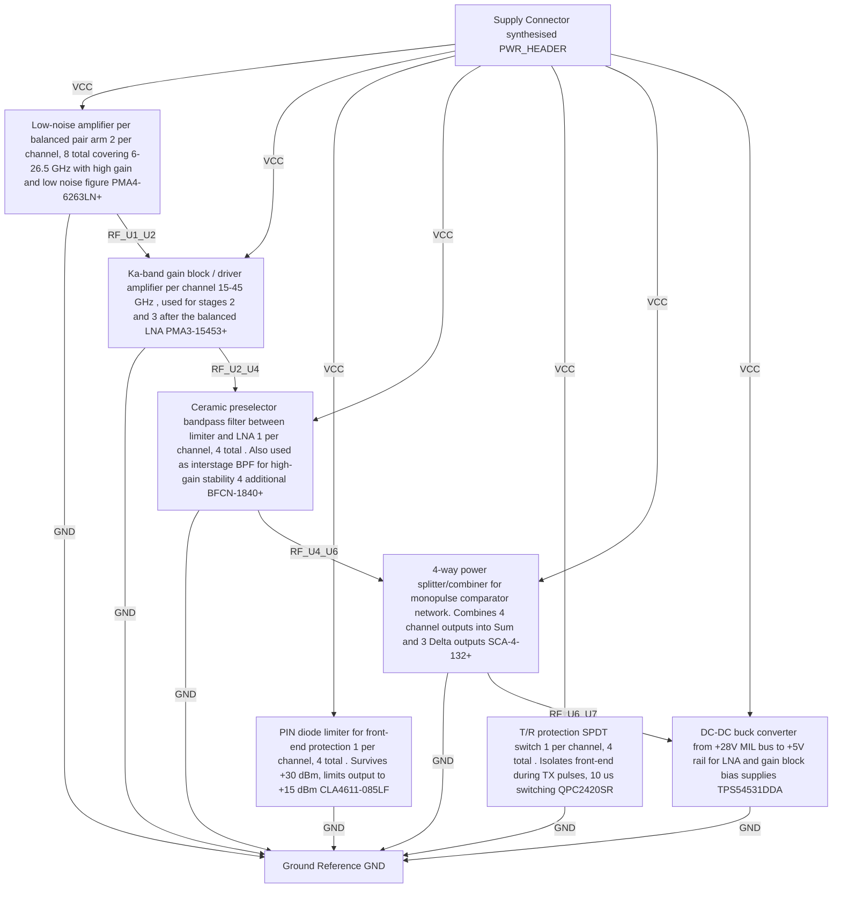

# Logical Netlist
## yhh

## Block Diagram

## Component Instances

| Ref | Part Number | Component |
|---|---|---|
| U1 | PMA4-6263LN+ | Low-noise amplifier per balanced pair arm (2 per channel, 8 total) covering 6-26.5 GHz with high gain and low noise figure |
| U2 | PMA3-15453+ | Ka-band gain block / driver amplifier per channel (15-45 GHz), used for stages 2 and 3 after the balanced LNA |
| U3 | CLA4611-085LF | PIN diode limiter for front-end protection (1 per channel, 4 total). Survives +30 dBm, limits output to +15 dBm |
| U4 | BFCN-1840+ | Ceramic preselector bandpass filter between limiter and LNA (1 per channel, 4 total). Also used as interstage BPF for high-gain stability (4 additional) |
| U5 | QPC2420SR | T/R protection SPDT switch (1 per channel, 4 total). Isolates front-end during TX pulses, < 10 us switching |
| U6 | SCA-4-132+ | 4-way power splitter/combiner for monopulse comparator network. Combines 4 channel outputs into Sum and 3 Delta outputs |
| U7 | TPS54531DDA | DC-DC buck converter from +28V MIL bus to +5V rail for LNA and gain block bias supplies |
| J_PWR | PWR_HEADER | Supply Connector (synthesised) |
| GND_STAR | GND | Ground Reference |

## Pin-to-Pin Connections

| Net | From | Pin | To | Pin | Type |
|---|---|---|---|---|---|
| VCC | J_PWR | 1 | U1 | VCC | power |
| VCC | J_PWR | 1 | U2 | VCC | power |
| VCC | J_PWR | 1 | U3 | VCC | power |
| VCC | J_PWR | 1 | U4 | VCC | power |
| VCC | J_PWR | 1 | U5 | VCC | power |
| VCC | J_PWR | 1 | U6 | VCC | power |
| VCC | J_PWR | 1 | U7 | VCC | power |
| GND | U1 | GND | GND_STAR | 1 | ground |
| GND | U2 | GND | GND_STAR | 1 | ground |
| GND | U3 | GND | GND_STAR | 1 | ground |
| GND | U4 | GND | GND_STAR | 1 | ground |
| GND | U5 | GND | GND_STAR | 1 | ground |
| GND | U6 | GND | GND_STAR | 1 | ground |
| GND | U7 | GND | GND_STAR | 1 | ground |
| RF_U1_U2 | U1 | OUT | U2 | IN | rf |
| RF_U2_U4 | U2 | OUT | U4 | IN | rf |
| RF_U4_U6 | U4 | OUT | U6 | IN | rf |
| RF_U6_U7 | U6 | OUT | U7 | IN | rf |

## Net Connection List

| Net Name | Reference Designator - Pin No. |
|----------|-------------------------------|
| GND | U1 - GND,  GND_STAR - 1,  U2 - GND,  U3 - GND,  U4 - GND,  U5 - GND,  U6 - GND,  U7 - GND |
| RF_U1_U2 | U1 - OUT,  U2 - IN |
| RF_U2_U4 | U2 - OUT,  U4 - IN |
| RF_U4_U6 | U4 - OUT,  U6 - IN |
| RF_U6_U7 | U6 - OUT,  U7 - IN |
| VCC | J_PWR - 1,  U1 - VCC,  U2 - VCC,  U3 - VCC,  U4 - VCC,  U5 - VCC,  U6 - VCC,  U7 - VCC |

## Validation Notes

- INFO: Auto-extracted 9 components from P1 BOM
- INFO: Generated 18 connections based on signal chain analysis
- INFO: Power nets: VCC
- INFO: Ground nets: AGND, GND
- WARNING: No power regulators detected in BOM
- WARNING: No FPGA/processor detected in BOM