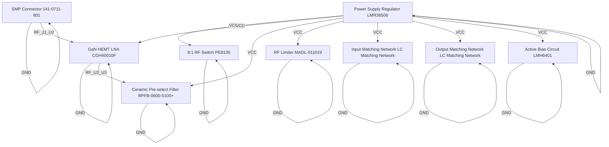

# Logical Netlist
## gvng

## Block Diagram

## Component Instances

| Ref | Part Number | Component |
|---|---|---|
| U1 | PE8135 | 8:1 RF Switch |
| U2 | CGH40010F | GaN HEMT LNA |
| U3 | BPFB-0600-5100+ | Ceramic Pre-select Filter |
| U4 | MADL-011019 | RF Limiter |
| U5 | LC Matching Network | Input Matching Network |
| U6 | LC Matching Network | Output Matching Network |
| J1 | 141-0711-801 | SMP Connector |
| U7 | LMH6401 | Active Bias Circuit |
| U8 | LMR36506 | Power Supply Regulator |

## Pin-to-Pin Connections

| Net | From | Pin | To | Pin | Type |
|---|---|---|---|---|---|
| VCC | U8 | OUT | U1 | VCC | power |
| VCC | U8 | OUT | U2 | VCC | power |
| VCC | U8 | OUT | U3 | VCC | power |
| VCC | U8 | OUT | U4 | VCC | power |
| VCC | U8 | OUT | U5 | VCC | power |
| VCC | U8 | OUT | U6 | VCC | power |
| VCC | U8 | OUT | U7 | VCC | power |
| GND | U1 | GND | U1 | GND | ground |
| GND | U2 | GND | U2 | GND | ground |
| GND | U3 | GND | U3 | GND | ground |
| GND | U4 | GND | U4 | GND | ground |
| GND | U5 | GND | U5 | GND | ground |
| GND | U6 | GND | U6 | GND | ground |
| GND | J1 | GND | J1 | GND | ground |
| GND | U7 | GND | U7 | GND | ground |
| GND | U8 | GND | U8 | GND | ground |
| RF_J1_U2 | J1 | OUT | U2 | IN | rf |
| RF_U2_U3 | U2 | OUT | U3 | IN | rf |

## Net Connection List

| Net Name | Reference Designator - Pin No. |
|----------|-------------------------------|
| GND | U1 - GND,  U2 - GND,  U3 - GND,  U4 - GND,  U5 - GND,  U6 - GND,  J1 - GND,  U7 - GND,  U8 - GND |
| RF_J1_U2 | J1 - OUT,  U2 - IN |
| RF_U2_U3 | U2 - OUT,  U3 - IN |
| VCC | U8 - OUT,  U1 - VCC,  U2 - VCC,  U3 - VCC,  U4 - VCC,  U5 - VCC,  U6 - VCC,  U7 - VCC |

## Validation Notes

- INFO: Auto-extracted 9 components from P1 BOM
- INFO: Generated 18 connections based on signal chain analysis
- INFO: Power nets: VCC
- INFO: Ground nets: AGND, GND
- WARNING: No FPGA/processor detected in BOM