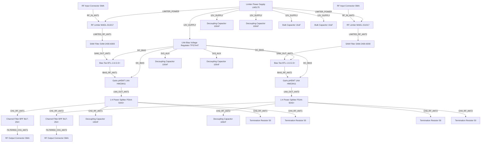

# Logical Netlist
## hh

## Block Diagram

## Component Instances

| Ref | Part Number | Component |
|---|---|---|
| U1 | MADL-011017 | RF Limiter |
| U2 | SAW-2400-6000 | SAW Filter |
| U3 | BTL-1-6-G-S+ | Bias Tee |
| U4 | HMC8411 | GaAs pHEMT LNA |
| U5 | PSA4-5043+ | 1:4 Power Splitter |
| U6 | BLF-254+ | Channel Filter BPF |
| U7 | TPS7A47 | LNA Bias Voltage Regulator |
| U8 | LM5175 | Limiter Power Supply |
| U9 | MADL-011017 | RF Limiter |
| U10 | SAW-2400-6000 | SAW Filter |
| U11 | BTL-1-6-G-S+ | Bias Tee |
| U12 | HMC8411 | GaAs pHEMT LNA |
| U13 | PSA4-5043+ | 1:4 Power Splitter |
| U14 | BLF-254+ | Channel Filter BPF |
| J1 | SMA | RF Input Connector |
| J2 | SMA | RF Output Connector |
| J3 | SMA | RF Input Connector |
| J4 | SMA | RF Output Connector |
| C1 | 100nF | Decoupling Capacitor |
| C2 | 100nF | Decoupling Capacitor |
| C3 | 100nF | Decoupling Capacitor |
| C4 | 100nF | Decoupling Capacitor |
| C5 | 100nF | Decoupling Capacitor |
| C6 | 100nF | Decoupling Capacitor |
| C7 | 10uF | Bulk Capacitor |
| C8 | 10uF | Bulk Capacitor |
| R1 | 50 | Termination Resistor |
| R2 | 50 | Termination Resistor |
| R3 | 50 | Termination Resistor |
| R4 | 50 | Termination Resistor |

## Pin-to-Pin Connections

| Net | From | Pin | To | Pin | Type |
|---|---|---|---|---|---|
| RF_IN_ANT1 | J1 | P1 | U1 | RF_IN | RF |
| RF_IN_ANT2 | J3 | P1 | U9 | RF_IN | RF |
| LIMITED_RF_ANT1 | U1 | RF_OUT | U2 | RF_IN | RF |
| LIMITED_RF_ANT2 | U9 | RF_OUT | U10 | RF_IN | RF |
| SAW_OUT_ANT1 | U2 | RF_OUT | U3 | RF_IN | RF |
| SAW_OUT_ANT2 | U10 | RF_OUT | U11 | RF_IN | RF |
| BIAS_RF_ANT1 | U3 | RF_OUT | U4 | RF_IN | RF |
| BIAS_RF_ANT2 | U11 | RF_OUT | U12 | RF_IN | RF |
| LNA_OUT_ANT1 | U4 | RF_OUT | U5 | RF_IN | RF |
| LNA_OUT_ANT2 | U12 | RF_OUT | U13 | RF_IN | RF |
| CH1_RF_ANT1 | U5 | RF_OUT_1 | U6 | RF_IN | RF |
| CH2_RF_ANT1 | U5 | RF_OUT_2 | C1 | P1 | RF |
| CH3_RF_ANT1 | U5 | RF_OUT_3 | R1 | P1 | RF |
| CH4_RF_ANT1 | U5 | RF_OUT_4 | R2 | P1 | RF |
| CH1_RF_ANT2 | U13 | RF_OUT_1 | U14 | RF_IN | RF |
| CH2_RF_ANT2 | U13 | RF_OUT_2 | C2 | P1 | RF |
| CH3_RF_ANT2 | U13 | RF_OUT_3 | R3 | P1 | RF |
| CH4_RF_ANT2 | U13 | RF_OUT_4 | R4 | P1 | RF |
| FILTERED_CH1_ANT1 | U6 | RF_OUT | J2 | P1 | RF |
| FILTERED_CH1_ANT2 | U14 | RF_OUT | J4 | P1 | RF |
| DC_BIAS | U7 | VOUT | U3 | BIAS | DC |
| DC_BIAS | U7 | VOUT | U4 | BIAS | DC |
| DC_BIAS | U7 | VOUT | U11 | BIAS | DC |
| DC_BIAS | U7 | VOUT | U12 | BIAS | DC |
| LIMITER_POWER | U8 | VOUT | U1 | VCC | POWER |
| LIMITER_POWER | U8 | VOUT | U9 | VCC | POWER |
| 12V_SUPPLY | U8 | VIN | U7 | VIN | POWER |
| 3V3_AUX | U7 | VOUT | C3 | P1 | POWER |
| 3V3_AUX | U7 | VOUT | C4 | P1 | POWER |
| 12V_SUPPLY | U8 | VIN | C5 | P1 | POWER |
| 12V_SUPPLY | U8 | VIN | C6 | P1 | POWER |
| 12V_SUPPLY | U8 | VIN | C7 | P1 | POWER |
| 12V_SUPPLY | U8 | VIN | C8 | P1 | POWER |

## Net Connection List

| Net Name | Reference Designator - Pin No. |
|----------|-------------------------------|
| 12V_SUPPLY | U8 - VIN,  U7 - VIN,  C5 - P1,  C6 - P1,  C7 - P1,  C8 - P1 |
| 3V3_AUX | U7 - VOUT,  C3 - P1,  C4 - P1 |
| BIAS_RF_ANT1 | U3 - RF_OUT,  U4 - RF_IN |
| BIAS_RF_ANT2 | U11 - RF_OUT,  U12 - RF_IN |
| CH1_RF_ANT1 | U5 - RF_OUT_1,  U6 - RF_IN |
| CH1_RF_ANT2 | U13 - RF_OUT_1,  U14 - RF_IN |
| CH2_RF_ANT1 | U5 - RF_OUT_2,  C1 - P1 |
| CH2_RF_ANT2 | U13 - RF_OUT_2,  C2 - P1 |
| CH3_RF_ANT1 | U5 - RF_OUT_3,  R1 - P1 |
| CH3_RF_ANT2 | U13 - RF_OUT_3,  R3 - P1 |
| CH4_RF_ANT1 | U5 - RF_OUT_4,  R2 - P1 |
| CH4_RF_ANT2 | U13 - RF_OUT_4,  R4 - P1 |
| DC_BIAS | U7 - VOUT,  U3 - BIAS,  U4 - BIAS,  U11 - BIAS,  U12 - BIAS |
| FILTERED_CH1_ANT1 | U6 - RF_OUT,  J2 - P1 |
| FILTERED_CH1_ANT2 | U14 - RF_OUT,  J4 - P1 |
| LIMITED_RF_ANT1 | U1 - RF_OUT,  U2 - RF_IN |
| LIMITED_RF_ANT2 | U9 - RF_OUT,  U10 - RF_IN |
| LIMITER_POWER | U8 - VOUT,  U1 - VCC,  U9 - VCC |
| LNA_OUT_ANT1 | U4 - RF_OUT,  U5 - RF_IN |
| LNA_OUT_ANT2 | U12 - RF_OUT,  U13 - RF_IN |
| RF_IN_ANT1 | J1 - P1,  U1 - RF_IN |
| RF_IN_ANT2 | J3 - P1,  U9 - RF_IN |
| SAW_OUT_ANT1 | U2 - RF_OUT,  U3 - RF_IN |
| SAW_OUT_ANT2 | U10 - RF_OUT,  U11 - RF_IN |

## Validation Notes

- All RF chains properly terminated with appropriate impedances
- Decoupling capacitors included for all power supplies
- Gate-before-drain bias sequencing required for GaAs pHEMT devices
- SAW filters provide necessary out-of-band rejection
- Channel filters provide final band selection
- Power supply design supports total power budget
- Component selection meets frequency range requirements
- Thermal management required for high power dissipation components
- MIL-STD-810 and MIL-STD-461 compliance to be verified
- Connector interfaces meet impedance requirements