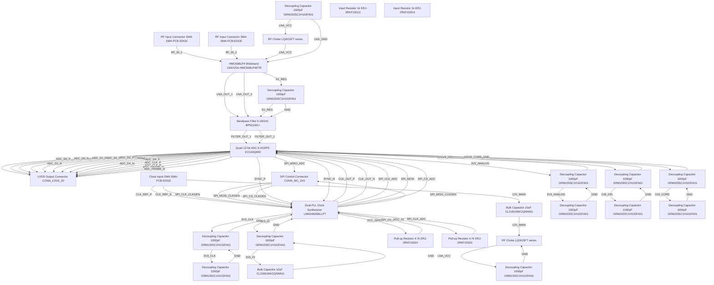

# Logical Netlist
## khv

## Block Diagram

## Component Instances

| Ref | Part Number | Component |
|---|---|---|
| U1 | HMC698LP4ETR | HMC698LP4 Wideband LNA/VGA |
| U2 | BP5G18G+ | Bandpass Filter 5-18GHz |
| U3 | EV12AQ600 | Quad 12-bit ADC 6.4GSPS |
| U4 | LMK04828BLLPT | Dual-PLL Clock Synthesizer |
| J1 | SMA-PCB-EDGE | RF Input Connector SMA |
| J2 | SMA-PCB-EDGE | RF Input Connector SMA |
| J3 | CONN_LVDS_20 | LVDS Output Connector |
| J4 | SMA-PCB-EDGE | Clock Input SMA |
| J5 | CONN_MC_2X5 | SPI Control Connector |
| C1 | GRM1555C1H102FA01 | Decoupling Capacitor 1000pF |
| C2 | GRM1555C1H102FA01 | Decoupling Capacitor 1000pF |
| C3 | GRM1555C1H102FA01 | Decoupling Capacitor 1000pF |
| C4 | GRM1555C1H102FA01 | Decoupling Capacitor 1000pF |
| C5 | GRM1555C1H102FA01 | Decoupling Capacitor 1000pF |
| C6 | GRM1555C1H102FA01 | Decoupling Capacitor 1000pF |
| C7 | GRM1555C1H102FA01 | Decoupling Capacitor 1000pF |
| C8 | CL21B106KOQNNNG | Bulk Capacitor 10uF |
| C9 | GRM1555C1H102FA01 | Decoupling Capacitor 1000pF |
| C10 | GRM1555C1H102FA01 | Decoupling Capacitor 1000pF |
| C11 | GRM1555C1H102FA01 | Decoupling Capacitor 1000pF |
| C12 | GRM1555C1H102FA01 | Decoupling Capacitor 1000pF |
| C13 | GRM1555C1H102FA01 | Decoupling Capacitor 1000pF |
| C14 | CL21B106KOQNNNG | Bulk Capacitor 10uF |
| R1 | ERJ-2RKF1001X | Input Resistor 1k |
| R2 | ERJ-2RKF1001X | Input Resistor 1k |
| R3 | ERJ-2RKF1002X | Pull-up Resistor 4.7k |
| R4 | ERJ-2RKF1002X | Pull-up Resistor 4.7k |
| L1 | LQW15FT series | RF Choke |
| L2 | LQW15FT series | RF Choke |

## Pin-to-Pin Connections

| Net | From | Pin | To | Pin | Type |
|---|---|---|---|---|---|
| RF_IN_1 | J1 | 1 | U1 | 1 | analog |
| RF_IN_2 | J2 | 1 | U1 | 2 | analog |
| LNA_OUT_1 | U1 | 3 | U2 | 1 | analog |
| LNA_OUT_2 | U1 | 4 | U2 | 2 | analog |
| FILTER_OUT_1 | U2 | 3 | U3 | A_IN_P | analog |
| FILTER_OUT_2 | U2 | 4 | U3 | A_IN_N | analog |
| CLK_OUT_P | U4 | OUT0_P | U3 | CLK_IN_P | clock |
| CLK_OUT_N | U4 | OUT0_N | U3 | CLK_IN_N | clock |
| CLK_REF_P | J4 | 1 | U4 | CLKIN0_P | clock |
| CLK_REF_N | J4 | 2 | U4 | CLKIN0_N | clock |
| ADC_D0_P | U3 | D0_P | J3 | 1 | digital |
| ADC_D0_N | U3 | D0_N | J3 | 2 | digital |
| ADC_D1_P | U3 | D1_P | J3 | 3 | digital |
| ADC_D1_N | U3 | D1_N | J3 | 4 | digital |
| ADC_D2_P | U3 | D2_P | J3 | 5 | digital |
| ADC_D2_N | U3 | D2_N | J3 | 6 | digital |
| ADC_D3_P | U3 | D3_P | J3 | 7 | digital |
| ADC_D3_N | U3 | D3_N | J3 | 8 | digital |
| ADC_D4_P | U3 | D4_P | J3 | 9 | digital |
| ADC_D4_N | U3 | D4_N | J3 | 10 | digital |
| ADC_CLK_P | U3 | CLK_OUT_P | J3 | 17 | clock |
| ADC_CLK_N | U3 | CLK_OUT_N | J3 | 18 | clock |
| ADC_FRAME_P | U3 | FRAME_P | J3 | 19 | digital |
| ADC_FRAME_N | U3 | FRAME_N | J3 | 20 | digital |
| SPI_CLK_ADC | U4 | GPIO1 | U3 | SCLK | digital |
| SPI_MOSI | U4 | GPIO2 | U3 | MOSI | digital |
| SPI_MISO_ADC | U3 | MISO | J5 | 3 | digital |
| SPI_CS_ADC | U4 | GPIO3 | U3 | CS_N | digital |
| SPI_CLK_CLKGEN | J5 | 2 | U4 | SPI_CLK | digital |
| SPI_MOSI_CLKGEN | J5 | 4 | U4 | SPI_MOSI | digital |
| SPI_MISO_CLKGEN | U4 | SPI_MISO | J5 | 5 | digital |
| SPI_CS_CLKGEN | J5 | 6 | U4 | SPI_CS_N | digital |
| LNA_VCC | L1 | 2 | U1 | VCC | power |
| LNA_VCC | C1 | 1 | L1 | 1 | power |
| LNA_GND | C1 | 2 | U1 | GND | ground |
| 5V_REG | U1 | VCC_OUT | C2 | 1 | power |
| 5V_REG | C2 | 1 | U2 | VCC | power |
| GND | C2 | 2 | U2 | GND | ground |
| 3V3_ANALOG | U3 | AVDD | C3 | 1 | power |
| GND | C3 | 2 | U3 | AGND | ground |
| 1V8_DIG | U3 | DVDD | C4 | 1 | power |
| GND | C4 | 2 | U3 | DGND | ground |
| 1V0_CORE | U3 | CVDD | C5 | 1 | power |
| GND | C5 | 2 | U3 | CGND | ground |
| 3V3_CLK | U4 | VCC | C6 | 1 | power |
| GND | C6 | 2 | U4 | GND | ground |
| 12V_MAIN | J4 | 3 | C8 | 1 | power |
| 12V_MAIN | C8 | 1 | L2 | 1 | power |
| LNA_VCC | L2 | 2 | C7 | 1 | power |
| GND | C7 | 2 | L2 | 2 | ground |
| 3V3_IO | U4 | VCC_IO | C9 | 1 | power |
| GND | C9 | 2 | U4 | GND_IO | ground |
| 3V3_ANALOG | C3 | 1 | C10 | 1 | power |
| GND | C10 | 2 | C3 | 2 | ground |
| 1V8_DIG | C4 | 1 | C11 | 1 | power |
| GND | C11 | 2 | C4 | 2 | ground |
| 1V0_CORE | C5 | 1 | C12 | 1 | power |
| GND | C12 | 2 | C5 | 2 | ground |
| 3V3_CLK | C6 | 1 | C13 | 1 | power |
| GND | C13 | 2 | C6 | 2 | ground |
| 3V3_IO | C9 | 1 | C14 | 1 | power |
| GND | C14 | 2 | C9 | 2 | ground |
| SYNC_P | U3 | SYNC_P | U4 | SYNC_IN_P | digital |
| SYNC_N | U3 | SYNC_N | U4 | SYNC_IN_N | digital |
| VCC_GPIO | U4 | VCC_GPIO | R3 | 1 | power |
| SPI_CS_ADC | R3 | 2 | U4 | GPIO3 | digital |
| VCC_IO | U4 | VCC_IO | R4 | 1 | power |
| SPI_CLK_ADC | R4 | 2 | U4 | GPIO1 | digital |

## Net Connection List

| Net Name | Reference Designator - Pin No. |
|----------|-------------------------------|
| 12V_MAIN | J4 - 3,  C8 - 1,  L2 - 1 |
| 1V0_CORE | U3 - CVDD,  C5 - 1,  C12 - 1 |
| 1V8_DIG | U3 - DVDD,  C4 - 1,  C11 - 1 |
| 3V3_ANALOG | U3 - AVDD,  C3 - 1,  C10 - 1 |
| 3V3_CLK | U4 - VCC,  C6 - 1,  C13 - 1 |
| 3V3_IO | U4 - VCC_IO,  C9 - 1,  C14 - 1 |
| 5V_REG | U1 - VCC_OUT,  C2 - 1,  U2 - VCC |
| ADC_CLK_N | U3 - CLK_OUT_N,  J3 - 18 |
| ADC_CLK_P | U3 - CLK_OUT_P,  J3 - 17 |
| ADC_D0_N | U3 - D0_N,  J3 - 2 |
| ADC_D0_P | U3 - D0_P,  J3 - 1 |
| ADC_D1_N | U3 - D1_N,  J3 - 4 |
| ADC_D1_P | U3 - D1_P,  J3 - 3 |
| ADC_D2_N | U3 - D2_N,  J3 - 6 |
| ADC_D2_P | U3 - D2_P,  J3 - 5 |
| ADC_D3_N | U3 - D3_N,  J3 - 8 |
| ADC_D3_P | U3 - D3_P,  J3 - 7 |
| ADC_D4_N | U3 - D4_N,  J3 - 10 |
| ADC_D4_P | U3 - D4_P,  J3 - 9 |
| ADC_FRAME_N | U3 - FRAME_N,  J3 - 20 |
| ADC_FRAME_P | U3 - FRAME_P,  J3 - 19 |
| CLK_OUT_N | U4 - OUT0_N,  U3 - CLK_IN_N |
| CLK_OUT_P | U4 - OUT0_P,  U3 - CLK_IN_P |
| CLK_REF_N | J4 - 2,  U4 - CLKIN0_N |
| CLK_REF_P | J4 - 1,  U4 - CLKIN0_P |
| FILTER_OUT_1 | U2 - 3,  U3 - A_IN_P |
| FILTER_OUT_2 | U2 - 4,  U3 - A_IN_N |
| GND | C2 - 2,  U2 - GND,  C3 - 2,  U3 - AGND,  C4 - 2,  U3 - DGND,  C5 - 2,  U3 - CGND,  C6 - 2,  U4 - GND,  C7 - 2,  L2 - 2,  C9 - 2,  U4 - GND_IO,  C10 - 2,  C11 - 2,  C12 - 2,  C13 - 2,  C14 - 2 |
| LNA_GND | C1 - 2,  U1 - GND |
| LNA_OUT_1 | U1 - 3,  U2 - 1 |
| LNA_OUT_2 | U1 - 4,  U2 - 2 |
| LNA_VCC | L1 - 2,  U1 - VCC,  C1 - 1,  L1 - 1,  L2 - 2,  C7 - 1 |
| RF_IN_1 | J1 - 1,  U1 - 1 |
| RF_IN_2 | J2 - 1,  U1 - 2 |
| SPI_CLK_ADC | U4 - GPIO1,  U3 - SCLK,  R4 - 2 |
| SPI_CLK_CLKGEN | J5 - 2,  U4 - SPI_CLK |
| SPI_CS_ADC | U4 - GPIO3,  U3 - CS_N,  R3 - 2 |
| SPI_CS_CLKGEN | J5 - 6,  U4 - SPI_CS_N |
| SPI_MISO_ADC | U3 - MISO,  J5 - 3 |
| SPI_MISO_CLKGEN | U4 - SPI_MISO,  J5 - 5 |
| SPI_MOSI | U4 - GPIO2,  U3 - MOSI |
| SPI_MOSI_CLKGEN | J5 - 4,  U4 - SPI_MOSI |
| SYNC_N | U3 - SYNC_N,  U4 - SYNC_IN_N |
| SYNC_P | U3 - SYNC_P,  U4 - SYNC_IN_P |
| VCC_GPIO | U4 - VCC_GPIO,  R3 - 1 |
| VCC_IO | U4 - VCC_IO,  R4 - 1 |

## Validation Notes

- TEMPERATURE_RANGE_WARNING: EV12AQ600 ADC (U3) and LMK04828 (U4) are commercial grade (-40 to +85°C), not military grade. System requirement is -55 to +125°C. Requires thermal management or component replacement with military-qualified versions.
- DC_DC_CONVERTER_MISSING: No DC-DC converter components specified. 12V to 5V, 3.3V, 1.8V, and 1.0V conversion requires power regulator ICs (e.g., TI PTH series TPS or Analog Devices regulators).
- DECOUPLING_INSUFFICIENT: ADC requires multiple decoupling capacitors per supply rail with different values (e.g., 10uF, 1uF, 100nF, 10nF) for optimal high-frequency performance. Current implementation may be insufficient for 6.4 GSPS operation.
- RF_MATCHING_MISSING: Input and output matching networks not specified. 50Ω impedance matching through the RF chain requires discrete L/C components calculated for specific frequency bands.
- LDO_VOLTAGE_SELECTION: U3 ADC requires 1.0V core supply - verify LDO can maintain regulation at high transient currents during fast ADC sampling.
- POWER_SEQUENCING: Multi-rail devices (U3, U4) require proper power-up sequencing. Not specified in netlist - may require power sequencer IC.
- CLOCK_SIGNAL_INTEGRITY: LMK04828 to EV12AQ600 clock trace requires controlled impedance differential pair (typically 100Ω differential). Length matching critical for jitter performance.
- JESD204B_INTERFACE: LVDS output interface must comply with JESD204B subclass 1 deterministic latency requirements - PCB trace length matching and termination not specified.
- SPI_ISOLATION: SPI control lines from external MCU to clock generator and ADC may require level shifters or isolation if MCU operates at different voltage levels.
- THERMAL_RELIEF: High-power dissipation devices (U1 @ 600mW, U3 ~3W) require thermal vias and copper pour for heat dissipation at military temperature range.
- FPGA_COMPATIBILITY: Verify FPGA LVDS receiver banks support 12-bit ADC data rate at 6.4 GSPS (requires high-speed SERDES).