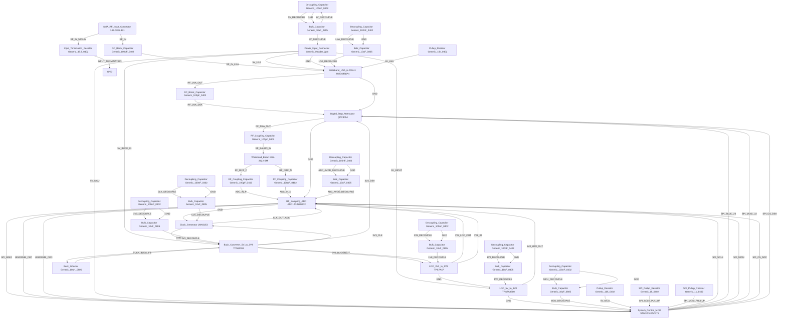

# Logical Netlist
## Test

## Block Diagram

## Component Instances

| Ref | Part Number | Component |
|---|---|---|
| J1 | 142-0701-851 | SMA_RF_Input_Connector |
| U1 | HMC698LP4 | Wideband_LNA_6-20GHz |
| U2 | QPC9054 | Digital_Step_Attenuator |
| T1 | EGL-2422-SM | Wideband_Balun |
| U3 | ADC12DJ5200RF | RF_Sampling_ADC |
| U4 | LMK61E2 | Clock_Generator |
| U5 | TPS62913 | Buck_Converter_5V_to_3V3 |
| U6 | TPS7A47 | LDO_3V3_to_1V8 |
| U7 | TPS7A8300 | LDO_5V_to_1V0 |
| U8 | STM32F407VGT6 | System_Control_MCU |
| C1 | Generic_100pF_0402 | DC_Block_Capacitor |
| C2 | Generic_100pF_0402 | DC_Block_Capacitor |
| C3 | Generic_100pF_0402 | RF_Coupling_Capacitor |
| C4 | Generic_100pF_0402 | RF_Coupling_Capacitor |
| C5 | Generic_100pF_0402 | RF_Coupling_Capacitor |
| C6 | Generic_100nF_0402 | Decoupling_Capacitor |
| C7 | Generic_10uF_0805 | Bulk_Capacitor |
| C8 | Generic_100nF_0402 | Decoupling_Capacitor |
| C9 | Generic_10uF_0805 | Bulk_Capacitor |
| C10 | Generic_100nF_0402 | Decoupling_Capacitor |
| C11 | Generic_10uF_0805 | Bulk_Capacitor |
| C12 | Generic_100nF_0402 | Decoupling_Capacitor |
| C13 | Generic_10uF_0805 | Bulk_Capacitor |
| C14 | Generic_100nF_0402 | Decoupling_Capacitor |
| C15 | Generic_10uF_0805 | Bulk_Capacitor |
| C16 | Generic_100nF_0402 | Decoupling_Capacitor |
| C17 | Generic_10uF_0805 | Bulk_Capacitor |
| C18 | Generic_100nF_0402 | Decoupling_Capacitor |
| C19 | Generic_10uF_0805 | Bulk_Capacitor |
| C20 | Generic_100nF_0402 | Decoupling_Capacitor |
| C21 | Generic_10uF_0805 | Bulk_Capacitor |
| L1 | Generic_10uH_0805 | Buck_Inductor |
| R1 | Generic_10k_0402 | Pullup_Resistor |
| R2 | Generic_10k_0402 | Pullup_Resistor |
| R3 | Generic_1k_0402 | SPI_Pullup_Resistor |
| R4 | Generic_1k_0402 | SPI_Pullup_Resistor |
| R5 | Generic_49.9_0402 | Input_Termination_Resistor |
| J2 | Generic_Header_2pin | Power_Input_Connector |

## Pin-to-Pin Connections

| Net | From | Pin | To | Pin | Type |
|---|---|---|---|---|---|
| RF_IN | J1 | 1 | C1 | 1 | RF |
| RF_IN_LNA | C1 | 2 | U1 | RF_IN | RF |
| RF_LNA_OUT | U1 | RF_OUT | C2 | 1 | RF |
| RF_LNA_DSA | C2 | 2 | U2 | RF_IN | RF |
| RF_DSA_OUT | U2 | RF_OUT | C3 | 1 | RF |
| RF_BALUN_IN | C3 | 2 | T1 | PIN_UNBAL | RF |
| RF_DIFF_P | T1 | PIN_BAL+ | C4 | 1 | differential |
| RF_DIFF_N | T1 | PIN_BAL- | C5 | 1 | differential |
| ADC_IN_P | C4 | 2 | U3 | AIN_P | differential |
| ADC_IN_N | C5 | 2 | U3 | AIN_N | differential |
| CLK_OUT_ADC | U4 | CLK_OUT | U3 | CLK_IN | clock |
| SPI_SCLK | U8 | PA5 | U3 | SCLK | digital |
| SPI_SCLK_U2 | U8 | PA5 | U2 | SCLK | digital |
| SPI_MOSI | U8 | PA7 | U3 | SDIO | digital |
| SPI_MOSI_U2 | U8 | PA7 | U2 | MOSI | digital |
| SPI_MISO | U3 | SDIO | U8 | PA6 | digital |
| SPI_CS_ADC | U8 | PA4 | U3 | CS_N | digital |
| SPI_CS_DSA | U8 | PB0 | U2 | CS_N | digital |
| JESD204B_CKP | U3 | CXP | U8 | PC10 | differential |
| JESD204B_CKN | U3 | CXN | U8 | PC11 | differential |
| 5V_INPUT | J2 | 1 | U7 | VIN | power |
| 5V_BUCK_IN | J2 | 1 | U5 | VIN | power |
| 5V_LNA | J2 | 1 | U1 | VCC | power |
| 5V_MCU | J2 | 1 | U8 | VDD | power |
| 3V3_BUCK_OUT | U5 | VOUT | U6 | VIN | power |
| 3V3_DSA | U5 | VOUT | U2 | VDD | power |
| 3V3_CLK | U5 | VOUT | U4 | VCC | power |
| 1V8_LDO_OUT | U6 | VOUT | U3 | AVDD_1V8 | power |
| 1V8_IO | U6 | VOUT | U3 | DVDD_1V8 | power |
| 1V0_LDO_OUT | U7 | VOUT | U3 | CVDD_1V0 | power |
| GND | J2 | 2 | U1 | GND | ground |
| GND | U1 | GND | U2 | GND | ground |
| GND | U2 | GND | U3 |  | ground |
| GND | U3 | GND | U4 | GND | ground |
| GND | U4 | GND | U5 | GND | ground |
| GND | U5 | GND | U6 | GND | ground |
| GND | U6 | GND | U7 | GND | ground |
| GND | U7 | GND | U8 | VSS | ground |
| 5V_DECOUPLE | C6 | 1 | C7 | 1 | power |
| 5V_DECOUPLE | C7 | 1 | J2 | 1 | power |
| GND | C6 | 2 | C7 | 2 | ground |
| 5V_DECOUPLE | C7 | 2 | C6 | 2 | power |
| 3V3_DECOUPLE | C8 | 1 | C9 | 1 | power |
| 3V3_DECOUPLE | C9 | 1 | U5 | VOUT | power |
| GND | C8 | 2 | C9 | 2 | ground |
| 1V8_DECOUPLE | C10 | 1 | C11 | 1 | power |
| 1V8_DECOUPLE | C11 | 1 | U6 | VOUT | power |
| GND | C10 | 2 | C11 | 2 | ground |
| 1V0_DECOUPLE | C12 | 1 | C13 | 1 | power |
| 1V0_DECOUPLE | C13 | 1 | U7 | VOUT | power |
| GND | C12 | 2 | C13 | 2 | ground |
| LNA_DECOUPLE | C14 | 1 | C15 | 1 | power |
| LNA_DECOUPLE | C15 | 1 | U1 | VCC | power |
| GND | C14 | 2 | C15 | 2 | ground |
| ADC_AVDD_DECOUPLE | C16 | 1 | C17 | 1 | power |
| ADC_AVDD_DECOUPLE | C17 | 1 | U3 | AVDD_1V8 | power |
| GND | C16 | 2 | C17 | 2 | ground |
| CLK_DECOUPLE | C18 | 1 | C19 | 1 | power |
| CLK_DECOUPLE | C19 | 1 | U4 | VCC | power |
| GND | C18 | 2 | C19 | 2 | ground |
| MCU_DECOUPLE | C20 | 1 | C21 | 1 | power |
| MCU_DECOUPLE | C21 | 1 | U8 | VDD | power |
| GND | C20 | 2 | C21 | 2 | ground |
| BUCK_SW | U5 | SW | L1 | 1 | power |
| BUCK_FB | L1 | 2 | U5 | FB | analog |
| 5V_LNA | R1 | 1 | U1 | VCC | power |
| 5V_MCU | R2 | 1 | U8 | VDD | power |
| SPI_SCLK_PULLUP | R3 | 2 | U8 | PA5 | digital |
| SPI_MOSI_PULLUP | R4 | 2 | U8 | PA7 | digital |
| RF_IN_50OHM | J1 | 1 | R5 | 1 | RF |
| INPUT_TERMINATION | R5 | 2 | GND | GND | ground |

## Net Connection List

| Net Name | Reference Designator - Pin No. |
|----------|-------------------------------|
| 1V0_DECOUPLE | C12 - 1,  C13 - 1,  U7 - VOUT |
| 1V0_LDO_OUT | U7 - VOUT,  U3 - CVDD_1V0 |
| 1V8_DECOUPLE | C10 - 1,  C11 - 1,  U6 - VOUT |
| 1V8_IO | U6 - VOUT,  U3 - DVDD_1V8 |
| 1V8_LDO_OUT | U6 - VOUT,  U3 - AVDD_1V8 |
| 3V3_BUCK_OUT | U5 - VOUT,  U6 - VIN |
| 3V3_CLK | U5 - VOUT,  U4 - VCC |
| 3V3_DECOUPLE | C8 - 1,  C9 - 1,  U5 - VOUT |
| 3V3_DSA | U5 - VOUT,  U2 - VDD |
| 5V_BUCK_IN | J2 - 1,  U5 - VIN |
| 5V_DECOUPLE | C6 - 1,  C7 - 1,  J2 - 1,  C7 - 2,  C6 - 2 |
| 5V_INPUT | J2 - 1,  U7 - VIN |
| 5V_LNA | J2 - 1,  U1 - VCC,  R1 - 1 |
| 5V_MCU | J2 - 1,  U8 - VDD,  R2 - 1 |
| ADC_AVDD_DECOUPLE | C16 - 1,  C17 - 1,  U3 - AVDD_1V8 |
| ADC_IN_N | C5 - 2,  U3 - AIN_N |
| ADC_IN_P | C4 - 2,  U3 - AIN_P |
| BUCK_FB | L1 - 2,  U5 - FB |
| BUCK_SW | U5 - SW,  L1 - 1 |
| CLK_DECOUPLE | C18 - 1,  C19 - 1,  U4 - VCC |
| CLK_OUT_ADC | U4 - CLK_OUT,  U3 - CLK_IN |
| GND | J2 - 2,  U1 - GND,  U2 - GND,  U3 - ,  U3 - GND,  U4 - GND,  U5 - GND,  U6 - GND,  U7 - GND,  U8 - VSS,  C6 - 2,  C7 - 2,  C8 - 2,  C9 - 2,  C10 - 2,  C11 - 2,  C12 - 2,  C13 - 2,  C14 - 2,  C15 - 2,  C16 - 2,  C17 - 2,  C18 - 2,  C19 - 2,  C20 - 2,  C21 - 2 |
| INPUT_TERMINATION | R5 - 2,  GND - GND |
| JESD204B_CKN | U3 - CXN,  U8 - PC11 |
| JESD204B_CKP | U3 - CXP,  U8 - PC10 |
| LNA_DECOUPLE | C14 - 1,  C15 - 1,  U1 - VCC |
| MCU_DECOUPLE | C20 - 1,  C21 - 1,  U8 - VDD |
| RF_BALUN_IN | C3 - 2,  T1 - PIN_UNBAL |
| RF_DIFF_N | T1 - PIN_BAL-,  C5 - 1 |
| RF_DIFF_P | T1 - PIN_BAL+,  C4 - 1 |
| RF_DSA_OUT | U2 - RF_OUT,  C3 - 1 |
| RF_IN | J1 - 1,  C1 - 1 |
| RF_IN_50OHM | J1 - 1,  R5 - 1 |
| RF_IN_LNA | C1 - 2,  U1 - RF_IN |
| RF_LNA_DSA | C2 - 2,  U2 - RF_IN |
| RF_LNA_OUT | U1 - RF_OUT,  C2 - 1 |
| SPI_CS_ADC | U8 - PA4,  U3 - CS_N |
| SPI_CS_DSA | U8 - PB0,  U2 - CS_N |
| SPI_MISO | U3 - SDIO,  U8 - PA6 |
| SPI_MOSI | U8 - PA7,  U3 - SDIO |
| SPI_MOSI_PULLUP | R4 - 2,  U8 - PA7 |
| SPI_MOSI_U2 | U8 - PA7,  U2 - MOSI |
| SPI_SCLK | U8 - PA5,  U3 - SCLK |
| SPI_SCLK_PULLUP | R3 - 2,  U8 - PA5 |
| SPI_SCLK_U2 | U8 - PA5,  U2 - SCLK |

## Validation Notes

- WARNING: QPC9054 DSA operates to 18 GHz but has insertion loss of 5.5 dB at highest frequency - ensure LNA gain compensates
- WARNING: Balun EGL-2422-SM has 1.5 dB insertion loss - included in noise figure budget
- RECOMMENDATION: Add RF ESD protection diode at SMA input for production (TECH SEM ESD9X5.0ST5G or similar)
- NOTE: ADC12DJ5200RF requires complex clocking scheme - verify LMK61E2 can meet jitter requirements at 5+ GSps
- NOTE: TPS7A8300 3A LDO may require heatsink at full 3A load with 5V->1V drop (~12W dissipation)
- RECOMMENDATION: Add temperature sensor near ADC for compensation
- NOTE: JESD204B interface requires careful PCB impedance control - use 100 ohm differential pairs
- CHECK: Ensure SPI pullup values (R3, R4 at 1k) are compatible with 3.3V logic levels
- VERIFY: STM32F407 GPIO not 5V tolerant - ensure all SPI lines are at 3.3V or use level shifters
- RECOMMENDATION: Add ferrite beads on power rails entering RF section for additional isolation
- NOTE: Rogers RO4003C PCB material recommended for RF traces above 6 GHz
- CHECK: LNA HMC698LP4 requires 90 mA at 5V - ensure adequate decoupling (C14, C15 provided)
- VERIFY: DSA QPC9054 control logic levels - 3.3V compatible
- RECOMMENDATION: Consider adding AGC loop algorithm in MCU firmware for automatic gain adjustment
- NOTE: System noise figure budget: LNA 3.5 dB + DSA ~5 dB + Balun 1.5 dB + ADC contribution = ~10-11 dB total