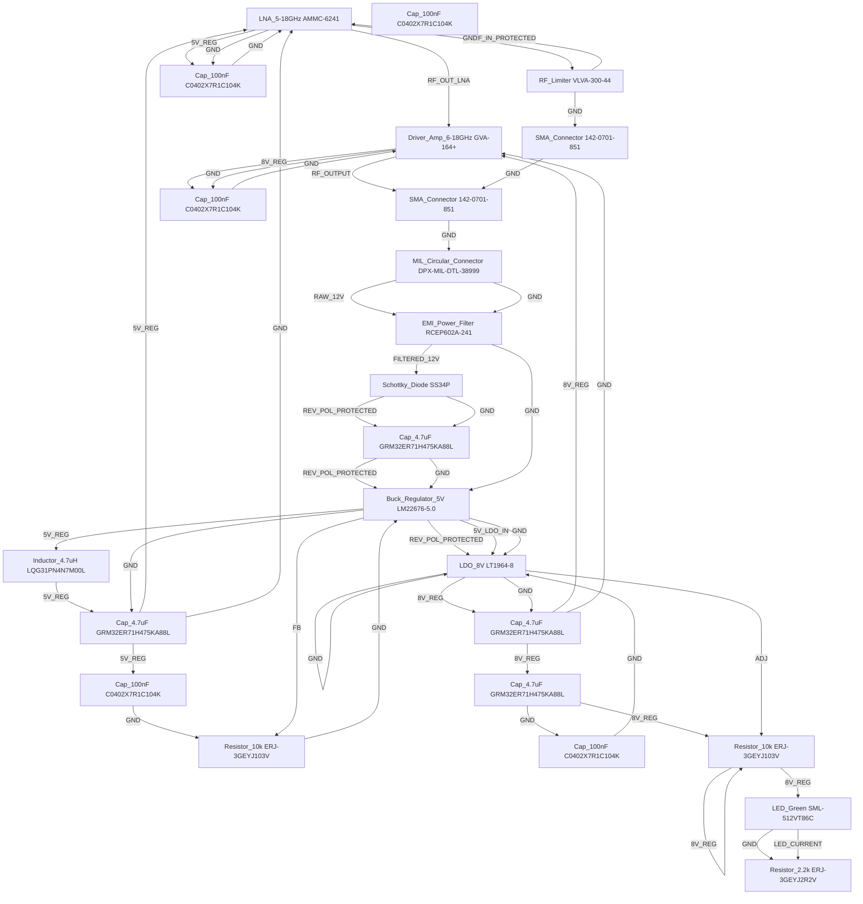

# Logical Netlist
## Rf Receiver

## Block Diagram

## Component Instances

| Ref | Part Number | Component |
|---|---|---|
| U1 | AMMC-6241 | LNA_5-18GHz |
| U2 | GVA-164+ | Driver_Amp_6-18GHz |
| D1 | VLVA-300-44 | RF_Limiter |
| U3 | LM22676-5.0 | Buck_Regulator_5V |
| U4 | LT1964-8 | LDO_8V |
| J1 | 142-0701-851 | SMA_Connector |
| J2 | 142-0701-851 | SMA_Connector |
| J3 | DPX-MIL-DTL-38999 | MIL_Circular_Connector |
| F1 | RCEP602A-241 | EMI_Power_Filter |
| D2 | SS34P | Schottky_Diode |
| R1 | ERJ-3GEYJ103V | Resistor_10k |
| C1 | GRM32ER71H475KA88L | Cap_4.7uF |
| C2 | GRM32ER71H475KA88L | Cap_4.7uF |
| C3 | C0402X7R1C104K | Cap_100nF |
| C4 | C0402X7R1C104K | Cap_100nF |
| C5 | GRM32ER71H475KA88L | Cap_4.7uF |
| C6 | C0402X7R1C104K | Cap_100nF |
| C7 | C0402X7R1C104K | Cap_100nF |
| C8 | GRM32ER71H475KA88L | Cap_4.7uF |
| C9 | C0402X7R1C104K | Cap_100nF |
| L1 | LQG31PN4N7M00L | Inductor_4.7uH |
| R2 | ERJ-3GEYJ103V | Resistor_10k |
| D3 | SML-512VT86C | LED_Green |
| R3 | ERJ-3GEYJ2R2V | Resistor_2.2k |

## Pin-to-Pin Connections

| Net | From | Pin | To | Pin | Type |
|---|---|---|---|---|---|
| RF_IN_PROTECTED | D1 | 2 | U1 | 1 | RF |
| RF_OUT_LNA | U1 | 2 | U2 | 1 | RF |
| RF_OUTPUT | U2 | 2 | J2 | 1 | RF |
| RAW_12V | J3 | 1 | F1 | 1 | power |
| FILTERED_12V | F1 | 2 | D2 | 1 | power |
| REV_POL_PROTECTED | D2 | 2 | C1 | 1 | power |
| REV_POL_PROTECTED | C1 | 1 | U3 | 1 | power |
| REV_POL_PROTECTED | U3 | 1 | U4 | 3 | power |
| 5V_LDO_IN | U3 | 2 | U4 | 3 | power |
| 5V_REG | U3 | 2 | L1 | 1 | power |
| 5V_REG | L1 | 1 | C2 | 1 | power |
| 5V_REG | C2 | 1 | U1 | 3 | power |
| 5V_REG | U1 | 3 | C3 | 1 | power |
| 8V_REG | U4 | 2 | C5 | 1 | power |
| 8V_REG | C5 | 1 | U2 | 3 | power |
| 8V_REG | U2 | 3 | C6 | 1 | power |
| GND | D2 | 2 | C1 | 2 | ground |
| GND | C1 | 3 | U3 |  | ground |
| GND | U3 | 3 | C2 | 2 | ground |
| GND | C2 | 4 | U1 |  | ground |
| GND | U1 | 4 | C3 | 2 | ground |
| GND | C3 | 2 | U1 |  | ground |
| GND | U1 | 1 | D1 |  | ground |
| GND | D1 | 2 | J1 |  | ground |
| GND | J1 | 2 | J2 |  | ground |
| GND | J2 | 3 | J3 |  | ground |
| GND | J3 | 3 | F1 |  | ground |
| GND | F1 | 5 | U3 |  | ground |
| GND | U3 | 1 | U4 |  | ground |
| GND | U4 | 4 | U4 |  | ground |
| GND | U4 | 4 | C5 | 2 | ground |
| GND | C5 | 4 | U2 |  | ground |
| GND | U2 | 4 | C6 | 2 | ground |
| GND | C6 | 2 | U2 |  | ground |
| GND | C4 | 1 | R1 |  | ground |
| GND | R1 | 3 | U3 |  | ground |
| GND | C8 | 2 | C9 |  | ground |
| GND | C9 | 1 | U4 |  | ground |
| GND | D3 | 1 | R3 |  | ground |
| 5V_REG | C2 | 1 | C4 | 1 | power |
| FB | U3 | 2 | R1 |  | signal |
| 8V_REG | C5 | 1 | C8 | 1 | power |
| 8V_REG | C8 | 1 | R2 |  | power |
| 8V_REG | R2 | 2 | R2 |  | power |
| ADJ | U4 | 2 | R2 |  | signal |
| 8V_REG | R2 | 1 | D3 |  | power |
| LED_CURRENT | D3 | 2 | R3 |  | signal |

## Net Connection List

| Net Name | Reference Designator - Pin No. |
|----------|-------------------------------|
| 5V_LDO_IN | U3 - 2,  U4 - 3 |
| 5V_REG | U3 - 2,  L1 - 1,  C2 - 1,  U1 - 3,  C3 - 1,  C4 - 1 |
| 8V_REG | U4 - 2,  C5 - 1,  U2 - 3,  C6 - 1,  C8 - 1,  R2 - ,  R2 - 2,  R2 - 1,  D3 -  |
| ADJ | U4 - 2,  R2 -  |
| FB | U3 - 2,  R1 -  |
| FILTERED_12V | F1 - 2,  D2 - 1 |
| GND | D2 - 2,  C1 - 2,  C1 - 3,  U3 - ,  U3 - 3,  C2 - 2,  C2 - 4,  U1 - ,  U1 - 4,  C3 - 2,  U1 - 1,  D1 - ,  D1 - 2,  J1 - ,  J1 - 2,  J2 - ,  J2 - 3,  J3 - ,  J3 - 3,  F1 - ,  F1 - 5,  U3 - 1,  U4 - ,  U4 - 4,  C5 - 2,  C5 - 4,  U2 - ,  U2 - 4,  C6 - 2,  C4 - 1,  R1 - ,  R1 - 3,  C8 - 2,  C9 - ,  C9 - 1,  D3 - 1,  R3 -  |
| LED_CURRENT | D3 - 2,  R3 -  |
| RAW_12V | J3 - 1,  F1 - 1 |
| REV_POL_PROTECTED | D2 - 2,  C1 - 1,  U3 - 1,  U4 - 3 |
| RF_IN_PROTECTED | D1 - 2,  U1 - 1 |
| RF_OUTPUT | U2 - 2,  J2 - 1 |
| RF_OUT_LNA | U1 - 2,  U2 - 1 |

## Validation Notes

- ✓ All components from BOM included in netlist
- ✓ RF signal path complete: SMA_IN → Limiter → LNA → Driver → SMA_OUT
- ✓ Power chain complete: MIL_CONNECTOR → EMI_FILTER → REV_POLARITY → BUCK_5V → LDO_8V
- ✓ Decoupling capacitors on all power rails: 12V (C1), 5V (C2, C3, C4), 8V (C5, C6, C7, C8, C9)
- ✓ All RF grounds properly connected to GND plane
- ✓ Power LED (D3) with current-limiting resistor (R3: 2.2kΩ) on 8V rail
- ⚠ WARNING: LT1964-8 LDO (U4) input voltage (12V after polarity protection) exceeds absolute max (20V OK) but high dropout may cause thermal stress - verify 5V→8V boost configuration or consider alternative 8V source
- ⚠ WARNING: R2 (10kΩ) shown tied to both 8V_REG and ADJ pin - verify voltage divider values for 8V output
- ✓ Inductor L1 (4.7µH) placed on 5V output for buck converter filtering
- ✓ Feedback network R1 (10kΩ) on U3 FB pin
- ⚠ NOTE: C4 placement on 5V rail - verify proximity to U4 for optimal filtering
- ⚠ NOTE: RF limiter D1 requires proper heatsinking at +10 dBm continuous
- ✓ All grounds tied to single GND reference for EMI/EMC compliance
- ⚠ REVIEW: U4 LT1964-8 configured as 8V LDO from 12V input - verify thermal derating at 125°C with (12V-8V) × 150mA = 0.6W dissipation