# Logical Netlist
## Receiver Module

## Block Diagram

```mermaid
graph TB
    U1[Wideband LNA 5-20GHz HMC6180LP4E]
    U2[Digital VGA 0.5-20GHz HMC698LP4]
    U3[Wideband Mixer 5-26GHz HMC556LC4]
    U4[LDO Regulator +3.3V Ultra-Low Noise LT3045EDD PBF]
    U5[LDO Regulator +5V Low Noise LT3094EDD PBF]
    J1[SMA Female Connector RF Input 142-0701-881]
    J2[SMA Female Connector IF Output 142-0701-881]
    J3[SMA Female Connector LO Input 142-0701-881]
    J4[Connector DC Power Input TB-2PIN]
    C1[DC Block Capacitor 100pF RF 04025C103KAT2A]
    C2[DC Block Capacitor 100pF RF 04025C103KAT2A]
    C3[DC Block Capacitor 100pF RF 04025C103KAT2A]
    C4[DC Block Capacitor 100pF RF 04025C103KAT2A]
    C10[Decoupling Capacitor 4.7uF GRM32ER71H475KE15L]
    C11[Decoupling Capacitor 100nF 04025C104KAT2A]
    C12[Decoupling Capacitor 100nF 04025C103KAT2A]
    C13[Decoupling Capacitor 100nF 04025C104KAT2A]
    C14[Decoupling Capacitor 4.7uF GRM32ER71H475KE15L]
    C15[Decoupling Capacitor 100nF 04025C103KAT2A]
    C16[Decoupling Capacitor 100nF 04025C104KAT2A]
    C17[Decoupling Capacitor 100nF 04025C103KAT2A]
    C18[Decoupling Capacitor 100nF 04025C104KAT2A]
    C19[Decoupling Capacitor 100nF 04025C104KAT2A]
    C20[Decoupling Capacitor 100nF 04025C103KAT2A]
    R1[Gate Bias Resistor 10K CRCW060310K0FKEB]
    R2[Gate Bias Resistor 10K CRCW060310K0FKEB]
    R3[Pull-up Resistor 10K CRCW060310K0FKEB]
    R4[Pull-up Resistor 10K CRCW060310K0FKEB]
    R5[Pull-up Resistor 10K CRCW060310K0FKEB]
    R6[Pull-up Resistor 10K CRCW060310K0FKEB]
    R7[Pull-up Resistor 10K CRCW060310K0FKEB]
    R8[Pull-up Resistor 10K CRCW060310K0FKEB]
    R9[Set Resistor 10K CRCW060310K0FKEB]
    R10[Set Resistor 10K CRCW060310K0FKEB]
    R11[Set Resistor 10K CRCW060310K0FKEB]
    R12[Set Resistor 274K CRCW060327K4FKEB]
    R13[Set Resistor 274K CRCW060327K4FKEB]
    L1[RF Choke 10nH 0402AF-R10XJLU]
    L2[RF Choke 10nH 0402AF-R10XJLU]
    D1[TVS Diode 12V Bidirectional SMBJ12CA]
    J5[VGA Control Interface Header HDR-10PIN]
    J1 -->|RF_IN| C1
    C1 -->|RF_IN_BLOCKED| U1
    U1 -->|RF_OUT_LNA| C2
    C2 -->|RF_IN_VGA| U2
    U2 -->|RF_OUT_VGA| C3
    C3 -->|RF_IN_MIXER| U3
    J3 -->|LO_IN| C4
    C4 -->|LO_IN_BLOCKED| U3
    U3 -->|IF_OUT_MIXER| J2
    J4 -->|+12V_RAW| D1
    D1 -->|+12V_PROTECTED| U4
    D1 -->|+12V_PROTECTED| U5
    J4 -->|GND| U4
    J4 -->|GND| U5
    U4 -->|+3V3_LDO| U1
    U4 -->|+3V3_LDO| U2
    U4 -->|+3V3_LDO| C11
    U4 -->|+3V3_LDO| C12
    U5 -->|+5V_LDO| U3
    U5 -->|+5V_LDO| C17
    U5 -->|+5V_LDO| C18
    R11 -->|SET_3V3| U4
    R13 -->|SET_5V| U5
    U4 -->|GND| R11
    U5 -->|GND| R13
    C10 -->|GND| U4
    C11 -->|GND| U4
    C12 -->|GND| U4
    C14 -->|GND| U5
    C17 -->|GND| U5
    C18 -->|GND| U5
    D1 -->|+12V_PROTECTED| C10
    D1 -->|+12V_PROTECTED| C14
    U1 -->|GND| J1
    U1 -->|GND| J1
    U1 -->|GND| L1
    U1 -->|DRAIN_LNA| L1
    L1 -->|DRAIN_LNA| R1
    R1 -->|VDD_LNA| U4
    R1 -->|VDD_LNA| C15
    C15 -->|GND| U4
    U1 -->|GND| U4
    U2 -->|GND| U5
    U2 -->|GND| U5
    U2 -->|GND| U5
    U2 -->|GND| U5
    U2 -->|VDD_DIG| U4
    U2 -->|VDD_DIG| C16
    C16 -->|GND| U4
    U2 -->|LE| R3
    R3 -->|LE| J5
    U2 -->|D0| R4
    R4 -->|D0| J5
    U2 -->|D1| R5
    R5 -->|D1| J5
    U2 -->|D2| R6
    R6 -->|D2| J5
    U2 -->|D3| R7
    R7 -->|D3| J5
    U2 -->|D4| R8
    R8 -->|D4| J5
    U2 -->|D5| R9
    R9 -->|D5| J5
    U2 -->|D6| R10
    R10 -->|D6| J5
    R3 -->|VDD_LE| U4
    R4 -->|VDD_D0-D6| U4
    R5 -->|VDD_D0-D6| U4
    R6 -->|VDD_D0-D6| U4
    R7 -->|VDD_D0-D6| U4
    R8 -->|VDD_D0-D6| U4
    R9 -->|VDD_D0-D6| U4
    R10 -->|VDD_D0-D6| U4
    J5 -->|GND| U4
    J5 -->|GND| U4
    J2 -->|GND| U5
    J2 -->|GND| U5
    J3 -->|GND| U5
    J3 -->|GND| U5
    U3 -->|GND| U5
    U3 -->|GND| U5
    U3 -->|GND| L2
    U3 -->|IF_BIAS| L2
    L2 -->|IF_BIAS| R2
    R2 -->|VDD_IF| U5
    R2 -->|VDD_IF| C19
    C19 -->|GND| U5
    D1 -->|+12V_PROTECTED| C20
    C20 -->|GND| U4
```

## Component Instances

| Ref | Part Number | Component |
|---|---|---|
| U1 | HMC6180LP4E | Wideband LNA 5-20GHz |
| U2 | HMC698LP4 | Digital VGA 0.5-20GHz |
| U3 | HMC556LC4 | Wideband Mixer 5-26GHz |
| U4 | LT3045EDD#PBF | LDO Regulator +3.3V Ultra-Low Noise |
| U5 | LT3094EDD#PBF | LDO Regulator +5V Low Noise |
| J1 | 142-0701-881 | SMA Female Connector RF Input |
| J2 | 142-0701-881 | SMA Female Connector IF Output |
| J3 | 142-0701-881 | SMA Female Connector LO Input |
| J4 | TB-2PIN | Connector DC Power Input |
| C1 | 04025C103KAT2A | DC Block Capacitor 100pF RF |
| C2 | 04025C103KAT2A | DC Block Capacitor 100pF RF |
| C3 | 04025C103KAT2A | DC Block Capacitor 100pF RF |
| C4 | 04025C103KAT2A | DC Block Capacitor 100pF RF |
| C10 | GRM32ER71H475KE15L | Decoupling Capacitor 4.7uF |
| C11 | 04025C104KAT2A | Decoupling Capacitor 100nF |
| C12 | 04025C103KAT2A | Decoupling Capacitor 100nF |
| C13 | 04025C104KAT2A | Decoupling Capacitor 100nF |
| C14 | GRM32ER71H475KE15L | Decoupling Capacitor 4.7uF |
| C15 | 04025C103KAT2A | Decoupling Capacitor 100nF |
| C16 | 04025C104KAT2A | Decoupling Capacitor 100nF |
| C17 | 04025C103KAT2A | Decoupling Capacitor 100nF |
| C18 | 04025C104KAT2A | Decoupling Capacitor 100nF |
| C19 | 04025C104KAT2A | Decoupling Capacitor 100nF |
| C20 | 04025C103KAT2A | Decoupling Capacitor 100nF |
| R1 | CRCW060310K0FKEB | Gate Bias Resistor 10K |
| R2 | CRCW060310K0FKEB | Gate Bias Resistor 10K |
| R3 | CRCW060310K0FKEB | Pull-up Resistor 10K |
| R4 | CRCW060310K0FKEB | Pull-up Resistor 10K |
| R5 | CRCW060310K0FKEB | Pull-up Resistor 10K |
| R6 | CRCW060310K0FKEB | Pull-up Resistor 10K |
| R7 | CRCW060310K0FKEB | Pull-up Resistor 10K |
| R8 | CRCW060310K0FKEB | Pull-up Resistor 10K |
| R9 | CRCW060310K0FKEB | Set Resistor 10K |
| R10 | CRCW060310K0FKEB | Set Resistor 10K |
| R11 | CRCW060310K0FKEB | Set Resistor 10K |
| R12 | CRCW060327K4FKEB | Set Resistor 274K |
| R13 | CRCW060327K4FKEB | Set Resistor 274K |
| L1 | 0402AF-R10XJLU | RF Choke 10nH |
| L2 | 0402AF-R10XJLU | RF Choke 10nH |
| D1 | SMBJ12CA | TVS Diode 12V Bidirectional |
| J5 | HDR-10PIN | VGA Control Interface Header |

## Pin-to-Pin Connections

| Net | From | Pin | To | Pin | Type |
|---|---|---|---|---|---|
| RF_IN | J1 | 1 | C1 | 1 | signal |
| RF_IN_BLOCKED | C1 | 2 | U1 | 3 | signal |
| RF_OUT_LNA | U1 | 6 | C2 | 1 | signal |
| RF_IN_VGA | C2 | 2 | U2 | 8 | signal |
| RF_OUT_VGA | U2 | 3 | C3 | 1 | signal |
| RF_IN_MIXER | C3 | 2 | U3 | 1 | signal |
| LO_IN | J3 | 1 | C4 | 1 | signal |
| LO_IN_BLOCKED | C4 | 2 | U3 | 8 | signal |
| IF_OUT_MIXER | U3 | 5 | J2 | 1 | signal |
| +12V_RAW | J4 | 1 | D1 | 2 | power |
| +12V_PROTECTED | D1 | 1 | U4 | 3 | power |
| +12V_PROTECTED | D1 | 1 | U5 | 3 | power |
| GND | J4 | 2 | U4 | 2 | ground |
| GND | J4 | 2 | U5 | 2 | ground |
| +3V3_LDO | U4 | 4 | U1 | 7 | power |
| +3V3_LDO | U4 | 4 | U2 | 16 | power |
| +3V3_LDO | U4 | 4 | C11 | 1 | power |
| +3V3_LDO | U4 | 4 | C12 | 1 | power |
| +5V_LDO | U5 | 4 | U3 | 2 | power |
| +5V_LDO | U5 | 4 | C17 | 1 | power |
| +5V_LDO | U5 | 4 | C18 | 1 | power |
| SET_3V3 | R11 | 2 | U4 | 5 | signal |
| SET_5V | R13 | 2 | U5 | 5 | signal |
| GND | U4 | 1 | R11 | 1 | ground |
| GND | U5 | 1 | R13 | 1 | ground |
| GND | C10 | 2 | U4 | 2 | ground |
| GND | C11 | 2 | U4 | 2 | ground |
| GND | C12 | 2 | U4 | 2 | ground |
| GND | C14 | 2 | U5 | 2 | ground |
| GND | C17 | 2 | U5 | 2 | ground |
| GND | C18 | 2 | U5 | 2 | ground |
| +12V_PROTECTED | D1 | 1 | C10 | 1 | power |
| +12V_PROTECTED | D1 | 1 | C14 | 1 | power |
| GND | U1 | 1 | J1 | 2 | ground |
| GND | U1 | 2 | J1 | 3 | ground |
| GND | U1 | 4 | L1 | 1 | ground |
| DRAIN_LNA | U1 | 5 | L1 | 2 | power |
| DRAIN_LNA | L1 | 2 | R1 | 2 | power |
| VDD_LNA | R1 | 1 | U4 | 4 | power |
| VDD_LNA | R1 | 1 | C15 | 1 | power |
| GND | C15 | 2 | U4 | 2 | ground |
| GND | U1 | 8 | U4 | 2 | ground |
| GND | U2 | 1 | U5 | 2 | ground |
| GND | U2 | 6 | U5 | 2 | ground |
| GND | U2 | 7 | U5 | 2 | ground |
| GND | U2 | 15 | U5 | 2 | ground |
| VDD_DIG | U2 | 17 | U4 | 4 | power |
| VDD_DIG | U2 | 17 | C16 | 1 | power |
| GND | C16 | 2 | U4 | 2 | ground |
| LE | U2 | 2 | R3 | 2 | signal |
| LE | R3 | 2 | J5 | 1 | signal |
| D0 | U2 | 9 | R4 | 2 | signal |
| D0 | R4 | 2 | J5 | 2 | signal |
| D1 | U2 | 10 | R5 | 2 | signal |
| D1 | R5 | 2 | J5 | 3 | signal |
| D2 | U2 | 11 | R6 | 2 | signal |
| D2 | R6 | 2 | J5 | 4 | signal |
| D3 | U2 | 12 | R7 | 2 | signal |
| D3 | R7 | 2 | J5 | 5 | signal |
| D4 | U2 | 13 | R8 | 2 | signal |
| D4 | R8 | 2 | J5 | 6 | signal |
| D5 | U2 | 14 | R9 | 2 | signal |
| D5 | R9 | 2 | J5 | 7 | signal |
| D6 | U2 | 5 | R10 | 2 | signal |
| D6 | R10 | 2 | J5 | 8 | signal |
| VDD_LE | R3 | 1 | U4 | 4 | power |
| VDD_D0-D6 | R4 | 1 | U4 | 4 | power |
| VDD_D0-D6 | R5 | 1 | U4 | 4 | power |
| VDD_D0-D6 | R6 | 1 | U4 | 4 | power |
| VDD_D0-D6 | R7 | 1 | U4 | 4 | power |
| VDD_D0-D6 | R8 | 1 | U4 | 4 | power |
| VDD_D0-D6 | R9 | 1 | U4 | 4 | power |
| VDD_D0-D6 | R10 | 1 | U4 | 4 | power |
| GND | J5 | 9 | U4 | 2 | ground |
| GND | J5 | 10 | U4 | 2 | ground |
| GND | J2 | 2 | U5 | 2 | ground |
| GND | J2 | 3 | U5 | 2 | ground |
| GND | J3 | 2 | U5 | 2 | ground |
| GND | J3 | 3 | U5 | 2 | ground |
| GND | U3 | 3 | U5 | 2 | ground |
| GND | U3 | 6 | U5 | 2 | ground |
| GND | U3 | 4 | L2 | 1 | ground |
| IF_BIAS | U3 | 7 | L2 | 2 | power |
| IF_BIAS | L2 | 2 | R2 | 2 | power |
| VDD_IF | R2 | 1 | U5 | 4 | power |
| VDD_IF | R2 | 1 | C19 | 1 | power |
| GND | C19 | 2 | U5 | 2 | ground |
| +12V_PROTECTED | D1 | 1 | C20 | 1 | power |
| GND | C20 | 2 | U4 | 2 | ground |

## Net Connection List

| Net Name | Reference Designator - Pin No. |
|----------|-------------------------------|
| +12V_PROTECTED | D1 - 1,  U4 - 3,  U5 - 3,  C10 - 1,  C14 - 1,  C20 - 1 |
| +12V_RAW | J4 - 1,  D1 - 2 |
| +3V3_LDO | U4 - 4,  U1 - 7,  U2 - 16,  C11 - 1,  C12 - 1 |
| +5V_LDO | U5 - 4,  U3 - 2,  C17 - 1,  C18 - 1 |
| D0 | U2 - 9,  R4 - 2,  J5 - 2 |
| D1 | U2 - 10,  R5 - 2,  J5 - 3 |
| D2 | U2 - 11,  R6 - 2,  J5 - 4 |
| D3 | U2 - 12,  R7 - 2,  J5 - 5 |
| D4 | U2 - 13,  R8 - 2,  J5 - 6 |
| D5 | U2 - 14,  R9 - 2,  J5 - 7 |
| D6 | U2 - 5,  R10 - 2,  J5 - 8 |
| DRAIN_LNA | U1 - 5,  L1 - 2,  R1 - 2 |
| GND | J4 - 2,  U4 - 2,  U5 - 2,  U4 - 1,  R11 - 1,  U5 - 1,  R13 - 1,  C10 - 2,  C11 - 2,  C12 - 2,  C14 - 2,  C17 - 2,  C18 - 2,  U1 - 1,  J1 - 2,  U1 - 2,  J1 - 3,  U1 - 4,  L1 - 1,  C15 - 2,  U1 - 8,  U2 - 1,  U2 - 6,  U2 - 7,  U2 - 15,  C16 - 2,  J5 - 9,  J5 - 10,  J2 - 2,  J2 - 3,  J3 - 2,  J3 - 3,  U3 - 3,  U3 - 6,  U3 - 4,  L2 - 1,  C19 - 2,  C20 - 2 |
| IF_BIAS | U3 - 7,  L2 - 2,  R2 - 2 |
| IF_OUT_MIXER | U3 - 5,  J2 - 1 |
| LE | U2 - 2,  R3 - 2,  J5 - 1 |
| LO_IN | J3 - 1,  C4 - 1 |
| LO_IN_BLOCKED | C4 - 2,  U3 - 8 |
| RF_IN | J1 - 1,  C1 - 1 |
| RF_IN_BLOCKED | C1 - 2,  U1 - 3 |
| RF_IN_MIXER | C3 - 2,  U3 - 1 |
| RF_IN_VGA | C2 - 2,  U2 - 8 |
| RF_OUT_LNA | U1 - 6,  C2 - 1 |
| RF_OUT_VGA | U2 - 3,  C3 - 1 |
| SET_3V3 | R11 - 2,  U4 - 5 |
| SET_5V | R13 - 2,  U5 - 5 |
| VDD_D0-D6 | R4 - 1,  U4 - 4,  R5 - 1,  R6 - 1,  R7 - 1,  R8 - 1,  R9 - 1,  R10 - 1 |
| VDD_DIG | U2 - 17,  U4 - 4,  C16 - 1 |
| VDD_IF | R2 - 1,  U5 - 4,  C19 - 1 |
| VDD_LE | R3 - 1,  U4 - 4 |
| VDD_LNA | R1 - 1,  U4 - 4,  C15 - 1 |

## Validation Notes

- WARNING: VGA control pins (LE, D0-D6) use 10KΩ pull-up resistors to +3.3V. If external control logic is 5V logic, ensure level translators or verify HMC698 digital input pin voltage tolerance.
- WARNING: DC blocking capacitors C1-C4 are 100pF C0G. Verify self-resonant frequency exceeds 18 GHz for full band coverage.
- NOTE: LNA U1 requires Vdd of +3V to +5V. Current design uses +3.3V rail via LDO U4 for optimal noise performance.
- NOTE: IF output bias (R2, L2) to +5V provides headroom for IF amplifier (if external) or mixer IF load.
- REMINDER: TVS diode D1 (SMBJ12CA) provides reverse polarity and overvoltage protection. Verify clamping voltage is compatible with LDO input voltage ratings (max 20V).
- REMINDER: All RF ground connections should use multiple vias to ground plane to minimize inductance at microwave frequencies.
- REMINDER: Decoupling capacitors should be placed as close as possible to IC power pins. C11, C12 for U4; C17, C18 for U5; C15 for U1; C16 for U2.
- REMINDER: RF choke L1 at LNA drain and L2 at mixer IF output should be high-impedance at RF frequencies (10nH suitable for 5-18 GHz).
- VERIFY: Resistor values for LDO SET pins (R11=10K, R13=274K) produce approximately +3.3V and +5V outputs based on LT3045/LT3094 datasheet formulas. Adjust during prototype testing.
- VERIFY: Mixer LO drive requirement is +7 dBm. Ensure external LO source can provide this level across 5-18 GHz range.