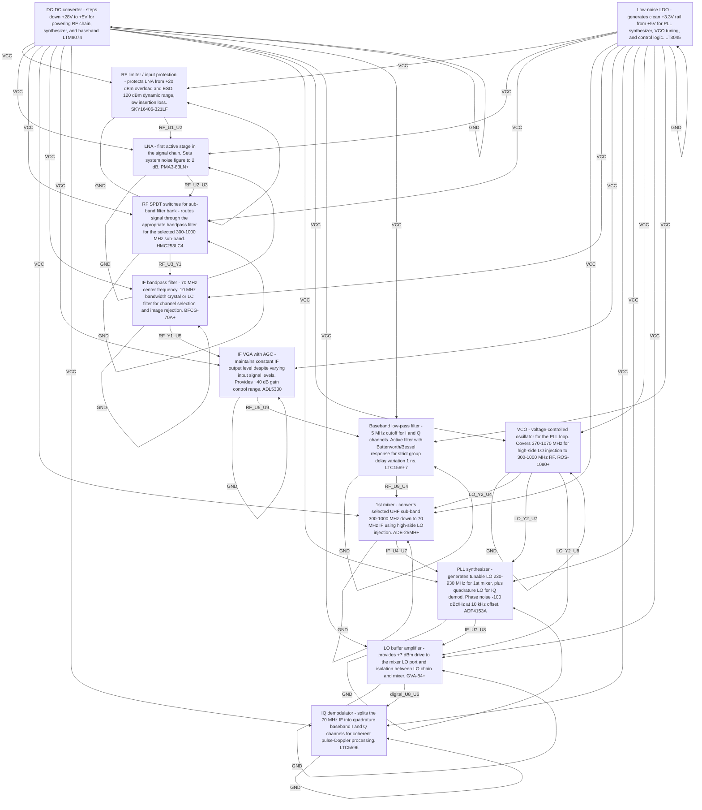

# Logical Netlist
## hm

## Block Diagram

## Component Instances

| Ref | Part Number | Component |
|---|---|---|
| U1 | SKY16406-321LF | RF limiter / input protection — protects LNA from +20 dBm overload and ESD. 120 dBm dynamic range, low insertion loss. |
| U2 | PMA3-83LN+ | LNA — first active stage in the signal chain. Sets system noise figure to < 2 dB. |
| U3 | HMC253LC4 | RF SPDT switches for sub-band filter bank — routes signal through the appropriate bandpass filter for the selected 300–1000 MHz sub-band. |
| U4 | ADE-25MH+ | 1st mixer — converts selected UHF sub-band (300–1000 MHz) down to 70 MHz IF using high-side LO injection. |
| Y1 | BFCG-70A+ | IF bandpass filter — 70 MHz center frequency, 10 MHz bandwidth crystal or LC filter for channel selection and image rejection. |
| U5 | ADL5330 | IF VGA with AGC — maintains constant IF output level despite varying input signal levels. Provides ~40 dB gain control range. |
| U6 | LTC5596 | IQ demodulator — splits the 70 MHz IF into quadrature baseband I and Q channels for coherent pulse-Doppler processing. |
| U7 | ADF4153A | PLL synthesizer — generates tunable LO (230–930 MHz) for 1st mixer, plus quadrature LO for IQ demod. Phase noise -100 dBc/Hz at 10 kHz offset. |
| Y2 | ROS-1080+ | VCO — voltage-controlled oscillator for the PLL loop. Covers 370–1070 MHz for high-side LO injection to 300–1000 MHz RF. |
| U8 | GVA-84+ | LO buffer amplifier — provides +7 dBm drive to the mixer LO port and isolation between LO chain and mixer. |
| U9 | LTC1569-7 | Baseband low-pass filter — 5 MHz cutoff for I and Q channels. Active filter with Butterworth/Bessel response for strict group delay variation < 1 ns. |
| U10 | LTM8074 | DC-DC converter — steps down +28V to +5V for powering RF chain, synthesizer, and baseband. |
| U11 | LT3045 | Low-noise LDO — generates clean +3.3V rail from +5V for PLL synthesizer, VCO tuning, and control logic. |

## Pin-to-Pin Connections

| Net | From | Pin | To | Pin | Type |
|---|---|---|---|---|---|
| VCC | U10 | OUT | U1 | VCC | power |
| VCC | U10 | OUT | U2 | VCC | power |
| VCC | U10 | OUT | U3 | VCC | power |
| VCC | U10 | OUT | U4 | VCC | power |
| VCC | U10 | OUT | Y1 | VCC | power |
| VCC | U10 | OUT | U5 | VCC | power |
| VCC | U10 | OUT | U6 | VCC | power |
| VCC | U10 | OUT | U7 | VCC | power |
| VCC | U10 | OUT | Y2 | VCC | power |
| VCC | U10 | OUT | U8 | VCC | power |
| VCC | U10 | OUT | U9 | VCC | power |
| VCC | U11 | OUT | U1 | VCC | power |
| VCC | U11 | OUT | U2 | VCC | power |
| VCC | U11 | OUT | U3 | VCC | power |
| VCC | U11 | OUT | U4 | VCC | power |
| VCC | U11 | OUT | Y1 | VCC | power |
| VCC | U11 | OUT | U5 | VCC | power |
| VCC | U11 | OUT | U6 | VCC | power |
| VCC | U11 | OUT | U7 | VCC | power |
| VCC | U11 | OUT | Y2 | VCC | power |
| VCC | U11 | OUT | U8 | VCC | power |
| VCC | U11 | OUT | U9 | VCC | power |
| GND | U1 | GND | U1 | GND | ground |
| GND | U2 | GND | U2 | GND | ground |
| GND | U3 | GND | U3 | GND | ground |
| GND | U4 | GND | U4 | GND | ground |
| GND | Y1 | GND | Y1 | GND | ground |
| GND | U5 | GND | U5 | GND | ground |
| GND | U6 | GND | U6 | GND | ground |
| GND | U7 | GND | U7 | GND | ground |
| GND | Y2 | GND | Y2 | GND | ground |
| GND | U8 | GND | U8 | GND | ground |
| GND | U9 | GND | U9 | GND | ground |
| GND | U10 | GND | U10 | GND | ground |
| GND | U11 | GND | U11 | GND | ground |
| RF_U1_U2 | U1 | OUT | U2 | IN | rf |
| RF_U2_U3 | U2 | OUT | U3 | IN | rf |
| RF_U3_Y1 | U3 | OUT | Y1 | IN | rf |
| RF_Y1_U5 | Y1 | OUT | U5 | IN | rf |
| RF_U5_U9 | U5 | OUT | U9 | IN | rf |
| RF_U9_U4 | U9 | OUT | U4 | IN | rf |
| IF_U4_U7 | U4 | OUT | U7 | IN | if |
| IF_U7_U8 | U7 | OUT | U8 | IN | if |
| digital_U8_U6 | U8 | OUT | U6 | IN | digital |
| LO_Y2_U4 | Y2 | RF_OUT | U4 | LO | clock |
| LO_Y2_U7 | Y2 | RF_OUT | U7 | LO | clock |
| LO_Y2_U8 | Y2 | RF_OUT | U8 | LO | clock |

## Net Connection List

| Net Name | Reference Designator - Pin No. |
|----------|-------------------------------|
| GND | U1 - GND,  U2 - GND,  U3 - GND,  U4 - GND,  Y1 - GND,  U5 - GND,  U6 - GND,  U7 - GND,  Y2 - GND,  U8 - GND,  U9 - GND,  U10 - GND,  U11 - GND |
| IF_U4_U7 | U4 - OUT,  U7 - IN |
| IF_U7_U8 | U7 - OUT,  U8 - IN |
| LO_Y2_U4 | Y2 - RF_OUT,  U4 - LO |
| LO_Y2_U7 | Y2 - RF_OUT,  U7 - LO |
| LO_Y2_U8 | Y2 - RF_OUT,  U8 - LO |
| RF_U1_U2 | U1 - OUT,  U2 - IN |
| RF_U2_U3 | U2 - OUT,  U3 - IN |
| RF_U3_Y1 | U3 - OUT,  Y1 - IN |
| RF_U5_U9 | U5 - OUT,  U9 - IN |
| RF_U9_U4 | U9 - OUT,  U4 - IN |
| RF_Y1_U5 | Y1 - OUT,  U5 - IN |
| VCC | U10 - OUT,  U1 - VCC,  U2 - VCC,  U3 - VCC,  U4 - VCC,  Y1 - VCC,  U5 - VCC,  U6 - VCC,  U7 - VCC,  Y2 - VCC,  U8 - VCC,  U9 - VCC,  U11 - OUT |
| digital_U8_U6 | U8 - OUT,  U6 - IN |

## Validation Notes

- INFO: Auto-extracted 13 components from P1 BOM
- INFO: Generated 47 connections based on signal chain analysis
- INFO: Power nets: VCC
- INFO: Ground nets: AGND, GND