# Logical Netlist
## rx band

## Block Diagram

```mermaid
graph TB
    J1[2.92mm-K SMA RF Input Connector SMA-2.92K]
    LIM1[RF Limiter +20dBm VLM-63A-S+]
    BPF1[YIG Tunable Preselector 18-40GHz YIG-BPF-1840]
    BT1[Bias Tee ZFBT-4R2GW+]
    U1[LNA / ZVA-183WA-S+ ZVA-183WA-S+]
    U2[MIX1 / CMD180C3 CMD180C3]
    U3[LO1 PLL / LMX2820 LMX2820RTCT]
    U4[LO1 Buffer Amplifier GVA-63+]
    BPF2[IF1 Bandpass Filter 4GHz BPF-4000+]
    U5[IF Gain Block / PMA2-123LNW+ PMA2-123LNW+]
    BPF3[IF1 Stability BPF 4GHz BPF-4000+]
    U6[MIX2 / MMIQ-0205HSM-2 MMIQ-0205HSM-2]
    U7[LO2 PLL / ADF4383 ADF4383BCCZ]
    U8[LO2 Buffer Amplifier GVA-63+]
    BPF4[IF2 Bandpass Filter 500MHz BPF-500+]
    U9[VGA / TGL2767-SMEVB TGL2767-SMEVB]
    U10[ADC / LTC2107IUK LTC2107IUK PBF]
    U11[FPGA / XC7K355T Kintex-7 XC7K355T-1FFG901I]
    U12[Reference OCXO 10MHz KOVTL10MDBFBCB]
    U13[5V LDO Regulator LM2940S-5.0/NOPB]
    U14[3.3V LDO Regulator LT1962EMS8-3.3 PBF]
    U15[1.8V LDO Regulator LT1962EMS8-1.8 PBF]
    U16[FPGA 1.0V Buck Regulator TPS54620RGWR]
    U17[LO1 10MHz RF Buffer GVA-63+]
    U18[LO2 10MHz RF Buffer GVA-63+]
    J2[Data Output Connector 60-pin SAMTEC-LSHM-60]
    J3[Power Input Connector CON-POWER-2]
    J4[LO1 SPI/JTAG Header 10-pin HDR-2x5]
    J5[LO2 SPI Header 6-pin HDR-2x3]
    J6[FPGA JTAG Header 10-pin HDR-2x5]
    C1[100nF Decoupling U1 GRM155R71C104KA88D]
    C2[100nF Decoupling U3 GRM155R71C104KA88D]
    C3[100nF Decoupling U5 GRM155R71C104KA88D]
    C4[100nF Decoupling U4 LO1 Buf GRM155R71C104KA88D]
    C5[100nF Decoupling U8 LO2 Buf GRM155R71C104KA88D]
    C6[100nF Decoupling U13 5V LDO GRM155R71C104KA88D]
    C7[100nF Decoupling U13 5V LDO Out GRM155R71C104KA88D]
    C8[100nF Decoupling U14 3.3V LDO GRM155R71C104KA88D]
    C9[100nF Decoupling U14 3.3V Out GRM155R71C104KA88D]
    C10[100nF Decoupling U15 1.8V LDO GRM155R71C104KA88D]
    C11[100nF Decoupling U15 1.8V Out GRM155R71C104KA88D]
    C12[100nF Decoupling U7 LO2 PLL GRM155R71C104KA88D]
    C13[100nF Decoupling U17 Ref Buf GRM155R71C104KA88D]
    C14[100nF Decoupling U18 Ref Buf GRM155R71C104KA88D]
    C15[10uF Input Filter C LIM1 GRM188R61C106MA73D]
    C16[100nF Bypass U16 Buck Vin GRM155R71C104KA88D]
    C17[22uF Output C U16 Buck GRM21BR61C226ME44L]
    C18[10uF Input C 15V to LDOs GRM188R61C106MA73D]
    L1[15V Input Common Mode Choke DLW43SH510XK2L]
    L2[10uH Inductor U16 Buck XAL5050-103ME]
    R1[VGA Bias Resistor RC0402FR-0710KL]
    R2[VGA Series Resistor RC0402FR-071KL]
    R3[AGC DAC Output Resistor RC0402FR-07100R]
    R4[OCXO 12V Current Limit R RC0402FR-07100R]
    R5[U16 Feedback Resistor RC0402FR-0710KL]
    R6[U16 Feedback Resistor Lo RC0402FR-074K75L]
    GND_STAR[Ground Reference GND]
    J1 -->|RF_IN| LIM1
    LIM1 -->|RF_LIMITED| BPF1
    BPF1 -->|RF_FILTERED| BT1
    BT1 -->|RF_BIAS| U1
    U1 -->|RF_LNA_OUT| U2
    U4 -->|LO1_RF| U2
    U3 -->|LO1_OUT| U4
    U2 -->|IF1_RAW| BPF2
    BPF2 -->|IF1_FILTERED| U5
    U5 -->|IF1_AMP| BPF3
    BPF3 -->|IF1_STAB| U6
    U8 -->|LO2_RF| U6
    U7 -->|LO2_OUT| U8
    U6 -->|IF2_RAW| BPF4
    BPF4 -->|IF2_FILTERED| U9
    U9 -->|IF2_VGA_OUT| U10
    U17 -->|REF_10MHZ_LO1| U3
    U18 -->|REF_10MHZ_LO2| U7
    U12 -->|10MHZ_DIST1| U17
    U12 -->|10MHZ_DIST2| U18
    U10 -->|LVDS_D0| U11
    U10 -->|LVDS_D0_N| U11
    U10 -->|LVDS_D1| U11
    U10 -->|LVDS_D1_N| U11
    U10 -->|LVDS_CLK_P| U11
    U10 -->|LVDS_CLK_N| U11
    U10 -->|ADC_OVR| U11
    U11 -->|ADC_PD| U10
    U10 -->|LVDS_D2| U11
    U10 -->|LVDS_D2_N| U11
    U10 -->|LVDS_D3| U11
    U10 -->|LVDS_D3_N| U11
    U10 -->|LVDS_D4| U11
    U10 -->|LVDS_D4_N| U11
    U10 -->|LVDS_D5| U11
    U10 -->|LVDS_D5_N| U11
    U10 -->|LVDS_D6| U11
    U10 -->|LVDS_D6_N| U11
    U10 -->|LVDS_D7| U11
    U10 -->|LVDS_D7_N| U11
    U11 -->|LO1_SPI_CS| U3
    U11 -->|LO1_SPI_SCLK| U3
    U11 -->|LO1_SPI_SDIO| U3
    U3 -->|LO1_SPI_SDO| U11
    U11 -->|LO2_SPI_CS| U7
    U11 -->|LO2_SPI_SCLK| U7
    U11 -->|LO2_SPI_SDIO| U7
    U7 -->|LO2_SPI_SDO| U11
    U11 -->|AGC_DAC| R3
    R3 -->|AGC_CTRL| R2
    R2 -->|VGA_CTRL| U9
    U11 -->|FPGA_INIT| J2
    U11 -->|FPGA_TX0| J2
    U11 -->|FPGA_TX1| J2
    U11 -->|FPGA_TX2| J2
    U11 -->|FPGA_TX3| J2
    U11 -->|FPGA_TXC_P| J2
    U11 -->|FPGA_TXC_N| J2
    U11 -->|FPGA_READY| J2
    U11 -->|FPGA_MISO| J2
    U11 -->|FPGA_SYNC| J2
    J3 -->|15V_IN| L1
    L1 -->|15V_FILT| C18
    C18 -->|15V_TO_LDO5| U13
    C18 -->|15V_TO_LDO33| U14
    C18 -->|15V_TO_LDO18| U15
    C18 -->|15V_TO_BUCK| U16
    C18 -->|15V_TO_OCXO| R4
    R4 -->|OCXO_PWR| U12
    U13 -->|5V_RF| C7
    U13 -->|5V_TO_U1| C1
    U13 -->|5V_TO_U5| C3
    U13 -->|5V_TO_U4| C4
    U13 -->|5V_TO_U8| C5
    U13 -->|5V_TO_U17| C13
    U13 -->|5V_TO_U18| C14
    C1 -->|U1_VCC| U1
    U14 -->|3V3_DIG| C9
    U14 -->|3V3_TO_U3| C2
    U14 -->|3V3_TO_U7| C12
    U14 -->|3V3_TO_U10_IO| U10
    U14 -->|3V3_TO_U11_IO| U11
    C2 -->|U3_VCC| U3
    C3 -->|U5_VCC| U5
    C4 -->|U4_VCC| U4
    C5 -->|U8_VCC| U8
    C12 -->|U7_VCC| U7
    C13 -->|U17_VCC| U17
    C14 -->|U18_VCC| U18
    U15 -->|1V8_ADC| C11
    U15 -->|1V8_TO_U10_CORE| U10
    U15 -->|1V8_TO_U11_AUX| U11
    U16 -->|1V0_FPGA| L2
    L2 -->|1V0_OUT| C17
    L2 -->|1V0_TO_U11_CORE| U11
    L2 -->|FB_NODE| R5
    R5 -->|FB_DIV| R6
    R5 -->|FB_SENSE| U16
    U11 -->|YIG_BIAS| BT1
    J1 -->|GND| LIM1
    J1 -->|GND| BPF1
    J1 -->|GND| BT1
    J1 -->|GND| U1
    J1 -->|GND| U2
    J1 -->|GND| BPF2
    J1 -->|GND| U5
    J1 -->|GND| BPF3
    J1 -->|GND| U6
    J1 -->|GND| BPF4
    J1 -->|GND| U9
    J1 -->|GND| U10
    J1 -->|GND| U3
    J1 -->|GND| U7
    J1 -->|GND| U4
    J1 -->|GND| U8
    J1 -->|GND| U17
    J1 -->|GND| U18
    J1 -->|GND| U12
    J1 -->|GND| U13
    J1 -->|GND| U14
    J1 -->|GND| U15
    J1 -->|GND| U16
    J1 -->|GND| U11
    J1 -->|GND| J2
    J1 -->|GND| C1
    J1 -->|GND| C2
    J1 -->|GND| C3
    J1 -->|GND| C4
    J1 -->|GND| C5
    J1 -->|GND| C6
    J1 -->|GND| C7
    J1 -->|GND| C8
    J1 -->|GND| C9
    J1 -->|GND| C10
    J1 -->|GND| C11
    J1 -->|GND| C12
    J1 -->|GND| C13
    J1 -->|GND| C14
    J1 -->|GND| C15
    J1 -->|GND| C16
    J1 -->|GND| C17
    J1 -->|GND| C18
    J1 -->|GND| J3
    J1 -->|GND| R6
    U13 -->|5V_TO_LIM1| C15
    C15 -->|LIM1_PWR| LIM1
    U13 -->|5V_LDO_IN| C6
    U14 -->|3V3_LDO_IN| C8
    U15 -->|1V8_LDO_IN| C10
    U16 -->|BUCK_VIN| C16
    U6 -->|IF_NEG_NC| U6
    U3 -->|LO1_MUX_OUT| U11
    U3 -->|LO1_LD| U11
    U7 -->|LO2_MUX_OUT| U11
    U7 -->|LO2_LD| U11
    U11 -->|ADC_OFS| U10
    U11 -->|ADC_CS| U10
    U11 -->|ADC_SDATA| U10
    U11 -->|ADC_SCLK| U10
    U11 -->|ADC_ENC_P| U10
    U11 -->|ADC_ENC_N| U10
    U11 -->|ADC_SE| U10
    J6 -->|FPGA_TDI| U11
    U11 -->|FPGA_TDO| J6
    J6 -->|FPGA_TCK| U11
    J6 -->|FPGA_TMS| U11
    R1 -->|VGA_BIAS| U9
    U13 -->|5V_TO_R1| R1
    U10 -->|U10_VIN_MINUS| U10
    U3 -->|U3_RFOUTB_NC| U3
    U7 -->|U7_RFOUTB_NC| U7
    U2 -->|U2_IF_NC| U2
    U13 -->|VCC| J1
    J1 -->|GND| GND_STAR
    U13 -->|VCC| BPF1
    U13 -->|VCC| BT1
    U13 -->|VCC| U2
    U13 -->|VCC| BPF2
    U13 -->|VCC| BPF3
    U13 -->|VCC| U6
    U13 -->|VCC| BPF4
    U13 -->|VCC| U9
    U13 -->|VCC| U10
    U13 -->|VCC| U11
    U13 -->|VCC| J2
    U13 -->|VCC| J3
    J3 -->|GND| GND_STAR
    U13 -->|VCC| J4
    J4 -->|GND| GND_STAR
    U13 -->|VCC| J5
    J5 -->|GND| GND_STAR
    U13 -->|VCC| J6
    J6 -->|GND| GND_STAR
```

## Component Instances

| Ref | Part Number | Component |
|---|---|---|
| J1 | SMA-2.92K | 2.92mm-K SMA RF Input Connector |
| LIM1 | VLM-63A-S+ | RF Limiter +20dBm |
| BPF1 | YIG-BPF-1840 | YIG Tunable Preselector 18-40GHz |
| BT1 | ZFBT-4R2GW+ | Bias Tee |
| U1 | ZVA-183WA-S+ | LNA / ZVA-183WA-S+ |
| U2 | CMD180C3 | MIX1 / CMD180C3 |
| U3 | LMX2820RTCT | LO1 PLL / LMX2820 |
| U4 | GVA-63+ | LO1 Buffer Amplifier |
| BPF2 | BPF-4000+ | IF1 Bandpass Filter 4GHz |
| U5 | PMA2-123LNW+ | IF Gain Block / PMA2-123LNW+ |
| BPF3 | BPF-4000+ | IF1 Stability BPF 4GHz |
| U6 | MMIQ-0205HSM-2 | MIX2 / MMIQ-0205HSM-2 |
| U7 | ADF4383BCCZ | LO2 PLL / ADF4383 |
| U8 | GVA-63+ | LO2 Buffer Amplifier |
| BPF4 | BPF-500+ | IF2 Bandpass Filter 500MHz |
| U9 | TGL2767-SMEVB | VGA / TGL2767-SMEVB |
| U10 | LTC2107IUK#PBF | ADC / LTC2107IUK |
| U11 | XC7K355T-1FFG901I | FPGA / XC7K355T Kintex-7 |
| U12 | KOVTL10MDBFBCB | Reference OCXO 10MHz |
| U13 | LM2940S-5.0/NOPB | 5V LDO Regulator |
| U14 | LT1962EMS8-3.3#PBF | 3.3V LDO Regulator |
| U15 | LT1962EMS8-1.8#PBF | 1.8V LDO Regulator |
| U16 | TPS54620RGWR | FPGA 1.0V Buck Regulator |
| U17 | GVA-63+ | LO1 10MHz RF Buffer |
| U18 | GVA-63+ | LO2 10MHz RF Buffer |
| J2 | SAMTEC-LSHM-60 | Data Output Connector 60-pin |
| J3 | CON-POWER-2 | Power Input Connector |
| J4 | HDR-2x5 | LO1 SPI/JTAG Header 10-pin |
| J5 | HDR-2x3 | LO2 SPI Header 6-pin |
| J6 | HDR-2x5 | FPGA JTAG Header 10-pin |
| C1 | GRM155R71C104KA88D | 100nF Decoupling U1 |
| C2 | GRM155R71C104KA88D | 100nF Decoupling U3 |
| C3 | GRM155R71C104KA88D | 100nF Decoupling U5 |
| C4 | GRM155R71C104KA88D | 100nF Decoupling U4 LO1 Buf |
| C5 | GRM155R71C104KA88D | 100nF Decoupling U8 LO2 Buf |
| C6 | GRM155R71C104KA88D | 100nF Decoupling U13 5V LDO |
| C7 | GRM155R71C104KA88D | 100nF Decoupling U13 5V LDO Out |
| C8 | GRM155R71C104KA88D | 100nF Decoupling U14 3.3V LDO |
| C9 | GRM155R71C104KA88D | 100nF Decoupling U14 3.3V Out |
| C10 | GRM155R71C104KA88D | 100nF Decoupling U15 1.8V LDO |
| C11 | GRM155R71C104KA88D | 100nF Decoupling U15 1.8V Out |
| C12 | GRM155R71C104KA88D | 100nF Decoupling U7 LO2 PLL |
| C13 | GRM155R71C104KA88D | 100nF Decoupling U17 Ref Buf |
| C14 | GRM155R71C104KA88D | 100nF Decoupling U18 Ref Buf |
| C15 | GRM188R61C106MA73D | 10uF Input Filter C LIM1 |
| C16 | GRM155R71C104KA88D | 100nF Bypass U16 Buck Vin |
| C17 | GRM21BR61C226ME44L | 22uF Output C U16 Buck |
| C18 | GRM188R61C106MA73D | 10uF Input C 15V to LDOs |
| L1 | DLW43SH510XK2L | 15V Input Common Mode Choke |
| L2 | XAL5050-103ME | 10uH Inductor U16 Buck |
| R1 | RC0402FR-0710KL | VGA Bias Resistor |
| R2 | RC0402FR-071KL | VGA Series Resistor |
| R3 | RC0402FR-07100R | AGC DAC Output Resistor |
| R4 | RC0402FR-07100R | OCXO 12V Current Limit R |
| R5 | RC0402FR-0710KL | U16 Feedback Resistor |
| R6 | RC0402FR-074K75L | U16 Feedback Resistor Lo |
| GND_STAR | GND | Ground Reference |

## Pin-to-Pin Connections

| Net | From | Pin | To | Pin | Type |
|---|---|---|---|---|---|
| RF_IN | J1 | 1 | LIM1 | IN | rf |
| RF_LIMITED | LIM1 | OUT | BPF1 | IN | rf |
| RF_FILTERED | BPF1 | OUT | BT1 | RF_IN | rf |
| RF_BIAS | BT1 | RF_DC | U1 | RF_IN | rf |
| RF_LNA_OUT | U1 | RF_OUT | U2 | RF | rf |
| LO1_RF | U4 | RF_OUT | U2 | LO | rf |
| LO1_OUT | U3 | RFOUTA | U4 | RF_IN | rf |
| IF1_RAW | U2 | IF | BPF2 | IN | if |
| IF1_FILTERED | BPF2 | OUT | U5 | RF_IN | if |
| IF1_AMP | U5 | RF_OUT | BPF3 | IN | if |
| IF1_STAB | BPF3 | OUT | U6 | RF+ | if |
| LO2_RF | U8 | RF_OUT | U6 | LO | rf |
| LO2_OUT | U7 | RFOUTA | U8 | RF_IN | rf |
| IF2_RAW | U6 | IF+ | BPF4 | IN | if |
| IF2_FILTERED | BPF4 | OUT | U9 | RF_IN | if |
| IF2_VGA_OUT | U9 | RF_OUT | U10 | VIN+ | if |
| REF_10MHZ_LO1 | U17 | RF_OUT | U3 | OSCIN_P | clock |
| REF_10MHZ_LO2 | U18 | RF_OUT | U7 | REFIN | clock |
| 10MHZ_DIST1 | U12 | OUT | U17 | RF_IN | clock |
| 10MHZ_DIST2 | U12 | OUT | U18 | RF_IN | clock |
| LVDS_D0 | U10 | D0+ | U11 | IO_L1P | digital |
| LVDS_D0_N | U10 | D0- | U11 | IO_L1N | digital |
| LVDS_D1 | U10 | D1+ | U11 | IO_L2P | digital |
| LVDS_D1_N | U10 | D1- | U11 | IO_L2N | digital |
| LVDS_CLK_P | U10 | CLKOUT+ | U11 | IO_L3P | digital |
| LVDS_CLK_N | U10 | CLKOUT- | U11 | IO_L3N | digital |
| ADC_OVR | U10 | OVR | U11 | IO_L4P | digital |
| ADC_PD | U11 |  | U10 | PD | digital |
| LVDS_D2 | U10 | D2+ | U11 | IO_L5P | digital |
| LVDS_D2_N | U10 | D2- | U11 | IO_L5N | digital |
| LVDS_D3 | U10 | D3+ | U11 | IO_L6P | digital |
| LVDS_D3_N | U10 | D3- | U11 | IO_L6N | digital |
| LVDS_D4 | U10 | D4+ | U11 | IO_L7P | digital |
| LVDS_D4_N | U10 | D4- | U11 | IO_L7N | digital |
| LVDS_D5 | U10 | D5+ | U11 | IO_L8P | digital |
| LVDS_D5_N | U10 | D5- | U11 | IO_L8N | digital |
| LVDS_D6 | U10 | D6+ | U11 | IO_L9P | digital |
| LVDS_D6_N | U10 | D6- | U11 | IO_L9N | digital |
| LVDS_D7 | U10 | D7+ | U11 | IO_L10P | digital |
| LVDS_D7_N | U10 | D7- | U11 | IO_L10N | digital |
| LO1_SPI_CS | U11 | IO_L11P | U3 | CSB | digital |
| LO1_SPI_SCLK | U11 | IO_L11N | U3 | SCLK | digital |
| LO1_SPI_SDIO | U11 | IO_L12P | U3 | SDIO | digital |
| LO1_SPI_SDO | U3 | SDO | U11 | IO_L12N | digital |
| LO2_SPI_CS | U11 | IO_L13P | U7 | CSB | digital |
| LO2_SPI_SCLK | U11 | IO_L13N | U7 | SCLK | digital |
| LO2_SPI_SDIO | U11 | IO_L14P | U7 | SDIO | digital |
| LO2_SPI_SDO | U7 | SDO | U11 | IO_L14N | digital |
| AGC_DAC | U11 | IO_L15P | R3 | 1 | analog |
| AGC_CTRL | R3 | 2 | R2 | 1 | analog |
| VGA_CTRL | R2 | 2 | U9 | VC | analog |
| FPGA_INIT | U11 | IO_L16P | J2 | 1 | digital |
| FPGA_TX0 | U11 | IO_L17P | J2 | 2 | digital |
| FPGA_TX1 | U11 | IO_L18P | J2 | 3 | digital |
| FPGA_TX2 | U11 | IO_L19P | J2 | 4 | digital |
| FPGA_TX3 | U11 | IO_L20P | J2 | 5 | digital |
| FPGA_TXC_P | U11 | IO_L21P | J2 | 6 | digital |
| FPGA_TXC_N | U11 | IO_L21N | J2 | 7 | digital |
| FPGA_READY | U11 | IO_L22P | J2 | 8 | digital |
| FPGA_MISO | U11 | IO_L23P | J2 | 9 | digital |
| FPGA_SYNC | U11 | IO_L24P | J2 | 10 | digital |
| 15V_IN | J3 | 1 | L1 | 1 | power |
| 15V_FILT | L1 | 2 | C18 | 1 | power |
| 15V_TO_LDO5 | C18 | 1 | U13 | VIN | power |
| 15V_TO_LDO33 | C18 | 1 | U14 | VIN | power |
| 15V_TO_LDO18 | C18 | 1 | U15 | VIN | power |
| 15V_TO_BUCK | C18 | 1 | U16 | VIN | power |
| 15V_TO_OCXO | C18 | 1 | R4 | 1 | power |
| OCXO_PWR | R4 | 2 | U12 | VCC | power |
| 5V_RF | U13 | VOUT | C7 | 1 | power |
| 5V_TO_U1 | U13 | VOUT | C1 | 1 | power |
| 5V_TO_U5 | U13 | VOUT | C3 | 1 | power |
| 5V_TO_U4 | U13 | VOUT | C4 | 1 | power |
| 5V_TO_U8 | U13 | VOUT | C5 | 1 | power |
| 5V_TO_U17 | U13 | VOUT | C13 | 1 | power |
| 5V_TO_U18 | U13 | VOUT | C14 | 1 | power |
| U1_VCC | C1 | 1 | U1 | VCC | power |
| 3V3_DIG | U14 | VOUT | C9 | 1 | power |
| 3V3_TO_U3 | U14 | VOUT | C2 | 1 | power |
| 3V3_TO_U7 | U14 | VOUT | C12 | 1 | power |
| 3V3_TO_U10_IO | U14 | VOUT | U10 | VDD33 | power |
| 3V3_TO_U11_IO | U14 | VOUT | U11 | VCCO_0 | power |
| U3_VCC | C2 | 1 | U3 | VCC | power |
| U5_VCC | C3 | 1 | U5 | VCC | power |
| U4_VCC | C4 | 1 | U4 | VCC | power |
| U8_VCC | C5 | 1 | U8 | VCC | power |
| U7_VCC | C12 | 1 | U7 | VCC | power |
| U17_VCC | C13 | 1 | U17 | VCC | power |
| U18_VCC | C14 | 1 | U18 | VCC | power |
| 1V8_ADC | U15 | VOUT | C11 | 1 | power |
| 1V8_TO_U10_CORE | U15 | VOUT | U10 | VDD18 | power |
| 1V8_TO_U11_AUX | U15 | VOUT | U11 | VCCAUX | power |
| 1V0_FPGA | U16 | SW | L2 | 1 | power |
| 1V0_OUT | L2 | 2 | C17 | 1 | power |
| 1V0_TO_U11_CORE | L2 | 2 | U11 | VCCINT | power |
| FB_NODE | L2 | 2 | R5 | 1 | power |
| FB_DIV | R5 | 2 | R6 | 1 | power |
| FB_SENSE | R5 | 2 | U16 | FB | power |
| YIG_BIAS | U11 | IO_L15N | BT1 | DC | analog |
| GND | J1 | 2 | LIM1 | GND | ground |
| GND | J1 | 2 | BPF1 | GND | ground |
| GND | J1 | 2 | BT1 | GND | ground |
| GND | J1 | 2 | U1 | GND | ground |
| GND | J1 | 2 | U2 | GND | ground |
| GND | J1 | 2 | BPF2 | GND | ground |
| GND | J1 | 2 | U5 | GND | ground |
| GND | J1 | 2 | BPF3 | GND | ground |
| GND | J1 | 2 | U6 | GND | ground |
| GND | J1 | 2 | BPF4 | GND | ground |
| GND | J1 | 2 | U9 | GND | ground |
| GND | J1 | 2 | U10 | GND | ground |
| GND | J1 | 2 | U3 | GND | ground |
| GND | J1 | 2 | U7 | GND | ground |
| GND | J1 | 2 | U4 | GND | ground |
| GND | J1 | 2 | U8 | GND | ground |
| GND | J1 | 2 | U17 | GND | ground |
| GND | J1 | 2 | U18 | GND | ground |
| GND | J1 | 2 | U12 | GND | ground |
| GND | J1 | 2 | U13 | GND | ground |
| GND | J1 | 2 | U14 | GND | ground |
| GND | J1 | 2 | U15 | GND | ground |
| GND | J1 | 2 | U16 | GND | ground |
| GND | J1 | 2 | U11 | GND | ground |
| GND | J1 | 2 | J2 | GND | ground |
| GND | J1 | 2 | C1 | 2 | ground |
| GND | J1 | 2 | C2 | 2 | ground |
| GND | J1 | 2 | C3 | 2 | ground |
| GND | J1 | 2 | C4 | 2 | ground |
| GND | J1 | 2 | C5 | 2 | ground |
| GND | J1 | 2 | C6 | 2 | ground |
| GND | J1 | 2 | C7 | 2 | ground |
| GND | J1 | 2 | C8 | 2 | ground |
| GND | J1 | 2 | C9 | 2 | ground |
| GND | J1 | 2 | C10 | 2 | ground |
| GND | J1 | 2 | C11 | 2 | ground |
| GND | J1 | 2 | C12 | 2 | ground |
| GND | J1 | 2 | C13 | 2 | ground |
| GND | J1 | 2 | C14 | 2 | ground |
| GND | J1 | 2 | C15 | 2 | ground |
| GND | J1 | 2 | C16 | 2 | ground |
| GND | J1 | 2 | C17 | 2 | ground |
| GND | J1 | 2 | C18 | 2 | ground |
| GND | J1 | 2 | J3 | 2 | ground |
| GND | J1 | 2 | R6 | 2 | ground |
| 5V_TO_LIM1 | U13 | VOUT | C15 | 1 | power |
| LIM1_PWR | C15 | 1 | LIM1 | VCC | power |
| 5V_LDO_IN | U13 | VIN | C6 | 1 | power |
| 3V3_LDO_IN | U14 | VIN | C8 | 1 | power |
| 1V8_LDO_IN | U15 | VIN | C10 | 1 | power |
| BUCK_VIN | U16 | VIN | C16 | 1 | power |
| IF_NEG_NC | U6 | RF- | U6 | IF- | rf |
| LO1_MUX_OUT | U3 | MUXOUT | U11 | IO_L25P | digital |
| LO1_LD | U3 | LD | U11 | IO_L25N | digital |
| LO2_MUX_OUT | U7 | MUXOUT | U11 | IO_L26P | digital |
| LO2_LD | U7 | LD | U11 | IO_L26N | digital |
| ADC_OFS | U11 | IO_L27P | U10 | OFS | analog |
| ADC_CS | U11 | IO_L27N | U10 | CS | digital |
| ADC_SDATA | U11 | IO_L28P | U10 | SDATA | digital |
| ADC_SCLK | U11 | IO_L28N | U10 | SCLK | digital |
| ADC_ENC_P | U11 | IO_L29P | U10 | ENC+ | clock |
| ADC_ENC_N | U11 | IO_L29N | U10 | ENC- | clock |
| ADC_SE | U11 | IO_L30P | U10 | SE | digital |
| FPGA_TDI | J6 | 2 | U11 | TDI | digital |
| FPGA_TDO | U11 | TDO | J6 | 3 | digital |
| FPGA_TCK | J6 | 4 | U11 | TCK | clock |
| FPGA_TMS | J6 | 5 | U11 | TMS | digital |
| VGA_BIAS | R1 | 2 | U9 | VBIAS | analog |
| 5V_TO_R1 | U13 | VOUT | R1 | 1 | power |
| U10_VIN_MINUS | U10 | VIN- | U10 | VCM | analog |
| U3_RFOUTB_NC | U3 | RFOUTB | U3 | RFOUTB | rf |
| U7_RFOUTB_NC | U7 | RFOUTB | U7 | RFOUTB | rf |
| U2_IF_NC | U2 | IF-NC | U2 | IF-NC | rf |
| VCC | U13 | OUT | J1 | VCC | power |
| GND | J1 | GND | GND_STAR | 1 | ground |
| VCC | U13 | OUT | BPF1 | VCC | power |
| VCC | U13 | OUT | BT1 | VCC | power |
| VCC | U13 | OUT | U2 | VCC | power |
| VCC | U13 | OUT | BPF2 | VCC | power |
| VCC | U13 | OUT | BPF3 | VCC | power |
| VCC | U13 | OUT | U6 | VCC | power |
| VCC | U13 | OUT | BPF4 | VCC | power |
| VCC | U13 | OUT | U9 | VCC | power |
| VCC | U13 | OUT | U10 | VCC | power |
| VCC | U13 | OUT | U11 | VCC | power |
| VCC | U13 | OUT | J2 | VCC | power |
| VCC | U13 | OUT | J3 | VCC | power |
| GND | J3 | GND | GND_STAR | 1 | ground |
| VCC | U13 | OUT | J4 | VCC | power |
| GND | J4 | GND | GND_STAR | 1 | ground |
| VCC | U13 | OUT | J5 | VCC | power |
| GND | J5 | GND | GND_STAR | 1 | ground |
| VCC | U13 | OUT | J6 | VCC | power |
| GND | J6 | GND | GND_STAR | 1 | ground |

## Net Connection List

| Net Name | Reference Designator - Pin No. |
|----------|-------------------------------|
| 10MHZ_DIST1 | U12 - OUT,  U17 - RF_IN |
| 10MHZ_DIST2 | U12 - OUT,  U18 - RF_IN |
| 15V_FILT | L1 - 2,  C18 - 1 |
| 15V_IN | J3 - 1,  L1 - 1 |
| 15V_TO_BUCK | C18 - 1,  U16 - VIN |
| 15V_TO_LDO18 | C18 - 1,  U15 - VIN |
| 15V_TO_LDO33 | C18 - 1,  U14 - VIN |
| 15V_TO_LDO5 | C18 - 1,  U13 - VIN |
| 15V_TO_OCXO | C18 - 1,  R4 - 1 |
| 1V0_FPGA | U16 - SW,  L2 - 1 |
| 1V0_OUT | L2 - 2,  C17 - 1 |
| 1V0_TO_U11_CORE | L2 - 2,  U11 - VCCINT |
| 1V8_ADC | U15 - VOUT,  C11 - 1 |
| 1V8_LDO_IN | U15 - VIN,  C10 - 1 |
| 1V8_TO_U10_CORE | U15 - VOUT,  U10 - VDD18 |
| 1V8_TO_U11_AUX | U15 - VOUT,  U11 - VCCAUX |
| 3V3_DIG | U14 - VOUT,  C9 - 1 |
| 3V3_LDO_IN | U14 - VIN,  C8 - 1 |
| 3V3_TO_U10_IO | U14 - VOUT,  U10 - VDD33 |
| 3V3_TO_U11_IO | U14 - VOUT,  U11 - VCCO_0 |
| 3V3_TO_U3 | U14 - VOUT,  C2 - 1 |
| 3V3_TO_U7 | U14 - VOUT,  C12 - 1 |
| 5V_LDO_IN | U13 - VIN,  C6 - 1 |
| 5V_RF | U13 - VOUT,  C7 - 1 |
| 5V_TO_LIM1 | U13 - VOUT,  C15 - 1 |
| 5V_TO_R1 | U13 - VOUT,  R1 - 1 |
| 5V_TO_U1 | U13 - VOUT,  C1 - 1 |
| 5V_TO_U17 | U13 - VOUT,  C13 - 1 |
| 5V_TO_U18 | U13 - VOUT,  C14 - 1 |
| 5V_TO_U4 | U13 - VOUT,  C4 - 1 |
| 5V_TO_U5 | U13 - VOUT,  C3 - 1 |
| 5V_TO_U8 | U13 - VOUT,  C5 - 1 |
| ADC_CS | U11 - IO_L27N,  U10 - CS |
| ADC_ENC_N | U11 - IO_L29N,  U10 - ENC- |
| ADC_ENC_P | U11 - IO_L29P,  U10 - ENC+ |
| ADC_OFS | U11 - IO_L27P,  U10 - OFS |
| ADC_OVR | U10 - OVR,  U11 - IO_L4P |
| ADC_PD | U11 - ,  U10 - PD |
| ADC_SCLK | U11 - IO_L28N,  U10 - SCLK |
| ADC_SDATA | U11 - IO_L28P,  U10 - SDATA |
| ADC_SE | U11 - IO_L30P,  U10 - SE |
| AGC_CTRL | R3 - 2,  R2 - 1 |
| AGC_DAC | U11 - IO_L15P,  R3 - 1 |
| BUCK_VIN | U16 - VIN,  C16 - 1 |
| FB_DIV | R5 - 2,  R6 - 1 |
| FB_NODE | L2 - 2,  R5 - 1 |
| FB_SENSE | R5 - 2,  U16 - FB |
| FPGA_INIT | U11 - IO_L16P,  J2 - 1 |
| FPGA_MISO | U11 - IO_L23P,  J2 - 9 |
| FPGA_READY | U11 - IO_L22P,  J2 - 8 |
| FPGA_SYNC | U11 - IO_L24P,  J2 - 10 |
| FPGA_TCK | J6 - 4,  U11 - TCK |
| FPGA_TDI | J6 - 2,  U11 - TDI |
| FPGA_TDO | U11 - TDO,  J6 - 3 |
| FPGA_TMS | J6 - 5,  U11 - TMS |
| FPGA_TX0 | U11 - IO_L17P,  J2 - 2 |
| FPGA_TX1 | U11 - IO_L18P,  J2 - 3 |
| FPGA_TX2 | U11 - IO_L19P,  J2 - 4 |
| FPGA_TX3 | U11 - IO_L20P,  J2 - 5 |
| FPGA_TXC_N | U11 - IO_L21N,  J2 - 7 |
| FPGA_TXC_P | U11 - IO_L21P,  J2 - 6 |
| GND | J1 - 2,  LIM1 - GND,  BPF1 - GND,  BT1 - GND,  U1 - GND,  U2 - GND,  BPF2 - GND,  U5 - GND,  BPF3 - GND,  U6 - GND,  BPF4 - GND,  U9 - GND,  U10 - GND,  U3 - GND,  U7 - GND,  U4 - GND,  U8 - GND,  U17 - GND,  U18 - GND,  U12 - GND,  U13 - GND,  U14 - GND,  U15 - GND,  U16 - GND,  U11 - GND,  J2 - GND,  C1 - 2,  C2 - 2,  C3 - 2,  C4 - 2,  C5 - 2,  C6 - 2,  C7 - 2,  C8 - 2,  C9 - 2,  C10 - 2,  C11 - 2,  C12 - 2,  C13 - 2,  C14 - 2,  C15 - 2,  C16 - 2,  C17 - 2,  C18 - 2,  J3 - 2,  R6 - 2,  J1 - GND,  GND_STAR - 1,  J3 - GND,  J4 - GND,  J5 - GND,  J6 - GND |
| IF1_AMP | U5 - RF_OUT,  BPF3 - IN |
| IF1_FILTERED | BPF2 - OUT,  U5 - RF_IN |
| IF1_RAW | U2 - IF,  BPF2 - IN |
| IF1_STAB | BPF3 - OUT,  U6 - RF+ |
| IF2_FILTERED | BPF4 - OUT,  U9 - RF_IN |
| IF2_RAW | U6 - IF+,  BPF4 - IN |
| IF2_VGA_OUT | U9 - RF_OUT,  U10 - VIN+ |
| IF_NEG_NC | U6 - RF-,  U6 - IF- |
| LIM1_PWR | C15 - 1,  LIM1 - VCC |
| LO1_LD | U3 - LD,  U11 - IO_L25N |
| LO1_MUX_OUT | U3 - MUXOUT,  U11 - IO_L25P |
| LO1_OUT | U3 - RFOUTA,  U4 - RF_IN |
| LO1_RF | U4 - RF_OUT,  U2 - LO |
| LO1_SPI_CS | U11 - IO_L11P,  U3 - CSB |
| LO1_SPI_SCLK | U11 - IO_L11N,  U3 - SCLK |
| LO1_SPI_SDIO | U11 - IO_L12P,  U3 - SDIO |
| LO1_SPI_SDO | U3 - SDO,  U11 - IO_L12N |
| LO2_LD | U7 - LD,  U11 - IO_L26N |
| LO2_MUX_OUT | U7 - MUXOUT,  U11 - IO_L26P |
| LO2_OUT | U7 - RFOUTA,  U8 - RF_IN |
| LO2_RF | U8 - RF_OUT,  U6 - LO |
| LO2_SPI_CS | U11 - IO_L13P,  U7 - CSB |
| LO2_SPI_SCLK | U11 - IO_L13N,  U7 - SCLK |
| LO2_SPI_SDIO | U11 - IO_L14P,  U7 - SDIO |
| LO2_SPI_SDO | U7 - SDO,  U11 - IO_L14N |
| LVDS_CLK_N | U10 - CLKOUT-,  U11 - IO_L3N |
| LVDS_CLK_P | U10 - CLKOUT+,  U11 - IO_L3P |
| LVDS_D0 | U10 - D0+,  U11 - IO_L1P |
| LVDS_D0_N | U10 - D0-,  U11 - IO_L1N |
| LVDS_D1 | U10 - D1+,  U11 - IO_L2P |
| LVDS_D1_N | U10 - D1-,  U11 - IO_L2N |
| LVDS_D2 | U10 - D2+,  U11 - IO_L5P |
| LVDS_D2_N | U10 - D2-,  U11 - IO_L5N |
| LVDS_D3 | U10 - D3+,  U11 - IO_L6P |
| LVDS_D3_N | U10 - D3-,  U11 - IO_L6N |
| LVDS_D4 | U10 - D4+,  U11 - IO_L7P |
| LVDS_D4_N | U10 - D4-,  U11 - IO_L7N |
| LVDS_D5 | U10 - D5+,  U11 - IO_L8P |
| LVDS_D5_N | U10 - D5-,  U11 - IO_L8N |
| LVDS_D6 | U10 - D6+,  U11 - IO_L9P |
| LVDS_D6_N | U10 - D6-,  U11 - IO_L9N |
| LVDS_D7 | U10 - D7+,  U11 - IO_L10P |
| LVDS_D7_N | U10 - D7-,  U11 - IO_L10N |
| OCXO_PWR | R4 - 2,  U12 - VCC |
| REF_10MHZ_LO1 | U17 - RF_OUT,  U3 - OSCIN_P |
| REF_10MHZ_LO2 | U18 - RF_OUT,  U7 - REFIN |
| RF_BIAS | BT1 - RF_DC,  U1 - RF_IN |
| RF_FILTERED | BPF1 - OUT,  BT1 - RF_IN |
| RF_IN | J1 - 1,  LIM1 - IN |
| RF_LIMITED | LIM1 - OUT,  BPF1 - IN |
| RF_LNA_OUT | U1 - RF_OUT,  U2 - RF |
| U10_VIN_MINUS | U10 - VIN-,  U10 - VCM |
| U17_VCC | C13 - 1,  U17 - VCC |
| U18_VCC | C14 - 1,  U18 - VCC |
| U1_VCC | C1 - 1,  U1 - VCC |
| U2_IF_NC | U2 - IF-NC |
| U3_RFOUTB_NC | U3 - RFOUTB |
| U3_VCC | C2 - 1,  U3 - VCC |
| U4_VCC | C4 - 1,  U4 - VCC |
| U5_VCC | C3 - 1,  U5 - VCC |
| U7_RFOUTB_NC | U7 - RFOUTB |
| U7_VCC | C12 - 1,  U7 - VCC |
| U8_VCC | C5 - 1,  U8 - VCC |
| VCC | U13 - OUT,  J1 - VCC,  BPF1 - VCC,  BT1 - VCC,  U2 - VCC,  BPF2 - VCC,  BPF3 - VCC,  U6 - VCC,  BPF4 - VCC,  U9 - VCC,  U10 - VCC,  U11 - VCC,  J2 - VCC,  J3 - VCC,  J4 - VCC,  J5 - VCC,  J6 - VCC |
| VGA_BIAS | R1 - 2,  U9 - VBIAS |
| VGA_CTRL | R2 - 2,  U9 - VC |
| YIG_BIAS | U11 - IO_L15N,  BT1 - DC |

## Validation Notes

- ⚠️ CRITICAL: ZVA-183WA-S+ LNA covers 0.1-18 GHz only — DOES NOT COVER the required 18-40 GHz band. A 40+ GHz GaN LNA (e.g., Northrop Grumman ALH369 or custom MMIC) is mandatory for final PDR.
- ⚠️ CRITICAL: CMD180C3 Mixer RF range is 18-32 GHz only. Full 18-40 GHz requires a second mixer (CMD181, 26-45 GHz) for upper sub-band, or a different mixer covering the full range.
- ⚠️ CRITICAL: TGL2767 VGA operates at 2-31 GHz — this is in the RF path, but IF2 is at 500 MHz. VGA should be a lower-frequency part for IF2 placement, OR the block diagram placement should be reconsidered.
- ⚠️ MAJOR: YIG tunable preselector is a custom/specialty component — no specific part number assigned. Requires careful specification for 18-40 GHz tuning range.
- ⚠️ MAJOR: Bias-T specified as ZFBT-4R2GW+ (2.4-4200 MHz) does NOT cover 18-40 GHz. Need a wideband bias-tee covering the full RF band (e.g., ZFBT-28263+ or custom).
- ⚠️ MAJOR: GVA-63+ buffer amplifiers cover DC-6000 MHz. Cannot buffer LO1 at 14-36 GHz. Need a mmWave buffer amplifier for LO1 (e.g., HMC-C019).
- ⚠️ DESIGN NOTE: LMX2820 RTCT is WQFN-24 package — very small for a 22.6 GHz PLL. Verify thermal performance at military temperature range.
- ⚠️ POWER BUDGET: 4-channel system at 25W budget allows ~6.25W per channel. Current single-channel estimate exceeds this. Multi-channel design needs power scaling analysis.
- ⚠️ STABILITY: With 65+ dB cascaded gain, cavity shielding between RF front-end, IF1, and IF2 stages is critical. Supply decoupling must be LC/ferrite-based with >40dB rail isolation between stages.
- ⚠️ NF: Specified 8 dB system NF requires careful gain allocation. ZVA-183WA-S+ NF ~3.5 dB plus limiter/filter insertion loss may challenge the system NF target.
- ✅ ADC SFDR of 89 dBc exceeds 80 dB requirement (REQ-HW-007).
- ✅ OCXO phase noise -160 dBc/Hz at 10 kHz provides excellent reference for LO PLLs.
- ⚠️ FPGA XC7K355T-1FFG901I industrial grade rated to -40°C only — does NOT meet -55°C requirement (REQ-HW-021). Need extended screening or different grade.
- ⚠️ REQ-HW-027 Nyquist: ADC at 210 Msps gives 105 MHz Nyquist bandwidth. 500 MHz IF2 bandwidth exceeds Nyquist — requires sub-band tuning or lower IF2 center frequency.
- ⚠️ LO drive level: Both mixers require +13 dBm LO drive. LMX2820 outputs +7 dBm and ADF4383 outputs ~+4 dBm — buffer amplifiers U4/U8 must provide sufficient gain.
- ⚠️ LO1 phase noise: LMX2820 spec of -120 dBc/Hz at 10 kHz offset meets REQ-HW-012, but multiplied to Ka-band (×2) degrades by 6 dB to -114 dBc/Hz — verify at operating frequency.