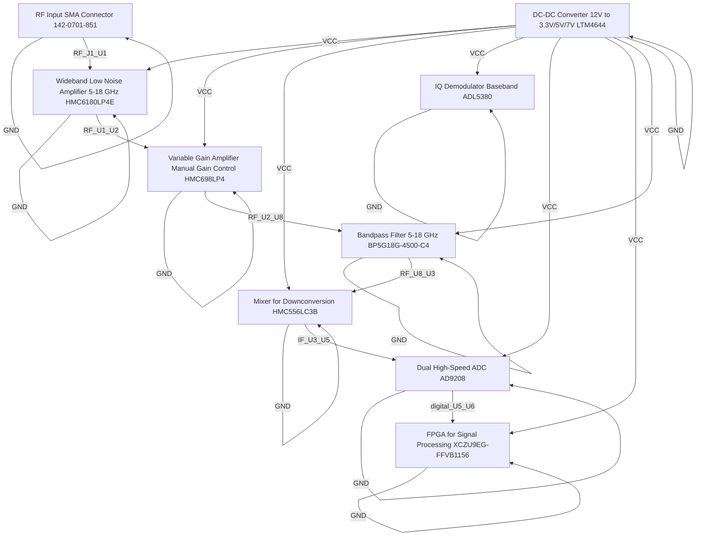

# Logical Netlist
## rx module

## Block Diagram

## Component Instances

| Ref | Part Number | Component |
|---|---|---|
| U1 | HMC6180LP4E | Wideband Low Noise Amplifier (5-18 GHz) |
| U2 | HMC698LP4 | Variable Gain Amplifier (Manual Gain Control) |
| U3 | HMC556LC3B | Mixer for Downconversion |
| U4 | ADL5380 | IQ Demodulator (Baseband) |
| U5 | AD9208 | Dual High-Speed ADC |
| U6 | XCZU9EG-FFVB1156 | FPGA for Signal Processing |
| U7 | LTM4644 | DC-DC Converter 12V to 3.3V/5V/7V |
| J1 | 142-0701-851 | RF Input SMA Connector |
| U8 | BP5G18G-4500-C4 | Bandpass Filter 5-18 GHz |

## Pin-to-Pin Connections

| Net | From | Pin | To | Pin | Type |
|---|---|---|---|---|---|
| VCC | U7 | OUT | U1 | VCC | power |
| VCC | U7 | OUT | U2 | VCC | power |
| VCC | U7 | OUT | U3 | VCC | power |
| VCC | U7 | OUT | U4 | VCC | power |
| VCC | U7 | OUT | U5 | VCC | power |
| VCC | U7 | OUT | U6 | VCC | power |
| VCC | U7 | OUT | U8 | VCC | power |
| GND | U1 | GND | U1 | GND | ground |
| GND | U2 | GND | U2 | GND | ground |
| GND | U3 | GND | U3 | GND | ground |
| GND | U4 | GND | U4 | GND | ground |
| GND | U5 | GND | U5 | GND | ground |
| GND | U6 | GND | U6 | GND | ground |
| GND | U7 | GND | U7 | GND | ground |
| GND | J1 | GND | J1 | GND | ground |
| GND | U8 | GND | U8 | GND | ground |
| RF_J1_U1 | J1 | OUT | U1 | IN | rf |
| RF_U1_U2 | U1 | OUT | U2 | IN | rf |
| RF_U2_U8 | U2 | OUT | U8 | IN | rf |
| RF_U8_U3 | U8 | OUT | U3 | IN | rf |
| IF_U3_U5 | U3 | OUT | U5 | IN | if |
| digital_U5_U6 | U5 | OUT | U6 | IN | digital |

## Net Connection List

| Net Name | Reference Designator - Pin No. |
|----------|-------------------------------|
| GND | U1 - GND,  U2 - GND,  U3 - GND,  U4 - GND,  U5 - GND,  U6 - GND,  U7 - GND,  J1 - GND,  U8 - GND |
| IF_U3_U5 | U3 - OUT,  U5 - IN |
| RF_J1_U1 | J1 - OUT,  U1 - IN |
| RF_U1_U2 | U1 - OUT,  U2 - IN |
| RF_U2_U8 | U2 - OUT,  U8 - IN |
| RF_U8_U3 | U8 - OUT,  U3 - IN |
| VCC | U7 - OUT,  U1 - VCC,  U2 - VCC,  U3 - VCC,  U4 - VCC,  U5 - VCC,  U6 - VCC,  U8 - VCC |
| digital_U5_U6 | U5 - OUT,  U6 - IN |

## Validation Notes

- INFO: Auto-extracted 9 components from P1 BOM
- INFO: Generated 22 connections based on signal chain analysis
- INFO: Power nets: VCC
- INFO: Ground nets: AGND, GND