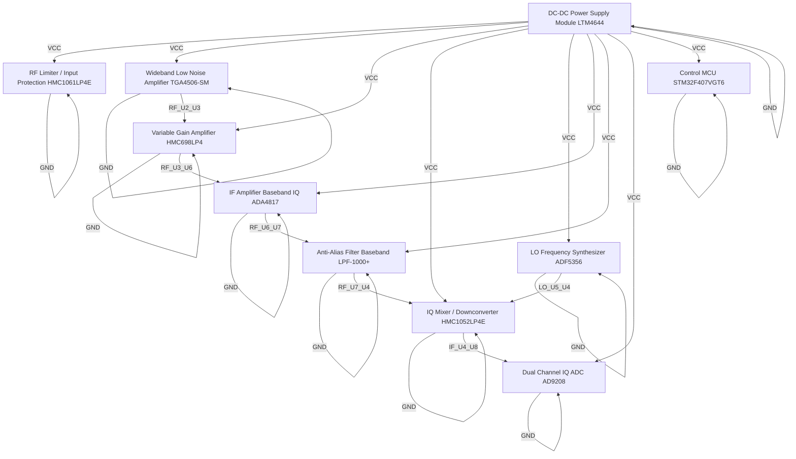

# Logical Netlist
## receiver

## Block Diagram

## Component Instances

| Ref | Part Number | Component |
|---|---|---|
| U1 | HMC1061LP4E | RF Limiter / Input Protection |
| U2 | TGA4506-SM | Wideband Low Noise Amplifier |
| U3 | HMC698LP4 | Variable Gain Amplifier |
| U4 | HMC1052LP4E | IQ Mixer / Downconverter |
| U5 | ADF5356 | LO Frequency Synthesizer |
| U6 | ADA4817 | IF Amplifier (Baseband IQ) |
| U7 | LPF-1000+ | Anti-Alias Filter (Baseband) |
| U8 | AD9208 | Dual Channel IQ ADC |
| U9 | STM32F407VGT6 | Control MCU |
| U10 | LTM4644 | DC-DC Power Supply Module |

## Pin-to-Pin Connections

| Net | From | Pin | To | Pin | Type |
|---|---|---|---|---|---|
| VCC | U10 | OUT | U1 | VCC | power |
| VCC | U10 | OUT | U2 | VCC | power |
| VCC | U10 | OUT | U3 | VCC | power |
| VCC | U10 | OUT | U4 | VCC | power |
| VCC | U10 | OUT | U5 | VCC | power |
| VCC | U10 | OUT | U6 | VCC | power |
| VCC | U10 | OUT | U7 | VCC | power |
| VCC | U10 | OUT | U8 | VCC | power |
| VCC | U10 | OUT | U9 | VCC | power |
| GND | U1 | GND | U1 | GND | ground |
| GND | U2 | GND | U2 | GND | ground |
| GND | U3 | GND | U3 | GND | ground |
| GND | U4 | GND | U4 | GND | ground |
| GND | U5 | GND | U5 | GND | ground |
| GND | U6 | GND | U6 | GND | ground |
| GND | U7 | GND | U7 | GND | ground |
| GND | U8 | GND | U8 | GND | ground |
| GND | U9 | GND | U9 | GND | ground |
| GND | U10 | GND | U10 | GND | ground |
| RF_U2_U3 | U2 | OUT | U3 | IN | rf |
| RF_U3_U6 | U3 | OUT | U6 | IN | rf |
| RF_U6_U7 | U6 | OUT | U7 | IN | rf |
| RF_U7_U4 | U7 | OUT | U4 | IN | rf |
| IF_U4_U8 | U4 | OUT | U8 | IN | if |
| LO_U5_U4 | U5 | RF_OUT | U4 | LO | clock |

## Net Connection List

| Net Name | Reference Designator - Pin No. |
|----------|-------------------------------|
| GND | U1 - GND,  U2 - GND,  U3 - GND,  U4 - GND,  U5 - GND,  U6 - GND,  U7 - GND,  U8 - GND,  U9 - GND,  U10 - GND |
| IF_U4_U8 | U4 - OUT,  U8 - IN |
| LO_U5_U4 | U5 - RF_OUT,  U4 - LO |
| RF_U2_U3 | U2 - OUT,  U3 - IN |
| RF_U3_U6 | U3 - OUT,  U6 - IN |
| RF_U6_U7 | U6 - OUT,  U7 - IN |
| RF_U7_U4 | U7 - OUT,  U4 - IN |
| VCC | U10 - OUT,  U1 - VCC,  U2 - VCC,  U3 - VCC,  U4 - VCC,  U5 - VCC,  U6 - VCC,  U7 - VCC,  U8 - VCC,  U9 - VCC |

## Validation Notes

- INFO: Auto-extracted 10 components from P1 BOM
- INFO: Generated 25 connections based on signal chain analysis
- INFO: Power nets: VCC
- INFO: Ground nets: AGND, GND
- WARNING: No FPGA/processor detected in BOM