# Logical Netlist
## khg

## Block Diagram

```mermaid
graph TB
    U1[LNA TQM473552]
    U2[Digital Step Attenuator HMC698LP4]
    U3[IQ Demodulator MWC-1440+]
    U4[ADC Dual Channel ADC12DJ5200RF]
    U5[Clock Generator JESD204C LMX2594]
    U6[Quad LDO Regulator TPS7A4700]
    U7[Wideband High Gain Amp ADA4817-1ACPZ]
    U8[Wideband High Gain Amp ADA4817-1ACPZ]
    U9[PWM Controller LT8650S]
    U10[DCDC Converter LTC7151S]
    U11[3.3V LDO Regulator TPS7A4700]
    U12[2.5V LDO Regulator TPS7A47]
    U13[1.8V LDO Regulator TPS7A47]
    U14[1.0V LDO Regulator TPS62913]
    D1[RF Limiter LPA-518+]
    FL1[Bandpass Filter 5-18GHz BP5G18G-5180-SM]
    J1[RF Input Connector SMA-EDGE-JACK]
    J2[Control Interface Connector FTSH-105-01-L-DV]
    J3[JESD204C Interface Samtec Edge Rate]
    J4[Power Input Connector Molex 43650]
    T1[RF Transformer 1:4 EGL-2462]
    T2[RF Transformer 1:4 EGL-2462]
    L1[Power Inductor XEL4030]
    C1[RF DC Block Capacitor GRM1555C1H100GA01]
    C2[Decoupling Capacitor GRM32ER71C476KA15L]
    C3[Decoupling Capacitor GRM32ER71C476KA15L]
    C4[Decoupling Capacitor GRM32ER71C476KA15L]
    C5[Decoupling Capacitor GRM32ER71C476KA15L]
    C6[Decoupling Capacitor GRM32ER71C476KA15L]
    C7[Decoupling Capacitor GRM32ER71C476KA15L]
    C8[Decoupling Capacitor GRM32ER71C476KA15L]
    C9[Decoupling Capacitor GRM32ER71C476KA15L]
    C10[Decoupling Capacitor GRM32ER71C476KA15L]
    C11[Decoupling Capacitor GRM32ER71C476KA15L]
    C12[Decoupling Capacitor GRM32ER71C476KA15L]
    C13[Decoupling Capacitor GRM32ER71C476KA15L]
    C14[Decoupling Capacitor GRM32ER71C476KA15L]
    C15[Decoupling Capacitor 0402YD106KAT2A]
    C16[Decoupling Capacitor 0402YD106KAT2A]
    C17[Decoupling Capacitor GRM1555C1H100JA01]
    C18[Decoupling Capacitor GRM1555C1H100JA01]
    C19[Decoupling Capacitor GRM1555C1H100JA01]
    C20[Decoupling Capacitor GRM1555C1H100JA01]
    R1[Input Bias Resistor RC0402FR-074K7L]
    R2[Input Bias Resistor RC0402FR-074K7L]
    R3[Feedback Resistor ERA-2AED1001X]
    R4[Feedback Resistor ERA-2AED1001X]
    R5[Feedback Resistor ERA-2AED1001X]
    R6[Feedback Resistor ERA-2AED1001X]
    R7[Feedback Resistor ERA-2AED1001X]
    R8[Feedback Resistor ERA-2AED1001X]
    R9[Output Resistor ERA-2AED2203X]
    R10[Output Resistor ERA-2AED2203X]
    J1 -->|RF_IN| D1
    D1 -->|RF_LIMITED| FL1
    FL1 -->|RF_FILTERED| U1
    U1 -->|RF_LNA_OUT| U2
    U2 -->|RF_VGA_OUT| U3
    U5 -->|LO_IN| U3
    U3 -->|IF_I_P| U7
    U3 -->|IF_I_N| U7
    U3 -->|IF_Q_P| U8
    U3 -->|IF_Q_N| U8
    U7 -->|ADC_IN_I_P| T1
    U8 -->|ADC_IN_Q_P| T2
    T1 -->|ADC_I_P| U4
    T1 -->|ADC_I_N| U4
    T2 -->|ADC_Q_P| U4
    T2 -->|ADC_Q_N| U4
    U4 -->|JESD_TX_P| J3
    U4 -->|JESD_TX_N| J3
    U5 -->|JESD_SYSREF_P| U4
    U5 -->|JESD_SYSREF_N| U4
    U5 -->|ADC_CLK_P| U4
    U5 -->|ADC_CLK_N| U4
    J4 -->|VCC_12V| U10
    U10 -->|VCC_5V| U6
    U10 -->|VCC_5V| U1
    U10 -->|VCC_5V| U2
    U10 -->|VCC_5V| U3
    U10 -->|VCC_5V| U5
    U6 -->|VCC_3V3| U11
    U11 -->|VCC_3V3| U4
    U6 -->|VCC_2V5| U12
    U12 -->|VCC_2V5| U4
    U6 -->|VCC_1V8| U13
    U13 -->|VCC_1V8| U5
    U14 -->|VCC_1V0| U4
    J2 -->|SPI_SCK| U4
    J2 -->|SPI_SCK| U5
    J2 -->|SPI_SCK| U2
    J2 -->|SPI_MOSI| U4
    J2 -->|SPI_MOSI| U5
    J2 -->|SPI_MISO| U4
    J2 -->|SPI_MISO| U5
    J2 -->|ADC_CS| U4
    J2 -->|PLL_CS| U5
    J2 -->|VGA_LE| U2
    J2 -->|VGA_D0| U2
    J2 -->|VGA_D1| U2
    J2 -->|VGA_D2| U2
    J2 -->|VGA_D3| U2
    J2 -->|VGA_D4| U2
    J2 -->|VGA_D5| U2
    J4 -->|GND| U10
    U10 -->|GND| U6
    U6 -->|GND| U1
    U1 -->|GND| U2
    U2 -->|GND| U3
    U3 -->|GND| U4
    U4 -->|GND| U5
    U5 -->|GND| U7
    U7 -->|GND| U8
    U11 -->|GND| U12
    U12 -->|GND| U13
    U13 -->|GND| U14
    J1 -->|GND| D1
    D1 -->|GND| FL1
    J3 -->|GND| U4
    U1 -->|VCC_5V_C1| C1
    C1 -->|GND_C1| U1
    U2 -->|VCC_5V_C2| C2
    C2 -->|GND_C2| U2
    U3 -->|VCC_5V_C3| C3
    C3 -->|GND_C3| U3
    U5 -->|VCC_5V_C4| C4
    C4 -->|GND_C4| U5
    U4 -->|VCC_3V3_C5| C5
    C5 -->|GND_C5| U4
    U4 -->|VCC_2V5_C6| C6
    C6 -->|GND_C6| U4
    U5 -->|VCC_1V8_C7| C7
    C7 -->|GND_C7| U5
    U4 -->|VCC_1V0_C8| C8
    C8 -->|GND_C8| U4
    U7 -->|VCC_3V3_C9| C9
    C9 -->|GND_C9| U7
    U8 -->|VCC_3V3_C10| C10
    C10 -->|GND_C10| U8
```

## Component Instances

| Ref | Part Number | Component |
|---|---|---|
| U1 | TQM473552 | LNA |
| U2 | HMC698LP4 | Digital Step Attenuator |
| U3 | MWC-1440+ | IQ Demodulator |
| U4 | ADC12DJ5200RF | ADC Dual Channel |
| U5 | LMX2594 | Clock Generator JESD204C |
| U6 | TPS7A4700 | Quad LDO Regulator |
| U7 | ADA4817-1ACPZ | Wideband High Gain Amp |
| U8 | ADA4817-1ACPZ | Wideband High Gain Amp |
| U9 | LT8650S | PWM Controller |
| U10 | LTC7151S | DCDC Converter |
| U11 | TPS7A4700 | 3.3V LDO Regulator |
| U12 | TPS7A47 | 2.5V LDO Regulator |
| U13 | TPS7A47 | 1.8V LDO Regulator |
| U14 | TPS62913 | 1.0V LDO Regulator |
| D1 | LPA-518+ | RF Limiter |
| FL1 | BP5G18G-5180-SM | Bandpass Filter 5-18GHz |
| J1 | SMA-EDGE-JACK | RF Input Connector |
| J2 | FTSH-105-01-L-DV | Control Interface Connector |
| J3 | Samtec Edge Rate | JESD204C Interface |
| J4 | Molex 43650 | Power Input Connector |
| T1 | EGL-2462 | RF Transformer 1:4 |
| T2 | EGL-2462 | RF Transformer 1:4 |
| L1 | XEL4030 | Power Inductor |
| C1 | GRM1555C1H100GA01 | RF DC Block Capacitor |
| C2 | GRM32ER71C476KA15L | Decoupling Capacitor |
| C3 | GRM32ER71C476KA15L | Decoupling Capacitor |
| C4 | GRM32ER71C476KA15L | Decoupling Capacitor |
| C5 | GRM32ER71C476KA15L | Decoupling Capacitor |
| C6 | GRM32ER71C476KA15L | Decoupling Capacitor |
| C7 | GRM32ER71C476KA15L | Decoupling Capacitor |
| C8 | GRM32ER71C476KA15L | Decoupling Capacitor |
| C9 | GRM32ER71C476KA15L | Decoupling Capacitor |
| C10 | GRM32ER71C476KA15L | Decoupling Capacitor |
| C11 | GRM32ER71C476KA15L | Decoupling Capacitor |
| C12 | GRM32ER71C476KA15L | Decoupling Capacitor |
| C13 | GRM32ER71C476KA15L | Decoupling Capacitor |
| C14 | GRM32ER71C476KA15L | Decoupling Capacitor |
| C15 | 0402YD106KAT2A | Decoupling Capacitor |
| C16 | 0402YD106KAT2A | Decoupling Capacitor |
| C17 | GRM1555C1H100JA01 | Decoupling Capacitor |
| C18 | GRM1555C1H100JA01 | Decoupling Capacitor |
| C19 | GRM1555C1H100JA01 | Decoupling Capacitor |
| C20 | GRM1555C1H100JA01 | Decoupling Capacitor |
| R1 | RC0402FR-074K7L | Input Bias Resistor |
| R2 | RC0402FR-074K7L | Input Bias Resistor |
| R3 | ERA-2AED1001X | Feedback Resistor |
| R4 | ERA-2AED1001X | Feedback Resistor |
| R5 | ERA-2AED1001X | Feedback Resistor |
| R6 | ERA-2AED1001X | Feedback Resistor |
| R7 | ERA-2AED1001X | Feedback Resistor |
| R8 | ERA-2AED1001X | Feedback Resistor |
| R9 | ERA-2AED2203X | Output Resistor |
| R10 | ERA-2AED2203X | Output Resistor |

## Pin-to-Pin Connections

| Net | From | Pin | To | Pin | Type |
|---|---|---|---|---|---|
| RF_IN | J1 | 1 | D1 | 1 | signal |
| RF_LIMITED | D1 | 2 | FL1 | 1 | signal |
| RF_FILTERED | FL1 | 2 | U1 | RF_IN | signal |
| RF_LNA_OUT | U1 | RF_OUT | U2 | RF_IN | signal |
| RF_VGA_OUT | U2 | RF_OUT | U3 | RF_IN | signal |
| LO_IN | U5 | RF_OUT_A | U3 | LO_IN | signal |
| IF_I_P | U3 | IF_I_P | U7 | IN+ | signal |
| IF_I_N | U3 | IF_I_N | U7 | IN- | differential |
| IF_Q_P | U3 | IF_Q_P | U8 | IN+ | signal |
| IF_Q_N | U3 | IF_Q_N | U8 | IN- | differential |
| ADC_IN_I_P | U7 | OUT | T1 | 1 | signal |
| ADC_IN_Q_P | U8 | OUT | T2 | 1 | signal |
| ADC_I_P | T1 | 3 | U4 | VIN1_P | differential |
| ADC_I_N | T1 | 4 | U4 | VIN1_N | differential |
| ADC_Q_P | T2 | 3 | U4 | VIN2_P | differential |
| ADC_Q_N | T2 | 4 | U4 | VIN2_N | differential |
| JESD_TX_P | U4 | DO0_P | J3 | 2 | differential |
| JESD_TX_N | U4 | DO0_N | J3 | 4 | differential |
| JESD_SYSREF_P | U5 | SYSREF_P | U4 | SYSREF_P | differential |
| JESD_SYSREF_N | U5 | SYSREF_N | U4 | SYSREF_N | differential |
| ADC_CLK_P | U5 | CLKOUT_P | U4 | CLKIN_P | differential |
| ADC_CLK_N | U5 | CLKOUT_N | U4 | CLKIN_N | differential |
| VCC_12V | J4 | 1 | U10 | VIN | power |
| VCC_5V | U10 | SW | U6 | IN | power |
| VCC_5V | U10 | SW | U1 | VCC | power |
| VCC_5V | U10 | SW | U2 | VCC | power |
| VCC_5V | U10 | SW | U3 | VCC | power |
| VCC_5V | U10 | SW | U5 | VCC | power |
| VCC_3V3 | U6 | OUT1 | U11 | IN | power |
| VCC_3V3 | U11 | OUT | U4 | AVDD | power |
| VCC_2V5 | U6 | OUT2 | U12 | IN | power |
| VCC_2V5 | U12 | OUT | U4 | DVDD | power |
| VCC_1V8 | U6 | OUT3 | U13 | IN | power |
| VCC_1V8 | U13 | OUT | U5 | DVDD | power |
| VCC_1V0 | U14 | OUT | U4 | CVDD | power |
| SPI_SCK | J2 | 5 | U4 | SCLK | signal |
| SPI_SCK | J2 | 5 | U5 | SCLK | signal |
| SPI_SCK | J2 | 5 | U2 | CLK | signal |
| SPI_MOSI | J2 | 3 | U4 | SDIO | signal |
| SPI_MOSI | J2 | 3 | U5 | MOSI | signal |
| SPI_MISO | J2 | 1 | U4 | SDIO | signal |
| SPI_MISO | J2 | 1 | U5 | MISO | signal |
| ADC_CS | J2 | 7 | U4 | CSB | signal |
| PLL_CS | J2 | 9 | U5 | CS | signal |
| VGA_LE | J2 | 11 | U2 | LE | signal |
| VGA_D0 | J2 | 13 | U2 | D0 | signal |
| VGA_D1 | J2 | 15 | U2 | D1 | signal |
| VGA_D2 | J2 | 17 | U2 | D2 | signal |
| VGA_D3 | J2 | 19 | U2 | D3 | signal |
| VGA_D4 | J2 | 21 | U2 | D4 | signal |
| VGA_D5 | J2 | 23 | U2 | D5 | signal |
| GND | J4 | 2 | U10 | GND | ground |
| GND | U10 | GND | U6 | GND | ground |
| GND | U6 | GND | U1 | GND | ground |
| GND | U1 | GND | U2 | GND | ground |
| GND | U2 | GND | U3 | GND | ground |
| GND | U3 | GND | U4 | GND | ground |
| GND | U4 | GND | U5 | GND | ground |
| GND | U5 | GND | U7 | GND | ground |
| GND | U7 | GND | U8 | GND | ground |
| GND | U11 | GND | U12 | GND | ground |
| GND | U12 | GND | U13 | GND | ground |
| GND | U13 | GND | U14 | GND | ground |
| GND | J1 | 2 | D1 | GND | ground |
| GND | D1 | GND | FL1 | GND | ground |
| GND | J3 | 1 | U4 | GND | ground |
| VCC_5V_C1 | U1 | VCC | C1 | 1 | power |
| GND_C1 | C1 | 2 | U1 | GND | ground |
| VCC_5V_C2 | U2 | VCC | C2 | 1 | power |
| GND_C2 | C2 | 2 | U2 | GND | ground |
| VCC_5V_C3 | U3 | VCC | C3 | 1 | power |
| GND_C3 | C3 | 2 | U3 | GND | ground |
| VCC_5V_C4 | U5 | VCC | C4 | 1 | power |
| GND_C4 | C4 | 2 | U5 | GND | ground |
| VCC_3V3_C5 | U4 | AVDD | C5 | 1 | power |
| GND_C5 | C5 | 2 | U4 | GND | ground |
| VCC_2V5_C6 | U4 | DVDD | C6 | 1 | power |
| GND_C6 | C6 | 2 | U4 | GND | ground |
| VCC_1V8_C7 | U5 | DVDD | C7 | 1 | power |
| GND_C7 | C7 | 2 | U5 | GND | ground |
| VCC_1V0_C8 | U4 | CVDD | C8 | 1 | power |
| GND_C8 | C8 | 2 | U4 | GND | ground |
| VCC_3V3_C9 | U7 | VCC | C9 | 1 | power |
| GND_C9 | C9 | 2 | U7 | GND | ground |
| VCC_3V3_C10 | U8 | VCC | C10 | 1 | power |
| GND_C10 | C10 | 2 | U8 | GND | ground |

## Net Connection List

| Net Name | Reference Designator - Pin No. |
|----------|-------------------------------|
| ADC_CLK_N | U5 - CLKOUT_N,  U4 - CLKIN_N |
| ADC_CLK_P | U5 - CLKOUT_P,  U4 - CLKIN_P |
| ADC_CS | J2 - 7,  U4 - CSB |
| ADC_IN_I_P | U7 - OUT,  T1 - 1 |
| ADC_IN_Q_P | U8 - OUT,  T2 - 1 |
| ADC_I_N | T1 - 4,  U4 - VIN1_N |
| ADC_I_P | T1 - 3,  U4 - VIN1_P |
| ADC_Q_N | T2 - 4,  U4 - VIN2_N |
| ADC_Q_P | T2 - 3,  U4 - VIN2_P |
| GND | J4 - 2,  U10 - GND,  U6 - GND,  U1 - GND,  U2 - GND,  U3 - GND,  U4 - GND,  U5 - GND,  U7 - GND,  U8 - GND,  U11 - GND,  U12 - GND,  U13 - GND,  U14 - GND,  J1 - 2,  D1 - GND,  FL1 - GND,  J3 - 1 |
| GND_C1 | C1 - 2,  U1 - GND |
| GND_C10 | C10 - 2,  U8 - GND |
| GND_C2 | C2 - 2,  U2 - GND |
| GND_C3 | C3 - 2,  U3 - GND |
| GND_C4 | C4 - 2,  U5 - GND |
| GND_C5 | C5 - 2,  U4 - GND |
| GND_C6 | C6 - 2,  U4 - GND |
| GND_C7 | C7 - 2,  U5 - GND |
| GND_C8 | C8 - 2,  U4 - GND |
| GND_C9 | C9 - 2,  U7 - GND |
| IF_I_N | U3 - IF_I_N,  U7 - IN- |
| IF_I_P | U3 - IF_I_P,  U7 - IN+ |
| IF_Q_N | U3 - IF_Q_N,  U8 - IN- |
| IF_Q_P | U3 - IF_Q_P,  U8 - IN+ |
| JESD_SYSREF_N | U5 - SYSREF_N,  U4 - SYSREF_N |
| JESD_SYSREF_P | U5 - SYSREF_P,  U4 - SYSREF_P |
| JESD_TX_N | U4 - DO0_N,  J3 - 4 |
| JESD_TX_P | U4 - DO0_P,  J3 - 2 |
| LO_IN | U5 - RF_OUT_A,  U3 - LO_IN |
| PLL_CS | J2 - 9,  U5 - CS |
| RF_FILTERED | FL1 - 2,  U1 - RF_IN |
| RF_IN | J1 - 1,  D1 - 1 |
| RF_LIMITED | D1 - 2,  FL1 - 1 |
| RF_LNA_OUT | U1 - RF_OUT,  U2 - RF_IN |
| RF_VGA_OUT | U2 - RF_OUT,  U3 - RF_IN |
| SPI_MISO | J2 - 1,  U4 - SDIO,  U5 - MISO |
| SPI_MOSI | J2 - 3,  U4 - SDIO,  U5 - MOSI |
| SPI_SCK | J2 - 5,  U4 - SCLK,  U5 - SCLK,  U2 - CLK |
| VCC_12V | J4 - 1,  U10 - VIN |
| VCC_1V0 | U14 - OUT,  U4 - CVDD |
| VCC_1V0_C8 | U4 - CVDD,  C8 - 1 |
| VCC_1V8 | U6 - OUT3,  U13 - IN,  U13 - OUT,  U5 - DVDD |
| VCC_1V8_C7 | U5 - DVDD,  C7 - 1 |
| VCC_2V5 | U6 - OUT2,  U12 - IN,  U12 - OUT,  U4 - DVDD |
| VCC_2V5_C6 | U4 - DVDD,  C6 - 1 |
| VCC_3V3 | U6 - OUT1,  U11 - IN,  U11 - OUT,  U4 - AVDD |
| VCC_3V3_C10 | U8 - VCC,  C10 - 1 |
| VCC_3V3_C5 | U4 - AVDD,  C5 - 1 |
| VCC_3V3_C9 | U7 - VCC,  C9 - 1 |
| VCC_5V | U10 - SW,  U6 - IN,  U1 - VCC,  U2 - VCC,  U3 - VCC,  U5 - VCC |
| VCC_5V_C1 | U1 - VCC,  C1 - 1 |
| VCC_5V_C2 | U2 - VCC,  C2 - 1 |
| VCC_5V_C3 | U3 - VCC,  C3 - 1 |
| VCC_5V_C4 | U5 - VCC,  C4 - 1 |
| VGA_D0 | J2 - 13,  U2 - D0 |
| VGA_D1 | J2 - 15,  U2 - D1 |
| VGA_D2 | J2 - 17,  U2 - D2 |
| VGA_D3 | J2 - 19,  U2 - D3 |
| VGA_D4 | J2 - 21,  U2 - D4 |
| VGA_D5 | J2 - 23,  U2 - D5 |
| VGA_LE | J2 - 11,  U2 - LE |

## Validation Notes

- WARNING: HMC698LP4 operating temperature (-40 to +85°C) does not meet full military temp range (-55 to +125°C). Consider HMC1119 variant for full military compliance.
- WARNING: LT8650S temperature range should be verified for -55°C operation. Derating may be required.
- INFO: Total estimated power consumption: ~35-40W (within 50W budget target).
- INFO: All IC power pins have appropriate decoupling capacitors specified (100nF ceramic).
- INFO: Differential impedance matching required on JESD204C lanes (100Ω differential).
- INFO: ADC clock routing requires controlled impedance (50Ω single-ended or 100Ω differential).
- REVIEW: LO signal power to mixer - verify +10dBm drive level from LMX2594 output.
- REVIEW: SPI interface voltage levels - verify all devices compatible with 3.3V logic levels.
- REVIEW: RF layout considerations - maintain 50Ω controlled impedance throughout signal chain.
- REVIEW: Thermal management required for U4 ADC (high-speed digitization generates significant heat).
- REVIEW: EMI/EMC considerations for 12GHz+ signals - proper shielding and filtering required.