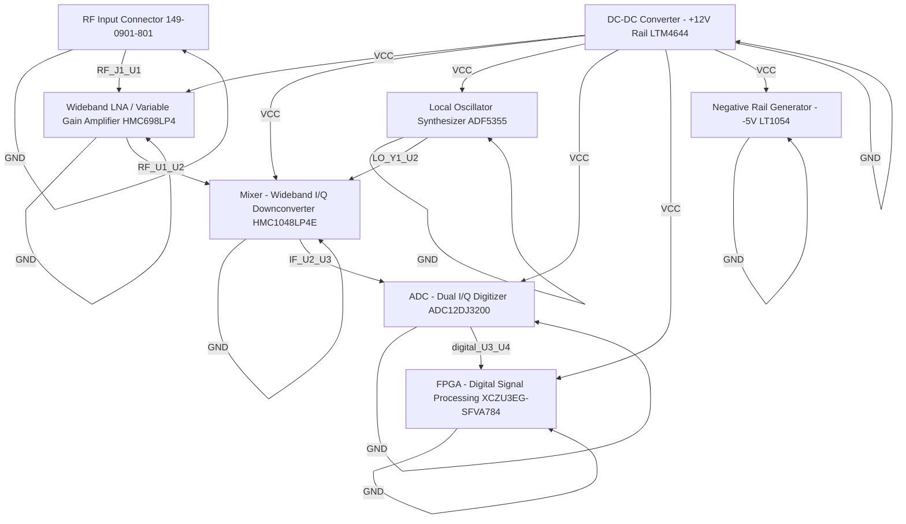

# Logical Netlist
## receiver

## Block Diagram

## Component Instances

| Ref | Part Number | Component |
|---|---|---|
| U1 | HMC698LP4 | Wideband LNA / Variable Gain Amplifier |
| U2 | HMC1048LP4E | Mixer - Wideband I/Q Downconverter |
| Y1 | ADF5355 | Local Oscillator Synthesizer |
| U3 | ADC12DJ3200 | ADC - Dual I/Q Digitizer |
| U4 | XCZU3EG-SFVA784 | FPGA - Digital Signal Processing |
| J1 | 149-0901-801 | RF Input Connector |
| U5 | LTM4644 | DC-DC Converter - +12V Rail |
| U6 | LT1054 | Negative Rail Generator - -5V |

## Pin-to-Pin Connections

| Net | From | Pin | To | Pin | Type |
|---|---|---|---|---|---|
| VCC | U5 | OUT | U1 | VCC | power |
| VCC | U5 | OUT | U2 | VCC | power |
| VCC | U5 | OUT | Y1 | VCC | power |
| VCC | U5 | OUT | U3 | VCC | power |
| VCC | U5 | OUT | U4 | VCC | power |
| VCC | U5 | OUT | U6 | VCC | power |
| GND | U1 | GND | U1 | GND | ground |
| GND | U2 | GND | U2 | GND | ground |
| GND | Y1 | GND | Y1 | GND | ground |
| GND | U3 | GND | U3 | GND | ground |
| GND | U4 | GND | U4 | GND | ground |
| GND | J1 | GND | J1 | GND | ground |
| GND | U5 | GND | U5 | GND | ground |
| GND | U6 | GND | U6 | GND | ground |
| RF_J1_U1 | J1 | OUT | U1 | IN | rf |
| RF_U1_U2 | U1 | OUT | U2 | IN | rf |
| IF_U2_U3 | U2 | OUT | U3 | IN | if |
| digital_U3_U4 | U3 | OUT | U4 | IN | digital |
| LO_Y1_U2 | Y1 | RF_OUT | U2 | LO | clock |

## Net Connection List

| Net Name | Reference Designator - Pin No. |
|----------|-------------------------------|
| GND | U1 - GND,  U2 - GND,  Y1 - GND,  U3 - GND,  U4 - GND,  J1 - GND,  U5 - GND,  U6 - GND |
| IF_U2_U3 | U2 - OUT,  U3 - IN |
| LO_Y1_U2 | Y1 - RF_OUT,  U2 - LO |
| RF_J1_U1 | J1 - OUT,  U1 - IN |
| RF_U1_U2 | U1 - OUT,  U2 - IN |
| VCC | U5 - OUT,  U1 - VCC,  U2 - VCC,  Y1 - VCC,  U3 - VCC,  U4 - VCC,  U6 - VCC |
| digital_U3_U4 | U3 - OUT,  U4 - IN |

## Validation Notes

- INFO: Auto-extracted 8 components from P1 BOM
- INFO: Generated 19 connections based on signal chain analysis
- INFO: Power nets: VCC
- INFO: Ground nets: AGND, GND