# Logical Netlist
## hfuf

## Block Diagram

```mermaid
graph TB
    J1[RF_CONN_2.92mm_F 2.92mm-K-FEMALE]
    LIM1[LIMITER_PIN SKY16602-632LF]
    F1[BPF_LTCC BFHK-5001+]
    BT1[BIAS_TEE PE1604]
    U1[GAIN_BLOCK LVA-273PN+]
    U2[GAIN_BLOCK LVA-273PN+]
    U3[GAIN_BLOCK LVA-273PN+]
    J2[RF_CONN_2.92mm_F 2.92mm-K-FEMALE]
    J3[RF_CONN_2.92mm_F 2.92mm-K-FEMALE]
    LIM2[LIMITER_PIN SKY16602-632LF]
    F2[BPF_LTCC BFHK-5001+]
    BT2[BIAS_TEE PE1604]
    U4[GAIN_BLOCK LVA-273PN+]
    U5[GAIN_BLOCK LVA-273PN+]
    U6[GAIN_BLOCK LVA-273PN+]
    J4[RF_CONN_2.92mm_F 2.92mm-K-FEMALE]
    J5[RF_CONN_2.92mm_F 2.92mm-K-FEMALE]
    LIM3[LIMITER_PIN SKY16602-632LF]
    F3[BPF_LTCC BFHK-5001+]
    BT3[BIAS_TEE PE1604]
    U7[GAIN_BLOCK LVA-273PN+]
    U8[GAIN_BLOCK LVA-273PN+]
    U9[GAIN_BLOCK LVA-273PN+]
    J6[RF_CONN_2.92mm_F 2.92mm-K-FEMALE]
    J7[RF_CONN_2.92mm_F 2.92mm-K-FEMALE]
    LIM4[LIMITER_PIN SKY16602-632LF]
    F4[BPF_LTCC BFHK-5001+]
    BT4[BIAS_TEE PE1604]
    U10[GAIN_BLOCK LVA-273PN+]
    U11[GAIN_BLOCK LVA-273PN+]
    U12[GAIN_BLOCK LVA-273PN+]
    J8[RF_CONN_2.92mm_F 2.92mm-K-FEMALE]
    U13[BUCK_REG_5V TPS62136RGXR]
    U14[LDO_3V3 MIC5209-3.3YM]
    J9[DC_INPUT_JACK CONN_DC_2PIN]
    U15[ACTIVE_BIAS_CTRL GATE_CTRL_BIAS_ABC]
    C1[CAPACITOR_100NF CAP_CER_100NF]
    C2[CAPACITOR_100NF CAP_CER_100NF]
    C3[CAPACITOR_100NF CAP_CER_100NF]
    C4[CAPACITOR_100NF CAP_CER_100NF]
    C5[CAPACITOR_100NF CAP_CER_100NF]
    C6[CAPACITOR_100NF CAP_CER_100NF]
    C7[CAPACITOR_100NF CAP_CER_100NF]
    C8[CAPACITOR_100NF CAP_CER_100NF]
    C9[CAPACITOR_100NF CAP_CER_100NF]
    C10[CAPACITOR_100NF CAP_CER_100NF]
    C11[CAPACITOR_100NF CAP_CER_100NF]
    C12[CAPACITOR_100NF CAP_CER_100NF]
    C13[CAPACITOR_10UF CAP_CER_10UF]
    C14[CAPACITOR_10UF CAP_CER_10UF]
    C15[CAPACITOR_10UF CAP_CER_10UF]
    C16[CAPACITOR_10UF CAP_CER_10UF]
    C17[CAPACITOR_47UF CAP_CER_47UF]
    C18[CAPACITOR_47UF CAP_CER_47UF]
    L1[INDUCTOR_4U7 IND_4U7_PWR]
    R1[RESISTOR_10K RES_10K]
    R2[RESISTOR_10K RES_10K]
    R3[RESISTOR_100K RES_100K]
    R4[RESISTOR_10K RES_10K]
    J1 -->|RF_IN_CH1| LIM1
    LIM1 -->|RF_LIM1_F1| F1
    F1 -->|RF_F1_BT1| BT1
    BT1 -->|RF_BT1_U1| U1
    U1 -->|RF_U1_U2| U2
    U2 -->|RF_U2_U3| U3
    U3 -->|RF_OUT_CH1| J2
    J3 -->|RF_IN_CH2| LIM2
    LIM2 -->|RF_LIM2_F2| F2
    F2 -->|RF_F2_BT2| BT2
    BT2 -->|RF_BT2_U4| U4
    U4 -->|RF_U4_U5| U5
    U5 -->|RF_U5_U6| U6
    U6 -->|RF_OUT_CH2| J4
    J5 -->|RF_IN_CH3| LIM3
    LIM3 -->|RF_LIM3_F3| F3
    F3 -->|RF_F3_BT3| BT3
    BT3 -->|RF_BT3_U7| U7
    U7 -->|RF_U7_U8| U8
    U8 -->|RF_U8_U9| U9
    U9 -->|RF_OUT_CH3| J6
    J7 -->|RF_IN_CH4| LIM4
    LIM4 -->|RF_LIM4_F4| F4
    F4 -->|RF_F4_BT4| BT4
    BT4 -->|RF_BT4_U10| U10
    U10 -->|RF_U10_U11| U11
    U11 -->|RF_U11_U12| U12
    U12 -->|RF_OUT_CH4| J8
    J9 -->|DC_IN| U13
    J9 -->|12V_RAW| U15
    U13 -->|5V_BUCK| U14
    U13 -->|5V_BUCK| U15
    U14 -->|3V3_LDO| U15
    U15 -->|GATE_CH1| BT1
    U15 -->|GATE_CH2| BT2
    U15 -->|GATE_CH3| BT3
    U15 -->|GATE_CH4| BT4
    U13 -->|5V_BUCK| U1
    U13 -->|5V_BUCK| U2
    U13 -->|5V_BUCK| U3
    U13 -->|5V_BUCK| U4
    U13 -->|5V_BUCK| U5
    U13 -->|5V_BUCK| U6
    U13 -->|5V_BUCK| U7
    U13 -->|5V_BUCK| U8
    U13 -->|5V_BUCK| U9
    U13 -->|5V_BUCK| U10
    U13 -->|5V_BUCK| U11
    U13 -->|5V_BUCK| U12
    U13 -->|VDD_BUCK| C1
    C1 -->|GND| U13
    U14 -->|VDD_LDO| C2
    C2 -->|GND| U14
    U13 -->|VDD_BUCK| U1
    U1 -->|GND| C3
    U13 -->|VDD_BUCK| C3
    U13 -->|VDD_BUCK| U2
    U2 -->|GND| C4
    U13 -->|VDD_BUCK| C4
    U13 -->|VDD_BUCK| U3
    U3 -->|GND| C5
    U13 -->|VDD_BUCK| C5
    U13 -->|VDD_BUCK| U4
    U4 -->|GND| C6
    U13 -->|VDD_BUCK| C6
    U13 -->|VDD_BUCK| U5
    U5 -->|GND| C7
    U13 -->|VDD_BUCK| C7
    U13 -->|VDD_BUCK| U6
    U6 -->|GND| C8
    U13 -->|VDD_BUCK| C8
    U13 -->|VDD_BUCK| U7
    U7 -->|GND| C9
    U13 -->|VDD_BUCK| C9
    U13 -->|VDD_BUCK| U8
    U8 -->|GND| C10
    U13 -->|VDD_BUCK| C10
    U13 -->|VDD_BUCK| U9
    U9 -->|GND| C11
    U13 -->|VDD_BUCK| C11
    U13 -->|VDD_BUCK| U10
    U10 -->|GND| C12
    U13 -->|VDD_BUCK| C12
    U13 -->|VDD_BUCK| U11
    U11 -->|GND| C13
    U13 -->|VDD_BUCK| C13
    U13 -->|VDD_BUCK| U12
    U12 -->|GND| C14
    U13 -->|VDD_BUCK| C14
    J9 -->|DC_IN| C15
    C15 -->|GND| J9
    J9 -->|DC_IN| C16
    C16 -->|GND| U13
    LIM1 -->|GND| J9
    LIM2 -->|GND| J9
    LIM3 -->|GND| J9
    LIM4 -->|GND| J9
    F1 -->|GND| J9
    F2 -->|GND| J9
    F3 -->|GND| J9
    F4 -->|GND| J9
    R1 -->|EN_BUCK| U13
    U13 -->|5V_BUCK| R1
    R2 -->|EN_LDO| U14
    U13 -->|5V_BUCK| R2
    R3 -->|EN_ABC| U15
    U14 -->|3V3_LDO| R3
    R4 -->|SDA| U15
    U14 -->|3V3_LDO| R4
    U13 -->|VDD_BUCK| U15
    U15 -->|GND| J9
    U13 -->|GND| C17
    U13 -->|VDD_BUCK| C17
    U14 -->|VDD_LDO| C18
    C18 -->|GND| U14
    U13 -->|FB_BUCK| L1
    U13 -->|SW_BUCK| L1
    U13 -->|VDD_BUCK| L1
```

## Component Instances

| Ref | Part Number | Component |
|---|---|---|
| J1 | 2.92mm-K-FEMALE | RF_CONN_2.92mm_F |
| LIM1 | SKY16602-632LF | LIMITER_PIN |
| F1 | BFHK-5001+ | BPF_LTCC |
| BT1 | PE1604 | BIAS_TEE |
| U1 | LVA-273PN+ | GAIN_BLOCK |
| U2 | LVA-273PN+ | GAIN_BLOCK |
| U3 | LVA-273PN+ | GAIN_BLOCK |
| J2 | 2.92mm-K-FEMALE | RF_CONN_2.92mm_F |
| J3 | 2.92mm-K-FEMALE | RF_CONN_2.92mm_F |
| LIM2 | SKY16602-632LF | LIMITER_PIN |
| F2 | BFHK-5001+ | BPF_LTCC |
| BT2 | PE1604 | BIAS_TEE |
| U4 | LVA-273PN+ | GAIN_BLOCK |
| U5 | LVA-273PN+ | GAIN_BLOCK |
| U6 | LVA-273PN+ | GAIN_BLOCK |
| J4 | 2.92mm-K-FEMALE | RF_CONN_2.92mm_F |
| J5 | 2.92mm-K-FEMALE | RF_CONN_2.92mm_F |
| LIM3 | SKY16602-632LF | LIMITER_PIN |
| F3 | BFHK-5001+ | BPF_LTCC |
| BT3 | PE1604 | BIAS_TEE |
| U7 | LVA-273PN+ | GAIN_BLOCK |
| U8 | LVA-273PN+ | GAIN_BLOCK |
| U9 | LVA-273PN+ | GAIN_BLOCK |
| J6 | 2.92mm-K-FEMALE | RF_CONN_2.92mm_F |
| J7 | 2.92mm-K-FEMALE | RF_CONN_2.92mm_F |
| LIM4 | SKY16602-632LF | LIMITER_PIN |
| F4 | BFHK-5001+ | BPF_LTCC |
| BT4 | PE1604 | BIAS_TEE |
| U10 | LVA-273PN+ | GAIN_BLOCK |
| U11 | LVA-273PN+ | GAIN_BLOCK |
| U12 | LVA-273PN+ | GAIN_BLOCK |
| J8 | 2.92mm-K-FEMALE | RF_CONN_2.92mm_F |
| U13 | TPS62136RGXR | BUCK_REG_5V |
| U14 | MIC5209-3.3YM | LDO_3V3 |
| J9 | CONN_DC_2PIN | DC_INPUT_JACK |
| U15 | GATE_CTRL_BIAS_ABC | ACTIVE_BIAS_CTRL |
| C1 | CAP_CER_100NF | CAPACITOR_100NF |
| C2 | CAP_CER_100NF | CAPACITOR_100NF |
| C3 | CAP_CER_100NF | CAPACITOR_100NF |
| C4 | CAP_CER_100NF | CAPACITOR_100NF |
| C5 | CAP_CER_100NF | CAPACITOR_100NF |
| C6 | CAP_CER_100NF | CAPACITOR_100NF |
| C7 | CAP_CER_100NF | CAPACITOR_100NF |
| C8 | CAP_CER_100NF | CAPACITOR_100NF |
| C9 | CAP_CER_100NF | CAPACITOR_100NF |
| C10 | CAP_CER_100NF | CAPACITOR_100NF |
| C11 | CAP_CER_100NF | CAPACITOR_100NF |
| C12 | CAP_CER_100NF | CAPACITOR_100NF |
| C13 | CAP_CER_10UF | CAPACITOR_10UF |
| C14 | CAP_CER_10UF | CAPACITOR_10UF |
| C15 | CAP_CER_10UF | CAPACITOR_10UF |
| C16 | CAP_CER_10UF | CAPACITOR_10UF |
| C17 | CAP_CER_47UF | CAPACITOR_47UF |
| C18 | CAP_CER_47UF | CAPACITOR_47UF |
| L1 | IND_4U7_PWR | INDUCTOR_4U7 |
| R1 | RES_10K | RESISTOR_10K |
| R2 | RES_10K | RESISTOR_10K |
| R3 | RES_100K | RESISTOR_100K |
| R4 | RES_10K | RESISTOR_10K |

## Pin-to-Pin Connections

| Net | From | Pin | To | Pin | Type |
|---|---|---|---|---|---|
| RF_IN_CH1 | J1 | SIG | LIM1 | RF_IN | RF |
| RF_LIM1_F1 | LIM1 | RF_OUT | F1 | RF_IN | RF |
| RF_F1_BT1 | F1 | RF_OUT | BT1 | RF_IN | RF |
| RF_BT1_U1 | BT1 | RF_OUT | U1 | RF_IN | RF |
| RF_U1_U2 | U1 | RF_OUT | U2 | RF_IN | RF |
| RF_U2_U3 | U2 | RF_OUT | U3 | RF_IN | RF |
| RF_OUT_CH1 | U3 | RF_OUT | J2 | SIG | RF |
| RF_IN_CH2 | J3 | SIG | LIM2 | RF_IN | RF |
| RF_LIM2_F2 | LIM2 | RF_OUT | F2 | RF_IN | RF |
| RF_F2_BT2 | F2 | RF_OUT | BT2 | RF_IN | RF |
| RF_BT2_U4 | BT2 | RF_OUT | U4 | RF_IN | RF |
| RF_U4_U5 | U4 | RF_OUT | U5 | RF_IN | RF |
| RF_U5_U6 | U5 | RF_OUT | U6 | RF_IN | RF |
| RF_OUT_CH2 | U6 | RF_OUT | J4 | SIG | RF |
| RF_IN_CH3 | J5 | SIG | LIM3 | RF_IN | RF |
| RF_LIM3_F3 | LIM3 | RF_OUT | F3 | RF_IN | RF |
| RF_F3_BT3 | F3 | RF_OUT | BT3 | RF_IN | RF |
| RF_BT3_U7 | BT3 | RF_OUT | U7 | RF_IN | RF |
| RF_U7_U8 | U7 | RF_OUT | U8 | RF_IN | RF |
| RF_U8_U9 | U8 | RF_OUT | U9 | RF_IN | RF |
| RF_OUT_CH3 | U9 | RF_OUT | J6 | SIG | RF |
| RF_IN_CH4 | J7 | SIG | LIM4 | RF_IN | RF |
| RF_LIM4_F4 | LIM4 | RF_OUT | F4 | RF_IN | RF |
| RF_F4_BT4 | F4 | RF_OUT | BT4 | RF_IN | RF |
| RF_BT4_U10 | BT4 | RF_OUT | U10 | RF_IN | RF |
| RF_U10_U11 | U10 | RF_OUT | U11 | RF_IN | RF |
| RF_U11_U12 | U11 | RF_OUT | U12 | RF_IN | RF |
| RF_OUT_CH4 | U12 | RF_OUT | J8 | SIG | RF |
| DC_IN | J9 | +12V | U13 | VIN | power |
| 12V_RAW | J9 | +12V | U15 | VDD_12V | power |
| 5V_BUCK | U13 | VOUT | U14 | VIN | power |
| 5V_BUCK | U13 | VOUT | U15 | VDD_5V | power |
| 3V3_LDO | U14 | VOUT | U15 | VDD_3V3 | power |
| GATE_CH1 | U15 | GATE_OUT1 | BT1 | DC_IN | analog |
| GATE_CH2 | U15 | GATE_OUT2 | BT2 | DC_IN | analog |
| GATE_CH3 | U15 | GATE_OUT3 | BT3 | DC_IN | analog |
| GATE_CH4 | U15 | GATE_OUT4 | BT4 | DC_IN | analog |
| 5V_BUCK | U13 | VOUT | U1 | VDD | power |
| 5V_BUCK | U13 | VOUT | U2 | VDD | power |
| 5V_BUCK | U13 | VOUT | U3 | VDD | power |
| 5V_BUCK | U13 | VOUT | U4 | VDD | power |
| 5V_BUCK | U13 | VOUT | U5 | VDD | power |
| 5V_BUCK | U13 | VOUT | U6 | VDD | power |
| 5V_BUCK | U13 | VOUT | U7 | VDD | power |
| 5V_BUCK | U13 | VOUT | U8 | VDD | power |
| 5V_BUCK | U13 | VOUT | U9 | VDD | power |
| 5V_BUCK | U13 | VOUT | U10 | VDD | power |
| 5V_BUCK | U13 | VOUT | U11 | VDD | power |
| 5V_BUCK | U13 | VOUT | U12 | VDD | power |
| VDD_BUCK | U13 | VOUT | C1 | 1 | power |
| GND | C1 | 2 | U13 | GND | ground |
| VDD_LDO | U14 | VOUT | C2 | 1 | power |
| GND | C2 | 2 | U14 | GND | ground |
| VDD_BUCK | U13 | VOUT | U1 | VDD | power |
| GND | U1 | GND | C3 | 2 | ground |
| VDD_BUCK | U13 | VOUT | C3 | 1 | power |
| VDD_BUCK | U13 | VOUT | U2 | VDD | power |
| GND | U2 | GND | C4 | 2 | ground |
| VDD_BUCK | U13 | VOUT | C4 | 1 | power |
| VDD_BUCK | U13 | VOUT | U3 | VDD | power |
| GND | U3 | GND | C5 | 2 | ground |
| VDD_BUCK | U13 | VOUT | C5 | 1 | power |
| VDD_BUCK | U13 | VOUT | U4 | VDD | power |
| GND | U4 | GND | C6 | 2 | ground |
| VDD_BUCK | U13 | VOUT | C6 | 1 | power |
| VDD_BUCK | U13 | VOUT | U5 | VDD | power |
| GND | U5 | GND | C7 | 2 | ground |
| VDD_BUCK | U13 | VOUT | C7 | 1 | power |
| VDD_BUCK | U13 | VOUT | U6 | VDD | power |
| GND | U6 | GND | C8 | 2 | ground |
| VDD_BUCK | U13 | VOUT | C8 | 1 | power |
| VDD_BUCK | U13 | VOUT | U7 | VDD | power |
| GND | U7 | GND | C9 | 2 | ground |
| VDD_BUCK | U13 | VOUT | C9 | 1 | power |
| VDD_BUCK | U13 | VOUT | U8 | VDD | power |
| GND | U8 | GND | C10 | 2 | ground |
| VDD_BUCK | U13 | VOUT | C10 | 1 | power |
| VDD_BUCK | U13 | VOUT | U9 | VDD | power |
| GND | U9 | GND | C11 | 2 | ground |
| VDD_BUCK | U13 | VOUT | C11 | 1 | power |
| VDD_BUCK | U13 | VOUT | U10 | VDD | power |
| GND | U10 | GND | C12 | 2 | ground |
| VDD_BUCK | U13 | VOUT | C12 | 1 | power |
| VDD_BUCK | U13 | VOUT | U11 | VDD | power |
| GND | U11 | GND | C13 | 2 | ground |
| VDD_BUCK | U13 | VOUT | C13 | 1 | power |
| VDD_BUCK | U13 | VOUT | U12 | VDD | power |
| GND | U12 | GND | C14 | 2 | ground |
| VDD_BUCK | U13 | VOUT | C14 | 1 | power |
| DC_IN | J9 | +12V | C15 | 1 | power |
| GND | C15 | 2 | J9 | GND | ground |
| DC_IN | J9 | +12V | C16 | 1 | power |
| GND | C16 | 2 | U13 | GND | ground |
| GND | LIM1 | GND | J9 | GND | ground |
| GND | LIM2 | GND | J9 | GND | ground |
| GND | LIM3 | GND | J9 | GND | ground |
| GND | LIM4 | GND | J9 | GND | ground |
| GND | F1 | GND | J9 | GND | ground |
| GND | F2 | GND | J9 | GND | ground |
| GND | F3 | GND | J9 | GND | ground |
| GND | F4 | GND | J9 | GND | ground |
| EN_BUCK | R1 | 2 | U13 | EN | digital |
| 5V_BUCK | U13 | VOUT | R1 | 1 | power |
| EN_LDO | R2 | 2 | U14 | EN | digital |
| 5V_BUCK | U13 | VOUT | R2 | 1 | power |
| EN_ABC | R3 | 2 | U15 | EN | digital |
| 3V3_LDO | U14 | VOUT | R3 | 1 | power |
| SDA | R4 | 1 | U15 | SDA | digital |
| 3V3_LDO | U14 | VOUT | R4 | 2 | power |
| VDD_BUCK | U13 | VOUT | U15 | VDD_5V | power |
| GND | U15 | GND | J9 | GND | ground |
| GND | U13 | GND | C17 | 2 | ground |
| VDD_BUCK | U13 | VOUT | C17 | 1 | power |
| VDD_LDO | U14 | VOUT | C18 | 1 | power |
| GND | C18 | 2 | U14 | GND | ground |
| FB_BUCK | U13 | FB | L1 | 1 | analog |
| SW_BUCK | U13 | SW | L1 | 2 | power |
| VDD_BUCK | U13 | VOUT | L1 | 2 | power |

## Net Connection List

| Net Name | Reference Designator - Pin No. |
|----------|-------------------------------|
| 12V_RAW | J9 - +12V,  U15 - VDD_12V |
| 3V3_LDO | U14 - VOUT,  U15 - VDD_3V3,  R3 - 1,  R4 - 2 |
| 5V_BUCK | U13 - VOUT,  U14 - VIN,  U15 - VDD_5V,  U1 - VDD,  U2 - VDD,  U3 - VDD,  U4 - VDD,  U5 - VDD,  U6 - VDD,  U7 - VDD,  U8 - VDD,  U9 - VDD,  U10 - VDD,  U11 - VDD,  U12 - VDD,  R1 - 1,  R2 - 1 |
| DC_IN | J9 - +12V,  U13 - VIN,  C15 - 1,  C16 - 1 |
| EN_ABC | R3 - 2,  U15 - EN |
| EN_BUCK | R1 - 2,  U13 - EN |
| EN_LDO | R2 - 2,  U14 - EN |
| FB_BUCK | U13 - FB,  L1 - 1 |
| GATE_CH1 | U15 - GATE_OUT1,  BT1 - DC_IN |
| GATE_CH2 | U15 - GATE_OUT2,  BT2 - DC_IN |
| GATE_CH3 | U15 - GATE_OUT3,  BT3 - DC_IN |
| GATE_CH4 | U15 - GATE_OUT4,  BT4 - DC_IN |
| GND | C1 - 2,  U13 - GND,  C2 - 2,  U14 - GND,  U1 - GND,  C3 - 2,  U2 - GND,  C4 - 2,  U3 - GND,  C5 - 2,  U4 - GND,  C6 - 2,  U5 - GND,  C7 - 2,  U6 - GND,  C8 - 2,  U7 - GND,  C9 - 2,  U8 - GND,  C10 - 2,  U9 - GND,  C11 - 2,  U10 - GND,  C12 - 2,  U11 - GND,  C13 - 2,  U12 - GND,  C14 - 2,  C15 - 2,  J9 - GND,  C16 - 2,  LIM1 - GND,  LIM2 - GND,  LIM3 - GND,  LIM4 - GND,  F1 - GND,  F2 - GND,  F3 - GND,  F4 - GND,  U15 - GND,  C17 - 2,  C18 - 2 |
| RF_BT1_U1 | BT1 - RF_OUT,  U1 - RF_IN |
| RF_BT2_U4 | BT2 - RF_OUT,  U4 - RF_IN |
| RF_BT3_U7 | BT3 - RF_OUT,  U7 - RF_IN |
| RF_BT4_U10 | BT4 - RF_OUT,  U10 - RF_IN |
| RF_F1_BT1 | F1 - RF_OUT,  BT1 - RF_IN |
| RF_F2_BT2 | F2 - RF_OUT,  BT2 - RF_IN |
| RF_F3_BT3 | F3 - RF_OUT,  BT3 - RF_IN |
| RF_F4_BT4 | F4 - RF_OUT,  BT4 - RF_IN |
| RF_IN_CH1 | J1 - SIG,  LIM1 - RF_IN |
| RF_IN_CH2 | J3 - SIG,  LIM2 - RF_IN |
| RF_IN_CH3 | J5 - SIG,  LIM3 - RF_IN |
| RF_IN_CH4 | J7 - SIG,  LIM4 - RF_IN |
| RF_LIM1_F1 | LIM1 - RF_OUT,  F1 - RF_IN |
| RF_LIM2_F2 | LIM2 - RF_OUT,  F2 - RF_IN |
| RF_LIM3_F3 | LIM3 - RF_OUT,  F3 - RF_IN |
| RF_LIM4_F4 | LIM4 - RF_OUT,  F4 - RF_IN |
| RF_OUT_CH1 | U3 - RF_OUT,  J2 - SIG |
| RF_OUT_CH2 | U6 - RF_OUT,  J4 - SIG |
| RF_OUT_CH3 | U9 - RF_OUT,  J6 - SIG |
| RF_OUT_CH4 | U12 - RF_OUT,  J8 - SIG |
| RF_U10_U11 | U10 - RF_OUT,  U11 - RF_IN |
| RF_U11_U12 | U11 - RF_OUT,  U12 - RF_IN |
| RF_U1_U2 | U1 - RF_OUT,  U2 - RF_IN |
| RF_U2_U3 | U2 - RF_OUT,  U3 - RF_IN |
| RF_U4_U5 | U4 - RF_OUT,  U5 - RF_IN |
| RF_U5_U6 | U5 - RF_OUT,  U6 - RF_IN |
| RF_U7_U8 | U7 - RF_OUT,  U8 - RF_IN |
| RF_U8_U9 | U8 - RF_OUT,  U9 - RF_IN |
| SDA | R4 - 1,  U15 - SDA |
| SW_BUCK | U13 - SW,  L1 - 2 |
| VDD_BUCK | U13 - VOUT,  C1 - 1,  U1 - VDD,  C3 - 1,  U2 - VDD,  C4 - 1,  U3 - VDD,  C5 - 1,  U4 - VDD,  C6 - 1,  U5 - VDD,  C7 - 1,  U6 - VDD,  C8 - 1,  U7 - VDD,  C9 - 1,  U8 - VDD,  C10 - 1,  U9 - VDD,  C11 - 1,  U10 - VDD,  C12 - 1,  U11 - VDD,  C13 - 1,  U12 - VDD,  C14 - 1,  U15 - VDD_5V,  C17 - 1,  L1 - 2 |
| VDD_LDO | U14 - VOUT,  C2 - 1,  C18 - 1 |

## Validation Notes

- CRITICAL: Limiter SKY16602-632LF frequency range is 0.2-4.0 GHz, but system specification requires 2-6 GHz operation. C-band (4-6 GHz) inputs will not be protected. Consider adding SKY16603-632LF (0.2-6 GHz) for full-band coverage.
- CRITICAL: Preselector BFHK-5001+ covers 4.5-5.3 GHz only. This provides insufficient out-of-band rejection at S-band (2-4 GHz) edges. Full 2-6 GHz coverage requires switched filter bank or custom LC design per REQ-HW-010.
- WARNING: LVA-273PN+ gain is 14 dB typ. Three stages provide 42 dB gain, which is below the 50 dB target specified in REQ-HW-004. Consider adding fourth gain stage or selecting higher-gain LNA (e.g., TGA2525 GaN MMIC with 20+ dB gain).
- INFO: LVA-273PN+ is GaAs MMIC, not GaN HEMT as specified in REQ-HW-011. Part was selected as closest available broadband option. Pure GaN implementation would require custom GaN HEMT design with external bias sequencing.
- INFO: OIP3 of +22 dBm (LVA-273PN+) yields approximately +8 dBm IIP3 (22-14=8), which is below the +20 dBm IIP3 target. A higher-linearity front-end LNA is recommended for the first stage.
- PASS: Buck regulator TPS62136RGXR provides 4A at 5V (20W), sufficient for 12 LNA stages at 75mA each (0.9W) plus control circuitry.
- PASS: LDO MIC5209-3.3YM provides 500mA at 3.3V, sufficient for active bias controller and digital control.
- CHECK: Gate-before-drain sequencing must be verified in Active Bias Controller (U15) implementation to prevent GaN/GaAs device damage during power-up.
- CHECK: Phase matching of ±5° across channels requires careful PCB layout with equal trace lengths. 4-layer or 6-layer stackup with controlled impedance recommended.
- INFO: BPF insertion loss 2.0 dB + Limiter loss 0.3 dB + Bias-T loss 0.15 dB = 2.45 dB front-end loss before LNA. First-stage LNA NF of 3.5 dB results in ~6 dB system NF, which may exceed the 5 dB target depending on implementation.
- VERIFY: Output power +10 dBm P1dB requirement - LVA-273PN+ P1dB is +10 dBm typ, which marginally meets REQ-HW-038. Consider headroom margin.