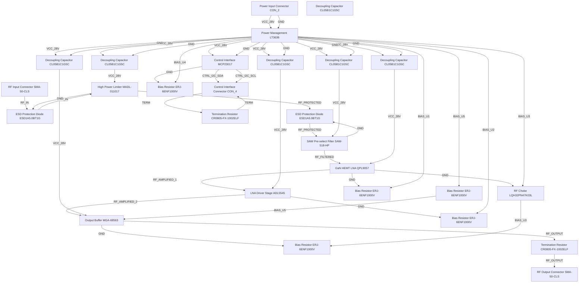

# Logical Netlist
## dgh

## Block Diagram

## Component Instances

| Ref | Part Number | Component |
|---|---|---|
| U1 | MADL-011017 | High Power Limiter |
| U2 | SAW-518-HP | SAW Pre-select Filter |
| U3 | QPL9057 | GaN HEMT LNA |
| U4 | ADL5545 | LNA Driver Stage |
| U5 | MGA-68563 | Output Buffer |
| U6 | LT3636 | Power Management |
| U7 | MCP23017 | Control Interface |
| J1 | SMA-50-CLS | RF Input Connector |
| J2 | SMA-50-CLS | RF Output Connector |
| J3 | CON_4 | Control Interface Connector |
| J4 | CON_2 | Power Input Connector |
| C1 | CL05B1C1G5C | Decoupling Capacitor |
| C2 | CL05B1C1G5C | Decoupling Capacitor |
| C3 | CL05B1C1G5C | Decoupling Capacitor |
| C4 | CL05B1C1G5C | Decoupling Capacitor |
| C5 | CL05B1C1G5C | Decoupling Capacitor |
| C6 | CL05B1C1G5C | Decoupling Capacitor |
| L1 | LQH32PN47K03L | RF Choke |
| R1 | ERJ-6ENF1000V | Bias Resistor |
| R2 | ERJ-6ENF1000V | Bias Resistor |
| R3 | ERJ-6ENF1000V | Bias Resistor |
| R4 | ERJ-6ENF1000V | Bias Resistor |
| R5 | ERJ-6ENF1000V | Bias Resistor |
| D1 | ESD1A5.0BT1G | ESD Protection Diode |
| D2 | ESD1A5.0BT1G | ESD Protection Diode |
| R6 | CR0805-FX-1002ELF | Termination Resistor |
| R7 | CR0805-FX-1002ELF | Termination Resistor |

## Pin-to-Pin Connections

| Net | From | Pin | To | Pin | Type |
|---|---|---|---|---|---|
| RF_IN | J1 | P1 | D1 | A | rf |
| RF_IN | D1 | K | U1 | RF_IN | rf |
| RF_PROTECTED | U1 | RF_OUT | D2 | A | rf |
| RF_PROTECTED | D2 | K | U2 | RF_IN | rf |
| RF_FILTERED | U2 | RF_OUT | U3 | RF_IN | rf |
| RF_AMPLIFIED_1 | U3 | RF_OUT | U4 | RF_IN | rf |
| RF_AMPLIFIED_2 | U4 | RF_OUT | U5 | RF_IN | rf |
| RF_OUTPUT | U5 | RF_OUT | R6 | P1 | rf |
| RF_OUTPUT | R6 | P2 | J2 | P1 | rf |
| VCC_28V | J4 | P1 | U6 | IN | power |
| VCC_28V | U6 | OUT1 | C1 | P1 | power |
| VCC_28V | C1 | P2 | U1 | VCC | power |
| VCC_28V | U6 | OUT2 | C2 | P1 | power |
| VCC_28V | C2 | P2 | U2 | VCC | power |
| VCC_28V | U6 | OUT3 | C3 | P1 | power |
| VCC_28V | C3 | P2 | U3 | VCC | power |
| VCC_28V | U6 | OUT4 | C4 | P1 | power |
| VCC_28V | C4 | P2 | U4 | VCC | power |
| VCC_28V | U6 | OUT5 | C5 | P1 | power |
| VCC_28V | C5 | P2 | U5 | VCC | power |
| VCC_28V | U6 | OUT6 | U7 | VCC | power |
| GND | J4 | P2 | U6 | GND | ground |
| GND | U6 | PGND | C1 | P1 | ground |
| GND | U6 | PGND | C2 | P1 | ground |
| GND | U6 | PGND | C3 | P1 | ground |
| GND | U6 | PGND | C4 | P1 | ground |
| GND | U6 | PGND | C5 | P1 | ground |
| GND | U6 | PGND | U7 | GND | ground |
| GND | U1 | GND | D1 | CATHODE | ground |
| GND | U2 | GND | D2 | CATHODE | ground |
| GND | U3 | GND | L1 | P1 | ground |
| GND | U3 | GND | R1 | P1 | ground |
| GND | U4 | GND | R2 | P1 | ground |
| GND | U5 | GND | R3 | P1 | ground |
| GND | U7 | GND | R4 | P1 | ground |
| CTRL_I2C_SDA | U7 | SCL | J3 | P1 | digital |
| CTRL_I2C_SCL | U7 | SDA | J3 | P2 | digital |
| BIAS_U1 | U6 | BIAS1 | R1 | P2 | analog |
| BIAS_U2 | U6 | BIAS2 | R2 | P2 | analog |
| BIAS_U3 | U6 | BIAS3 | L1 | P2 | analog |
| BIAS_U3 | L1 | P1 | R3 | P2 | analog |
| BIAS_U4 | U6 | BIAS4 | R4 | P2 | analog |
| BIAS_U5 | U6 | BIAS5 | R5 | P2 | analog |
| BIAS_U5 | R5 | P1 | U5 | BIAS | analog |
| TERM | J3 | P3 | R7 | P1 | digital |
| TERM | R7 | P2 | J3 | P4 | digital |

## Net Connection List

| Net Name | Reference Designator - Pin No. |
|----------|-------------------------------|
| BIAS_U1 | U6 - BIAS1,  R1 - P2 |
| BIAS_U2 | U6 - BIAS2,  R2 - P2 |
| BIAS_U3 | U6 - BIAS3,  L1 - P2,  L1 - P1,  R3 - P2 |
| BIAS_U4 | U6 - BIAS4,  R4 - P2 |
| BIAS_U5 | U6 - BIAS5,  R5 - P2,  R5 - P1,  U5 - BIAS |
| CTRL_I2C_SCL | U7 - SDA,  J3 - P2 |
| CTRL_I2C_SDA | U7 - SCL,  J3 - P1 |
| GND | J4 - P2,  U6 - GND,  U6 - PGND,  C1 - P1,  C2 - P1,  C3 - P1,  C4 - P1,  C5 - P1,  U7 - GND,  U1 - GND,  D1 - CATHODE,  U2 - GND,  D2 - CATHODE,  U3 - GND,  L1 - P1,  R1 - P1,  U4 - GND,  R2 - P1,  U5 - GND,  R3 - P1,  R4 - P1 |
| RF_AMPLIFIED_1 | U3 - RF_OUT,  U4 - RF_IN |
| RF_AMPLIFIED_2 | U4 - RF_OUT,  U5 - RF_IN |
| RF_FILTERED | U2 - RF_OUT,  U3 - RF_IN |
| RF_IN | J1 - P1,  D1 - A,  D1 - K,  U1 - RF_IN |
| RF_OUTPUT | U5 - RF_OUT,  R6 - P1,  R6 - P2,  J2 - P1 |
| RF_PROTECTED | U1 - RF_OUT,  D2 - A,  D2 - K,  U2 - RF_IN |
| TERM | J3 - P3,  R7 - P1,  R7 - P2,  J3 - P4 |
| VCC_28V | J4 - P1,  U6 - IN,  U6 - OUT1,  C1 - P1,  C1 - P2,  U1 - VCC,  U6 - OUT2,  C2 - P1,  C2 - P2,  U2 - VCC,  U6 - OUT3,  C3 - P1,  C3 - P2,  U3 - VCC,  U6 - OUT4,  C4 - P1,  C4 - P2,  U4 - VCC,  U6 - OUT5,  C5 - P1,  C5 - P2,  U5 - VCC,  U6 - OUT6,  U7 - VCC |

## Validation Notes

- Power budget requires close monitoring with GaN HEMT components operating at high gain
- RF signal path shows proper component order: limiter → filter → amplifiers → output
- Decoupling capacitors properly placed for each RF component
- Bias circuit includes RF choke for LNA to prevent RF leakage
- Control interface properly terminated for signal integrity
- 4-channel implementation requires duplication of RF chain for each channel
- ESD protection properly placed at input to protect sensitive components
- Power management converts single +28V input to multiple isolated outputs
- Termination resistor properly placed at RF output to maintain 50Ω impedance